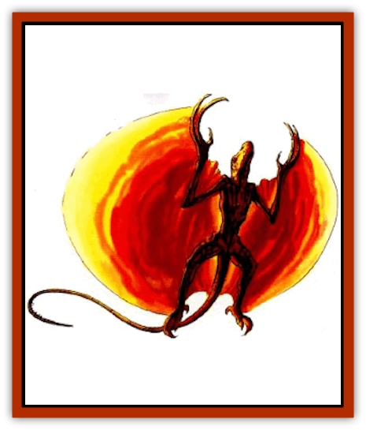

# Drake - Lesser - Athas - Sun

| Statistic | **Drake, Lesser (Athas), Sun** |
| --- | --- |
| **Activity Cycle:** | Day |
| **Alignment:** | Neutral |
| **Armor Class:** | -1 |
| **Climate/Terrain:** | Any |
| **Damage/Attack:** | 2d6+6 ('4)/5d8/4d4 |
| **Diet:** | Carnivore |
| **Frequency:** | Rare |
| **Hit Dice:** | 17+5 |
| **Intelligence:** | High (13) |
| **Magic Resistance:** | Nil |
| **Morale:** | Champion (16) |
| **Movement:** | 12, Fl 24(C) |
| **No. Appearing:** | 1 |
| **No. of Attacks:** | 6 |
| **Organization:** | Solitary |
| **Size:** | G (80' long, 60' wingspan) |
| **Special Attacks:** | Suffocation, dehydration, swallow |
| **Special Defenses:** | Nil |
| **THAC0:** | 3 |
| **Treasure:** | Nil |
| **XP Value:** | 17,000 |

**Psionics Summary**

| Level | Dis/Sci/Dev | Attack/Defense | Score | PSPs |
| --- | --- | --- | --- | --- |
| 17 | 2/3/10 | EW,MT,PsC/IF,MBk,TW | 13 | 50 |

**Metapsionics -** *Science:* ultrablast; *Devotions:* cannibalize, gird, prolong, psionic drain.

**Telepathy -** *Sciences:* mind link, mass domination; *Devotions:* ego whip, domination, contact, repugnance, mind thrust, psionic crush.

See also: [[Drake_Lesser_Athas_General_Information|Drake, Lesser (Athas), General Information]]

The sun drake is the most powerful of the lesser drakes. It resembles a [[Phoenix|phoenix]] with large, curved wings that give it an almost circular appearance when flying overhead. A sun drake's body is thin and lithe and measures about 35 feet. Its long tail adds another 20 feet to its length. The drake's wingspan is nearly 40 feet. It has powerful hind legs and long forelegs. All four of these limbs have wicked claws that the drake strikes with in combat. The drake has a short, wide maw.

The sun drake varies in color from red to orange to yellow. The color changes as it ages. As a drake glides in front of the sun, its wings shimmer with a ruddy glow, reminiscent of a fiery sunset.

**Combat:** The sun drake has an awesome array of attacks. It can use any or all of its attacks in a round depending on what it is fighting. The sun-drake's most powerful physical attack is its bite, which inflicts 5-40 (5d8) points of damage. Also, a roll of 4 or more greater than the THAC0 means the opponent has been swallowed whole. Once swallowed, targets as tall as 5 feet can attack from inside. Larger creatures are limited to psionic attacks only.

The drake can attack with all its claws when flying or with its foreclaws when on the ground. Each claw inflicts 8-18 (2d6+6) points of damage. The sun drake can swat its tail at an opponent for 4-16 (4d4) points of damage instead of the stun inflicted by other drakes.

**Habitat/Society:** Sun drakes prefer to live among the highest peaks in whatever area they inhabit. They use their lairs only at night, spending their days soaring on thermals. Sun drakes are immune to all forms of attack involving heat, including the harsh rays of the Athasian sun. Sun drakes require little sleep, but when they sleep they set up their *life detection* ability and maintain it with *gird* while they rest.

Sun drakes are solitary creatures, but they don't mind the company of creatures from the Elemental Plane of Air or creatures from the Elemental Plane of Fire. Each sun drake prefers only one of these types, except for the elemental [[Drake_Athas_General_Information|drake]] from the appropriate plane. These creatures are hunted mercilessly by the sun drakes.

Sun drakes have a collection of special treasures. The collection consists of objects of whatever color the drake's hide is, so they change their collection as they age. They might be persuaded to trade an old item for a new one that more closely matches their present color.

**Ecology:** Sun drakes mate for life, but see their partner only once a year. The pair have a special psionic link that they maintain with no effort. Through this link they can call the other drake for aid. During the yearly mating flight, the female flies to her mate's lair. She returns to her lair after mating to lay and incubate her eggs. The young sun drakes stay with their mother for the first year of their life to learn how to survive.

---
## Discovery & Documentation

**Source Publication:** Dark Sun Appendix II - Terrors Beyond Tyr (1991)
**Campaign Setting:** Dark Sun
**Author(s):** Jim Atkiss, Steve Brown, Timothy B. Brown, Andrew P. Morris, Bruce Nesmith, Wes Nicholson, Bill Slavicsek

### Other Creatures Found in This Source Book
   * [[Aarakocra_Athas|Aarakocra (Athas)]]
   * [[Animal_Domestic_Athas_II|Animal, Domestic (Athas) II]]
   * [[Aviarag|Aviarag]]
   * [[Baazrag|Baazrag]]
   * [[Baazrag_Boneclaw|Baazrag, Boneclaw]]
   * [[Bloodgrass|Bloodgrass]]
   * [[Cactus_Hunting|Cactus, Hunting]]
   * [[Cactus_Rock|Cactus, Rock]]
   * [[Cilops|Cilops]]
   * [[Crodlu|Crodlu]]
   * [[Dagorran|Dagorran]]
   * [[Dhaot|Dhaot]]
   * [[Drake_Lesser_Athas_General_Information|Drake, Lesser (Athas), General Information]]
   * [[Drake_Lesser_Athas_Magma|Drake, Lesser (Athas), Magma]]
   * [[Drake_Lesser_Athas_Rain|Drake, Lesser (Athas), Rain]]
   * [[Drake_Lesser_Athas_Silt|Drake, Lesser (Athas), Silt]]
   * [[Dray|Dray]]
   * [[Drik|Drik]]
   * [[Dune_Reaper|Dune Reaper]]
   * [[Dwarf_Athas|Dwarf (Athas)]]
   * [[Elemental_Beast_Athas_Air|Elemental Beast (Athas), Air]]
   * [[Elemental_Beast_Athas_Earth|Elemental Beast (Athas), Earth]]
   * [[Elemental_Beast_Athas_Fire|Elemental Beast (Athas), Fire]]
   * [[Elemental_Beast_Athas_Water|Elemental Beast (Athas), Water]]
   * [[Elf_Athas|Elf (Athas)]]
   * [[Fael|Fael]]
   * [[Feylaar|Feylaar]]
   * [[Fordorran|Fordorran]]
   * [[Giant_Half-giant|Giant, Half-giant]]
   * [[Giant_Shadow|Giant, Shadow]]
   * [[Golem_Athas_Magma|Golem (Athas), Magma]]
   * [[Golem_Athas_Salt|Golem (Athas), Salt]]
   * [[Golem_Athas_General_Information|Golem (Athas), General Information]]
   * [[Gorak|Gorak]]
   * [[Halfling_Athas|Halfling (Athas)]]
   * [[Human_Athas|Human (Athas)]]
   * [[Jhakar|Jhakar]]
   * [[Kaisharga|Kaisharga]]
   * [[Kes'trekel|Kes'trekel]]
   * [[Klar|Klar]]
   * [[Krag|Krag]]
   * [[Kragling|Kragling]]
   * [[Lirr|Lirr]]
   * [[Mastyrial|Mastyrial]]
   * [[Meorty|Meorty]]
   * [[Mul|Mul]]
   * [[Nikaal|Nikaal]]
   * [[Paraelemental_Beast_General_Information|Paraelemental Beast, General Information]]
   * [[Paraelemental_Beast_Magma|Paraelemental Beast, Magma]]
   * [[Paraelemental_Beast_Rain|Paraelemental Beast, Rain]]
   * [[Paraelemental_Beast_Silt|Paraelemental Beast, Silt]]
   * [[Paraelemental_Beast_Sun|Paraelemental Beast, Sun]]
   * [[Pakubrazi|Pakubrazi]]
   * [[Psionocus|Psionocus]]
   * [[Psurlon|Psurlon]]
   * [[Raaig|Raaig]]
   * [[Retriever_Obsidian|Retriever, Obsidian]]
   * [[Ruktoi|Ruktoi]]
   * [[Ruvoka_Athas|Ruvoka (Athas)]]
   * [[Sand_Howler|Sand Howler]]
   * [[Scorpion_Athas|Scorpion (Athas)]]
   * [[Seed_Brain|Seed, Brain]]
   * [[Silt_Horror_Black|Silt Horror, Black]]
   * [[Silt_Horror_Magma|Silt Horror, Magma]]
   * [[Silt_Horror_Red|Silt Horror, Red]]
   * [[Silt_Spawn|Silt Spawn]]
   * [[Slig|Slig]]
   * [[Spider_Athas|Spider (Athas)]]
   * [[Spinewyrm|Spinewyrm]]
   * [[Ssurran|Ssurran]]
   * [[Stalking_Horror|Stalking Horror]]
   * [[Tarek|Tarek]]
   * [[Tari|Tari]]
   * [[Thri-kreen|Thri-kreen]]
   * [[T'liz|T'liz]]
   * [[Tohr-kreen_II|Tohr-kreen II]]
   * [[Tohr-kreen_III|Tohr-kreen III]]
   * [[Trin|Trin]]
   * [[Tul'k|Tul'k]]
   * [[Undead_Athas_General_Information|Undead (Athas), General Information]]
   * [[Wraith_Athas|Wraith (Athas)]]
   * [[Xerichou|Xerichou]]
   * [[Zombie_Thinking|Zombie, Thinking]]
