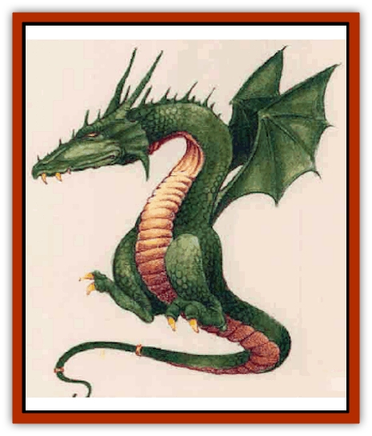

# Drake - Mystara

| Statistic | **Colddrake** | **Elemental Drake** | **Mandrake** | **Wooddrake** |
| --- | --- | --- | --- | --- |
| **Activity Cycle:** | Night | Any | Day | Day |
| **Alignment:** | Any chaotic | Neutral | Any chaotic | Any chaotic |
| **Armor Class:** | 0 | 0 | 0 | 0 |
| **Climate/Terrain:** | Cold regions | Any (see below) | Any | Any forest |
| **Damage/Attack:** | 1d2/1d2/2d4 | 1d3/1d3/1d8+2 | 1d2/1d2/1d6 | 1d2/1d2/1d8 |
| **Diet:** | Omnivore | Omnivore | Omnivore | Omnivore |
| **Frequency:** | Rare | Very rare | Rare | Rare |
| **Hit Dice:** | 5 | 6 | 3 | 4 |
| **Intelligence:** | High (13-14) | High (13-14) | High (13-14) | High (13-14) |
| **Magic Resistance:** | Nil | Nil | Nil | Nil |
| **Morale:** | Steady (12) | Elite (14) | Steady (12) | Steady (12) |
| **Movement:** | 12, Fl 3 (D) | 12, Fl 3 (D) | 12, Fl 3 (D) | 12, Fl 3 (D) |
| **No. Appearing:** | 1d4 | 1d4 | 1d4 | 1d4 |
| **No. of Attacks:** | 3 | 3 | 3 | 3 |
| **Organization:** | Cells | Cells | Cells | Cells |
| **Size:** | S (3-4' long) | L (8' long) | M (6' long) | M (3-5' long) |
| **Special Attacks:** | Nil | Nil | Nil | Nil |
| **Special Defenses:** | Spell immunities | Spell immunities | Spell immunities | Spell immunities |
| **THAC0:** | 15 | 15 | 17 | 17 |
| **Treasure:** | R (E) | Nil | R (E) | R (E) |
| **XP Value:** | 650 | 975 | 270 | 420 |

The drakes of Mystara are divided into two groups: chaotic and elemental. How closely related these groups are is a matter of disagreement among sages. In both cases, however, the drake is a man-sized creature.

In its true form, a drake resembles a small dragon with tiny wings and without front legs. The wings can support only slow flight for up to an hour at a time. However, drakes are most often encountered in a human or demihuman form; each of the four varieties can assume the form of one or two particular races (see details below). All drakes can use this *polymorph* power as often they desire, changing back and forth from draconian to nondraconian guise.

Drakes have no breath weapons or spellcasting abilities, but they can speak the language(s) befitting their *polymorphed* guise. They may be evil or good (50% chance of each) but, except for elemental drakes, are always chaotic.

**Combat:** Drakes are extremely intelligent and clever; they tell lies as needed, and surrender rather than fight to the death.

In human or demihuman form, a drake can use any weapon permitted to thieves. The attack and damage information given above applies to dragon-kin form only.

All drakes are immune to spells of 4th level or less. They can cancel this immunity for one round by concentrating - to receive a *cure wounds* spell, for example. They make saving throws as wizards of a level equal to their Hit Dice.

A *protecrion from evil* (or *good*, as appropriate) spell holds drakes at bay.

All drakes are thieves, having all the class abilities of a 5th-level thief (PP 50%, OL 42%, F/RT 40%, MS 40%, HS 31%, HN 20%, CW 90%, RL 25%; backstab x3). This can be a weakness as well as a virtue. For many drakes, theft is an obsession, like the disorder of kleptomania among humans. (The difficulty of a theft, not the value of the goods stolen, is what interests a drake. Thus, nearly worthless trinkets kept under lock, key, and burly guard would be far more desirable to a drake than a jewel-encrusted golden crown lying beside a road.)

Given their thief abihaes, it is natural that drakes prefer to attack by stealth whenever possible, and to take their enermes by surpnse and from a posiaon of advantage.

**Habitat/Society:** The drakes have long been considered a branch of the draconian family, which includes [[Dragon_Mystara_General_Information|dragons]] and [[Wyvern|wyverns]], because the drakes' true form closely resembles a dragon. Their shapechanging ability is simdar to that of Mystara's [[Dragon_Metallic_Gold|gold dragons]] as well. However, a hsiao scholar has demonstrated convincingly that the mandrakes, wooddrakes, and colddrakes are in fact related to Mystara's puckish fairykind.

Long ago, drakes devoted themselves to the cause of chaos. Their aim was to keep the world unstable - just unstable enough so it wouldn't progress to the point at which it could destroy itself. These drakes recalled a time when human technology almost destroyed Mystara, and they did not wish to see such events repeated.

The ideology of chaos is no longer such a conscious concern of drakes, rather, it has become an integral part of their nature, attitudes, and tendencies.

Chaotic evil drakes act in any way they wish and see no need to justify their behavior to anyone. These drakes revel in the company of other chaotic evil beings, and enjoy corrupting people into selfishness and wanton destruction. Chaotic neutral drakes have the same disregard for the opimons of others, but they are not actively malicious.

Chaotic good drakes, however, still seek a good end through chaos, and are not simply self-serving. They may take it upon themselves to pursue good chaos through adventuring; they seek out places where corrupt order has taken a firm hold (lawful evil philosophy is their nemesis), and try to overthrow it. They believe that all order is inherently corrupt, and only in anarchy can nature properly assert itself. The task of destroying all order is simply too vast, however. Therefore, they reason, it is best to concentrate on tyranny and the like - places where law has obviously gone bad. In fighting evil law, good drakes may be temporary allies with lawful good or even lawful neutral beings.

Drakes are found singly or in small groups, usually among humanoids who are unaware of their true nature. These "cells" of drakes have contact with other cells, creating a network of contacts that may span continents. These contacts are very useful for travel, to establish a new identity if a drake's true nature is uncovered, and for less respectable ends such as fencing stolen goods. (Some chaotic evil drakes use their contacts to help human thieves unload "hot" goods to distant huyen - for a generous cut in the profits, naturally.)

Both alignments of chaotic drakes are very fond of pranks and tricks, and have an acute sense of humor.

**Ecology:** To promote their chaotic goals, the drakes infiltrated the societies of men, elves, dwarves, halflings, and gnomes. There they subtly promoted their philosophy of chaos, nudging their neighbors into strife and disarray.

Drakes are omnivores. They eat balanced diets much like those of humans and demihumans. They do enjoy raw meat much more than most humans do, however.

**Mandrake**

  These tan drakes can change into human form, and they enjoy the company of men. They often hold minor jobs in stables and taverns in towns (never in positions of importance or power), and may pretend to be adventurers. They steal food from town storehouses, and valuables from wandering townsfolk.

Some mandrakes may actually join thieves' guilds and improve their abilities, though most avoid such lawfulness.

**Wooddrake**

  In their true form, wooddrakes are dark green. They also can assume elf and halfling forms. Otherwise, they're very similar in habits to mandrakes, and are sometimes discovered amidst elven or halfling communities.

**Colddrake**

  These white drakes shun the light of day, living deep underground (usually in icy caverns). They can change themselves into dwarf and gnome forms, and can sometimes be found amidst an underground dwarf or gnome community.

## Elemental Drake

Elemental drakes include four species (one for each element). They are distant cousins of the drakes described above, which are more common. Airdrakes are blue, earthdrakes are brown, flamedrakes are red, and water drakes are sea green. (Note: The Monstrous Manual describes a dragonet called the "[[Dragonet_Fire_Drake|fire drake]]". This creature is entirely different from the Mystaran flamedrake.)

**Combat:** Elemental drakes are immune to normal and silver weapons; a magical weapon is needed to damage them.

On the Prime Material Plane, elemental drakes can take the forms of young giants (1 to 4 feet shorter than normal), but they cannot throw rocks in those forms, and can only inflict 2d6 points of damage in hand-to-hand combat (instead of the normal damage done by the giant form). An airdrake can assume the form of a [[Giant_Cloud|cloud giant]]; an earthdrake, a [[Giant_Stone|stone giant]]; a flamedrake, a [[Giant_Fire|fire giant]]; and a waterdrake, a [[Giant_Storm|storm giant]].

Elemental drakes share the ahdities, immunities, and vulnerabilities of the more common drakes described above: thieves' skills, spell immunities, and the hedging effects of a *protection from evil or good* spell.

On their home planes, elemental drakes cannot change into giant forms; instead, they assume the form if a small elemental, with all the abilities of that form (treat them as a 6 Hit Dice elemental in size and ability).

**Habitat/Society:** These creatures live on the elemental planes, and are very rare on the Prime Material Plane. They cannot normally travel between the planes, but may "ride" along with an elemental or other creature, either to or from their plane of origin. On the Prime Material Plane, elemental drakes are sometimes found amid the real giants whose form they can take, acting for their own pulposes. The nature of these purposes is elusive. For the most part, elemental drakes seem content simply to observe what goes on. Perhapse they are spies and informants for the elemental planes' rulers, keeping those suzerains well informed about what goes on amongst giantkind.

Like the chaotic drakes, the elemental drakes arrange themselves in "cells" of individuals who can assist each other, while maintaining their "cover" in humanoid society.

**Ecology:** Elemental drakes are omnivores. Like other drakes, their diet closely matches that of the humanoids they can resemble. In addition, these drakes are nourished by frequent contact with their native element. Given the giants whose shapes they take, arranging such contact is no difficulty nor is it something that would attract attention.

An elemental drake deprived of contact with its native element will, over the course of days, become weakened (not to mention irritable). Of course, this differs little from the effects of food and water deprivation on humans.

The origin of the elemental drakes is hotly debated among sages. One camp believes the drakes are all descended from a minor subspecies of dragon that adapted to life on the Elemental planes. The other side holds that the drake-shape is a coincidental shape evolved by elemental life. Just to confuse things, some rogue thinkers assert that elemental drakes may be the result of magical crossbreeding of elementals and dragons.

---
## Discovery & Documentation

**Source Publication:** Mystara Appendix (1994)
**Campaign Setting:** Mystara
**Author(s):** John Nephew, Teeuwynn Woodruff, John Terra, Skip Williams

### Other Creatures Found in This Source Book
   * [[Actaeon|Actaeon]]
   * [[Agarat|Agarat]]
   * [[Ash_Crawler|Ash Crawler]]
   * [[Baldandar|Baldandar]]
   * [[Bargda|Bargda]]
   * [[Bhut|Bhut]]
   * [[Bird_Mystara|Bird (Mystara)]]
   * [[Blackball|Blackball]]
   * [[Choker|Choker]]
   * [[Coltpixie|Coltpixie]]
   * [[Crone_of_Chaos|Crone of Chaos]]
   * [[Darkhood|Darkhood]]
   * [[Darkwing|Darkwing]]
   * [[Decapus|Decapus]]
   * [[Deep_Glaurant|Deep Glaurant]]
   * [[Diabolus|Diabolus]]
   * [[Dimensional_Warper|Dimensional Warper]]
   * [[Dragon_Mystara_Crystalline|Dragon (Mystara), Crystalline]]
   * [[Dragon_Mystara_Jade|Dragon (Mystara), Jade]]
   * [[Dragon_Mystara_Onyx|Dragon (Mystara), Onyx]]
   * [[Dragon_Mystara_Ruby|Dragon (Mystara), Ruby]]
   * [[Dragonfly|Dragonfly]]
   * [[Dusanu|Dusanu]]
   * [[Elemental_of_Chaos_Air_Earth|Elemental of Chaos, Air/Earth]]
   * [[Elemental_of_Chaos_Fire_Water|Elemental of Chaos, Fire/Water]]
   * [[Elemental_of_Law_Air_Earth|Elemental of Law, Air/Earth]]
   * [[Elemental_of_Law_Fire_Water|Elemental of Law, Fire/Water]]
   * [[Familiar_Mystara|Familiar (Mystara)]]
   * [[Frost_Salamander|Frost Salamander]]
   * [[Fundamental_Air_Earth|Fundamental, Air/Earth]]
   * [[Fundamental_Fire_Water|Fundamental, Fire/Water]]
   * [[Gargantua_Mystara|Gargantua (Mystara)]]
   * [[Geonid|Geonid]]
   * [[Ghostly_Horde|Ghostly Horde]]
   * [[Giant_Athach|Giant, Athach]]
   * [[Giant_Hephaeston|Giant, Hephaeston]]
   * [[Golem_Drolem|Golem, Drolem]]
   * [[Golem_Mystara_I|Golem (Mystara) I]]
   * [[Golem_Mystara_II|Golem (Mystara) II]]
   * [[Golem_Mystara_III|Golem (Mystara) III]]
   * [[Gray_Philosopher|Gray Philosopher]]
   * [[Guardian_Warrior|Guardian Warrior]]
   * [[Gyerian|Gyerian]]
   * [[Herex|Herex]]
   * [[Hivebrood|Hivebrood]]
   * [[Horde|Horde]]
   * [[Hsiao|Hsiao]]
   * [[Huptzeen|Huptzeen]]
   * [[Hutaakan|Hutaakan]]
   * [[Imp_Mystara|Imp (Mystara)]]
   * [[Jellyfish_Giant_Mystara|Jellyfish, Giant (Mystara)]]
   * [[Kna|Kna]]
   * [[Kopru|Kopru]]
   * [[Lizard_Mystara|Lizard (Mystara)]]
   * [[Lizard-kin_Mystara|Lizard-kin (Mystara)]]
   * [[Lupin|Lupin]]
   * [[Lycanthrope_Werejaguar_Mystara|Lycanthrope, Werejaguar (Mystara)]]
   * [[Lycanthrope_Wereswine|Lycanthrope, Wereswine]]
   * [[Magen|Magen]]
   * [[Manikin|Manikin]]
   * [[Mek|Mek]]
   * [[Mujina|Mujina]]
   * [[Nagpa|Nagpa]]
   * [[Neh-thalggu|Neh-thalggu]]
   * [[Nightshade_Mystara|Nightshade (Mystara)]]
   * [[Nuckalavee|Nuckalavee]]
   * [[Pegataur|Pegataur]]
   * [[Phanaton|Phanaton]]
   * [[Plant_Dangerous_Mystara|Plant, Dangerous (Mystara)]]
   * [[Plasm|Plasm]]
   * [[Rakasta|Rakasta]]
   * [[Rock_Man|Rock Man]]
   * [[Sabreclaw|Sabreclaw]]
   * [[Sacrol|Sacrol]]
   * [[Scamille|Scamille]]
   * [[Shapeshifter|Shapeshifter]]
   * [[Shargugh|Shargugh]]
   * [[Shark-kin|Shark-kin]]
   * [[Sollux|Sollux]]
   * [[Spectral_Death|Spectral Death]]
   * [[Spectral_Hound|Spectral Hound]]
   * [[Spider-kin|Spider-kin]]
   * [[Spirit_Mystara|Spirit (Mystara)]]
   * [[Statue_Living|Statue, Living]]
   * [[Surtaki|Surtaki]]
   * [[Tabi|Tabi]]
   * [[Thoul|Thoul]]
   * [[Thunderhead|Thunderhead]]
   * [[Tiger_Ebon|Tiger, Ebon]]
   * [[Topi|Topi]]
   * [[Tortle|Tortle]]
   * [[Vampire_Velya|Vampire, Velya]]
   * [[White_Fang|White Fang]]
   * [[Worm_Mystara|Worm (Mystara)]]
   * [[Wyrd|Wyrd]]
   * [[Yowler|Yowler]]
   * [[Zombie_Lightning|Zombie, Lightning]]
