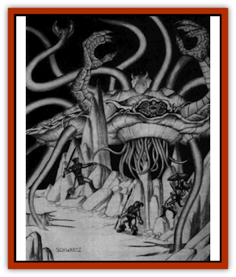

# Draknor

| Statistic | **Draknor** |
| --- | --- |
| **Activity Cycle:** | Any |
| **Alignment:** | Neutral |
| **Armor Class:** | -7/-1/2 |
| **Climate/Terrain:** | Special |
| **Damage/Attack:** | 3-18/3-18/2-8/2-8/2-8/2-8 |
| **Diet:** | Heat/Carnivore |
| **Frequency:** | Very rare |
| **Hit Dice:** | 20 |
| **Intelligence:** | High (13-14), but special |
| **Magic Resistance:** | 60% |
| **Morale:** | Fearless (20) |
| **Movement:** | 0 |
| **No. Appearing:** | 1 |
| **No. of Attacks:** | 2 claws, 4 tentacles |
| **Organization:** | Solitary |
| **Size:** | G (56' across) |
| **Special Attacks:** | Earthquakes, constriction. breath weapon, swallov whole |
| **Special Defenses:** | Hit only by +2 or better weapons; weapon and spell immunities; regeneration |
| **THAC0:** | 5 |
| **Treasure:** | Nil |
| **XP Value:** | 26,000 |

Draknor are very rarely encountered on the Prime Material plane. These creatures go through three distinct stages of growth: egg, larva, and adult. The statistics above represent a draknor in its larval stage only; the DM must invent statistics for the mature form of a draknor if one is encountered.

In the larval stage, a draknor is 55' wide, 40' long, and about 25' high, not including the several dozen feeding tendrils that trail beneath. These tendrils can reach amazing lengths, up to a mile long at times. A draknor larva cannot move from its lair and thus has no movement rate. Its feeding tendrils, however, can slither like snakes at a movement rate of 15 and can burrow through solid rock at a movement rate of 9. This burrowing is achieved by melting the stone with the draknor's intense heat.

The draknor supports itself with 12 rock-hard extensions that attach to nearby cave walls. Two reptilian claws protrude from the monster's front, and four large tentacles adorn its back. A draknor's body is made up of two distinct shells. A 6" gap between the upper and lower shells sports dozens of stalked eyes and sensory organs.

Although the draknor has high intelligence, its thought processes are totally alien to anything else in existence.

**Combat:** Draknor in their larval stage of growth are powerful entities indeed. A draknor's shell is the consistency of stone; attacks against its main body, support tentacles, or lizardlike arms and claws are against AC -7. Its four dorsal tentacles are somewhat softer; they have an armor class of -1. It is the draknor's feeding tendrils and the gap between its two shells that are the softest; here the draknor is only AC 2.

A draknor attacks six times a round in melee combat. Two attacks are with its claws, while the other four are with its dorsal tentacles. If a tentacle hits, it constricts its target for 2-12 hp damage per round, with no to-hit roll necessary in subsequent rounds. Breaking free requires a strength of at least 22 or the severing of the tentacle. Each tentacle has 30 hp in addition to the body's total. Instead of constricting a target, or if its claws hit a being of size L or smaller with a number four or more over the number needed to hit, the draknor pops the victim into its mouth. Swallowed PCs take 10-100 hp damage per round due to both acid and heat, and can escape only by doing 50 hp damage to the draknor's interior, which is AC 2. If this is done, the victim is spit up immediately.

A draknor is hit by only +2 or better weaponry. It is immune to poison and lightning, and takes half damage from acid. Cold causes double damage. Fire and heat heal the draknor for a number of hit points equal to the attack's normal damage, up to the creature's maximum hit points.

A draknor cannot be magically controlled and, since its thought processes are so alien, it is immune to all forms of mental attack. Treat it as if it had a 25 wisdom on Table 5, on page 17 of the 2nd Edition Player's Handbook. It is immune to and reflects *mind blast* as well.

The 30 tendrils that trail under the draknor's body tap info heat reserves (usually pools of magma, but any continual source of great heat will do). Each tendril takes 10 hp damage to sever. If all the tendrils are severed, the draknor will no longer have a method of consuming heat and will die of starvation in about two weeks. As long as at least one of the tentacles is even partially intact, the draknor will regenerate all damage at the rate of 3 hp per round. For every 10 tentacles severed, the number of hit points regenerated per round decreases by one.

A draknor has two ways to attack assailants at long range. First, it can send a burrowing tentacle through the rocky ground under a target, causing a minor, localized earthquake that knocks the target down on a successful hit. The victim must also save vs. paralyzation or be stunned for 2-5 rounds. The draknor can attack up to three targets per round in this fashion. Second, in any round that it is not swallowing somsething, a draknor can choose to forego its regeneration and spew the heat from its mouth at any one target. This heat takes the form of a ruby-red ray that is 1' wide and up to 200' long. If this attacks hits, the target must save vs. breath weapon or take 5-60 (5d12) hp damage (half damage if the save is made). Although the draknor is not damaged by its own heat ray, neither can it heal itself by striking itself with this ray.

**Habitat/Society:** A draknor spends the first part of its life on the Prime Material plane. It is not known how draknor eggs arrive here, but it may be inferred that an adult draknor travels to this plane to place its eggs in secluded spots. In its egg form, a draknor is defenseless, but it soon hatches into the larval form and begins to search for food. Draknor are never encountered except singly and are always found underground. Once fully grown, the draknor migrates to the para-elemental plane of Magma to live out the rest of its life. Not much is known about adult draknor, as they have never been found on this plane. These adults are certain to be much more powerful than   their larvae, although exact details are up to the individual DM.

**Ecology:** The draknor begins life as a 2ft-long egg with no forms of attack or defense. The egg has an armor class of 8 and can be destroyed very quickly and safely. After a year of growth, the egg has expanded to a length of 20' and is ready lo hatch.

To grow to adulthood, the draknor larva that emerges from the egg must find a source of continual heat within two weeks or it will die. To accomplish this, the immobile draknor uses a set of 30 burrowing tendrils that snake through the ground to find pockets of molten rock. Once this magma is located, the draknor begins to grow again, gaining 1 hp every other day (starting with a total of 100). As soon as it reaches a total of 160 hp, the draknor is mature and migrates to the para-elemental plane of Magma. The great vortex of energy created by its leaving usually transforms the area into a flaming volcanic region.

Although draknor are highly intelligent, they cannot (or choose not to) communicate with other life forms. Due to their destructive life cycles, they are hunted down as soon as their presence becomes known. Although draknor eat mainly heat, they are capable of digesting both organic and inorganic substances. Just how these other substances are used in draknor metabolism is not clear, although many sages hypothesize that the draknor gain both their intelligence and sensory faculties from these sources.

---
## Discovery & Documentation

**Source Publication:** Dungeon #24 (1990)
**Campaign Setting:** Dungeon Magazine
**Author(s):**
