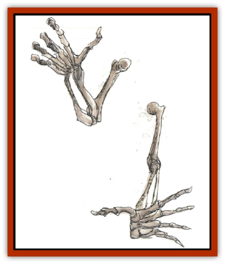

# Dread

| Statistic | **Dread** |
| --- | --- |
| **Activity Cycle:** | Any |
| **Alignment:** | Neutral |
| **Armor Class:** | 6 |
| **Climate/Terrain:** | Any land |
| **Damage/Attack:** | 1d4 or by weapon type |
| **Diet:** | None |
| **Frequency:** | Rare |
| **Hit Dice:** | 3+3 |
| **Intelligence:** | Non- (0) |
| **Magic Resistance:** | Nil |
| **Morale:** | Fearless (20) |
| **Movement:** | 6, Fl 15 (B), Sw 9, Jp 3 |
| **No. Appearing:** | 1 or 1d6 |
| **No. of Attacks:** | 1 |
| **Organization:** | Solitary or group (as created) |
| **Size:** | S (up to 4' long) |
| **Special Attacks:** | Nil |
| **Special Defenses:** | See below |
| **THAC0:** | 17 |
| **Treasure:** | Any (as guardian) |
| **XP Value:** | 975 / Vampiric dread: 1,400 |

Dread are flying, animated skeletal arms that attack living things by raking with their sharpened fingerbones or by wielding weapons. These undead are created by wizards and priests to serve as guardians. The enchantment involves a set of instructions (similar to the specific triggering conditions for a *magic mouth* spell), in which the creator of the dread specifies where they are to operate; and under what circumstances they will and won't attack. The spells also allow the bone to regenerate damage done to it, and to resist aging effects.

Long ago, families who could not afford better, or could not bring themselves to trust hireswords, had dread created to guard their treasure vaults. Typically these were armed with magical swords, and many dread encountered are so armed.

Dread are often ordered to attack all intruders who do not speak a certain password or wear a particular badge. In other cases, they are instructed to slay all living things entering a particular place such as a "trap" passage or room that leads nowhere and is intended only as a deathtrap.

**Combat:** Dread wield weapons (often scimitars or hand axes; they can use anything up to 50 lbs. in weight and 10 feet in overall length) as they fly menacingly through the darkness. In many cases, they are left in niches where no human could lurk, or partway down shafts, or above trap doors, so an intruder cannot avoid their initial attack. Dread can also be positioned to repeatedly hurl or drop rocks down a shaft that intruders are climbing.

Dread are turned as shadows (but in certain "prime guard" areas, enchantments prevent most dread from being turned - or dispelled - at all), and they are immune to *charm*, *hold*, and *sleep* spells. Cold-based attacks inflict no damage upon them, holy water causes 2d4 points of damage per vial (1d4 if only a splash hits), and edged or piercing weapons deal only half damage to them. The enchantments that animate them also make them specifically immune to *shatter*, *disintegrate*, and all related and *polymorph* spells.

If damaged, dread regenerate 2 lost hit points per day.

Dread are sometimes concealed amid bones of the fallen creatures they guard (e.g., in a coffin) or, in some cases, a pile formed of the remains of their victims. They often lie unmoving until intruders are within 10 feet, and they can wield bones or hurl skulls as weapons. In either case, bones inflict 1d4 points of damage if thrown and 1d4+1 if wielded as weapons - at each blow, roll a die: Any odd result means the bone has shattered beyond a usable state. Dread themselves have been made immune to such ready breakage.

**Habitat/Society:** Dread are found only as guardians (or, very rarely, as weapons-practice sparring partners or wizards' helpers in a spellcasting chamber.

**Ecology:** Dread have no life processes, consuming and needing nothing. Their powdered bones can be used as an ingredient in certain preservative magics and in spells concerned with flight, telekinesis, and levitation.

**Vampiric Dread**

  These rare specimens of dread must slay a living thing at least once per year to prolong their unlife. When they inflict damage (barehanded, not with a weapon) to a living being, half the hit points lost by their victims (round down) are immediately gained by the dread. These extra hit points fade only at the rate of 1 per ride (10 days). Many vampiric dread can wander (hunt) freely, as their boundary enchantments are linked to specific stones that have crumbled away. Vampiric dread are often depicted in warning tales and paintings, dripping the blood of victims as they fly along.

---
## Discovery & Documentation

**Source Publication:** Monstrous Compendium, 1994 Annual, Volume 1 (1995)
**Campaign Setting:** Advanced Dungeons & Dragons 2nd Edition
**Author(s):** David Wise

### Other Creatures Found in This Source Book
   * [[Abyss_Ant|Abyss Ant]]
   * [[Achaierai|Achaierai]]
   * [[Afanc|Afanc]]
   * [[Al-Jahar|Al-Jahar]]
   * [[Baelnorn|Baelnorn]]
   * [[Baneguard|Baneguard]]
   * [[Banelar|Banelar]]
   * [[Bird_Talking|Bird, Talking]]
   * [[Blazing_Bones|Blazing Bones]]
   * [[Campestri|Campestri]]
   * [[Caniquine|Caniquine]]
   * [[Cat_Winged|Cat, Winged]]
   * [[Crypt_Servant|Crypt Servant]]
   * [[Death's_Head_Tree|Death's Head Tree]]
   * [[Dog_Saluqi|Dog, Saluqi]]
   * [[Dragon_Electrum|Dragon, Electrum]]
   * [[Dragon_Fang|Dragon, Fang]]
   * [[Dragon_Linnorm_Corpse_Tearer|Dragon, Linnorm, Corpse Tearer]]
   * [[Dragon_Linnorm_Dread|Dragon, Linnorm, Dread]]
   * [[Dragon_Linnorm_Flame|Dragon, Linnorm, Flame]]
   * [[Dragon_Linnorm_Forest|Dragon, Linnorm, Forest]]
   * [[Dragon_Linnorm_Frost|Dragon, Linnorm, Frost]]
   * [[Dragon_Linnorm_Gray|Dragon, Linnorm, Gray]]
   * [[Dragon_Linnorm_Land|Dragon, Linnorm, Land]]
   * [[Dragon_Linnorm_Midgard|Dragon, Linnorm, Midgard]]
   * [[Dragon_Linnorm_Rain|Dragon, Linnorm, Rain]]
   * [[Dragon_Linnorm_Sea|Dragon, Linnorm, Sea]]
   * [[Dragon_Neutral_Jacinth|Dragon, Neutral, Jacinth]]
   * [[Dragon_Neutral_Jade|Dragon, Neutral, Jade]]
   * [[Dragon_Neutral_Pearl|Dragon, Neutral, Pearl]]
   * [[Dragon-kin|Dragon-kin]]
   * [[Elemental_Earth_Kin_Chrysmal|Elemental, Earth Kin, Chrysmal]]
   * [[Elemental_Earth_Kin_Earth_Weird|Elemental, Earth Kin, Earth Weird]]
   * [[Elemental_Fire_Kin_Azer|Elemental, Fire Kin, Azer]]
   * [[Elemental_Sandman|Elemental, Sandman]]
   * [[Elemental_Wind_Walker|Elemental, Wind Walker]]
   * [[Elemental_Vermin|Elemental Vermin]]
   * [[Feystag|Feystag]]
   * [[Flame_Skull|Flame Skull]]
   * [[Foulwing|Foulwing]]
   * [[Gambado|Gambado]]
   * [[Garbug|Garbug]]
   * [[Genie_Tasked_Administrator|Genie, Tasked, Administrator]]
   * [[Genie_Tasked_Deceiver|Genie, Tasked, Deceiver]]
   * [[Genie_Tasked_Harim_Servant|Genie, Tasked, Harim Servant]]
   * [[Genie_Tasked_Messenger|Genie, Tasked, Messenger]]
   * [[Genie_Tasked_Miner|Genie, Tasked, Miner]]
   * [[Genie_Tasked_Oathbinder|Genie, Tasked, Oathbinder]]
   * [[Gibbering_Mouther|Gibbering Mouther]]
   * [[Gnasher|Gnasher]]
   * [[Gnasher_Winged|Gnasher, Winged]]
   * [[Golem_Brain|Golem, Brain]]
   * [[Golem_Hammer|Golem, Hammer]]
   * [[Golem_Metagolem|Golem, Metagolem]]
   * [[Golem_Spiderstone|Golem, Spiderstone]]
   * [[Gorynych|Gorynych]]
   * [[Greelox|Greelox]]
   * [[Helmed_Horror|Helmed Horror]]
   * [[Jarbo|Jarbo]]
   * [[Laraken|Laraken]]
   * [[Lich_Psionic|Lich, Psionic]]
   * [[Living_Steel|Living Steel]]
   * [[Lock_Lurker|Lock Lurker]]
   * [[Loxo|Loxo]]
   * [[Lycanthrope_Loup_de_Noir|Lycanthrope, Loup de Noir]]
   * [[Lycanthrope_Werebadger|Lycanthrope, Werebadger]]
   * [[Lycanthrope_Werejaguar|Lycanthrope, Werejaguar]]
   * [[Lythlyx|Lythlyx]]
   * [[Magebane|Magebane]]
   * [[Marrashi|Marrashi]]
   * [[Metalmaster|Metalmaster]]
   * [[Mimic_House_Hunter|Mimic, House Hunter]]
   * [[Naga_Bone|Naga, Bone]]
   * [[Nautilus_Giant|Nautilus, Giant]]
   * [[Nightshade_Toril|Nightshade (Toril)]]
   * [[Nishruu|Nishruu]]
   * [[Noran|Noran]]
   * [[Opinicus|Opinicus]]
   * [[Ormyrr|Ormyrr]]
   * [[Parasite|Parasite]]
   * [[Pasari-Niml|Pasari-Niml]]
   * [[Plant_Vampire_Moss|Plant, Vampire Moss]]
   * [[Pteraman|Pteraman]]
   * [[Rautym|Rautym]]
   * [[Shadeling|Shadeling]]
   * [[Skum|Skum]]
   * [[Snake_Giant_Cobra|Snake, Giant Cobra]]
   * [[Snake_Stone|Snake, Stone]]
   * [[Spectral_Wizard|Spectral Wizard]]
   * [[Spell_Weaver|Spell Weaver]]
   * [[Spider_Brain|Spider, Brain]]
   * [[Suwyze|Suwyze]]
   * [[Tatalla|Tatalla]]
   * [[Tick_Heart|Tick, Heart]]
   * [[Tree_Dark|Tree, Dark]]
   * [[Tree_Singing|Tree, Singing]]
   * [[Tressym|Tressym]]
   * [[Troll_Snow|Troll, Snow]]
   * [[Tuyewera|Tuyewera]]
   * [[Ulitharid|Ulitharid]]
   * [[Undead_Dwarf|Undead Dwarf]]
   * [[Undead_Lake_Monster|Undead Lake Monster]]
   * [[Whipsting|Whipsting]]
   * [[Windghost|Windghost]]
   * [[Wolf_Dread|Wolf, Dread]]
   * [[Wolf_Stone|Wolf, Stone]]
   * [[Wolf_Vampiric|Wolf, Vampiric]]
   * [[Wraith_Shimmering|Wraith, Shimmering]]
   * [[Xantravar|Xantravar]]
   * [[Xaver|Xaver]]
