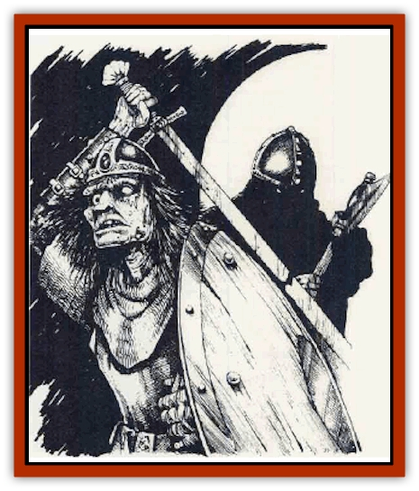

# Dread Warrior

| Statistic | **Dread Warrior** |
| --- | --- |
| **Activity Cycle:** | Day or night |
| **Alignment:** | Neutral evil |
| **Armor Class:** | 2 to 4 |
| **Climate/Terrain:** | Any |
| **Damage/Attack:** | 1d8+2 or by weapon +2 |
| **Diet:** | None |
| **Frequency:** | Rare |
| **Hit Dice:** | 4 |
| **Intelligence:** | Low (5-7) |
| **Magic Resistance:** | Nil |
| **Morale:** | Fanatic (18) |
| **Movement:** | 9 |
| **No. Appearing:** | 1-12 |
| **No. of Attacks:** | 1 |
| **Organization:** | Band |
| **Size:** | M |
| **Special Attacks:** | Nil |
| **Special Defenses:** | Nil |
| **THAC0:** | 17 |
| **Treasure:** | Nil |
| **XP Value:** | 175 |

Dread warriors are enhanced undead created by Szass Tam, Zulkir of Necromancy for the Red Wizards of Thay. Dread warriors are created immediately after a warrior's death so that they retain at least minimal intelligence. They must be created from the bodies of fighters of at least 4th level who have been dead for less than a day. They are found primarily in the retinue of Szass Tam, although he has loaned a few to trusted allies.

**Combat:** As former fighters, dread warriors retain their desire to fight and are both strong and skilled. A dread warrior's Strength is 18/01 and, although this does not provide the creature with an attack bonus, it does grant +2 to all inflicted damage (its standard unarmed damage is 1d8+2). Dread warriors are armed with whatever weapons they carried as living fighters, though none have the sophistication to use bows or crossbows. They can be ordered to throw spears or javelins, but do so with minimal accuracy (4 to hit).

Dread warriors are capable of following simple orders such as "advance and attack the enemy", "stay here and defend this hallway against all attackers", and so on. They are not at all sophisticated, however, and complex orders simply confuse them. Orders of up to 12 words cause no problems; there is a cumulative 5% chance for every word after the 12th that a dread warrior will misinterpret the order - does the exact opposite, goes berserk and begins attacking anything nearby, or stands around doing nothing. This percentage is doubled if the dread warriors are in Rashemen, where the powerful magic of the spirits of the land disrupts the evil necromantic spells of the Red Wizards. Additionally, dread warriors suffer a -2 attack roll penalty when in combat with Rashemaar nature spirits or Witches of Rachemen.

Dread warriors can be turned by clerics as shadows. A *raise dead* spell destroys a dread warrior entirely, while a *resurrection* spell requires the dread warrior to make a saving throw vs. spell (save as 4th-level fighter). If the saving thmw fails, the dread warrior is instantly destroyed. If it succeeds, the dread warrior is restored to life, fully regaining the form it had in life.

**Habitat/Society:** Dread warriors exist exclusively as soldiers and guards for the Red Wizards and Szass Tam in particular. When not in combat they are usually kept in "cold storage" in dungeons or barracks, since Tam is reluctant to use his valued elite warriors as domestic servants. His associates have been known to use his dread warriors in this manner, but this almost always results in a sharp rebuke from the Zulkir of Necromancy, who sees little humor in such shenanigans.

Dread warriors form a part of Cyric's Legion, one of Szass Tam's largest military units. Recently Szass Tam has been creating more dread warriors in anticipation of a large-scale civil conflict, possibly against the thurchions (provincial rulers) and zulkirs (school leaders) of Thay who continue to hold out against him.

**Ecology:** The dread warriors' very existence is geared to the defense of Thay and the mad schemes of its rulers. The few dread warriors who break free of control sometimes wander the countryside, shambling about in twisted caricatures of their old lives, sometimes challenging passersby to fights, sometimes breaking into homes to steal food (even though they can no longer eat), or otherwise terrorizing the innocent.

Zulkir Szass Tam created the dread warriors over 20 years ago, intending them for an invasion of Rashemen. Myrkul's Legion, a force made up entirely of dread warriors, was unleashed on the berserkers and the coastal cities in 1357 DR (Dale Recockoning), but was turned back after furious fighting. Many dread warriors fell to the spells of the Rashemaar Witches, and more were destroyed by the Rashemaar natnre spirits. The powerful place-magic of Rashemen apparently affected the dread warriors as well, for many misinterpreted orders and some even turned on each other, destroying entire companies.

---
## Discovery & Documentation

**Source Publication:** Monstrous Compendium, 1996 Annual, Volume 3 (1995)
**Campaign Setting:** Advanced Dungeons & Dragons 2nd Edition
**Author(s):** Jon Pickens

### Other Creatures Found in This Source Book
   * [[Alaghi|Alaghi]]
   * [[Alhoon|Alhoon]]
   * [[Aranea_Savage_Coast|Aranea (Savage Coast)]]
   * [[Arcane_Head|Arcane Head]]
   * [[Banedead|Banedead]]
   * [[Banelich|Banelich]]
   * [[Bat_Bonebat|Bat, Bonebat]]
   * [[Beetle|Beetle]]
   * [[Belgoi|Belgoi]]
   * [[Bladeling|Bladeling]]
   * [[Braxat|Braxat]]
   * [[Bunyip|Bunyip]]
   * [[Burbur|Burbur]]
   * [[Bvanen|Bvanen]]
   * [[Cat_Great_Snow_Tiger|Cat, Great, Snow Tiger]]
   * [[Chosen_One|Chosen One]]
   * [[Chronovoid|Chronovoid]]
   * [[Cildabrin|Cildabrin]]
   * [[Coffer_Corpse|Coffer Corpse]]
   * [[Disenchanter|Disenchanter]]
   * [[Dog_Temporal|Dog, Temporal]]
   * [[Dragon_Cerilia|Dragon (Cerilia)]]
   * [[Dragon_Ghost|Dragon, Ghost]]
   * [[Dragon_Lesser_Undead|Dragon, Lesser Undead]]
   * [[Dragon_Neutral_Amber|Dragon, Neutral, Amber]]
   * [[Dreamweaver|Dreamweaver]]
   * [[Dream_Spawn_Greater_Ennui|Dream Spawn, Greater, Ennui]]
   * [[Dream_Spawn_Lesser_Morph|Dream Spawn, Lesser, Morph]]
   * [[Dwarf_Arctic|Dwarf, Arctic]]
   * [[Dwarf_Urdunnir|Dwarf, Urdunnir]]
   * [[Eel_Giant_Moray|Eel, Giant Moray]]
   * [[Elemental_Fire_Kin_Tome_Guardian|Elemental, Fire Kin, Tome Guardian]]
   * [[Elf_Rockseer|Elf, Rockseer]]
   * [[Ethyk|Ethyk]]
   * [[Faerie_Faerie_Fiddler|Faerie, Faerie Fiddler]]
   * [[Faerie_Petty_Bramble|Faerie, Petty, Bramble]]
   * [[Faerie_Petty_Gorse|Faerie, Petty, Gorse]]
   * [[Faerie_Petty|Faerie, Petty]]
   * [[Firenewt|Firenewt]]
   * [[Formian|Formian]]
   * [[Gargoyle_II|Gargoyle II]]
   * [[Giant_Cerilia|Giant (Cerilia)]]
   * [[Goblin_Cerilia|Goblin (Cerilia)]]
   * [[Golem_Magic|Golem, Magic]]
   * [[Golem_Shaboath|Golem, Shaboath]]
   * [[Hag_Bheur|Hag, Bheur]]
   * [[Hamadryad|Hamadryad]]
   * [[Hound_of_Ill-Omen|Hound of Ill-Omen]]
   * [[Human_Cerilia|Human (Cerilia)]]
   * [[Hybsil|Hybsil]]
   * [[Ibrandlin|Ibrandlin]]
   * [[Imp_Chaos|Imp, Chaos]]
   * [[Ixitxachitl_Ixzan|Ixitxachitl, Ixzan]]
   * [[Jabberwock|Jabberwock]]
   * [[Kyton|Kyton]]
   * [[Kyuss_Son_of|Kyuss, Son of]]
   * [[Lillend|Lillend]]
   * [[Life-Shaped_Creation_Guardian|Life-Shaped Creation, Guardian]]
   * [[Life-Shaped_Creation_Transport|Life-Shaped Creation, Transport]]
   * [[Lycanthrope_Werecrocodile|Lycanthrope, Werecrocodile]]
   * [[Lycanthrope_Werespider|Lycanthrope, Werespider]]
   * [[Magedoom|Magedoom]]
   * [[Manotaur|Manotaur]]
   * [[Mastiff_Shadow|Mastiff, Shadow]]
   * [[Meazel|Meazel]]
   * [[Mist_Scarlet_Dancer|Mist, Scarlet Dancer]]
   * [[Needleman|Needleman]]
   * [[Orc_Neo-Orog|Orc, Neo-Orog]]
   * [[Orc_Ondonti|Orc, Ondonti]]
   * [[Owlbear_II|Owlbear II]]
   * [[Pegataur|Pegataur]]
   * [[Phaerimm|Phaerimm]]
   * [[Reggelid|Reggelid]]
   * [[Render|Render]]
   * [[Saurial|Saurial]]
   * [[Scalamagdrion|Scalamagdrion]]
   * [[Sharn|Sharn]]
   * [[Snake_Messenger|Snake, Messenger]]
   * [[Spirit_Forest_Uthraki|Spirit, Forest, Uthraki]]
   * [[Spirit_Forest_Wood_Man|Spirit, Forest, Wood Man]]
   * [[Spirit_Ice_Orglash|Spirit, Ice, Orglash]]
   * [[Spirit_Rock_Thomil|Spirit, Rock, Thomil]]
   * [[Strider_Giant|Strider, Giant]]
   * [[Tembo|Tembo]]
   * [[Temporal_Glider|Temporal Glider]]
   * [[Temporal_Stalker|Temporal Stalker]]
   * [[Tether_Beast|Tether Beast]]
   * [[Thessalmonster|Thessalmonster]]
   * [[Time_Dimensional|Time Dimensional]]
   * [[Tomb_Tapper|Tomb Tapper]]
   * [[Undead_Dragon_Slayer|Undead Dragon Slayer]]
   * [[Unicorn_Black_Toril|Unicorn, Black (Toril)]]
   * [[Vaath|Vaath]]
   * [[Vortex_Spider|Vortex Spider]]
   * [[Weredragon|Weredragon]]
   * [[Zhentarim_Spirit|Zhentarim Spirit]]
