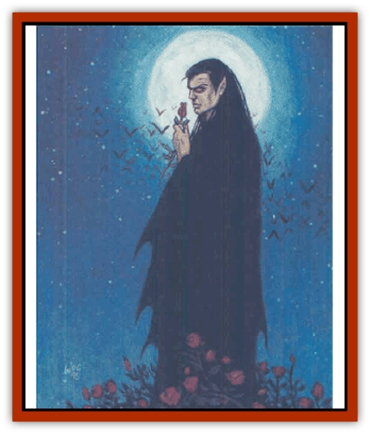

# Dream Spawn - General Information

Dream spawn are creatures native to the Nightmare Lands of the *Ravenloft* setting, combining the physical nature of the waking world with the malleable etherealness of the dream plane. All dream spawn, no matter their physical shape, appear as blank templates waiting for the imaginations of dreamers to temporarily define their forms. They can shift from featureless creatures to a specific form in an instant, copying that form exactly as it appears in the subconscious memories of a dreamer.

Dream spawn are divided into two categories: lesser dream spawn and greater dream spawn. There are a number of types in each category, but only the most prevalent are described here. These are the [[Dream_Spawn_Lesser_Morph|gray morphs]] and [[Dream_Spawn_Lesser_Morph|shadow morphs]] in the lesser category, and the [[Dream_Spawn_Greater_Ennui|ennui]] in the greater category. A specific entry on each of these types follows this general information.

**Dream Language:** All dream spawn speak the same language. The words are spoken in quiet, soothing tones that make listeners from the waking world very sleepy. Some *wanderers* (physical travelers in the Nightmare Lands, as opposed to *dreamers*, who visit in their dreams while asleep) have described the language as reminiscent of the lullabies they heard as children - not the words themselves, which few besides dream spawn understand, but the feelings of peace and comfort that they impart through tone and the quality of sound. A dream svawn can also speak the language of the dreamer or wanderer whose subconscious memories it taps.

Only wanderers are affected by the language of dream spawn. Dreamers, as they am already asleep, are immune to the effects of the tranquil tones.

Lesser dream spawn language renders a wanderer exposed to it sluggish and weary. This is reflected by a -2 penalty to all attack rolls and ability checks unless a successful saving throw vs. paralyzation is made. Failure meam the sluggishness lasts for 1d4+1 rounds or for as long as at least one lesser dream spawn continues to speak (taking no other action).

Greater dream spawn language has a more pronounced affect on wanderers. A wanderer who hears it must make a save vs. spell or suffer effects similar to a *sleep* spell with the following modifications: elves and creatures of up to 6+3 HD are affected by these sleep-inducing tones.

**Special Powers:** Because part of a dream spawn exists beyond the physical world, these creatures can be hurt only by enchanted weapons. The amount of enchantment required to damage a specific dream spawn is detailed in the individual entries.

*Attacks:* In their natural forms, dream spawn attack with clawlike hands. The amount of damage these attacks cause and the number of attacks a dream spawn can make in a single round are defined in the individual entries which follow.

*Forms:* All dream spawn have the ability to assume forms pulled from the deepest memories of dreamers, or in rare instances from the subconscious minds of wanderers. Where dreamers are concerned, dream spawn can draw on their memories at will. To access the memories of wanderers, dream spawn must first make physical contact and successfully employ their absorption power.

*Absorption:* Through the absorption of a portion of a wanderer's Intelligence, a dream spawn gains the ability to assume forms from the wanderer's mind. Lesser dream spawn can make one successful absorption attack per day, greater dream spawn can make two.

To use the absorption power, a dream spawn must make a successful attack roll to touch a wanderer with the suction-cup growths on its palms. This attack inflicts no physical damage. Instead, the victim loses 1d4+1 points of Intelligence (and all of the bonusses associated with his original score). This loss is temporary; a character regains Intelligence at a rate of 1 point per day. If absorption causes a character's Intelligence score to drop to 0, that character becomes noncorporeal (essentially, the physical body becomes a dream body) until the lost Intelligence points are recovered.

When a dream spawn assumes a different form (which takes one round), it gains all of the strengths and weaknesses of that form. These strengths and weaknesses may not always be realistic, but they will always match the memories from which the form was drawn. For example, in human form a dream spawn can be injured by normal weapons.

---
## Discovery & Documentation

**Source Publication:** The Nightmare Lands (1995)
**Campaign Setting:** Ravenloft
**Author(s):** Shane Lacy Hensley

### Other Creatures Found in This Source Book
   * [[Arcane_Head|Arcane Head]]
   * [[Dreamweaver|Dreamweaver]]
   * [[Dream_Spawn_Greater_Ennui|Dream Spawn, Greater, Ennui]]
   * [[Dream_Spawn_Lesser_Morph|Dream Spawn, Lesser, Morph]]
   * [[Ghost_Dancer_The|Ghost Dancer, The]]
   * [[Human_Abber_Shaman|Human, Abber Shaman]]
   * [[Hypnos|Hypnos]]
   * [[Lost_Souls|Lost Souls]]
   * [[Morpheus|Morpheus]]
   * [[Mullonga|Mullonga]]
   * [[Nightmare_Court_The|Nightmare Court, The]]
   * [[Nightmare_Man_The|Nightmare Man, The]]
   * [[Night_Terror_Mandalain|Night Terror, Mandalain]]
   * [[Rainbow_Serpent_The|Rainbow Serpent, The]]
