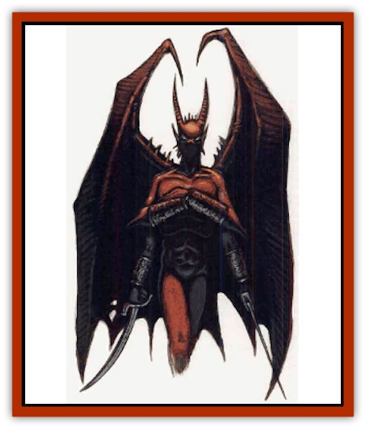

# Dream Spawn - Greater - Ennui

| Statistic | **Dream Spawn, Greater, Ennui** |
| --- | --- |
| **Activity Cycle:** | Night |
| **Alignment:** | Lawful evil |
| **Armor Class:** | 5 |
| **Climate/Terrain:** | The Nightmare Lands |
| **Damage/Attack:** | 1d6 &times;4 or by weapon |
| **Diet:** | Special |
| **Frequency:** | Verv rare |
| **Hit Dice:** | 8 |
| **Intelligence:** | High (14) |
| **Magic Resistance:** | 15% |
| **Morale:** | Champion (16) |
| **Movement:** | 9, Fl 24 (C) |
| **No. Appearing:** | 1 |
| **No. of Attacks:** | 4 or 2 |
| **Organization:** | Solitary |
| **Size:** | M (6' tall) |
| **Special Attacks:** | Swoop, invisibility |
| **Special Defenses:** | +3 or better weapon to hit |
| **THAC0:** | 13 |
| **Treasure:** | Nil |
| **XP Value:** | 6,000 |

Ennui are greater dream spawn who serve the members of the [[Nightmare_Court_The|Nightmare Court]], actively controlling events occurring in dreamscapes while their masters are otherwise occupied. They can move freely across the Veil of Sleep, stepping between the waking world and the dreamscapes without trouble. Ennui are naturally wild and savage. Fear generated in dreamers by nightmares not only sustains ennui, it gives them control over their innate savagery.

An ennui appears as a large creature that can shift its form at will. In its natural form, it stands as tall as a man, has four arms, and batlike wings. Its skin is gray and featureless, able to change with fluidic ease.

Ennui speak the language common to all dream spawn, as detailed in the [[Dream_Spawn_General_Information|general information]] entry. An ennui can also speak the primary language of the dreamer or wanderer from which it draws memories.

**Combat:** An ennui fights with its four clawlike hands. It can strike with all four claws in a single round, but can attack only a single foe. Each claw inflicts 1d6 points of damage.

This type of greater dream spawn can also make a special swoop attack. It dives at an opponent from a great height, its wings spread wide. At the end of the swoop, the ennui attacks a single target with all four clawed hands and with its two clawed feet. All ennui claws inflict 1d6 points of damage, but the swoop provides a damage bonus of +2 to each successful attack. After all six attacks are made, the swooping ennui must land and spend the next two rounds resting its wings. It can continue to use other attack forms, but must wait at least two rounds before making another swoop attack.

If armed with a *dream slayer sword* (40% chance), an ennui can make two attacks per round. These attacks can be directed at one or two opponents. A *dream slayer sword* inflicts 1d10+4 damage upon dreamers or 1d10+1 damage upon wanderers.

An ennui in its natural form can become *invisible* at will. If it makes an attack it immediately becomes visible again. An ennui often becomes invisible after making a swoop attack to confuse its opponents.

**Habitat/Society:** Ennui hate other ennui and lord over all [[Dream_Spawn_Lesser_Morph|lesser dream spawn]]. They have no communities, but seek to serve the Nightmare Court. A vassal ennui is a dream spawn who has attached itself to the Court. Vassal ennui perform special missions for specific Court members and also serve as overseers of the dreamscapes. When a dreamer is emplaced as seed in a dreamscape, an ennui is assigned to guard him and keep the nightmare flowing. Like wardens in prisons, ennui enforce the laws of their masters and administer to particular dreamscapes. They take this job very seriously and are prepared to die to fulfill it.

Rogue ennui are greater dream spawn who have not yet attached themselves to the Nightmare Court or who have been dismissed from their duties. These creatures are wild and extremely dangerous as they are denied access to the fear-inducing nightmares they crave.

**Ecology:** Ennui draw sustenance from the dream seeds they oversee. They can consume lesser dream spawn, but the sweet fear generated by the nightmares of dream seeds keeps their wild sides in check.

---
## Discovery & Documentation

**Source Publication:** The Nightmare Lands (1995)
**Campaign Setting:** Ravenloft
**Author(s):** Shane Lacy Hensley

### Other Creatures Found in This Source Book
   * [[Arcane_Head|Arcane Head]]
   * [[Dreamweaver|Dreamweaver]]
   * [[Dream_Spawn_General_Information|Dream Spawn, General Information]]
   * [[Dream_Spawn_Lesser_Morph|Dream Spawn, Lesser, Morph]]
   * [[Ghost_Dancer_The|Ghost Dancer, The]]
   * [[Human_Abber_Shaman|Human, Abber Shaman]]
   * [[Hypnos|Hypnos]]
   * [[Lost_Souls|Lost Souls]]
   * [[Morpheus|Morpheus]]
   * [[Mullonga|Mullonga]]
   * [[Nightmare_Court_The|Nightmare Court, The]]
   * [[Nightmare_Man_The|Nightmare Man, The]]
   * [[Night_Terror_Mandalain|Night Terror, Mandalain]]
   * [[Rainbow_Serpent_The|Rainbow Serpent, The]]
