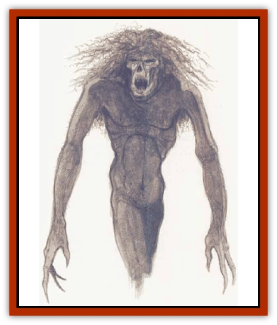

# Dream Spawn - Lesser - Morph

| Statistic | **Gray Morph** | **Shadow Morph** |
| --- | --- | --- |
| **Activity Cycle:** | Night | Night |
| **Alignment:** | Lawful neutral | Lawful evil |
| **Armor Class:** | 7 | 4 |
| **Climate/Terrain:** | The Nightmare Lands | The Nightmare Lands |
| **Damage/Attack:** | 1d4 | 1d8/1d8 |
| **Diet:** | Special | Special |
| **Frequency:** | Common | Rare |
| **Hit Dice:** | 3 | 5 |
| **Intelligence:** | Low (7) | Very (11) |
| **Magic Resistance:** | Nil | Nil |
| **Morale:** | Unsteady (7) | Elite (13) |
| **Movement:** | 6 | 12 |
| **No. Appearing:** | 4-24 | 1-4 |
| **No. of Attacks:** | 1 | 2 |
| **Organization:** | Group | Pack |
| **Size:** | S (4' tall) | M (5' tall) |
| **Special Attacks:** | Absorption | Horror |
| **Special Defenses:** | +1 weapon to hit | +2 weapon to hit |
| **THAC0:** | 17 | 15 |
| **Treasure:** | Nil | Nil |
| **XP Value:** | 420 | 975 |

Lesser dream spawn come in many varieties, but morphs are the type most often employed by the Nightmare Court. Two of the more prevalent types are gray morphs and shadow morphs.

## Gray Morph

Gray morphs populate the dreamscapes and roam the *Terrain Between* (a zone in which waking reality and dreamscapes are mixed and in constant flux). They function as the supporting cast in dreams and nightmares. It is not known if they serve this function in normal dream scenes or just in the dreamscapes of the Nightmare Lands.

A gray morph's natural form is that of a small, blank, featureless humanoid with long, gangly limbs and pale, gray flesh that is as malleable as water. In dreamscapes, gray morphs assume the form off normal people, common animals and even common objects to fill out the details of the dream. They can change form at will in a dreamscape due to the energy provided by a seed (a dreamer temporarily attached to a particular dreamscape). In the Terrain Between, however, they need to draw on the memories of living, sentient beings through physical contact.

Gray morphs speak the language of all dream spawn, as well as the languages of the memory-forms they assume.

**Combat:** These dream spawn are cowards who hide behind the masks of change. They prefer not to fight, fleeing at the first sign of hostility. If forced into battle, they attack with their clawlike hands for 1d4 points of damage. Against wanderers they will murmur their language (see [[Dream_Spawn_General_Information|General Information]] section).

**Habitat/Society:** When not wearing the forms drawn from the minds of dreamers, gray morphs huddle in groups and wait for new memories to come along and give them purpose and roles to play. Otherwise, they have no society to speak of. They resent the [[Dream_Spawn_Greater_Ennui|greater dream spawn]] who lord over them.

**Ecology:** Gray morphs absorb memories and assume memory-forms to sustain themselves. They avoid greater spawn, who feast on them.

## Shadow Morph

Shadow morphs play major roles in nightmares, assuming the forms of whatever horrors (of 5 HD or less) haunt the recessed memories of dream seeds (that is, dreamers). Its natural form looks much like a gray morph, though it's slightly larger, its flesh darker, and its featureless lines sharper and more frightening.

**Combat:** Shadow morphs are vicious, mean-spirited creatures that revel in causing pain and destruction while inducing heart-stopping fear. A shadow morph has a horror attack, a terrible screech that causes everyone who hears it and can see the morph's natural form to save vs. spell at -2 or be frozen with fear for 1d6-1 rounds. Those affeced by the horror give off energy that sustain and fortifies the shadow morph. For each round that a victim is horror-struck, the fear-inducing morph regenerates 1 lost hit point.

**Habitat/Society:** Shadow morphs bave no established society. Like other lesser dream spawn, they seek the dreams of others to give them form and substance. However, unlike gray morphs, shadow morphs use their ability to assume memory-forms to generate even greater fear in their victims. They assume thr forms of monsters or whatever memories most frighten a dreamer.

**Ecology:** Shadow morphs feed on fear, so they rarely kill their victims. Greater dream spawn sometimes feed on these dark creatures.

---
## Discovery & Documentation

**Source Publication:** The Nightmare Lands (1995)
**Campaign Setting:** Ravenloft
**Author(s):** Shane Lacy Hensley

### Other Creatures Found in This Source Book
   * [[Arcane_Head|Arcane Head]]
   * [[Dreamweaver|Dreamweaver]]
   * [[Dream_Spawn_General_Information|Dream Spawn, General Information]]
   * [[Dream_Spawn_Greater_Ennui|Dream Spawn, Greater, Ennui]]
   * [[Ghost_Dancer_The|Ghost Dancer, The]]
   * [[Human_Abber_Shaman|Human, Abber Shaman]]
   * [[Hypnos|Hypnos]]
   * [[Lost_Souls|Lost Souls]]
   * [[Morpheus|Morpheus]]
   * [[Mullonga|Mullonga]]
   * [[Nightmare_Court_The|Nightmare Court, The]]
   * [[Nightmare_Man_The|Nightmare Man, The]]
   * [[Night_Terror_Mandalain|Night Terror, Mandalain]]
   * [[Rainbow_Serpent_The|Rainbow Serpent, The]]
