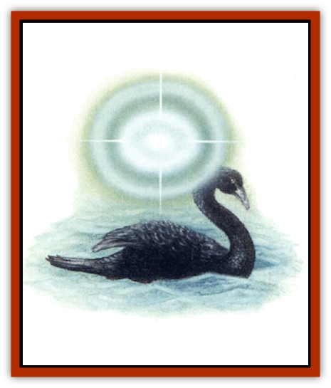
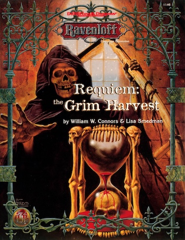

# Dream Stalker

| Statistic | **Dream Stalker** |
| --- | --- |
| **Activity Cycle:** | Night |
| **Alignment:** | Neutral evil |
| **Armor Class:** | 0 |
| **Climate/Terrain:** | Any |
| **Damage/Attack:** | Special |
| **Diet:** | Dream essences |
| **Frequency:** | Very rare |
| **Hit Dice:** | 3 |
| **Intelligence:** | Average (8-10) |
| **Magic Resistance:** | Nil |
| **Morale:** | Elite (13-14), see below |
| **Movement:** | Fl 18 (A) |
| **No. Appearing:** | 1 |
| **No. of Attacks:** | 1 |
| **Organization:** | Solitary |
| **Size:** | T (4&rdquo; diameter) |
| **Special Attacks:** | Coma |
| **Special Defenses:** | +1 or better magical weapons to hit |
| **THAC0:** | Nil |
| **Treasure:** | Nil |
| **XP Value:** | 650 |

The dream stalker's natural form is that of a glowing ball about the size of a human fist. It is sometimes mistaken for a [[Will_O'Wisp|will o'wisp]], although it is much smaller and does not change color, remaining instead a faint yellowish white. It moves by floating through the air, but can hug the ground and seem to be rolling along, instead.

The dream stalker can assume, at will, the shape of any small animal. Typical forms include those of a [[Dog|dog]] or [[Cat_Small|cat]], or a small farm animal such as a rabbit or duck. A form native to a particular terrain type might be assumed instead - a [[Lizard|lizard]] or large insect, for example. While in animal form, the dream stalker does not glow and looks identical to the creature it is duplicating. It can even mimic a specific animal's markings.

In animal form, the dream stalker can communicate as the animal; in its natural form its communication is empathic, or a welter of confusing images from the last dreamer it fed upon.

**Combat:** In its true forms a dream stalker "attacks" by hovering above the face of someone who is dreaming; it need not touch, but must remain within an inch or two of the dreamer's eyes (strangely, the bright glow of the dream stalker does not awaken the dreamer). Others who look at the glowing ball can see the victim's dreams reflected inside it, as if gazing into a crystal ball. The dreams often have a nightmarish quality. The dream stalker causes no physical damage, but damages a dreamer's mind, causing a deep, magical sleep resembling a coma.

If left undisturbed, a dream stalker will feed for 4d4 rounds before moving on to a fresh victim. The magical sleep it induces lasts a number of days equal to the number of rounds of feeding. In other words, if a dream stalker feeds upon a creature for five rounds, that creature will not awaken for five days. A successful saving throw vs. paralyzation reduces this time by half (rounded up to the nearest whole day).

While in the coma, the victim is unable to eat or drink and loses 1d3 hit points per day. Natural healing does not occur, but magical healing can restore lost hit points.

A sleeping victim can be awakened only by magical means: a *dispel magic* spell, for example. If awakened before the coma has run its course, the dreamer must make a successful madness check (or a saving throw vs. paralyzation) or awaken suddenly from a terrifying dream, suffering some form of nightmare induced madness as a result. This madness may take the form of delusions, paranoia, hallucinations, or amnesia. It has a duration equal to the number of days that the victim would have spent in the coma, was he not awakened.

A dream stalker's animal form has an Armor Class of 8 and can be struck by normal weapons. It can attack with whatever natural weapons the animal has (claws and teeth) at a THAC0 of 17, inflicting 1d2 points of damage on a successful hit. As soon as the animal form has suffered 4 points of damage, the animal "dies". One round later, a glowing sphere of light emerges from the corpse (the dream stalker in its true form). Unless the attacker used magical weapons or spells against the animal form, the dream stalker has suffered no real damage, having its full 3 Hit Dice upon rising from the corpse.

In its true form, a dream stalker has an Armor Class of 0 and can be struck only by magic. A dream stalker whose true form is damaged will flee. As a dream stalker accumulates damage, its glow dims. When reduced to 0 hit points, it blinks out of existence.

**Habitat/Society:** Dream stalkers live in desolate, misty areas, and can leave them for only short periods of time, an hour or two at most. They can sense emotions at a distance of many miles and are drawn to them. The dream stalker prefers to feed unmolested upon a sleeping victim. If a chosen victim remains in the vicinity, it will return when next he sleeps to feed again.

The dream stalker typically seeks out those experiencing frustration or grief as they search for a missing animal. It may appear before them in the appropriate animal form then run away, luring them into the mists. Once inside the mists, the victims typically lose their way. The dream stalker need only wait for them to tire and sleep before reverting to its true form and feeding upon traumatic dream essences.

**Ecology:** A dream stalker typically lives at the fringes of swamps or in ruins where prey can easily be found. When slain, the remains left behind resemble a marble-sized sphere of glass. These are highly prized by wizards, who grind them into dust for the manufacture of sleeping powders and potions.

---
## Discovery & Documentation

**Source Publication:** Requiem: The Grim Harvest (1996)
**Campaign Setting:** Ravenloft
**Author(s):** William W. Connors, Lisa Smedman

### Other Creatures Found in This Source Book
   * [[Golem_Maggot|Golem, Maggot]]
   * [[Mummy_Bog|Mummy, Bog]]
   * [[Siren_Ravenloft|Siren (Ravenloft)]]
