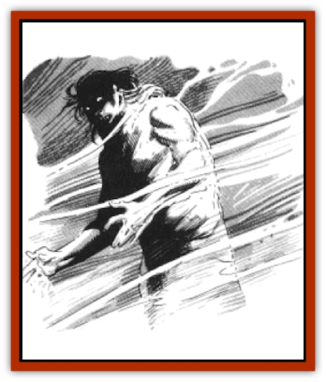

# Dreamshadow

| Statistic | **Dreamshadow** |
| --- | --- |
| **Activity Cycle:** | As creature or person mimicked |
| **Alignment:** | As creature or person mimicked |
| **Armor Class:** | As creature or person mimicked |
| **Climate/Terrain:** | As creature or person mimicked |
| **Damage/Attack:** | As person or creature mimicked (but illusionary) |
| **Diet:** | None |
| **Frequency:** | Very rare |
| **Hit Dice:** | As creature or person mimicked |
| **Intelligence:** | As the dreamer |
| **Magic Resistance:** | See below |
| **Morale:** | As person or creature mimicked |
| **Movement:** | As creature or person mimicked |
| **No. Appearing:** | Varies |
| **No. of Attacks:** | As person or creature mimicked |
| **Organization:** | As creature or person mimicked |
| **Size:** | As person or creature mimicked |
| **Special Attacks:** | As person or creature mimicked (but illusionary) |
| **Special Defenses:** | As person or creature mimicked |
| **THAC0:** | As creature or person mimicked |
| **Treasure:** | As creature or person mimicked (but illusionary) |
| **XP Value:** | As person or creature mimicked + 10% |

Dreamshadows are illusionary creations that take the appearance of any real person or creature known to the dreamer or to anyone experiencing the dream. They are quite believable and in all ways appear to be the actual person or creature. They are normally encountered as a result of a *mindspin* spell (see the "[[Dreamwraith|Dreamwraith]]" entry for details).

A dreamshadow can be of any alignment and can either be helpful or harmful to those experiencing it. It can appear as a monster (such as a [[Spider_Krynn|whisper spider]] or an [[Beast_Undead|undead beast]]), a member of an intelligent race (such as an [[Elf|elf]] or a [[Draconian_General_Information|draconian]]), or even as the dreamer himself. Not only does a dreamshadow have the shape of the creature or person it mimics, it also has the same alignment and personality. An [[Ogre|ogre]] dreamshadow, for instance, will probably be stupid and hostile, while a Solamnic Knight dreamshadow will probably be stern and honorable. A character encountering a dreamshadow of himself will discover that the dreamshadow shares the identical equipment, clothing, and physical features, but not necessarily the same knowledge and information.

It is extremely difficult to distinguish dreamshadows from their non-illusionary counterparts, but since dreamshadows always retain the intelligence of the dreamer some dreamshadows can exhibit peculiar aberrations. For instance, a chicken that scratches a message in the dirt or an ogre who speaks with eloquence and precision might alert the observer that he is dealing with a dreamshadow instead of the actual creature.

**Combat:** A dreamshadow attacks with the same weapons, abilities, strategies, and ferocity as its non-illusionary counterpart. However, a dreamshadow causes partially illusionary damage. This damage is equal to 1 hit point of real damage per 4 points of illusionary damage (for instance, if a character takes 12 points of illusionary damage, he experiences it as 3 hit points of real damage). Note that while a character is in the dream he believes illusionary damage to be genuine and therefore drops to the ground as though lifeless after taking what he believes to be the appropriate damage. When a character believes he has suffered a fatal amount of damage, he "dies". The illusionary nature of the damage is apparent only after his companions successfully end the dream or the dream is otherwise dispelled.

Spells cast by magic-using dreamshadows have effects on characters equivalent to actual spells. A *fireball* cast by a dreamshadow [[Dragon_General_Information|dragon]] does a comparable amount of illusionary damage. A dreamshadow [[Gorgon|gorgon]] turns a character to stone until the dream is ended.

Dreamshadows cannot be disbelieved into non-existence. However, if a dreamshadow is disbelieved before it conducts its first attack against a character, the character suffers no illusionary damage. A character cannot disbelieve a dreamshadow once he has suffered illusionary damage from it (see the "[[Dreamwraith|Dreamwraith]]" entry for information about disbelieving illusions).

Characters can use their weapons and spells against a dreamshadow just as they would against its non-illusionary counterpart - the dreamshadow suffers normal damage, not illusionary damage. When a dreamshadow is reduced to 0 hit points, it is destroyed.

Dreamshadows have no magic resistance in the first level of a *mindspin* dream, 10% magic resistance in the second level, and 20% in the third level (see the "[[Dreamwraith|Dreamwraith]]" entry for information about the mindspin levels).

**Habitat/Society:** A dreamshadow has no meaningful existence beyond that as experienced by the dreamer. Hence, even if a dreamshadow survives an encounter with a character or adventuring party, for all practical purposes it ceases to exist when the dream is ended. Dreamshadows collect illusionary treasure; their treasure items have no value for non-illusionary characters and cannot be taken from the dream.

**Ecology:** Dreamshadows interact with one another as they would in the non-illusionary world, for instance, a dreamshadow farmer might be tending a flock of dreamshadow sheep, while a band of dreamshadow hunters might be stalking a dreamshadow [[Bear_Ice|ice bear]]. But dreamshadows only appear to eat, drink, and sleep, since their physiological functions are all illusionary.

---
## Discovery & Documentation

**Source Publication:** MC4 Dragonlance Appendix (w/binder #2) (1989)
**Campaign Setting:** Dragonlance
**Author(s):** Rick Swan

### Other Creatures Found in This Source Book
   * [[Anemone_Giant_Sea|Anemone, Giant Sea]]
   * [[Bear_Ice|Bear, Ice]]
   * [[Beast_Undead|Beast, Undead]]
   * [[Bird_Krynn|Bird (Krynn)]]
   * [[Disir|Disir]]
   * [[Draconian_Aurak|Draconian, Aurak]]
   * [[Draconian_Baaz|Draconian, Baaz]]
   * [[Draconian_Bozak|Draconian, Bozak]]
   * [[Draconian_Kapak|Draconian, Kapak]]
   * [[Draconian_General_Information|Draconian, General Information]]
   * [[Draconian_Sivak|Draconian, Sivak]]
   * [[Draconian_Proto-_Traag|Draconian, Proto-, Traag]]
   * [[Dragon_Amphi|Dragon, Amphi]]
   * [[Dragon_Astral|Dragon, Astral]]
   * [[Dragon_Kodragon|Dragon, Kodragon]]
   * [[Dragon_Krynn_Othlorx_General_Information|Dragon (Krynn), Othlorx, General Information]]
   * [[Dragon_Krynn_General_Information|Dragon (Krynn), General Information]]
   * [[Dragon_Sea|Dragon, Sea]]
   * [[Dreamwraith|Dreamwraith]]
   * [[Dwarf_Daergar|Dwarf, Daergar]]
   * [[Dwarf_Hill_Neidar|Dwarf, Hill, Neidar]]
   * [[Dwarf_Mountain_Hylar|Dwarf, Mountain, Hylar]]
   * [[Dwarf_Theiwar|Dwarf, Theiwar]]
   * [[Dwarf_Zakhar|Dwarf, Zakhar]]
   * [[Elf_Half-|Elf, Half-]]
   * [[Elf_High_Qualinesti|Elf, High, Qualinesti]]
   * [[Elf_High_Silvanesti|Elf, High, Silvanesti]]
   * [[Elf_Sea_Dargonesti|Elf, Sea, Dargonesti]]
   * [[Elf_Sea_Dimernesti|Elf, Sea, Dimernesti]]
   * [[Elf_Wild_Kagonesti|Elf, Wild, Kagonesti]]
   * [[Eyewing|Eyewing]]
   * [[Fetch|Fetch]]
   * [[Fire_Minion|Fire Minion]]
   * [[Fireshadow|Fireshadow]]
   * [[Gnome_Tinker|Gnome, Tinker]]
   * [[Gurik_Cha'ahl|Gurik Cha'ahl]]
   * [[Haunt_Knight|Haunt, Knight]]
   * [[Horax|Horax]]
   * [[Human_Krynn|Human (Krynn)]]
   * [[Imp_Blood_Sea|Imp, Blood Sea]]
   * [[Kalothagh|Kalothagh]]
   * [[Kani_Doll|Kani Doll]]
   * [[Kender|Kender]]
   * [[Kyrie|Kyrie]]
   * [[Lizard_Man_Krynn|Lizard Man (Krynn)]]
   * [[Minotaur_Krynn|Minotaur, Krynn]]
   * [[Ogre_High|Ogre, High]]
   * [[Ogre_Krynn|Ogre (Krynn)]]
   * [[Phaethon|Phaethon]]
   * [[Saqualaminoi|Saqualaminoi]]
   * [[Shadowperson|Shadowperson]]
   * [[Shimmerweed|Shimmerweed]]
   * [[Skrit|Skrit]]
   * [[Spectral_Minion|Spectral Minion]]
   * [[Spider_Krynn|Spider (Krynn)]]
   * [[Stag|Stag]]
   * [[Tayling|Tayling]]
   * [[Thanoi|Thanoi]]
   * [[Tylor|Tylor]]
   * [[Wichtlin|Wichtlin]]
   * [[Wyndlass|Wyndlass]]
   * [[Yaggol|Yaggol]]
