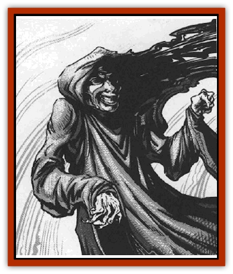

# Dreamslayer

| Statistic | **Dreamslayer** |
| --- | --- |
| **Activity Cycle:** | Night |
| **Alignment:** | Chaotic evil |
| **Armor Class:** | -2 |
| **Climate/Terrain:** | Wildspace/Astral plane |
| **Damage/Attack:** | Special |
| **Diet:** | Special |
| **Frequency:** | Very rare |
| **Hit Dice:** | 8 |
| **Intelligence:** | Exceptional (15) |
| **Magic Resistance:** | 90% |
| **Morale:** | Fanatic (18) |
| **Movement:** | 12, Fl 24 (B), SR 5 |
| **No. Appearing:** | 1 |
| **No. of Attacks:** | 1 |
| **Organization:** | Solitary |
| **Size:** | M (7' tall) |
| **Special Attacks:** | See below |
| **Special Defenses:** | See below |
| **THAC0:** | 13 |
| **Treasure:** | Nil |
| **XP Value:** | 10,000 |

The realm of dreams is a dark, mysterious place in the mind of every dreamer. Something in the nature of wildspace lets certain beings use dreams as a portal, allowing them the chance to depart the immaterial world and walk in the real world. The dreamslayer looks for sleeping spelljammers and attacks them through their dreams.

When seen in a dream, the dreamslayer's most common form is a black-shrouded humanoid figure. Its covered face is the face of the dreamer, though its eyes are glowing white sockets, and the facial features are twisted into a look of pure evil.

A dreamslayer can also appear as the living thing the dreamer fears most, or in its true form: a 7'-tall bipedal lizard torso, glistening black, with a 3'-long tail, talons, and a pair of draconian wings. The face is a glowing, featureless white oval.

**Combat:** When the dreamslayer encounters a sleeping victim in wildspace, the beast attempts to enter the victim's dreams. The circumstances of a character's dreams are up to the DM.

The dreamslayer always seeks a dream featuring other people, such as family or friends that the dreamer misses. A typical dream features 1d6 of these "dreamfolk" The dreamer sees the dreamslayer enter the dream, To weaken the dreamer's will, the dreamslayer takes control of the dream and "slays" the dreamfolk in gruesome ways. With each slaying, the dreamer (who can only watch, not act) saves vs. spell; a roll of 20 means the dreamer awakens, driving the dreamslayer back into the Astral Plane. A normal save means that the dreamer neither weakens nor awakens. Failure to save drains 2 points of Intelligence from the dreamer.

After all the dreamfolk are "killed", the dream scenery vanishes, replaced by a barren gray plain. The dreamslayer advances to kill the dreamer. If the dreamer saved successfully, he can conjure one weapon or possession for every 3 points of Intelligence remaining; if the dreamer is a spellcaster, he selects one spell per 2 points of Intelligence left. If the dreamer failed to save, he has nothing but a nightshirt. In either case, use the dreamer's normal statistics for combat. Spells and items must be chosen before the battle is joined.

The dreamslayer attacks once per round, making a normal attack roll. If the dreamslayer hits, the victim loses 2 points of Intelligence. When the victim reaches zero, see below.

Each round that the dreamslayer hits, the victim must save vs. spell, with a cumulative -1 die roll penalty for each hit the dreamslayer has already made (including those on the dreamfolk). A victim who saves can try to awaken instead of attacking, using the saving throw and Intelligence check procedure described above. A victim who wakes up recovers the lost Intelligence at a rate of 1 point per 10 minutes of rest.

A dreamslayer can only be attacked inside a dream, and then only by the dreamer. It cannot attack physically.

**Habitat/Society:** Dreamslayers have no society or organization. Dreamslayers are not found on planets nor in the phlogiston. They wander the Astral Plane, looking only for dreamers to inhabit.

If a dreamslayer reduces its victim to zero Intelligence, it takes over the body for one day per point of the victim's original Intelligence. During this time, the dreamslayer does everything denied to insubstantial forms. It eats and drinks to excess and tries to experience anger, love, thrills, fear, and joy. *Detect evil* cast on the host shows strong evil. *ESP* reveals an alien mind. *Know alignment* shows a chaotic evil entity.

When its time is up, the dreamslayer is hurled back to the Astral Plane, and the body collapses, dead. But if *exorcise* or *dispel evil* is cast on the victim before that time, the dreamslayer leaves the body, screaming. The victim falls into a deep sleep lasting 1d6 hours and awakens with no memory of the ordeal. Though they roam the Astral Plane, dreamslayers cannot be seen, heard, or felt. Dreamslayers only see sleeping beings; waking life is invisible to them.

**Ecology:** Dreamslayers contribute nothing to the ecosystem. They are the vultures of dreams, parasites of the night. Their method of reproduction, if any, is unknown.

---
## Discovery & Documentation

**Source Publication:** MC9 Spelljammer Appendix II (1991)
**Campaign Setting:** Planescape
**Author(s):** Scott Davis, Newton Ewell, John Terra

### Other Creatures Found in This Source Book
   * [[Alchemy_Plant|Alchemy Plant]]
   * [[Allura|Allura]]
   * [[Aperusa|Aperusa]]
   * [[Autognome|Autognome]]
   * [[Bionoid|Bionoid]]
   * [[Bloodsac|Bloodsac]]
   * [[Buzzjewel|Buzzjewel]]
   * [[Constellate|Constellate]]
   * [[Contemplator|Contemplator]]
   * [[Dohwar|Dohwar]]
   * [[Dragon_Moon|Dragon, Moon]]
   * [[Dragon_Stellar|Dragon, Stellar]]
   * [[Dragon_Sun|Dragon, Sun]]
   * [[Dweomerborn|Dweomerborn]]
   * [[Fal|Fal]]
   * [[Feesu|Feesu]]
   * [[Fire_Bat|Fire Bat]]
   * [[Firebird|Firebird]]
   * [[Firelich|Firelich]]
   * [[Flowfiend|Flowfiend]]
   * [[Gadabout|Gadabout]]
   * [[Gammaroid|Gammaroid]]
   * [[Gonn|Gonn]]
   * [[Gossamer|Gossamer]]
   * [[Grav|Grav]]
   * [[Great_Dreamer|Great Dreamer]]
   * [[Greatswan|Greatswan]]
   * [[Grell_Colonial|Grell, Colonial]]
   * [[Gullion|Gullion]]
   * [[Insectare|Insectare]]
   * [[Lhee|Lhee]]
   * [[Mercurial_Slime|Mercurial Slime]]
   * [[Meteorspawn|Meteorspawn]]
   * [[Monitor|Monitor]]
   * [[Owl_Space|Owl, Space]]
   * [[Pristatic|Pristatic]]
   * [[Scro|Scro]]
   * [[Selkie_Star|Selkie, Star]]
   * [[Silatic|Silatic]]
   * [[Skullbird|Skullbird]]
   * [[Sleek|Sleek]]
   * [[Sluk|Sluk]]
   * [[Space_Swine|Space Swine]]
   * [[Sphinx_Astro-|Sphinx, Astro-]]
   * [[Spirit_Warrior|Spirit Warrior]]
   * [[Starfly_Plant|Starfly Plant]]
   * [[Stargazer|Stargazer]]
   * [[Undead_Stellar|Undead, Stellar]]
   * [[Witchlight_Marauder|Witchlight Marauder]]
   * [[Xixchil|Xixchil]]
   * [[Yitsan|Yitsan]]
   * [[Zurchin|Zurchin]]
