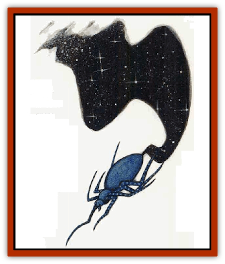

# Dreamweaver

| Statistic | **Dreamweaver** |
| --- | --- |
| **Activity Cycle:** | Night |
| **Alignment:** | Lawful neutral |
| **Armor Class:** | 6 |
| **Climate/Terrain:** | The Nightmare Lands |
| **Damage/Attack:** | 1 |
| **Diet:** | Special |
| **Frequency:** | Common |
| **Hit Dice:** | 1+1 |
| **Intelligence:** | Low (7) |
| **Magic Resistance:** | Nil |
| **Morale:** | Average (10) |
| **Movement:** | 9, Wb 12 |
| **No. Appearing:** | 3-18 |
| **No. of Attacks:** | 1 |
| **Organization:** | Swarm |
| **Size:** | T (6&ldquo; diameter) |
| **Special Attacks:** | Poison |
| **Special Defenses:** | +1 or better weapon to hit |
| **THAC0:** | 19 |
| **Treasure:** | Nil |
| **XP Value:** | 420 |

Dreamweavers spin the stuff of dreams and nightmares, giving shape and substance to the scenes inside the dreamscapes. These spiderlike creatures come in two varieties: light-colored *dream spinners* and *dark weavers*, who create the tapestries of nightmare.

Dreamweavers are [[Spider|spiders]] no bigger than 6 inches in diameter. The type that weaves beautiful silken dreams has a light-colored body, usually the same color as the morning sky. The type that weaves nightma webs has a sleek body as dark as the deepest night. Both types have matching striped legs.

These spider creatures are not known to communicate with other races in any obvious way, though it appears that they do communicate with each other. The [[Nightmare_Man_The|Nightmare Man]] (of the Nightmare Court) also seems able to communicate with at least the dark weavers, though whether this is a learned skill or some special power has never been confirmed.

**Combat:** Dreamweavers usually avoid direct contact with other creatures. They are not malicious or violent in any way. They seem to be interested only in weaving dreams and nightmares from the raw material churning in the minds of dreamers. When forced to defend themselves, the spiders can deliver a relatively weak bite that inflicts 1 point of damage. The poison that accompanies the bite is not weak, however. It causes victims to immediately fall into a deep, comalike sleep. Dreamers who are bitten are not affected by the poison directly, but their physical bodies fall into a deeper sleep. Once a victim falls asleep, the dreamweavers flee.

A wanderer bitten by a dreamweaver must make a saving throw vs. poison to withstand the poison's effects. Failure causes the victim to fall unconscious for 1d4 hours. An unconscious victim cannot be revived until the poison has run its course. While in this state the victim experiences intense dreams or nightmares, depending on what dreamweaver bit him.

A dreamer bitten by a dreamweaver also makes a save vs. poison. The effects are the same as for wanderers, except that the dreamer's physical body suffers and not his dream-self. This increases the length of the dreamer's sleeping period and keeps him trapped in the dream for that much longer.

If dreamweavers are ever exposed to sunlight or bright illumination of similar intensity, they fade away like the morning dew - or a fleeting dream.

**Habitat/Society:** Dreamweavers live in swarms consisting of one variety of the dream creatures. Many swarms of both types may occupy a single dreamscape, spinning the fabric of the dreams and nightmares playing out inside the sphere. From one side, the weave looks like any location from the real world. From the other, it appears as it truly is - a woven dream of stars and light or a nightmare web of skulls and dark horrors.

Dreamers and wanderers will seldom see dreamweavers. These stay behmd the scenes, weaving the patterns of dreamscapes just out of view.

**Ecology:** Like other creatures of the dream plane, dreamweavers draw their sustenance from dreamers.

---
## Discovery & Documentation

**Source Publication:** The Nightmare Lands (1995)
**Campaign Setting:** Ravenloft
**Author(s):** Shane Lacy Hensley

### Other Creatures Found in This Source Book
   * [[Arcane_Head|Arcane Head]]
   * [[Dream_Spawn_General_Information|Dream Spawn, General Information]]
   * [[Dream_Spawn_Greater_Ennui|Dream Spawn, Greater, Ennui]]
   * [[Dream_Spawn_Lesser_Morph|Dream Spawn, Lesser, Morph]]
   * [[Ghost_Dancer_The|Ghost Dancer, The]]
   * [[Human_Abber_Shaman|Human, Abber Shaman]]
   * [[Hypnos|Hypnos]]
   * [[Lost_Souls|Lost Souls]]
   * [[Morpheus|Morpheus]]
   * [[Mullonga|Mullonga]]
   * [[Nightmare_Court_The|Nightmare Court, The]]
   * [[Nightmare_Man_The|Nightmare Man, The]]
   * [[Night_Terror_Mandalain|Night Terror, Mandalain]]
   * [[Rainbow_Serpent_The|Rainbow Serpent, The]]
