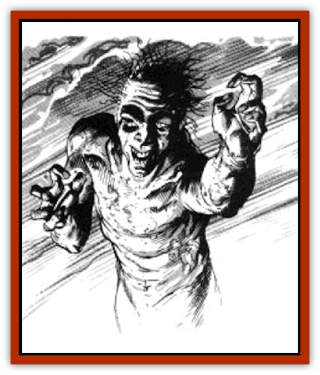

# Dreamwraith

| Statistic | **Dreamwraith** |
| --- | --- |
| **Activity Cycle:** | As creature or person mimicked |
| **Alignment:** | Chaotic evil |
| **Armor Class:** | 3 |
| **Climate/Terrain:** | As creature or person mimicked |
| **Damage/Attack:** | 1-10 or by weapon (illusionary) |
| **Diet:** | None |
| **Frequency:** | Very rare |
| **Hit Dice:** | 8 |
| **Intelligence:** | As creature or person mimicked |
| **Magic Resistance:** | See below |
| **Morale:** | Elite (14) |
| **Movement:** | As creature or person mimicked |
| **No. Appearing:** | 1-4 |
| **No. of Attacks:** | 1 |
| **Organization:** | As creature or person mimicked |
| **Size:** | As person or creature mimicked |
| **Special Attacks:** | -1 bonus to initiative roll |
| **Special Defenses:** | Nil |
| **THAC0:** | 13 |
| **Treasure:** | Nil |
| **XP Value:** | 2,000 |

Dreamwraiths are violent creations of the subconscious. They assault the minds of their victims through powerful illusionary attacks.

A dreamwraith can appear in a number of forms, usually humanoid, but almost always frightening and repulsive. It often takes the form of the dead, decaying visage of a character's former friend or ally. Dreamwraiths are normally encountered as a result of a *mindspin* spell (see following).

**Combat:** Although their forms can vary, the AC and Hit Dice of dreamwraiths are always the same. Dreamwraiths despise all non-illusionary creatures of good or neutral alignment and are devoted to their destruction. Intelligent and cunning, dreamwraiths strike with surprising fury, often catching their victims off-guard. Dreamwraiths gain a -1 bonus to all initiative checks.

Occasionally, a character may encounter a dreamwraith with the ability to *cause despair*. Such a dreamwraith will tell the character a tale of hopelessness and discouragement. If the character succeeds in a saving throw vs. spell, he resists the hypnotic effect of the dreamwraith's words. If he fails the saving throw, the character is overwhelmed with despair. He joins the dreamwraith, repeating the litany of hopelessness. Only a *dispel magic* spell or a convincing speech about hope and courage can negate the despair. There is a base chance of 30% that the speech negates the despair. At the DM'S discretion, the base chance may be modified as much as +70% if the speech is particularly inspiring.

The chilling touch of a dreamwraith inflicts 1d10 points of damage. They also employ a variety of weapons, most often long swords, battle axes, and daggers. However, the damage from both the touch and the weapons is illusionary, equal to 1 hit point of real damage per 4 points of illusionary damage. As with the illusionary damage of a [[Dreamshadow|dreamshadow]], a character suffering illusionary damage perceives the damage to be real, "dying" when he believes he has suffered a fatal amount of damage. The illusionary nature of the damage is apparent only after the dream has ended.

Dreamwraiths take normal damage from a character's weapons and spells, ceasing to exist when reduced to 0 hit points.

Dreamwraiths have normal magic resistance in the first level of *mindspin* dream, 10% magic resistance in the second level, and 20% in the third level. Because they are not undead, they cannot be turned.

If a dreamwraith is disbelieved before it conducts its first attack on a character, the character suffers no illusionary damage. A character cannot disbelieve a dreamwraith once he has suffered illusionary damage from it.

**Disbelieving Illusions:** A character can attempt to disbelieve dreamwraiths and dreamshadows. Each disbelief attempt requires the following steps:

<ol><li>The disbelieving character announces how many melee rounds he intends to concentrate on the suspected illusion.</li><li>The modifier for the disbelief check is determined, based on the length of uninterrupted concentration (see the table below). The character can perform no other actions while concentrating. Note that the concentration time is extremely limited if the illusion attacks the character while he is concentrating.</li><li>Determine the Disbelief Number by adding the concentration modifier to the characters intelligence. Add 1 for every other character who has successfully disbelieved during any previous round. If the character is attempting to disbelieve a dreamwraith, there is a -5 penalty.</li><li>The DM secretly rolls 1d20. It the result is higher than the Disbelief Number, then the entity in question looks real and its effects are perceived as real. It the result is equal to or lower than the Disbelief Number, then the illusion is disbelieved. A disbelief check can be made only once per hour by a character against any single illusion however, the character can check again whenever another character in his group makes a successful check. If an illusion is a group of entities, then the check is made for the entire group. Characters who successfully disbelieve cannot be harmed by illusions.</li></ol>**Concentration Modifiers for Illusion Disbelief**

| Time | Modifier |
| --- | --- |
| 1 round | +1 |
| 2 rounds | +2 |
| 3 rounds | +3 |
| 4-6 rounds | +4 |
| 7-9 rounds | +5 |
| 1-3 turns | +6 |
| 4-6 turns | +7 |
| 1+ hours | +8 |

**Habitat/Society:** A dreamwraith ceases to exist when the dream in which he resides has ended.

**Ecology:** Dreamwraiths experience only illusionary physiological functions. They are shunned by illusionary creatures of all alignments, but often ally with other dreamwraiths as well as evil dreamshadows.

---
## Discovery & Documentation

**Source Publication:** MC4 Dragonlance Appendix (w/binder #2) (1989)
**Campaign Setting:** Dragonlance
**Author(s):** Rick Swan

### Other Creatures Found in This Source Book
   * [[Anemone_Giant_Sea|Anemone, Giant Sea]]
   * [[Bear_Ice|Bear, Ice]]
   * [[Beast_Undead|Beast, Undead]]
   * [[Bird_Krynn|Bird (Krynn)]]
   * [[Disir|Disir]]
   * [[Draconian_Aurak|Draconian, Aurak]]
   * [[Draconian_Baaz|Draconian, Baaz]]
   * [[Draconian_Bozak|Draconian, Bozak]]
   * [[Draconian_Kapak|Draconian, Kapak]]
   * [[Draconian_General_Information|Draconian, General Information]]
   * [[Draconian_Sivak|Draconian, Sivak]]
   * [[Draconian_Proto-_Traag|Draconian, Proto-, Traag]]
   * [[Dragon_Amphi|Dragon, Amphi]]
   * [[Dragon_Astral|Dragon, Astral]]
   * [[Dragon_Kodragon|Dragon, Kodragon]]
   * [[Dragon_Krynn_Othlorx_General_Information|Dragon (Krynn), Othlorx, General Information]]
   * [[Dragon_Krynn_General_Information|Dragon (Krynn), General Information]]
   * [[Dragon_Sea|Dragon, Sea]]
   * [[Dreamshadow|Dreamshadow]]
   * [[Dwarf_Daergar|Dwarf, Daergar]]
   * [[Dwarf_Hill_Neidar|Dwarf, Hill, Neidar]]
   * [[Dwarf_Mountain_Hylar|Dwarf, Mountain, Hylar]]
   * [[Dwarf_Theiwar|Dwarf, Theiwar]]
   * [[Dwarf_Zakhar|Dwarf, Zakhar]]
   * [[Elf_Half-|Elf, Half-]]
   * [[Elf_High_Qualinesti|Elf, High, Qualinesti]]
   * [[Elf_High_Silvanesti|Elf, High, Silvanesti]]
   * [[Elf_Sea_Dargonesti|Elf, Sea, Dargonesti]]
   * [[Elf_Sea_Dimernesti|Elf, Sea, Dimernesti]]
   * [[Elf_Wild_Kagonesti|Elf, Wild, Kagonesti]]
   * [[Eyewing|Eyewing]]
   * [[Fetch|Fetch]]
   * [[Fire_Minion|Fire Minion]]
   * [[Fireshadow|Fireshadow]]
   * [[Gnome_Tinker|Gnome, Tinker]]
   * [[Gurik_Cha'ahl|Gurik Cha'ahl]]
   * [[Haunt_Knight|Haunt, Knight]]
   * [[Horax|Horax]]
   * [[Human_Krynn|Human (Krynn)]]
   * [[Imp_Blood_Sea|Imp, Blood Sea]]
   * [[Kalothagh|Kalothagh]]
   * [[Kani_Doll|Kani Doll]]
   * [[Kender|Kender]]
   * [[Kyrie|Kyrie]]
   * [[Lizard_Man_Krynn|Lizard Man (Krynn)]]
   * [[Minotaur_Krynn|Minotaur, Krynn]]
   * [[Ogre_High|Ogre, High]]
   * [[Ogre_Krynn|Ogre (Krynn)]]
   * [[Phaethon|Phaethon]]
   * [[Saqualaminoi|Saqualaminoi]]
   * [[Shadowperson|Shadowperson]]
   * [[Shimmerweed|Shimmerweed]]
   * [[Skrit|Skrit]]
   * [[Spectral_Minion|Spectral Minion]]
   * [[Spider_Krynn|Spider (Krynn)]]
   * [[Stag|Stag]]
   * [[Tayling|Tayling]]
   * [[Thanoi|Thanoi]]
   * [[Tylor|Tylor]]
   * [[Wichtlin|Wichtlin]]
   * [[Wyndlass|Wyndlass]]
   * [[Yaggol|Yaggol]]
