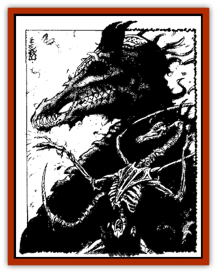

# Dregoth

| Statistic | **Dregoth** |
| --- | --- |
| **Activity Cycle:** | Any |
| **Alignment:** | Chaotic evil |
| **Armor Class:** | -8 |
| **Climate/Terrain:** | New Giustenal |
| **Damage/Attack:** | 2d10/2d10/4d12 |
| **Diet:** | None |
| **Frequency:** | Unique |
| **Hit Dice:** | 29th-level dragon (173 hit points) |
| **Intelligence:** | Supragenius (20) |
| **Magic Resistance:** | 40% |
| **Morale:** | Fearless (20) |
| **Movement:** | 15, FI 18 (C) |
| **No. Appearing:** | 1 |
| **No. of Attacks:** | 3 |
| **Organization:** | Solitary |
| **Size:** | G (30' tall) |
| **Special Attacks:** | See below |
| **Special Defenses:** | See below |
| **THAC0:** | -1 |
| **Treasure:** | H |
| **XP Value:** | 28,000 |

**Psionics Summary**

| Level | Dis/Sci/Dev | Attack/Defense | Score | PSPs |
| --- | --- | --- | --- | --- |
| 29 | 5/28/60 | all/all | 18 | 327 |

**Clairsentience -** *Sciences:* aura sight, clairaudience, clairvoyance, object reading; *Devotions:* combat mind, danger sense, feel sound, know direction, know location, psionic sense, see magic, spirit sense.

**Psychokinesis -** *Sciences:* create object, detonate, disintegrate, molecular rearrangement, telekinesis; *Devotions:* animate object, animate shadow, ballistic attack, control body, control flames, control sound, control winds, inertial barrier, levitation, magnetize.

**Psychometabolism -** *Sciences:* complete healing, death field, energy containment, life draining, metamorphosis, shadow form; *Devotions:* aging, biofeedback, body control, catfall, cause decay, chameleon power, displacement, double pain, enhancement, heightened senses, mind over body, prolong, suspend animation.

**Psychoportation -** *Sciences:* banishment, summon planar creature, summon planar energy, teleport, teleport other; *Devotions:* astral projection, blink, dimensional blade, dimensional door, dimension walk, dream travel, ethereal traveller, phase, shadow walk, summon object, teleport trigger, wrench.

**Telepathy -** *Sciences:* aura alteration, domination, empower, mass domination, mind link, psionic crush, tower of iron will, ultrablast; *Devotions:* aversion, awe, conceal thoughts, contact, ego whip, ESP, id insinuation, inflict pain, intellect fortress, invisibility, mental barrier, mind thrust, phobia amplification, psionic blast, psionic drain, send thoughts, thought shield.

The Dread King Dregoth was killed almost 2,000 years ago by the combined powers of seven sorcerer-kings. Shortly thereafter, Dregoth rose as the undead dragon king. While Dregoth is a unique being, his new state is very similar to that of a [[Kaisharga|kaisharga]], a lichlike creature native to Athas. He has existed in this state since the day of his return, neither dead nor alive, neither fully human nor fully [[Dragon_Athas|dragon]].

In life, Dregoth was a 29th-level dragon, on the verge of achieving the final stage of metamorphosis. He had been a champion of Rajaat the Warbringer, a general in the devastating Cleansing Wars that laid waste to the world. When it became clear the Warbringer was going to betray his Champions, Dregoth helped imprison Rajaat. Once Rajaat was safely locked away, Dregoth helped the other champions (now sorcerer-kings) turn Borys into the [[Dragon_of_Tyr|Dragon of Tyr]] to guard over the Warbringer's prison.

The sorcerer-kings decided to destroy the Dread King of Giustenal, who was next in line of the remaining Champions to become a full Dragon. They feared that the insanity that had affected Borys shortly after his transformation would soon affect Dregoth. They ambushed Dregoth in his own palace, battering him with the Way, pounding him with spells, and even striking him with weapons and fists. Dregoth fought bitterly, but the seven struck without warning. He died, and his city died with him.

Dregoth now rules a city far removed from the light of the crimson sun: the city of New Giustenal. He looks much as he did in life, one step removed from a full dragon. He is 30 feet tall and weighs 20,000 pounds. He has a dragon's form, with wings, scales, a tail, claws, and a devastating breath weapon. Dregoth's physical shape was badly damaged by the attack of the sorcerer-kings. So, his wings are torn, his body still wears the wounds inflicted upon it, and gaping holes show exposed bone in many places. The armored skin that remains is stretched thinly over the skeleton beneath. His eyes, like the eyes of all kaisharga, burn with green fire.

Dregoth can understand and speak all languages.

**Combat:** In addition to the psionics and spells of a 29th-level dragon, Dregoth has the abilities of a kaisharga. He uses a devastating claw/claw/bite attack that inflicts 2d10/2d10/4d12 points of damage. (The claw attacks receive an additional 10 points of damage because of Dregoth's great strength.) He can unleash a breath weapon that causes 20d12 points of damage to everything in its path. The searing cone is 5 feet wide at the base, 50 feet long, and 100 feet wide at the end. He can attack with his tail, causing 5d10 points of damage. Dregoth's undead nature gives him a chilling touch that does 1d10 points of additional damage. Characters touched need to save versus paralyzation or be paralyzed until the condition is dispelled.

The undead dragon king projects an aura of fear. It has a 60-foot range and affects creatures of 8 HD or less. These must make saving throws versus spells or flee in terror for 5d4 rounds. Dregoth can only be hit by +2 or better magical weapons. He is immune to *charm*, *sleep*, *enfeeblement*, *polymorph*, *cold*, *electricity*, *insanity*, and *death* spells. He makes all saving throws as a 21st-level wizard. Even though he's an undead creature, Dregoth can't be turned.

**Habitat/Society:** Dregoth rules the city of New Giustenal, which is located far below the ruins of the ancient city of Giustenal. He created two types of [[Dray|dray]], one of which serves him and worships him as a god. When Dregoth isn't locked inside his Dread Palace, he wanders the planes seeking ways to become a true god. This is his quest, though he doesn't realize that godhood is impossible to achieve on Athas.

Dregoth never appears to his citizens in his true form. Instead, he wears one of two false forms in front of the masses. The first of these forms is that of a tall, regal dray. This is what most of the people of New Giustenal believe their godking to be. The second form, used on very rare occasions, is that of a living 29th-level dragon. This form is modeled after Dregoth's true form before it was corrupted by undeath. A combination of magic and psionics, much of it imbued in the amulets and rings Dregoth wears, maintains the illusory forms, though the Dread King can drop or shift between them at will.

---
## Discovery & Documentation

**Source Publication:** Dark Sun Campaign Setting (revised) (1991)
**Campaign Setting:** Dark Sun
**Author(s):** Bill Slavicsek

### Other Creatures Found in This Source Book
   * [[Animal_Domestic_Athas_I|Animal, Domestic (Athas) I]]
   * [[Animal_Domestic_Athas_II|Animal, Domestic (Athas) II]]
   * [[Giant_Athas|Giant (Athas)]]
