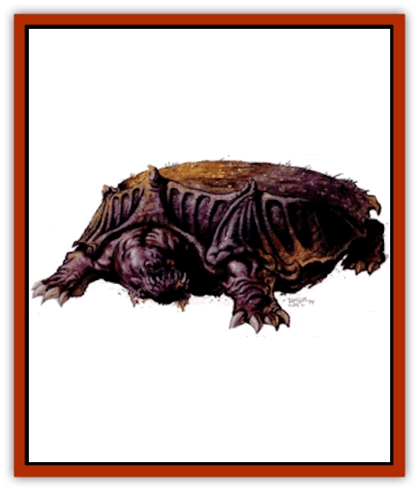

# Drik

| Statistic | **Drik** | **High Drik** |
| --- | --- | --- |
| **Activity Cycle:** | Day | Any |
| **Alignment:** | Neutral | Neutral evil |
| **Armor Class:** | 2 | 0 |
| **Climate/Terrain:** | Rocky badlands | Rocky badlands |
| **Damage/Attack:** | 2d8/2d10 | 2d6 or by weapon |
| **Diet:** | Omnivore | Carnivore |
| **Frequency:** | Very rare | Very rare |
| **Hit Dice:** | 16+6 | 8+3 |
| **Intelligence:** | Animal (1) | Average (8-10) |
| **Magic Resistance:** | Nil | 30% |
| **Morale:** | Elite (13-14) | Champion (15-16) |
| **Movement:** | 6 | 12 |
| **No. Appearing:** | 2-4 (1d3+1) | 1 |
| **No. of Attacks:** | 2 | 1 |
| **Organization:** | Family | Solitary |
| **Size:** | G (36' long) | H (18' tall) |
| **Special Attacks:** | Ram | Magic use, poison |
| **Special Defenses:** | Nil | Nil |
| **THAC0:** | 5 | 13 |
| **Treasure:** | Nil | Nil |
| **XP Value:** | 9,000 | 9,000 |

A drik is a powerful and massive herd [[Lizard|lizard]]. Its sheer bulk gives it an awesome might, making young driks targets for beast masters from both Urik and Raam to serve in their armies. The capture of the young driks has all but depleted the wild drik.

A drik is a powerful animal, built low to the ground and covered by a thick horn-encrusted shell. At birth the drik has no shell. But while growing, the young drik secretes a resin and bits of bone that form the beast's carapace. The shell hardens as the creature matures to an adult and protects the drik from behind the head all the way to the tail. This shell is a dark gray, speckled white with bone chips. The scaly hide of the drik is a deep brown, though some appear light brown or even yellow. The drik's heavy body is supported by four thick, stublike legs, each sporting four huge claws. The drik's head is enormous and has two black eyes. It has and a large mouth capable of swallowing a human whole. Several jagged tusks protrude menacingly from below the creature's mouth. The drik communicates with other driks through grunts and bellows. More intelligent creatures must use psionics or magic to communicate with a drik.

**Combat:** The drik's short legs and great weight make it ponderous beast, but this apparent lethargy conceals the beast's surprising prowess in melee. Its primary form of attack is its bite that inflicts 2-16 (2d8) points of damage. A drik's head and neck are actually quite agile when it holds them away from the resin shell - almost as if its head and neck weren't connected to its gargantuan body. A causal observer might fall victim to the drik's unnatural quickness and reach.

A drik can also attack with its clawed forelegs, but the animal needs at least three legs on the ground to maintain balance and support its immense weight. Therefore, only one foreleg attack can be made per round, inflicting 2-20 (2d10) points of crushing and slashing damage if successful.

The drik can use a ram attack against another drik or other large, slow-moving object. A drik can initiate a ram attack if it has at least 30 feet between it and its target, if the target is gargantuan in size (25 feet or more), and if it doesn't move more than 60 feet per round itself. On a successful attack, the drik's ram attack inflicts 2-24 (2d12) points of damage. The drik's ram attack can also be used against structures. In this case, no attack roll is necessary and the ram damages 1 foot of material for every point below the structure's required saving throw. Saving throws are 7 against stone, 9 against metal and soft stone, and 17 against wood. The drik's ram attack is made in lieu of any other attack.

A drik does not normally ram anything but another drik that is invading its family's territory. Ram attacks against structures or creatures other than a trespassing drik are made only at the instigation of the beast's handler.

**Habitat/Society:** Wild driks live in small family units dominated by a single female. Other adult females are not welcome within a family. They generally eat the grasses and shrubs of the badlands or the slower animals they can catch. Feral driks often lie still and wait for unwary creatures to wander within attack range. They drink from the Black Waters, making it fairly easy for trappers to locate them. Driks are the only animals known that can ingest Hamanu's terrible poisons from the Black Waters and survive.

In captivity, driks are ideal animals for siege combat. Their natural ram attack is quite valuable, as is their great size and natural protection. Some driks are used to pull massive siege towers or wagons, but often they are used as individual, mobile weapons platforms (see drik war machine, below).

**Ecology:** A drik mother lays its eggs in the Black Waters every three years. The young then find the nearest adult female (not necessarily its mother) and become part of that family. A drik reaches adulthood in two years and can live to be 30 years old.

An adult drik weighs roughly 5 tons and can carry as much as 2,000 pounds on its back before it simply refuses to move. A drik can pull as much as 10 tons on wheeled vehicles or drag 5 tons behind it on a litter or similar platform.

A drik is particularly foul-tempered in captivity. In battle, each drik has its own psionic master who directs its activities. However, in the everyday life of a captive drik, trainers must deal with them without the benefit of psionicists. Casualties among drik trainers are high. No driks have been bred in captivity.

**Drik War Machine**

A drik war machine is similar to the standard drik, but the shell has been reshaped to allow siege weapons to be mounted on its back. Captors reshape the shell to permit greater ramming power.

The drik's resin shell is melted and partially reshaped. Workmen with torches flatten the surface of the shell to more readily accept ballistae and catapults. Raamese engineers have perfected a technique whereby a wooden mold is built around an immobilized young drik as its shell is forming. Though only one drik in three survives the process, the results can be spectacular. A drik so customized has siege weapons mounted on its back, the number and damage caused varies by weapon type and the type of structure being attacked.

| Attack Form | Hard Stone | Soft Stone | Metal | Thin Wood | Thick Wood |
| --- | --- | --- | --- | --- | --- |
| 2 ballistae | 2 | 3 | 5 | 10 | 5 |
| Large catapult | 4 | 8 | 10 | 20 | 13 |
| Small catapult | 8 | 11 | 8 | 17 | 9 |
| Ram (customized) | 9 | 12 | 12 | 20 | 19 |

## High Drik

Another more foul and corrupt method for altering the drik is known only to the defilers under the directorship of King Hamanu, warrior king of Urik. The minions of Hamanu are sent to the shores of the Black Waters to find drik eggs. These eggs are brought back to a bestiary that has been especially designed for this type of experimental conversion.

The defilers use their foul magics to change the way the beasts develop within their eggs. Only 20% of the treated eggs survive the process. The process stunts their growth, allowing them to grow to a maximum height of only 18'. However, the benefits to the armies of Hamanu far outweigh this minor setback.

High driks are relatively quit and nimble bipeds. Their forelegs have mutated and now boast three fingers instead of the clawed hooves of their brethren. The skin of high driks is a dark, blood-red to black and veins protrude beneath the thick hide of the creatures. Their shells retain a smaller but relatively unchanged shape except that they are more twisted and jagged than the natural form. The shell color ranges from gray to black with sickly-green flecks riddling the surface.

The tusks around the high driks' heads are proportionately smaller than those of their unaltered relatives. Their mouths, however, are filled with multiple rows of black, razor sharp teeth. Green, viscous fluid seeps from their slavering maws.

High driks are also relatively intelligent and can speak in a crude form of the common tongue if taught. They can also communicate with other natural driks.

It is believed that the transformation this creature undergoes causes it to become insane and psychotic. It is, however, impossible to tell as there is no equivalent being to compare the high drik to. At the very least, the high drik is sadistic and cruel, taking great joy in causing pain to others.

**Combat:** Because of the high driks' ability to communicate with lower driks, high driks have been implemented by Hamanu's army for use as beast masters to control driks in warfare.

In melee, high driks can attack using their teeth to cause 2-12 (2d6) points of damage If, while attacking a human-sized opponent or smaller (though no smaller than three feet), a high drik's roll is a natural 20, it has succeeded in tearing a limb from its target. To determine which part is torn off, roll a 1d10: 1 = head, 2-3 = left arm, 4-5 = right arm, 6-7 = right leg. 8-9 = left leg, and 10 = tail (head if no tail). Anyone bitten by a high drik must make a save vs. poison or receive an additional 3-18 (3d6) points in poison damage from the vile green secretions that drool from the beast's mouth.

High driks can also hold weapons in their three-fingered hands. Weapons of favor are giant versions of the club (7-14 (1d8+6) points of damage), long sword (8-18 (2d6+6) points of damage), spear (8-18 (2d6+61 points of damage), and trident (9-24 (3d6+6) points of damage).

Because high driks have retained their native language of grunts and growls, they are usually used as beast masters to Hamanu's war driks. The control high driks exercise over war driks requires no psionics or magical links and little training is necessary for a war drik to learn to obey the commands of its high drik master. If a controlling high drik is killed in combat, the war drik becomes confused and begins to rampage, attacking and ramming random structures and even allied driks.

Capable and even imposing in melee, high driks are at their most formidable while using their innate abilities as defilers and psionicists. High driks have magical abilities equal to those of 8th level defilers, a result of the intense magical treatment the drik eggs receive at the hands of Hamanu's defilers.

The intensity of the transformation from drik to high drik is so traumatizing to the psyche of the driks that there is a 75% chance the high driks will have psionic wild talents and a 15% chance of them having the abilities of 5th-level psionicists.

**Habitat/Society:** High driks are unnatural creations. They are kept in separate quarters especially made for the needs of this creature. They are treated well by the Drajian guards and servants that are entrusted with their care, though few servants have survived longer than a year at the beck and call of high driks. To bring harm to a high drik evokes the fiercest wrath of Hamanu as these are currently some of his most favored subjects.

---
## Discovery & Documentation

**Source Publication:** Dark Sun Appendix II - Terrors Beyond Tyr (1991)
**Campaign Setting:** Dark Sun
**Author(s):** Jim Atkiss, Steve Brown, Timothy B. Brown, Andrew P. Morris, Bruce Nesmith, Wes Nicholson, Bill Slavicsek

### Other Creatures Found in This Source Book
   * [[Aarakocra_Athas|Aarakocra (Athas)]]
   * [[Animal_Domestic_Athas_II|Animal, Domestic (Athas) II]]
   * [[Aviarag|Aviarag]]
   * [[Baazrag|Baazrag]]
   * [[Baazrag_Boneclaw|Baazrag, Boneclaw]]
   * [[Bloodgrass|Bloodgrass]]
   * [[Cactus_Hunting|Cactus, Hunting]]
   * [[Cactus_Rock|Cactus, Rock]]
   * [[Cilops|Cilops]]
   * [[Crodlu|Crodlu]]
   * [[Dagorran|Dagorran]]
   * [[Dhaot|Dhaot]]
   * [[Drake_Lesser_Athas_General_Information|Drake, Lesser (Athas), General Information]]
   * [[Drake_Lesser_Athas_Magma|Drake, Lesser (Athas), Magma]]
   * [[Drake_Lesser_Athas_Rain|Drake, Lesser (Athas), Rain]]
   * [[Drake_Lesser_Athas_Silt|Drake, Lesser (Athas), Silt]]
   * [[Drake_Lesser_Athas_Sun|Drake, Lesser (Athas), Sun]]
   * [[Dray|Dray]]
   * [[Dune_Reaper|Dune Reaper]]
   * [[Dwarf_Athas|Dwarf (Athas)]]
   * [[Elemental_Beast_Athas_Air|Elemental Beast (Athas), Air]]
   * [[Elemental_Beast_Athas_Earth|Elemental Beast (Athas), Earth]]
   * [[Elemental_Beast_Athas_Fire|Elemental Beast (Athas), Fire]]
   * [[Elemental_Beast_Athas_Water|Elemental Beast (Athas), Water]]
   * [[Elf_Athas|Elf (Athas)]]
   * [[Fael|Fael]]
   * [[Feylaar|Feylaar]]
   * [[Fordorran|Fordorran]]
   * [[Giant_Half-giant|Giant, Half-giant]]
   * [[Giant_Shadow|Giant, Shadow]]
   * [[Golem_Athas_Magma|Golem (Athas), Magma]]
   * [[Golem_Athas_Salt|Golem (Athas), Salt]]
   * [[Golem_Athas_General_Information|Golem (Athas), General Information]]
   * [[Gorak|Gorak]]
   * [[Halfling_Athas|Halfling (Athas)]]
   * [[Human_Athas|Human (Athas)]]
   * [[Jhakar|Jhakar]]
   * [[Kaisharga|Kaisharga]]
   * [[Kes'trekel|Kes'trekel]]
   * [[Klar|Klar]]
   * [[Krag|Krag]]
   * [[Kragling|Kragling]]
   * [[Lirr|Lirr]]
   * [[Mastyrial|Mastyrial]]
   * [[Meorty|Meorty]]
   * [[Mul|Mul]]
   * [[Nikaal|Nikaal]]
   * [[Paraelemental_Beast_General_Information|Paraelemental Beast, General Information]]
   * [[Paraelemental_Beast_Magma|Paraelemental Beast, Magma]]
   * [[Paraelemental_Beast_Rain|Paraelemental Beast, Rain]]
   * [[Paraelemental_Beast_Silt|Paraelemental Beast, Silt]]
   * [[Paraelemental_Beast_Sun|Paraelemental Beast, Sun]]
   * [[Pakubrazi|Pakubrazi]]
   * [[Psionocus|Psionocus]]
   * [[Psurlon|Psurlon]]
   * [[Raaig|Raaig]]
   * [[Retriever_Obsidian|Retriever, Obsidian]]
   * [[Ruktoi|Ruktoi]]
   * [[Ruvoka_Athas|Ruvoka (Athas)]]
   * [[Sand_Howler|Sand Howler]]
   * [[Scorpion_Athas|Scorpion (Athas)]]
   * [[Seed_Brain|Seed, Brain]]
   * [[Silt_Horror_Black|Silt Horror, Black]]
   * [[Silt_Horror_Magma|Silt Horror, Magma]]
   * [[Silt_Horror_Red|Silt Horror, Red]]
   * [[Silt_Spawn|Silt Spawn]]
   * [[Slig|Slig]]
   * [[Spider_Athas|Spider (Athas)]]
   * [[Spinewyrm|Spinewyrm]]
   * [[Ssurran|Ssurran]]
   * [[Stalking_Horror|Stalking Horror]]
   * [[Tarek|Tarek]]
   * [[Tari|Tari]]
   * [[Thri-kreen|Thri-kreen]]
   * [[T'liz|T'liz]]
   * [[Tohr-kreen_II|Tohr-kreen II]]
   * [[Tohr-kreen_III|Tohr-kreen III]]
   * [[Trin|Trin]]
   * [[Tul'k|Tul'k]]
   * [[Undead_Athas_General_Information|Undead (Athas), General Information]]
   * [[Wraith_Athas|Wraith (Athas)]]
   * [[Xerichou|Xerichou]]
   * [[Zombie_Thinking|Zombie, Thinking]]
