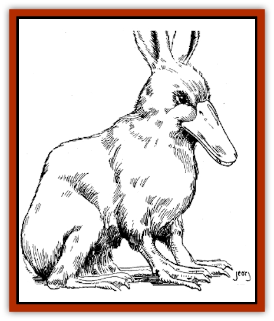

# Duckbunny

| Statistic | **Duckbunny** |
| --- | --- |
| **Activity Cycle:** | Day |
| **Alignment:** | Neutral |
| **Armor Class:** | 8 |
| **Climate/Terrain:** | Any land |
| **Damage/Attack:** | Nil |
| **Diet:** | Omnivore |
| **Frequency:** | Rare |
| **Hit Dice:** | 1-3 hp |
| **Intelligence:** | Animal (1) |
| **Magic Resistance:** | Nil |
| **Morale:** | Unreliable (2) |
| **Movement:** | 6, swim 12 |
| **No. Appearing:** | 1-10 |
| **No. of Attacks:** | 1 |
| **Organization:** | Pack |
| **Size:** | T |
| **Special Attacks:** | See below |
| **Special Defenses:** | Nil |
| **THAC0:** | 20 |
| **Treasure:** | Nil |
| **XP Value:** | 7 |

Magical crossbreeding is a dangerous endeavor. Rather than start experimenting in this field with potentially lethal creatures like the owlbear, most wizards prefer to begin their efforts with tamer, less deadly beasts. In this respect, duckbunnies are perfect candidates for the enterprising young mage just beginning his journey on the path of the crossbreeder. Made from harmless creatures of two separate types of animals�a mammal and a bird - the duckbunny provides a valuable lesson in crossbreeding magic.

Duckbunnies are the result of combining a snowshoe hare and a duck. With their ducks beak and webbed feet, they resemble nothing so much as some bizarre member of the platypus family, although their long bunny ears prevent them from being mistaken for those creatures. Almost all duckbunnies are white with orange-yellow bills and feet, and big, black eyes.

**Combat:** Duckbunnies generally do not engage in combat, fleeing instead from any encounter. If cornered, they will snap their beaks at any extended extremities within reach, from fingers to noses, but these attacks do no damage. Instead, the recipient of a duckbunny bite must check for surprise; if surprised, he is so shocked by the attack from such an inoffensive creature that he loses his initiative the next round. The duckbunny then takes the opportunity to flee.

**Habitat/Society:** Duckbunnies tend to follow the lifestyles of normal rabbits, with some exceptions. Like rabbits, they live in underground burrows, prefer a vegetarian diet, and breed in great numbers. However, due to their partial waterfowl nature, duckbunnies lay eggs instead of giving birth to live young have an insulating layer of fluffy down feathers underneath their fur and are excellent swimmers. They occasionally supplement their vegetarian diet with small fish they catch in their bills.

If freed, duckbunnies tend to make their homes along the banks of small bodies of water such as lakes and ponds. They can be as big a nuisance to vegetable gardens as are normal rabbits, although as long as there are water plants available most duckbunnies would prefer not to risk the dangers of cultivated gardens. In turn, duckbunnies are preyed upon by cats, wolves, and just about anything that hunts rabbits - and since a duckbunny's waddling gait on land is much slower than a true rabbits leaps and bounds, duckbunnies are often slain in the wild. Their main defensive strategy is to head for the water and swim to safety.

Occasionally, a duckbunny will answer the summons of a *find familiar* spell and serve a wizard in that capacity. As far as familiars go, a wizard could certainly do worse, but most wizards are less than pleased to see a duckbunny waddle up to them after the intensive preparation and effort involved in the casting of the *find familiar* spell.

**Ecology:** Normally created by fledgling wizards as an initial exercise in magical crossbreeding, duckbunnies nonetheless have several valuable features. Their eggs are delicious, and their high breeding rate ensures a steady supply. Because of the insulating properties of their downy feathers, duckbunny skins make excellent cloaks, capes, and boots. Duckbunny meat makes for a good stew, and is almost indistinguishable from rabbit meat.

When disturbed or surprised, duckbunnies cry out with a loud, duck-like "quack". This quacking makes duckbunnies an inexpensive alarm system, and many people are starting to use duckbunnies as the first line of defense in their home security systems. Granted, a duckbunny won't attack intruders like a good guard dog will, but he'll make a loud enough racket to warn the inhabitants and possibly scare off the intruder in the meantime. In addition, their high breeding rate makes duckbunnies much easier to replace than guard dogs, in the event that one or two are killed in the line of duty.

Finally, and most importantly to some, duckbunnies are almost irresistibly cute, with their big eyes, floppy ears, and soft, downy fur. It is no coincidence that a majority of the wizards who have created duckbunnies in the laboratory have young daughters at home, and it must be stated that duckbunnies do make wonderful pets.

Domesticated duckbunnies live for about ten years on average (much less in the wild), although those that become wizards' familiars can live for much longer.

---
## Discovery & Documentation

**Source Publication:** Dragon243 (1998)
**Campaign Setting:** Dragon Magazine
**Author(s):** Steve Berman, Roger Raupp, Johnathan M. Richards, George Vrbanic

### Other Creatures Found in This Source Book
   * [[Armadillephant|Armadillephant]]
   * [[Cat_Moat|Cat, Moat]]
   * [[Horse_Spider-|Horse, Spider-]]
   * [[Turtle_Dragonfly|Turtle, Dragonfly]]
