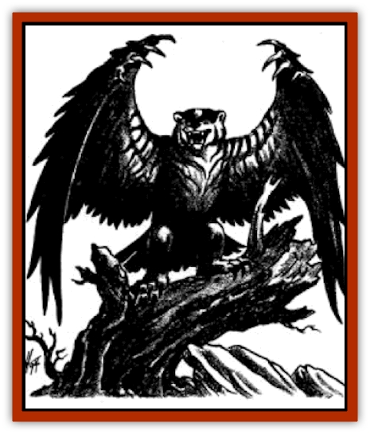

# Duhlarkin

| Statistic | **Generic** | **Wolveraven** |
| --- | --- | --- |
| **Activity Cycle:** | Any | Any |
| **Alignment:** | Neutral | Neutral |
| **Armor Class:** | See below | 4/5 |
| **Climate/Terrain:** | Any | Any sub-arctic |
| **Damage/Attack:** | See below | 2-5/2-5/2-5 |
| **Diet:** | See below | Omnivore |
| **Frequency:** | Very rare | Very rare |
| **Hit Dice:** | See below | 3+2 |
| **Intelligence:** | See below | Animal (1) |
| **Magic Resistance:** | Nil | Nil |
| **Morale:** | See below | Elite (13-14) |
| **Movement:** | See below | 6, Fl 12 (D) |
| **No. Appearing:** | 1 | 1-4 |
| **No. of Attacks:** | See below | 3 |
| **Organization:** | Solitary | Solitary |
| **Size:** | See below | M |
| **Special Attacks:** | See below | Wing spurs |
| **Special Defenses:** | See below | Nil |
| **THAC0:** | See below | 17 |
| **Treasure:** | Nil | Nil |
| **XP Value:** | See below | 175 |

Duhlarkin are unique creatures created through the use of a highly specialized form of *polymorph other* called *Duhlark's Animerge* (see TSR 1109, *City of Splendors*, *Campaign Guide to the City*, Chapter Seven). This spell allows the caster to fuse two creatures together into one original, amalgamated form, allowing traits from each creature to remain dominant in its new singular form. The creature acquires basic attributes from each of the animals involved in the spell, from body shape and size to movement modes, speed, and attack and defense modes (all the above statistics). If the caster is a transmuter, the caster can choose which traits are adopted in the new form and create new ones if desired; if not, the creature created is randomly determined by the Dungeon Master. Any creature created by means of this spell is generically referred to as "Duhlarkin", named after the spell.s creator.

**Combat:** The combat tactics and weapons of a Duhlarkin are determined by the two core animals; choose particular attacks of each of the animals and those are the attack modes of the merged creature. Keep in mind that body shape determines and alters some attack forms (see "Wolveraven" below).

**Habitat/Society:** The behavior patterns of a Duhlarkin resemble the dominant animal mind within it; for example, a [[Bear|bear]] merged with an [[Eagle|eagle]] could produce a hibernating avian that is extremely protective of its territory (bear behavior). Unlike the results of many other *polymorph* spells, the creatures created by *Duhlark's Animerge* can reproduce with other creatures of its kind (either another Duhlarkin or one of its source animals). Breeding a Duhlarkin with a source animal (for example, breeding a wolveraven with a [[Raven_Crow|giant raven]]) has a 25% chance of producing a viable wolveraven (50% chance of raven offspring, 25% stillborn), and breeding two like Duhlarkin has only a 50% chance of creating live offspring (50% stillborn).

**Ecology:** For years, Duhlark Kolat's fascination with monsters and creatures such as [[Chimera|chimerae]], [[Hippogriff|hippogriffs]], [[Owlbear_I|owlbears]], and [[Peryton|perytons]] led him to believe that transmutation magics were once in common use and the continued existence of such illogical creatures suggested that such creations were magically created but could eventually breed true and become viable species. Duhlark envisioned a simple dream of using such magics to create larger domesticated animals to prevent food shortages or perhaps creating a [[Horse|war horse]] with armor-plated skin.

Duhlark created his *animerge* spell and continues to test it, creating creatures to study and examining their viability and usefulness for Toril. Many of his experiments meet with failure. (Duhlark's first experiment with merging warm-blooded mammals and insects - a cricket and a [[Cat_Small|cat]] - created a feline of such inordinate strength and leaping ability that, with one startled jump, it embedded itself into the ceiling of his tower.) Some, however, are proving stable enough for continued existence, such as the badgeram, an omnivorous creature with a ram's horns, the tenacity and ferocity of a [[Badger|badger]] (as well as its foreclaws), and an innate protectiveness about its territory - a creature that guards a herd of sheep from [[Wolf|wolves]] with no danger of it turning on the herd.

**Wolveraven**

  One of Duhlark's original creations, the wolveraven is a cross between a giant raven and a [[Wolverine|wolverine]]. Having created four of them and bred six more through them, Duhlark considers this carnivore a success. (Duhlark gave one to Khelben as a token of respect and as a sign of his achievement.) While originally created as a curiosity, the wolveraven could survive well in the mountains north of the city, according to Duhlark, both reducing the overpopulation of mountain goats and providing a balance against an astonishing number of dangerous perytons that nest therein.

The wolveraven has a seven-foot wingspan, and its hind claws are strong enough to carry a small [[Halfling|halfling]] (or claw at one twice, the wolverine's claw damage increased to 1d4+1 due to the raven's superior leg strength). Its most damaging attacks are its bite (same as wolverine) and the bone spurs along the upper edge of its wings. A wolveraven can perform a swooping dive and slash at an opponent with its wing spurs, dealing 2-12 points of damage to any target in a passing attack that can also impale prey of 1' tall or smaller.

---
## Discovery & Documentation

**Source Publication:** City of Splendors (1994)
**Campaign Setting:** Forgotten Realms
**Author(s):** Ed Greenwood, Elain Cunningham

### Other Creatures Found in This Source Book
   * [[Curst|Curst]]
   * [[Doppelganger_Greater|Doppelganger, Greater]]
   * [[Gulguthhydra|Gulguthhydra]]
   * [[Hakeashar|Hakeashar]]
   * [[Leucrotta_Greater|Leucrotta, Greater]]
   * [[Lycanthrope_Wereshark|Lycanthrope, Wereshark]]
   * [[Nyth|Nyth]]
   * [[Ooze_Slime_Jelly_Ghaunadan|Ooze/Slime/Jelly, Ghaunadan]]
   * [[Palimpsest|Palimpsest]]
   * [[Peltast|Peltast]]
   * [[Raggamoffyn|Raggamoffyn]]
   * [[Shadowrath|Shadowrath]]
   * [[Snake_Sewerm|Snake, Sewerm]]
   * [[Watchspider|Watchspider]]
