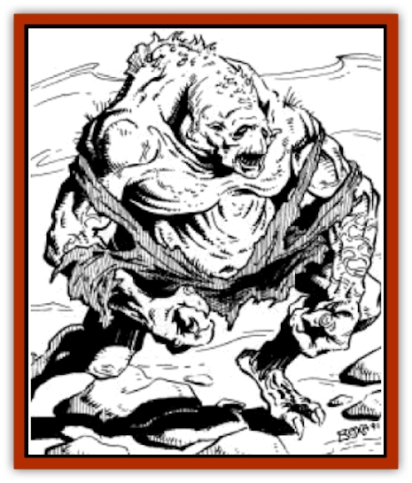

# Dune Freak

| Statistic | **Dune Freak** |
| --- | --- |
| **Activity Cycle:** | Night |
| **Alignment:** | Neutral evil |
| **Armor Class:** | 8 |
| **Climate/Terrain:** | Any sandy region |
| **Damage/Attack:** | 1d4/1d4 |
| **Diet:** | Omnivore |
| **Frequency:** | Uncommon |
| **Hit Dice:** | 3 |
| **Intelligence:** | Low (5-7) |
| **Magic Resistance:** | Nil |
| **Morale:** | Steady (11-12) |
| **Movement:** | 9, Br 15 |
| **No. Appearing:** | 2-12 (2d6) |
| **No. of Attacks:** | 2 |
| **Organization:** | Small Tribes |
| **Size:** | M (6' tall) |
| **Special Attacks:** | Surprise bonus, Paralyzation, suffocation |
| **Special Defenses:** | Burrow |
| **THAC0:** | 17 |
| **Treasure:** | P |
| **XP Value:** | 650 |

The dune freaks, or *anakore*, are a race of dimwitted humanoids with bony, wedgelike heads, small ears pressed close to the sides of their heads, and sunken, beady eyes covered by clear membranes to prevent sand from scratching these delicate tissues.

The bright light of Athas' sun blinds the anakore during the day, but at night they can see as clearly as most beings do during the day. The anakore do not have infravision, however; they do not see body heat. In complete darkness, they are as blind as any human. But if there is even the tiniest amount of light, such as from a star, they see very well.

The anakore have an unusual dorsal ridge running along their spine. This fin is actually a sensitive organ which picks up minute vibrations traveling through the sand. With it, they can locate a solitary creature walking on the sand from as far away as five miles.

**Combat:** Anakore usually attack their foes by burrowing underneath them, then striking from beneath the victim with their sharp claws. Such victims suffer a -3 penalty to their surprise rolls. The anakore continue to fight from within the sand for as long as possible, imposing a -2 penalty to their opponents. attack rolls.

When an anakore hits a victim with both claws, it holds the individual motionless for a moment and bites with its short, sharp teeth. While this bite inflicts no damage in itself, it does inject poisonous saliva into the wound. The victim must immediately save vs. paralyzation or be completely unable to move for 1d4 rounds. On the round following paralyzation, the victim is dragged under the sound, suffering an additional 1d4 per round suffocation damage.

**Habitat/Society:** The anakore live within any sandy heap, such as sand dunes or the alluvial fans at the mouths of the canyons. Normally, they travel and hunt in small packs of two to twelve individuals, with the largest, most aggressive acting as leader. They are rarely found outside of sandy areas, but they can walk upright across various kinds of terrain - though they are unusually vulnerable in this state and will avoid fighting at all costs.

**Ecology:** The anakore are nomadic burrowers who are constantly moving through the sandy wastes of Athas. It is often possible to identify an area through which anakores have passed by the dead plants found there - the anakores chew the roots away, leaving the upper stalks exposed. In addition to their diet of plant roots, the anakores also eat meat - [[Animal_Domestic_Athas_I|mekillot]], [[Animal_Domestic_Athas_I|inix]], [[Animal_Domestic_Athas_I|erdlu]], [[Elf_Athas|elf]], [[Dwarf_Athas|dwarf]], [[Halfling_Athas|halfling]], and nearly anything except [[Animal_Domestic_Athas_I|kank]].

---
## Discovery & Documentation

**Source Publication:** Dark Sun Campaign Setting (original) (1991)
**Campaign Setting:** Dark Sun
**Author(s):** Timothy B. Brown, Troy Denning, William W. Connors, J. Robert King, Brom and Tom Baxa,

### Other Creatures Found in This Source Book
   * [[Animal_Domestic_Athas_I|Animal, Domestic (Athas) I]]
   * [[Belgoi|Belgoi]]
   * [[Braxat|Braxat]]
   * [[Dragon_of_Tyr|Dragon of Tyr]]
   * [[Gaj|Gaj]]
   * [[Giant_Athach|Giant, Athach]]
   * [[Gith|Gith]]
   * [[Jozhal|Jozhal]]
   * [[Kluzd|Kluzd]]
   * [[Silk_Wyrm|Silk Wyrm]]
   * [[Tembo|Tembo]]
   * [[Wezer|Wezer]]
