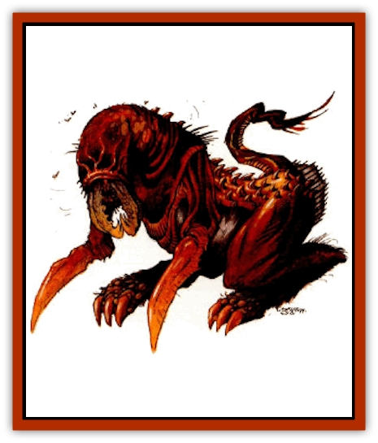

# Dune Reaper

| Statistic | **Drone** | **Warrior** |
| --- | --- | --- |
| **Activity Cycle:** | Day | Day |
| **Alignment:** | Neutral | Neutral |
| **Armor Class:** | 2 | 0 |
| **Climate/Terrain:** | Any | Any |
| **Damage/Attack:** | 3d6+7/3d6+7/2d6 | 3d6+7/3d6+7/2d6 |
| **Diet:** | Omnivore | Omnivore |
| **Frequency:** | Common | Common |
| **Hit Dice:** | 8 | 10 |
| **Intelligence:** | Semi- (2-4) | Low (5-7) |
| **Magic Resistance:** | 10% | 25% |
| **Morale:** | Fearless (19-20) | Fearless (19-20) |
| **Movement:** | 12, Jp 9 | 12, Jp 9 |
| **No. Appearing:** | 2-5 (1d4+1) or 5-25 (4d6+1) | 1 or 2-5 (1d4+1) |
| **No. of Attacks:** | 3 | 3 |
| **Organization:** | Pack | Pack |
| **Size:** | L (8' tall) | L (10' tall) |
| **Special Attacks:** | Surprise leap | Surprise leap |
| **Special Defenses:** | Nil | See below |
| **THAC0:** | 13 | 11 |
| **Treasure:** | Nil | Nil |
| **XP Value:** | 4,000 | 6,000 |

The dune reaper prowls the sandy wastes in wild packs, leaping from dunes to ambush and impale its prey on its scythelike limbs.

The dune reaper is large and forbidding creature with a toothy maw and mandibles to either side of its mouth. The reaper, as it is commonly called, also has a razor-sharp row of scalelike plates down the center of its back and a thick scaly hide ranging from red to deep brown in color. The beast's front limbs taper to swordlike appendages that it uses quite effectively in combat. The dune reaper's rear legs fold underneath themselves, giving it an impressive leaping ability. Perhaps the most disquieting features of the dune reaper are the eerie red luminescence of its eyes and the sickly sweet smell of decay that surrounds it. The reaper emits a howling wail that can frequently be heard across the barren deserts of Athas. The size, ferocity, and eerie appearance of the dune reaper makes it a highly valued combatant in many Athasian arenas.

**Combat:** Dune reapers are extremely territorial and attack any creature that invades their lands. The pride is divided into clans of 3-6 individuals consisting of at least one warrior and the rest, drones. These clans carry out the wishes of the matron, from building their hive to patrolling their region. The purpose of these patrols is to attack creatures trespassing within their territory and to bring back their carcasses for the rest of the pride to feed upon.

These beasts have a brutal cunning that belies their relatively low intellect. Reapers frequently lie in wait for days on caravan routes in anticipation of their next opportunity to feed. One of their favored methods of attack is to climb to the top of dunes that surround a road or trail and hide by crouching as low as is possible for a creature that can be as tall as 10'. When the reapers see a target pass beneath, they jump down with their powerful front appendages extended in the hopes of impaling the intended victim. Such attacks, if successful, cause 6-36 (6d6) points of damage and have a +5 THAC0 bonus because of the speed of descent and the weight of the reaper.

In melee these creatures are savage and fierce combatants. Their bladelike arms are lightning fast and inflict 3-18 (3d6) points of damage on a successful attack. Because of the strength of these arms, each successful attack receives a +7 modifier for damage. Their snapping laws and mandibles can clamp down on a victim causing 2-12 (2d6) points of damage. Reapers can lock their mandibles around or into the surrounding flesh with a second successful hit. If the second attack roll succeeds, on each subsequent round dune reapers hit automatically for 2-12 (2d6) points of damage. Victims can end these attacks, if they make a successful Bend Bars/Lift Gates roll. Success means the victim can pry the mandibles from its flesh. Such an attempt precludes any attacks from the victim that round.

Dune reapers have a very tough hide that contributes to their AC 2. While these creatures may not be exceptionally fast running, they are extremely agile and quick. A full-grown reaper in combat with its quickness, glowing red eyes, snapping maw and mandibles, and arcing, bladed arms can be an impressive and frightening sight.

**Habitat/Society:** Dune reapers roam the wastes in small prides that can include as many as 30 individuals. There is a strict hierarchy within the pride and it is matriarchal in nature. There are three distinct stations within the pride: the matron, the warriors, and the drones. The matron and all warriors are female and the drones are male. Female dune reapers grow larger than their male counterparts and the oldest, and most powerful, female is the matron of the pride. She leads the group in combat. When food is scarce, she leads them in their travels to find nourishment. Another female can challenge her for her position as matron through a fight to the death.

A pride of reapers will make its home on or near the base of a cliff near a water source within their territory. These lairs are built from the sand and gravel by mixing it with secretions from the drones' mouths. These structures rise multiple levels above the ground and several layers below the ground and appear structurally like an adobe hive. Each pride has two such nests within their territory and the pride splits their time evenly between them, half the year at each.

Dune reapers have two mating seasons. The matron is the only female capable of reproducing. This mating takes place once on the banks of the water sources near each of the hives. These areas tend to be ancestral ground that they return to annually. After mating, the matron kills the male and deposits 5-6 eggs within its corpse. She then buries the corpse near the banks of the river, oasis, or pond. The pride returns in two months when the eggs hatch. To maintain a proper balance of warriors and drones, some infants are destroyed and the rest are assimilated into the group. It takes the young reaper approximately two months to reach adulthood.

Dune reapers have a fairly sophisticated system of communication and do so through a complex system of sound, motion, and scents. If an individual returns after successfully locating the pride's next meal prospect, it begins a dance. During the dance it emits soft chortles and whirs and releases specific scents. The dance communicates to the pride the direction and distance of the food source, what it is, and the number of individuals.

**Ecology:** Dune reapers eat anything, plant or animal. They have even been seen eating small stones. Stones, it is believed, aid in digesting its varied foods. If food is in extremely short supply, prides have been known to turn on each other over meals and often fight to the death.

It is their ferocity that makes them so prized in the arena. One event favored by sorcerer kings involves setting loose one reaper above two combatants just as a killing blow is about to be delivered.

The front limbs of the dune reaper are often used to make swords and other bladed weapons. Its scaly plates can be used in the construction of shields and armor.

**Drone**

  Drones are the smallest dune reapers and on the lowest level of the dune reaper caste system. They generally constitute about two-thirds of the pride and are the basic workers and laborers of the pack. While not very intelligent, drones are stalwart workers and can understand and follow the orders of the warriors and matron. It is upon their backs that hives are built and the food is harvested.

Drones aren't intelligent enough to initiate any actions on their own and are therefore supervised by a warrior reaper. Each drone is assigned to one warrior and all orders come through her. They are bonded by their pheromones and this relationship lasts for life. If warrior drones are killed or die, the pride sets upon her remaining drones and destroys them.

Drones are completely subservient and loyal to their superior and will never attack her. However, should another warrior infringe upon the chain of command or otherwise prevent the drones from completing tasks assigned them, they attack the interloper until they are killed or ordered to cease by their superior. The only individual who can override the commands of the drones' superior is the matron. Drones never attack a matron.

**Warrior**

  **Psionics Summary**

| Level | Dis/Sci/Dev | Attack/Defense | Score | PSPs |
| --- | --- | --- | --- | --- |
| 10 | 2/2/7 | MT,PsC/IF,MB | 10 | 30 |

**Psychokinesis -** *Sciences:* nil; *Devotions:* ballistic attack, inertial barrier, molecular agitation.

**Telepathy -** *Sciences:* mind link, superior invisibility; *Devotions:* contact, send thoughts, mind bar, mind thrust, psionic crush.

  Warrior reapers are the sergeants of the pride. They see that the orders of the matron are carried out. Generally, warriors constitute about one-third of the pride population. Warriors are assigned 2-5 drones that are bonded to them for life. If a drone dies, one is assigned to the warrior when a new drone is born.

In combat, the warriors attack much in the way described earlier, but after the initial contact with an enemy, they usually stands back and support the drones by using their innate psionic abilities. Favored attacks include using *project force* and *ballistic attack* to distract and further injure their foes while the drones attack in melee. Also, warriors have been known to use their *inflict pain* ability to incapacitate more powerful foes. If things are going poorly and it looks as if the drones will be defeated, warriors use *superior invisibility* to escape to warn the pride and to gather reinforcements. This may seem cruel, but is an instinct and not an act of cowardice as the total defeat of a warrior's clan will incite the warrior's matron to attack the warrior. It is extremely rare for warriors to be victorious in such a match.

**Matron**

  The matron of a pride has the same abilities and statistics as the warrior reapers, but her hit points are at their maximum. It is the duty of the matron to direct the pride in all of its actions. She decides when and where a specific clan will hunt and when the pride migrates from one hive to the other.

---
## Discovery & Documentation

**Source Publication:** Dark Sun Appendix II - Terrors Beyond Tyr (1991)
**Campaign Setting:** Dark Sun
**Author(s):** Jim Atkiss, Steve Brown, Timothy B. Brown, Andrew P. Morris, Bruce Nesmith, Wes Nicholson, Bill Slavicsek

### Other Creatures Found in This Source Book
   * [[Aarakocra_Athas|Aarakocra (Athas)]]
   * [[Animal_Domestic_Athas_II|Animal, Domestic (Athas) II]]
   * [[Aviarag|Aviarag]]
   * [[Baazrag|Baazrag]]
   * [[Baazrag_Boneclaw|Baazrag, Boneclaw]]
   * [[Bloodgrass|Bloodgrass]]
   * [[Cactus_Hunting|Cactus, Hunting]]
   * [[Cactus_Rock|Cactus, Rock]]
   * [[Cilops|Cilops]]
   * [[Crodlu|Crodlu]]
   * [[Dagorran|Dagorran]]
   * [[Dhaot|Dhaot]]
   * [[Drake_Lesser_Athas_General_Information|Drake, Lesser (Athas), General Information]]
   * [[Drake_Lesser_Athas_Magma|Drake, Lesser (Athas), Magma]]
   * [[Drake_Lesser_Athas_Rain|Drake, Lesser (Athas), Rain]]
   * [[Drake_Lesser_Athas_Silt|Drake, Lesser (Athas), Silt]]
   * [[Drake_Lesser_Athas_Sun|Drake, Lesser (Athas), Sun]]
   * [[Dray|Dray]]
   * [[Drik|Drik]]
   * [[Dwarf_Athas|Dwarf (Athas)]]
   * [[Elemental_Beast_Athas_Air|Elemental Beast (Athas), Air]]
   * [[Elemental_Beast_Athas_Earth|Elemental Beast (Athas), Earth]]
   * [[Elemental_Beast_Athas_Fire|Elemental Beast (Athas), Fire]]
   * [[Elemental_Beast_Athas_Water|Elemental Beast (Athas), Water]]
   * [[Elf_Athas|Elf (Athas)]]
   * [[Fael|Fael]]
   * [[Feylaar|Feylaar]]
   * [[Fordorran|Fordorran]]
   * [[Giant_Half-giant|Giant, Half-giant]]
   * [[Giant_Shadow|Giant, Shadow]]
   * [[Golem_Athas_Magma|Golem (Athas), Magma]]
   * [[Golem_Athas_Salt|Golem (Athas), Salt]]
   * [[Golem_Athas_General_Information|Golem (Athas), General Information]]
   * [[Gorak|Gorak]]
   * [[Halfling_Athas|Halfling (Athas)]]
   * [[Human_Athas|Human (Athas)]]
   * [[Jhakar|Jhakar]]
   * [[Kaisharga|Kaisharga]]
   * [[Kes'trekel|Kes'trekel]]
   * [[Klar|Klar]]
   * [[Krag|Krag]]
   * [[Kragling|Kragling]]
   * [[Lirr|Lirr]]
   * [[Mastyrial|Mastyrial]]
   * [[Meorty|Meorty]]
   * [[Mul|Mul]]
   * [[Nikaal|Nikaal]]
   * [[Paraelemental_Beast_General_Information|Paraelemental Beast, General Information]]
   * [[Paraelemental_Beast_Magma|Paraelemental Beast, Magma]]
   * [[Paraelemental_Beast_Rain|Paraelemental Beast, Rain]]
   * [[Paraelemental_Beast_Silt|Paraelemental Beast, Silt]]
   * [[Paraelemental_Beast_Sun|Paraelemental Beast, Sun]]
   * [[Pakubrazi|Pakubrazi]]
   * [[Psionocus|Psionocus]]
   * [[Psurlon|Psurlon]]
   * [[Raaig|Raaig]]
   * [[Retriever_Obsidian|Retriever, Obsidian]]
   * [[Ruktoi|Ruktoi]]
   * [[Ruvoka_Athas|Ruvoka (Athas)]]
   * [[Sand_Howler|Sand Howler]]
   * [[Scorpion_Athas|Scorpion (Athas)]]
   * [[Seed_Brain|Seed, Brain]]
   * [[Silt_Horror_Black|Silt Horror, Black]]
   * [[Silt_Horror_Magma|Silt Horror, Magma]]
   * [[Silt_Horror_Red|Silt Horror, Red]]
   * [[Silt_Spawn|Silt Spawn]]
   * [[Slig|Slig]]
   * [[Spider_Athas|Spider (Athas)]]
   * [[Spinewyrm|Spinewyrm]]
   * [[Ssurran|Ssurran]]
   * [[Stalking_Horror|Stalking Horror]]
   * [[Tarek|Tarek]]
   * [[Tari|Tari]]
   * [[Thri-kreen|Thri-kreen]]
   * [[T'liz|T'liz]]
   * [[Tohr-kreen_II|Tohr-kreen II]]
   * [[Tohr-kreen_III|Tohr-kreen III]]
   * [[Trin|Trin]]
   * [[Tul'k|Tul'k]]
   * [[Undead_Athas_General_Information|Undead (Athas), General Information]]
   * [[Wraith_Athas|Wraith (Athas)]]
   * [[Xerichou|Xerichou]]
   * [[Zombie_Thinking|Zombie, Thinking]]
