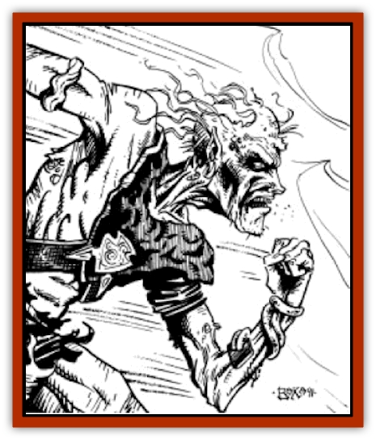

# Dune Runner

| Statistic | **Dune Runner** |
| --- | --- |
| **Activity Cycle:** | Night |
| **Alignment:** | Any evil |
| **Armor Class:** | As in life |
| **Climate/Terrain:** | Any |
| **Damage/Attack:** | As in life |
| **Diet:** | None |
| **Frequency:** | Very rare |
| **Hit Dice:** | As in life |
| **Intelligence:** | As in life |
| **Magic Resistance:** | Nil |
| **Morale:** | Champion (16) |
| **Movement:** | 18 |
| **No. Appearing:** | 1-4 |
| **No. of Attacks:** | As in life |
| **Organization:** | Solitary |
| **Size:** | M (7' tall) |
| **Special Attacks:** | Psionic |
| **Special Defenses:** | Nil |
| **THAC0:** | As in life |
| **Treasure:** | Nil |
| **XP Value:** | Varies |

**Psionics Summary**

| Level | Dis/Sci/Dev | Attack/Defense | Score | PSPs |
| --- | --- | --- | --- | --- |
| 2 | 1/2/3 | -/MB,TW | =Int | 100 |

**Telepathy -** *Sciences:* mass domination, mind link; *Devotions:* attraction, contact, life detection.

These psionic powers are gained in addition to any the elf possessed when it was alive. *Mass domination*, *attraction*, and *life detection* are always on, at no cost.

Dune runners are [[Elf_Athas|elves]] who died running to complete a quest or deliver an important message. They are undead, forever trapped and forced to repeat their hopeless mission night after night.

From a distance, a dune runner appears to be a muscular elf running across the terrain. Upon closer inspection, however, the very thin, gray skin can be seen pulled tautly against its boney frame.

The dune runner remembers all of the languages that the elf knew when it was alive. It is said that they sometimes talk to their victims as they run across the Athasian desert.

**Combat:** Elven dune runners retain all aspects of their former character class. They retain the possessions carried at the time of their demise, and they have the same level of skill in their given profession. They retain the ability to cast spells and may use any psionic abilities possessed when they were alive (in addition to those gained as accursed dune runners). In undeath, they also gain deadly special abilities; hence, no two dune runners are exactly alike.

As the runner approaches, any elf in the party is entitled to a Wisdom check to recognize the creature. A successful roll means that the elf realizes the runner is undead. Anyone, regardless of race, who is unfortunate enough to be near a dune runner must suffer the consequences. Any intelligent creature the runner passes must save versus spells or be compelled (via psionic *attraction* and *mass domination*) to accompany the runner on its trek that night. The number of people affected by the dune runner is limited to five (the normal number of creatures affected by *mass domination*) times the level of the elf when it died and became a dune runner. Victims will be unable to stop running and will lose one Constitution point per turn spent running. If not forcibly stopped and restrained, victims will continue to run until their Constitution reaches zero, when they will collapse. Once a victim's Constitution reaches zero, a system shock roll must be made to survive; failure means death. A successful roll means that the victim remains unconscious for 1d6 turns, after which he may recover constitution points at a regular rate only if he rehydrates (1d8 points per day). Failure to rehydrate results in a second collapse and death. An elven victim that dies during the evening becomes a runner himself and forever joins the runner in its nightly quest. The slain becomes the dune runner's eternal companion, following the runner quite possibly until the end of time.

**Habitat/Society:** Each dune runner is different. Each had its own lives, loves, goals, and desires. Night after night, they harangue and haunt travellers who cross their path. These haunted creatures have transcended physical limitations and run each night for the sheer pleasure of it. Their evil fixation is so consuming that they compel the living to join them in their crazed, headlong run into oblivion. Few individuals have ever run the entire night with a dune runner in order to find out what happens to them at dawn; the ones who live often refuse to speak of that night for the rest of their lives.

**Ecology:** The dune runner is a bane to any caravan travelling across country. It has been reported that some small caravans have been found deserted along a known dune runner's path. The traders are often found miles away, dead from exhaustion and dehydration. Larger, more experienced trading caravans will even delay their travel a half-day rather than cross or camp along a dune runner's trail near dark. Some believe it is possible to fulfill the runner's quest and grant it eternal rest, but no proof of this has ever been provided.

---
## Discovery & Documentation

**Source Publication:** MC12 Dark Sun Appendix I - Terrors of the Desert (1991)
**Campaign Setting:** Dark Sun
**Author(s):** Tom Prusa, Louis J. Prosperi, Walter M. Baas

### Other Creatures Found in This Source Book
   * [[Animal_Herd_Athas|Animal, Herd (Athas)]]
   * [[Animal_Household_Athas|Animal, Household (Athas)]]
   * [[Antloid_Desert|Antloid, Desert]]
   * [[Banshee_Dwarf|Banshee, Dwarf]]
   * [[Beetle_Agony|Beetle, Agony]]
   * [[Bog_Wader|Bog Wader]]
   * [[Brambleweed|Brambleweed]]
   * [[B'rohg|B'rohg]]
   * [[Burnflower|Burnflower]]
   * [[Cat_Psionic|Cat, Psionic]]
   * [[Cha'thrang|Cha'thrang]]
   * [[Cistern_Fiend|Cistern Fiend]]
   * [[Clam_Giant|Clam, Giant]]
   * [[Cloud_Ray|Cloud Ray]]
   * [[Drake_Athas_Air|Drake (Athas), Air]]
   * [[Drake_Athas_Earth|Drake (Athas), Earth]]
   * [[Drake_Athas_Fire|Drake (Athas), Fire]]
   * [[Drake_Athas_Water|Drake (Athas), Water]]
   * [[Dune_Trapper|Dune Trapper]]
   * [[Elemental_Athas_Greater_Air|Elemental (Athas), Greater, Air]]
   * [[Elemental_Athas_Greater_Earth|Elemental (Athas), Greater, Earth]]
   * [[Elemental_Athas_Greater_Fire|Elemental (Athas), Greater, Fire]]
   * [[Elemental_Athas_Greater_Water|Elemental (Athas), Greater, Water]]
   * [[Elemental_Athas_Lesser_Air_Earth|Elemental (Athas), Lesser, Air/Earth]]
   * [[Elemental_Athas_Lesser_Fire_Water|Elemental (Athas), Lesser, Fire/Water]]
   * [[Elemental_Athas_General_Information|Elemental (Athas), General Information]]
   * [[Erdland|Erdland]]
   * [[Esperweed|Esperweed]]
   * [[Flailer|Flailer]]
   * [[Floater|Floater]]
   * [[Giant_Athas|Giant (Athas)]]
   * [[Golem_Athas_I|Golem (Athas) I]]
   * [[Golem_Athas_II|Golem (Athas) II]]
   * [[Golem_Athas_III|Golem (Athas) III]]
   * [[Golem_Athas_General_Information|Golem (Athas), General Information]]
   * [[Halfling_Renegade|Halfling, Renegade]]
   * [[Hej-kin|Hej-kin]]
   * [[Id_Fiend|Id Fiend]]
   * [[Insect_Swarm_Athas|Insect Swarm (Athas)]]
   * [[Kank_Wild|Kank, Wild]]
   * [[Kirre|Kirre]]
   * [[Megapede|Megapede]]
   * [[Mul_Wild|Mul, Wild]]
   * [[Nightmare_Beast|Nightmare Beast]]
   * [[Plant_Carnivorous_Athas|Plant, Carnivorous (Athas)]]
   * [[Pterran|Pterran]]
   * [[Pterrax|Pterrax]]
   * [[Pulp_Bee|Pulp Bee]]
   * [[Pyreen|Pyreen]]
   * [[Rasclinn|Rasclinn]]
   * [[Razorwing|Razorwing]]
   * [[Roc_Athas|Roc (Athas)]]
   * [[Sand_Bride|Sand Bride]]
   * [[Sand_Cactus|Sand Cactus]]
   * [[Sand_Vortex|Sand Vortex]]
   * [[Scrab|Scrab]]
   * [[Silt_Horror|Silt Horror]]
   * [[Silt_Runner|Silt Runner]]
   * [[Sink_Worm|Sink Worm]]
   * [[Sloth_Athas|Sloth (Athas)]]
   * [[So-ut|So-ut]]
   * [[Spider_Cactus|Spider Cactus]]
   * [[Spider_Crystal|Spider, Crystal]]
   * [[Spirit_of_the_Land|Spirit of the Land]]
   * [[T'Chowb|T'Chowb]]
   * [[Thrax|Thrax]]
   * [[Tohr-kreen_I|Tohr-kreen I]]
   * [[Villichi|Villichi]]
   * [[Zhackal|Zhackal]]
   * [[Zombie_Plant|Zombie Plant]]
