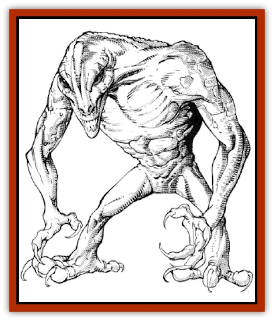

# Dune Stalker

| Statistic | **Dune Stalker** |
| --- | --- |
| **Activity Cycle:** | Day |
| **Alignment:** | Neutral evil |
| **Armor Class:** | 3 |
| **Climate/Terrain:** | Tropical/Desert |
| **Damage/Attack:** | 2-12 |
| **Diet:** | Unknown |
| **Frequency:** | Very rare |
| **Hit Dice:** | 6 |
| **Intelligence:** | High (13-14) |
| **Magic Resistance:** | 30% |
| **Morale:** | Elite (14) |
| **Movement:** | 12 |
| **No. Appearing:** | 1 |
| **No. of Attacks:** | 1 |
| **Organization:** | Solitary |
| **Size:** | M (7' tall) |
| **Special Attacks:** | Kiss of death (see below) |
| **Special Defenses:** | Can only be hit by magical weapons |
| **THAC0:** | 15 |
| **Treasure:** | Nil |
| **XP Value:** | 2,000 |

Vile in both their nature and in their appearance, dune stalkers shun the Prime Material Plane, unless summoned by a high-level evil magician to fulfill an evil quest. The dune stalker will attack good whenever it appears and attempt to deliver its bizarre and fatal "kiss of death" (see below).

The dune stalker appears as a tall, gaunt, and naked humanoid, with an unusually large, ovoid-shaped head, extremely long arms and legs, and razor-sharp claws on its hands and feet. The skin is redish-orange in hue and extremely dry and abrasive to the touch. The eyes are large, and the nose is narrow and long. The chest is abnormally broad at the top, narrowing uniformly to a relatively tiny waist. There is no hair whatsoever on the creature. It does not sweat.

**Combat:** The dune stalker's principal ranged attack is by sonic vibration. The dune stalker's broad chest apparently allows it to take in a huge quantity of dry, hot air, which is then forced out under tremendous pressure through a resonance chamber in the nasal passages. This sonic vibration has a range of 60' in a cone extending from the mouth, and expands to 10' in diameter at the extreme end of its range. The vibration causes 2-12 points of damage to each person within the cone, and causes temporary deafness for 1-10 rounds. No saving throw is permitted. Those outside the cone of effect will hear an eerie, nasal roar.

At close range, the dune stalker will attempt to deliver a "kiss of death" to whichever target within melee range is most identifiable as good. This is accomplished when the dune stalker places its lips in direct contact with the bare skin of its victim, and makes a sonic vibration attack. The sonic vibrations set up by the "kiss of death" are of such intensity that failure to make a successful saving throw vs. death means instant death. A succesful saving throw renders the victim unconscious for one melee round. In a "kiss of death", the attack has no other area of effect, although those nearby will still hear a muted trumpeting roar.

Dune stalkers have 30% magic resistance, and are only harmed by magical weapons. If attacked by a group, only some of which have magical weapons, the dune stalker will move first to attack those with magical weapons, particularly if they are of good alignment.

**Habitat/Society:** The dune stalker is a faultless tracker, with the same abilities in this regard as an [[Invisible_Stalker|invisible stalker]], most particularly the ability to detect any trail less than a day old. Summoned from the Para-Elemental Plane of Magma by a high-level evil magician, its quest on the Prime Material Plane may be general or specific. Only once the quest is completed does the dune stalker return to its own plane. Accordingly, dune stalkers are relentless and unmerciful in the pursuit of their assigned quest. As the literal terms of their quest are what binds them to the Prime Material Plane, they seek literal compliance and will be released from their quest if such is achieved, even if the intent of the quest remains unfulfilled - much as in the case of interpretation of a *wish* or *limited wish* spell. Similarly, even though they may accomplish the intent of their summoner, unless the literal terms of the quest are met, they will remain bound to the Prime Material Plane, roaming the desolate desert areas seeking violent release of the anger within them. In addition, throughout their existence on this plane, dune stalkers will always attack good should it be encountered in any form or combination.

Dune stalkers are solitary creatures when encountered on the Prime Material Plane. There is no evidence of an ability to *plane shift* without the summons of a high-level evil magician.

Little is known of dune stalkers on their own plane. It is clear to all who encounter them on the Prime Material Plane that they are desperately unhappy during their unrequested stay. They loathe coolness and moisture of any kind. Dune stalkers frequent only desert areas, and move with their greatest ease only during the hottest part of the day. It is also possible that they cannot hear sounds in the range of human hearing.

**Ecology:** The bones of a dune stalker are very strong, and made up of many hollow tubes, spiraling around one another to form an extremely strong bundle. This makes the bones almost impossible to work. The hide of a dune stalker is too abrasive to make a desirable leather for garments and the like, but does perform admirably as an abrasive sandpaper, highly favored by skilled woodcarvers because of its durability.

---
## Discovery & Documentation

**Source Publication:** MC14 Fiend Folio Appendix (1992)
**Campaign Setting:** Fiends Folio
**Author(s):** Don Bingle, John Terra, Wes Nicholson, Tim Beach, Steve Hardinger, Kris Hardinger, Rob Nicholls, Greg Swedberg, Al Boyce, Vince Garcia, Norm Ritchie

### Other Creatures Found in This Source Book
   * [[Aballin|Aballin]]
   * [[Achaierai|Achaierai]]
   * [[Adherer|Adherer]]
   * [[Algoid|Algoid]]
   * [[Al-Mi'raj|Al-Mi'raj]]
   * [[Apparition|Apparition]]
   * [[Caterwaul|Caterwaul]]
   * [[Coffer_Corpse|Coffer Corpse]]
   * [[Crabman|Crabman]]
   * [[Dark_Creeper|Dark Creeper]]
   * [[Dark_Stalker|Dark Stalker]]
   * [[Darter|Darter]]
   * [[Denzelian|Denzelian]]
   * [[Dwarf_Urdunnir|Dwarf, Urdunnir]]
   * [[Falcon_Fire|Falcon, Fire]]
   * [[Faux_Faerie|Faux Faerie]]
   * [[Flawder|Flawder]]
   * [[Fyrefly|Fyrefly]]
   * [[Gambado|Gambado]]
   * [[Garbug|Garbug]]
   * [[Giant_Fhoimorien|Giant, Fhoimorien]]
   * [[Gibberling|Gibberling]]
   * [[Gorbel|Gorbel]]
   * [[Grimlock|Grimlock]]
   * [[Hellcat|Hellcat]]
   * [[Ice_Lizard|Ice Lizard]]
   * [[Iron_Cobra|Iron Cobra]]
   * [[Khargra|Khargra]]
   * [[Mantari|Mantari]]
   * [[Penanggalan|Penanggalan]]
   * [[Pernicon|Pernicon]]
   * [[Phantom_Stalker|Phantom Stalker]]
   * [[Retriever|Retriever]]
   * [[Ruve|Ruve]]
   * [[Scathe|Scathe]]
   * [[Sheet_Ghoul_Sheet_Phantom|Sheet Ghoul/Sheet Phantom]]
   * [[Shocker|Shocker]]
   * [[Spanner|Spanner]]
   * [[Stwinger|Stwinger]]
   * [[Sussurus|Sussurus]]
   * [[Symbiotic_Jelly|Symbiotic Jelly]]
   * [[Terithran|Terithran]]
   * [[Thunder_Children|Thunder Children]]
   * [[Troll_Ice|Troll, Ice]]
   * [[Tween|Tween]]
   * [[Umpleby|Umpleby]]
   * [[Volt|Volt]]
   * [[Xill|Xill]]
   * [[Xvart|Xvart]]
   * [[Zygraat|Zygraat]]
