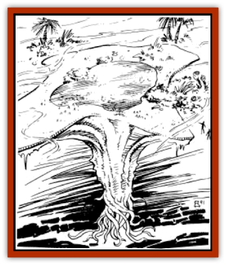

# Dune Trapper

| Statistic | **Dune Trapper** |
| --- | --- |
| **Activity Cycle:** | Any |
| **Alignment:** | Neutral |
| **Armor Class:** | 10 |
| **Climate/Terrain:** | Sandy wastes, salt flats |
| **Damage/Attack:** | See below |
| **Diet:** | Carnivore |
| **Frequency:** | Very rare |
| **Hit Dice:** | 16+3 |
| **Intelligence:** | Animal (1) |
| **Magic Resistance:** | Nil |
| **Morale:** | N/A |
| **Movement:** | 0 |
| **No. Appearing:** | 1 |
| **No. of Attacks:** | See below |
| **Organization:** | Solitary |
| **Size:** | G (100'+) |
| **Special Attacks:** | See below |
| **Special Defenses:** | See below |
| **THAC0:** | 5 |
| **Treasure:** | O,I,R,W |
| **XP Value:** | 19,000 |

A sparkling oasis in the middle of the desert, the dune trapper appears to be the salvation of many lost travellers. Unfortunately for most, apparent salvation often turns into death.

The dune trapper is often mistaken for a solitary oasis in the desert. The trapper has the appearance of almost an acre of vegetation surrounding a small pool of water.

**Combat:** When a victim comes to drink at or is near the pool (the real center of the plant), the trapper pulls itself down the pit it rests in, thus trapping the victim. Because of the size of the dune trapper, no attack roll is needed. Each round the trapper will deposit digestive fluids onto the victim it has swallowed causing 10d4 acid damage (save versus paralyzation for half), until the victim is liquified. Two separate Dexterity checks must be made each round to get free of the giant plant-animal. Two failed checks means the victim is swallowed and cannot employ any attack except psionics. One failed check means the individual is only partially trapped.only an arm or other extremity is caught - and automatically takes half damage that round. Two successful checks means the individual is able to get completely free of the plant without any damage. Any freed individual who wants to make a melee attack must spend one round of digging to expose an area of the dune trapper before making the first attack.

**Habitat/Society:** The trapper is some form of symbiotic/parasitic plant-animal that defies traditional classification. Dune trappers can grow to be as large as an acre (an acre equals 200'x200'). A dune trapper will dig a large sand pit that it covers with its star-shaped head. It buries itself inches under the sand, except for the center of its throat which is left exposed above the ground. The trapper's roots can extend miles into the ground to a deep water source. Pumping up small amounts of the precious fluid, it holds the water in the top of its throat to attract prey. The pools range from 5-50' across depending on the size of the dune trapper, but they are never more than an inch deep. Creatures that can smell water will travel many miles to the trapper's "oasis" only to meet their deaths. Although solitary in nature, dune trappers will sometimes encourage the growth of surrounding plants by furnishing them with traces of water. This helps the dune trapper further enhance its oasis disguise.

**Ecology:** If slain, the dune trapper will be found to contain as many quarts of water as it had hit points. The trapper itself is inedible to most humanoids (except for [[B'rohg|b'rohgs]] who consider it tasty).

---
## Discovery & Documentation

**Source Publication:** MC12 Dark Sun Appendix I - Terrors of the Desert (1991)
**Campaign Setting:** Dark Sun
**Author(s):** Tom Prusa, Louis J. Prosperi, Walter M. Baas

### Other Creatures Found in This Source Book
   * [[Animal_Herd_Athas|Animal, Herd (Athas)]]
   * [[Animal_Household_Athas|Animal, Household (Athas)]]
   * [[Antloid_Desert|Antloid, Desert]]
   * [[Banshee_Dwarf|Banshee, Dwarf]]
   * [[Beetle_Agony|Beetle, Agony]]
   * [[Bog_Wader|Bog Wader]]
   * [[Brambleweed|Brambleweed]]
   * [[B'rohg|B'rohg]]
   * [[Burnflower|Burnflower]]
   * [[Cat_Psionic|Cat, Psionic]]
   * [[Cha'thrang|Cha'thrang]]
   * [[Cistern_Fiend|Cistern Fiend]]
   * [[Clam_Giant|Clam, Giant]]
   * [[Cloud_Ray|Cloud Ray]]
   * [[Drake_Athas_Air|Drake (Athas), Air]]
   * [[Drake_Athas_Earth|Drake (Athas), Earth]]
   * [[Drake_Athas_Fire|Drake (Athas), Fire]]
   * [[Drake_Athas_Water|Drake (Athas), Water]]
   * [[Dune_Runner|Dune Runner]]
   * [[Elemental_Athas_Greater_Air|Elemental (Athas), Greater, Air]]
   * [[Elemental_Athas_Greater_Earth|Elemental (Athas), Greater, Earth]]
   * [[Elemental_Athas_Greater_Fire|Elemental (Athas), Greater, Fire]]
   * [[Elemental_Athas_Greater_Water|Elemental (Athas), Greater, Water]]
   * [[Elemental_Athas_Lesser_Air_Earth|Elemental (Athas), Lesser, Air/Earth]]
   * [[Elemental_Athas_Lesser_Fire_Water|Elemental (Athas), Lesser, Fire/Water]]
   * [[Elemental_Athas_General_Information|Elemental (Athas), General Information]]
   * [[Erdland|Erdland]]
   * [[Esperweed|Esperweed]]
   * [[Flailer|Flailer]]
   * [[Floater|Floater]]
   * [[Giant_Athas|Giant (Athas)]]
   * [[Golem_Athas_I|Golem (Athas) I]]
   * [[Golem_Athas_II|Golem (Athas) II]]
   * [[Golem_Athas_III|Golem (Athas) III]]
   * [[Golem_Athas_General_Information|Golem (Athas), General Information]]
   * [[Halfling_Renegade|Halfling, Renegade]]
   * [[Hej-kin|Hej-kin]]
   * [[Id_Fiend|Id Fiend]]
   * [[Insect_Swarm_Athas|Insect Swarm (Athas)]]
   * [[Kank_Wild|Kank, Wild]]
   * [[Kirre|Kirre]]
   * [[Megapede|Megapede]]
   * [[Mul_Wild|Mul, Wild]]
   * [[Nightmare_Beast|Nightmare Beast]]
   * [[Plant_Carnivorous_Athas|Plant, Carnivorous (Athas)]]
   * [[Pterran|Pterran]]
   * [[Pterrax|Pterrax]]
   * [[Pulp_Bee|Pulp Bee]]
   * [[Pyreen|Pyreen]]
   * [[Rasclinn|Rasclinn]]
   * [[Razorwing|Razorwing]]
   * [[Roc_Athas|Roc (Athas)]]
   * [[Sand_Bride|Sand Bride]]
   * [[Sand_Cactus|Sand Cactus]]
   * [[Sand_Vortex|Sand Vortex]]
   * [[Scrab|Scrab]]
   * [[Silt_Horror|Silt Horror]]
   * [[Silt_Runner|Silt Runner]]
   * [[Sink_Worm|Sink Worm]]
   * [[Sloth_Athas|Sloth (Athas)]]
   * [[So-ut|So-ut]]
   * [[Spider_Cactus|Spider Cactus]]
   * [[Spider_Crystal|Spider, Crystal]]
   * [[Spirit_of_the_Land|Spirit of the Land]]
   * [[T'Chowb|T'Chowb]]
   * [[Thrax|Thrax]]
   * [[Tohr-kreen_I|Tohr-kreen I]]
   * [[Villichi|Villichi]]
   * [[Zhackal|Zhackal]]
   * [[Zombie_Plant|Zombie Plant]]
