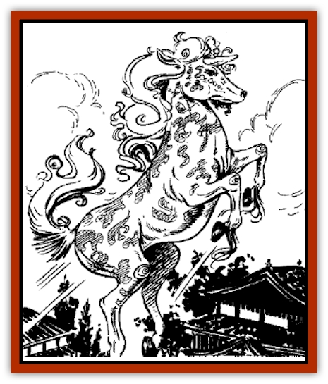
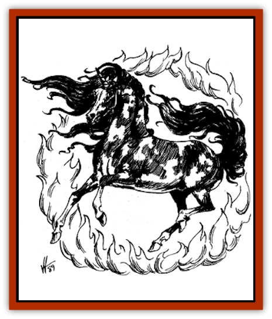

# Duruch'i-lin

| Statistic | **Ch'i-lin** | **Duru** |
| --- | --- | --- |
| **Activity Cycle:** | Any | Any |
| **Alignment:** | Lawful good | Lawful good |
| **Armor Class:** | -2 | 0 |
| **Climate/Terrain:** | Temperate forests | Temperate forests |
| **Damage/Attack:** | 1-10/1-10/3-18 | 1-6/1-6/2-12 |
| **Diet:** | Special | Special |
| **Frequency:** | Very rare | Very rare |
| **Hit Dice:** | 16 | 13 |
| **Intelligence:** | Genius (18) | Genius (18) |
| **Magic Resistance:** | See below | See below |
| **Morale:** | Fanatic (18) | Fanatic (18) |
| **Movement:** | 24 (ground or water), Fl 36 | 36 (ground, water, clouds), Fl 48 |
| **No. Appearing:** | 1 | 1 |
| **No. of Attacks:** | 3 | 3 |
| **Organization:** | Solitary | Solitary |
| **Size:** | G (75') | G (60') |
| **Special Attacks:** | See below | See below |
| **Special Defenses:** | See below | See below |
| **THAC0:** | 7 | 7 |
| **Treasure:** | Nil | Nil |
| **XP Value:** | 18,000 | 15,000 |

The duruch'i-lin, also known as the oriental [[Unicorn|unicorn]], is among the world's most beloved creatures. Though it is seldom seen by man, its appearance is always associated with longevity, health, and good fortune. The female duruch'i-lin is a "ch'i-1in." The male is a "duru."

A ch'i-lin is larger and more powerful than her male counterpart.Superficially, the ch'i-lin resembles a giant version of the common unicorn. It is not unusual for a ch'i-lin to attain a height of 100 feet or more, though it is more commonly 50-75 feet tall. The ch'i-lin's coat is a riot of color, seemingly random splotches of red, yellow, black, white, and blue, though its belly is always brilliant yellow. Its body is thicker than that of a common unicorn. It has the tail of a horse and the long jaws of a wolf. It has a blunt, fleshy horn about 5 feet long extending from its forehead. Its voice sounds like the tinkling of silver bells. The ch'i-lin can speak all human languages, as well as the languages of all forest creatures.

**Combat:** Ch'i-lin are normally passive and docile, resorting to violence only as a last resort. Their horns are too blunt to be used as weapons, but they can use them to fire six *magic bolts* per round, with each aimed at a different target. A ch'i-lin's *magic bolts* are +4 to hit and cause 3-18 (3d6) hit points of damage. They can *plane shift* and *become invisible* at will; and can cast *crystalbrittle* and *bless* each once per round. A character who touches the horn of a living ch'i-lin gains the ability to cast an *omen* spell; this ability lasts for one hour. Though loathe to engage in physical combat, ch'i-lin can inflict 1-10 hit points of damage from two hoof attacks and 3-18 (3d6) hit points of damage from a bite.

Ch'i-lin are immune to all poisons, as well as *death*, *charm*, and *hold* spells, and make their saving throws as if they were 20th level wizards. They are surrounded by an aura of golden flame that acts as a permanent *deflection* spell. Ch'i-lin can walk on water as easily as they can walk on land.

**Habitat/Society:** Ch'i-lin have an affinity for all living creatures, particularly those of the forests with whom they share a strong bond of friendship and trust. They have no permanent lair, preferring to roam from forest to forest in the company of their animal friends. Ch'i-lin never acquire treasure. When ch'i-lin desire privacy, they usually *plane shift* to another plane of existance where they may meditate in solitude for up to 10 years at a time. Ch'i-lin tend to shun the civilized world, but they often make an appearance when an especially benevolent ruler or wise sage is about to be born.

The first ch'i-lin was formed from the blended bodies of two now extinct creatures, the ch'i (a stag with silver antlers and emerald eyes) and the lin (a war horse with a golden coat whose every step cracked the earth). The ch'i-lin rose from the waters of Wa's Akano River, appearing to Emperor Kochi in the 1st Year of Chiso. On the back of the ch'i-lin was a detailed series of written characters; it is said that the language of Wa evolved from Emperor Kochi's transcription of these characters.

The courtship ritual of the ch'i-lin is a long and complex process. When a male ch'i-lin selects a suitable mate, he introduces her to an assembly of forest animals including at least one representative of every species in his territory, usually an area no less than 10,000 square miles. If the animals accept her, the male then introduces her to representatives of the Celestial Bureaucracy. If they approve the mating, the pair retires to another plane of existence where they spend no less than five years sharing every detail of their life histories. The female gives birth to a single infant. The pair raise the infant in this alternate plane until it reaches maturity (about 50 years), at which time all members of the family go their own way.

**Ecology:** Ch'i-lin seldom walk on the ground, fearing they will accidently trample an innocent insect or damage the vegetation. They eat only minerals and drink only from the purest of streams. Its horn, when ground into a powder, can be used as an antidote for any poison. Their coats retain the properties of *deflection* even after their death, and are highly prized as material for protective clothing.

**Duru**

  The duru is a smaller, faster, and less powerful version of the ch'ilin. He is identical in outlook and appearance to his female counterpart, except that his belly is blue and his protective aura is silver. He fires only three magic bolts per round, which have a +2 to-hit bonus and cause 2-12 (2d6) points of damage.

The courtship ritual of the duru is long and complex. When a duru finds an agreeable ch'i-lin, he introduces her to an assembly of forest animals, including at least one representative of every species in his territory. (The territory usually covers 10,000 sq. miles or more.) If the animals accept her, the male then introduces the chi'i-lin to representatives of the Celestial Bureaucracy. If they approve of the mating, the pair retires to another plane of existence, where they spend no less than five years sharing every detail of their life histories. The couple gives birth to a single infant, raising it in this alternate plane until it reaches maturity (about 50 years). When the child has matured, all members of the family go their own way.

---
## Discovery & Documentation

**Source Publication:** MC6 Kara-Tur Appendix (1990)
**Campaign Setting:** Kara-Tur (Forgotten Realms)
**Author(s):** Rick Swan

### Other Creatures Found in This Source Book
   * [[Bajang|Bajang]]
   * [[Bakemono|Bakemono]]
   * [[Bisan|Bisan]]
   * [[Buso|Buso]]
   * [[Carp_Giant|Carp, Giant]]
   * [[Centipede_Spirit|Centipede, Spirit]]
   * [[Chu-u|Chu-u]]
   * [[Con-tinh|Con-tinh]]
   * [[Doc_cu'o'c|Doc cu'o'c]]
   * [[Flame_Spirit|Flame Spirit]]
   * [[Foo_Creature|Foo Creature]]
   * [[Gaki|Gaki]]
   * [[Gargantua|Gargantua]]
   * [[Goblin_Rat|Goblin Rat]]
   * [[Hai_Nu|Hai Nu]]
   * [[Hannya|Hannya]]
   * [[Hengeyokai|Hengeyokai]]
   * [[Hsing-sing|Hsing-sing]]
   * [[Hu_Hsien|Hu Hsien]]
   * [[Human_Kara-Tur|Human (Kara-Tur)]]
   * [[Ikiryo|Ikiryo]]
   * [[Jishin_Mushi|Jishin Mushi]]
   * [[Kala|Kala]]
   * [[Kaluk|Kaluk]]
   * [[Kappa|Kappa]]
   * [[Korobokuru|Korobokuru]]
   * [[Krakentua|Krakentua]]
   * [[Kuei|Kuei]]
   * [[Memedi|Memedi]]
   * [[Men-shen|Men-shen]]
   * [[Nat|Nat]]
   * [[Ningyo|Ningyo]]
   * [[Oni|Oni]]
   * [[P'oh|P'oh]]
   * [[P'oh_Gohei|P'oh, Gohei]]
   * [[Shan_Sao|Shan Sao]]
   * [[Shirokinukatsukami|Shirokinukatsukami]]
   * [[Spirit_Folk|Spirit Folk]]
   * [[Spirit_Nature|Spirit, Nature]]
   * [[Spirit_Stone|Spirit, Stone]]
   * [[Tako|Tako]]
   * [[Tengu|Tengu]]
   * [[Wang-Liang|Wang-Liang]]
   * [[Yuan-ti_Histachii|Yuan-ti, Histachii]]
   * [[Yuki-on-na|Yuki-on-na]]
