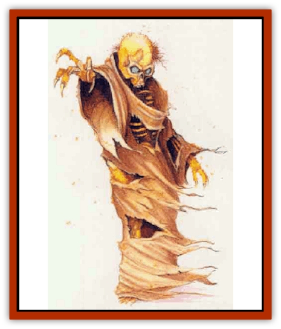

# Dusanu

| Statistic | **Dusanu** |
| --- | --- |
| **Activity Cycle:** | Night |
| **Alignment:** | Chaotic neutral |
| **Armor Class:** | 4 |
| **Climate/Terrain:** | Any temperate to tropical |
| **Damage/Attack:** | 1d8/1d8 |
| **Diet:** | Scavenger |
| **Frequency:** | Very rare |
| **Hit Dice:** | 9+2 |
| **Intelligence:** | Average (10) |
| **Magic Resistance:** | Nil |
| **Morale:** | Champion (15) |
| **Movement:** | 12 |
| **No. Appearing:** | 1d3+1 |
| **No. of Attacks:** | 2 |
| **Organization:** | Pack |
| **Size:** | M (6' tall) |
| **Special Attacks:** | Spores |
| **Special Defenses:** | See below |
| **THAC0:** | 11 |
| **Treasure:** | W |
| **XP Value:** | 3,000 |

The dusanu, or rot fiend, is a horrifying and intelligent humanoid that shuffles through the deepest wilderness of Mystara, attacking unfortunate humans and humanoids with its deadly spores.

A rot fiend appears as a yellowing, mold-encrusted human (or humanoid) [[Skeleton|skeleton]], often wearing tattered dothing. Its strange eyes flicker with a haunting blue light, and the foul air near a dusanu is tainted with the spores of its terrible dry rot.

There has been no account of any successful communication with a dusanu, although several sages and wizards have made the attempt.

**Combat:** In battle, dusanu are intelligent and very cunning. The monsters always attack with their moldy claws, each causing 1d8 points of damage. When attacking, a pack often attempts to form a spore-radiating circle around the intended victim(s). As a rot fiend attacks, its spores radiate outward, filling a 5-foot-radius circle around the creature. Any human, demihuman, or humanoid in this circle must roll a saving throw vs. poison. Those who fail suffer an additional 1d8 points of damage and become infected. (See "Habitat/Society.")

A dusanu's mold-infested bones are particularly spongy. Their ability to absorb impact protects the creature from damage. Nonmagical weapons inflict only 1 point of damage to the rot fiend, while magical blunt weapons (maces, hammers, etc.) cause only half damage. Other magical weapons, however, inflict full damage upon the creature. The dusanu's nonconductive mold makes it immunr to all types of electrical attacks.

**Habitat/Society:** The dusanu is actually a fungal colony inhabiting a human or humanoid skeleton. Its collective "group mind" grants the creature its intelligence and will. Mold inhabits every crevice of the host skeleton save the eye sockets, from which it emits the strange waste fumes that cause the dusanu's eyes to flicker with an eerie blue light.

A rot fiend reproduces by infecting humans and other humanoids with its poisonous spores. Those infected by these spores do not show any outward signs of infection for 1d3+1 days, save for an itchy rash. However, *cure wounds* spells have no effect on the victim. At the end of this time, yellowish mold begins to erupt from the victim's skin. Each day the victim must make a saving throw vs. death. A victim who fails the saving throw becomes overgrown with mold, resulting in death in less than two hours. The spores can be destroyed with a *cure disease* spell cast on the victim any time prior to death.

After a dormant period of 1d3 days, the mold animates the dead body, creating a new dusanu. The character's personality is lost to the new colony now inhabiting the corpse. All the person's memories and abilities disappear when the spores animate the body.

Dusanu prefer to travel in small packs of 1d3+1 colonies, so characters hardly ever encounter them alone. Rot fiends appear to communicate through the release of spores and can sense one of their own kind up to 10 miles away. The creatures do not seem to choose any particular lair or hunting ground, but instead adopt a nomadic lifestyle. Adventurers find them most often roaming deep forests or swamps far from regular human habitation.

When not attacking humans and other intelligent creatures, rot fiends avoid civilization.

**Ecology:** Periodically, a dusanu must renew its mold colony by launching spores onto a carcass, rotting tree limb, or other dead object. The spores rapidly grow into mold that consumes the decaying material, then launches new, revitalized spores that feed on the previous mold colony to build a new one. The mold on the dead material dies after it has used up its food supply. In this way, a rot fiend can consume an entire body or tree trunk the size of itself in less than three hours.

---
## Discovery & Documentation

**Source Publication:** Mystara Appendix (1994)
**Campaign Setting:** Mystara
**Author(s):** John Nephew, Teeuwynn Woodruff, John Terra, Skip Williams

### Other Creatures Found in This Source Book
   * [[Actaeon|Actaeon]]
   * [[Agarat|Agarat]]
   * [[Ash_Crawler|Ash Crawler]]
   * [[Baldandar|Baldandar]]
   * [[Bargda|Bargda]]
   * [[Bhut|Bhut]]
   * [[Bird_Mystara|Bird (Mystara)]]
   * [[Blackball|Blackball]]
   * [[Choker|Choker]]
   * [[Coltpixie|Coltpixie]]
   * [[Crone_of_Chaos|Crone of Chaos]]
   * [[Darkhood|Darkhood]]
   * [[Darkwing|Darkwing]]
   * [[Decapus|Decapus]]
   * [[Deep_Glaurant|Deep Glaurant]]
   * [[Diabolus|Diabolus]]
   * [[Dimensional_Warper|Dimensional Warper]]
   * [[Dragon_Mystara_Crystalline|Dragon (Mystara), Crystalline]]
   * [[Dragon_Mystara_Jade|Dragon (Mystara), Jade]]
   * [[Dragon_Mystara_Onyx|Dragon (Mystara), Onyx]]
   * [[Dragon_Mystara_Ruby|Dragon (Mystara), Ruby]]
   * [[Drake_Mystara|Drake (Mystara)]]
   * [[Dragonfly|Dragonfly]]
   * [[Elemental_of_Chaos_Air_Earth|Elemental of Chaos, Air/Earth]]
   * [[Elemental_of_Chaos_Fire_Water|Elemental of Chaos, Fire/Water]]
   * [[Elemental_of_Law_Air_Earth|Elemental of Law, Air/Earth]]
   * [[Elemental_of_Law_Fire_Water|Elemental of Law, Fire/Water]]
   * [[Familiar_Mystara|Familiar (Mystara)]]
   * [[Frost_Salamander|Frost Salamander]]
   * [[Fundamental_Air_Earth|Fundamental, Air/Earth]]
   * [[Fundamental_Fire_Water|Fundamental, Fire/Water]]
   * [[Gargantua_Mystara|Gargantua (Mystara)]]
   * [[Geonid|Geonid]]
   * [[Ghostly_Horde|Ghostly Horde]]
   * [[Giant_Athach|Giant, Athach]]
   * [[Giant_Hephaeston|Giant, Hephaeston]]
   * [[Golem_Drolem|Golem, Drolem]]
   * [[Golem_Mystara_I|Golem (Mystara) I]]
   * [[Golem_Mystara_II|Golem (Mystara) II]]
   * [[Golem_Mystara_III|Golem (Mystara) III]]
   * [[Gray_Philosopher|Gray Philosopher]]
   * [[Guardian_Warrior|Guardian Warrior]]
   * [[Gyerian|Gyerian]]
   * [[Herex|Herex]]
   * [[Hivebrood|Hivebrood]]
   * [[Horde|Horde]]
   * [[Hsiao|Hsiao]]
   * [[Huptzeen|Huptzeen]]
   * [[Hutaakan|Hutaakan]]
   * [[Imp_Mystara|Imp (Mystara)]]
   * [[Jellyfish_Giant_Mystara|Jellyfish, Giant (Mystara)]]
   * [[Kna|Kna]]
   * [[Kopru|Kopru]]
   * [[Lizard_Mystara|Lizard (Mystara)]]
   * [[Lizard-kin_Mystara|Lizard-kin (Mystara)]]
   * [[Lupin|Lupin]]
   * [[Lycanthrope_Werejaguar_Mystara|Lycanthrope, Werejaguar (Mystara)]]
   * [[Lycanthrope_Wereswine|Lycanthrope, Wereswine]]
   * [[Magen|Magen]]
   * [[Manikin|Manikin]]
   * [[Mek|Mek]]
   * [[Mujina|Mujina]]
   * [[Nagpa|Nagpa]]
   * [[Neh-thalggu|Neh-thalggu]]
   * [[Nightshade_Mystara|Nightshade (Mystara)]]
   * [[Nuckalavee|Nuckalavee]]
   * [[Pegataur|Pegataur]]
   * [[Phanaton|Phanaton]]
   * [[Plant_Dangerous_Mystara|Plant, Dangerous (Mystara)]]
   * [[Plasm|Plasm]]
   * [[Rakasta|Rakasta]]
   * [[Rock_Man|Rock Man]]
   * [[Sabreclaw|Sabreclaw]]
   * [[Sacrol|Sacrol]]
   * [[Scamille|Scamille]]
   * [[Shapeshifter|Shapeshifter]]
   * [[Shargugh|Shargugh]]
   * [[Shark-kin|Shark-kin]]
   * [[Sollux|Sollux]]
   * [[Spectral_Death|Spectral Death]]
   * [[Spectral_Hound|Spectral Hound]]
   * [[Spider-kin|Spider-kin]]
   * [[Spirit_Mystara|Spirit (Mystara)]]
   * [[Statue_Living|Statue, Living]]
   * [[Surtaki|Surtaki]]
   * [[Tabi|Tabi]]
   * [[Thoul|Thoul]]
   * [[Thunderhead|Thunderhead]]
   * [[Tiger_Ebon|Tiger, Ebon]]
   * [[Topi|Topi]]
   * [[Tortle|Tortle]]
   * [[Vampire_Velya|Vampire, Velya]]
   * [[White_Fang|White Fang]]
   * [[Worm_Mystara|Worm (Mystara)]]
   * [[Wyrd|Wyrd]]
   * [[Yowler|Yowler]]
   * [[Zombie_Lightning|Zombie, Lightning]]
