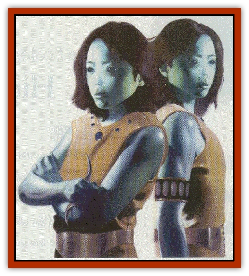

# Dvati

| Statistic | **Dvati** |
| --- | --- |
| **Activity Cycle:** | Any |
| **Alignment:** | Any good or neutral |
| **Armor Class:** | 10 (unarmored) |
| **Climate/Terrain:** | Outlands |
| **Damage/Attack:** | 1-4 or by weapon type |
| **Diet:** | Omnivore |
| **Frequency:** | Rare |
| **Hit Dice:** | 2+2 (or by class) |
| **Intelligence:** | High (13-14) |
| **Magic Resistance:** | 5% |
| **Morale:** |  |
| **Movement:** | 12 |
| **No. Appearing:** | 2-12 (always in groups of two) |
| **No. of Attacks:** | 2 |
| **Organization:** | Clan |
| **Size:** | 175 (each) |
| **Special Attacks:** | Ambidexterity |
| **Special Defenses:** | Confusion |
| **THAC0:** | 19 (or by class) |
| **Treasure:** | C,Q,R |
| **XP Value:** |  |

The dvati are a race of humanoids that dwell throughout the Outlands. All dvati are born identical twins; their priests explain that the dvati soul is so powerful a force that it takes two bodies to house it.

Dvati appear [[Elf|elven]] due to their slight build, but the resemblance ends there. They have snow-white skin; thick, black hair (that is rather difficult to cut); and solid blue eyes that seem to lack irises or pupils. Their noses are almost nonexistent, having only a pair of small, slitted nostrils that protrude slightly from the face. Their shapely and graceful hands have but three fingers and a thumb.

**Combat:** The dvati are typically nonviolent, considering themselves artists and philosophers. However, they are well versed in the arts of combat and defend themselves with deadly cunning. They commonly employ small, hand-held throwing blades and throwing stars. They are particularly fond of the tvan'th, an S-shaped throwing blade that returns when thrown properly.

Player character dvati can be fighters (up to level 16), priests (13), wizards (16), thieves (12), or bards (15). They enjoy the following multiclass options: fighter/wizard, fighter/priest, fighter/thief, wizard/thief, or fighter/wizard/thief. Additionally, all dvati are paired twins, meaning players who choose to create dvati characters must create two characters.

In combat, dvati work together to defeat enemies. A favorite tactic is circling a foe, using their echo-voice ability to confuse the target. This power involves speaking aloud in unison in such a way that the voices seem as if they come from everywhere at once. This results in a great deal of confusion, and those who fail a saving throw vs. spell suffer a -4 penalty to hit while the power is in effect. The ability takes 1 round to activate, and both dvati must be able to circle the target and speak. As long as they keep the echo-voice going, the attack penalty remains.

Dvati are inherently ambidextrous and possess the Two-weapon Fighting Style proficiency. In melee combat, they prefer paired weapons and gain an additional attack per round when using them.

A dvati cannot survive without its counterpart; if one is killed, the other loses Id6 hit points per day until it dies. This loss cannot be restored by anything short of a *wish*.

**Habitat/Society:** Dvati society is based entirely around the number two. This does not mean they are obsessively orderly or lawful, but simply that their art, architecture, language, and philosophies are all based around the idea of duality. Dvati children are always raised together, and they stay together after they reach adulthood.

Dvati twins can communicate with each other telepathically. This closeness doesn't bother them as it might members of other races. Indeed, the dvati relish their closeness.

Dvati gather in large communities, often building towns or cities in the Outlands. Each community is broken into four ruling houses, each governed by four subgroups called "rings".

Socially, dvati are a friendly and outgoing. They actively trade with other races and encourage contact with strangers. They are honest and slow to recognize dishonesty in others, though one act of dishonesty brands a person as a liar for life.

**Ecology:** The term "dvati" applies not only to the race but also to a set of twins. Indeed, due to their belief that a twin set share a soul, there is no singular pronoun in their language. The dvati farm and hunt, eating a stable diet of meats and vegetables. They have no special affinity for treasure but are fond of gems, working them into the items they craft.

---
## Discovery & Documentation

**Source Publication:** Dragon271 (2000)
**Campaign Setting:** Dragon Magazine
**Author(s):** Richard Sanders, Leon Chang, Talon Dunning, Dennis Caiero

### Other Creatures Found in This Source Book
   * [[Visceraith|Visceraith]]
