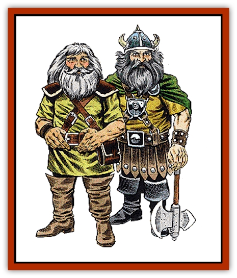

# Dwarf

| Statistic | **Hill** | **Mountain** |
| --- | --- | --- |
| **Activity Cycle:** | Any | Any |
| **Alignment:** | Lawful good | Lawful good |
| **Armor Class:** | 4 (10) | 4 (10) |
| **Climate/Terrain:** | Subarctic to subtropical rocky hills | Subarctic to subtropical mountains |
| **Damage/Attack:** | 1-8 (weapon) | 1-8 (weapon) |
| **Diet:** | Omnivore | Omnivore |
| **Frequency:** | Common | Common |
| **Hit Dice:** | 1 | 1+1 |
| **Intelligence:** | Very (11-12) | Very (11-12) |
| **Magic Resistance:** | See below | See below |
| **Morale:** | Elite (13-14) | Elite (13-14) |
| **Movement:** | 6 | 6 |
| **No. Appearing:** | 40-400 | 40-400 |
| **No. of Attacks:** | 1 | 1 |
| **Organization:** | Clans | Clans |
| **Size:** | S to M (4' and taller) | M (4½' and taller) |
| **Special Attacks:** | See below | See below |
| **Special Defenses:** | See below | See below |
| **THAC0:** | 20 | 19 |
| **Treasure:** | M&times;5 (G,Q&times;20,R) | M&times;5 (G,Q&times;20,R) |
| **XP Value:** | 175 | 270 |

Dwarves are a noble race of demihumans who dwell under the earth, forging great cities and waging massive wars against the forces of chaos and evil. Dwarves also have much in common with the rocks and gems they love to work, for they are both hard and unyielding. It's often been said that it's easier to make a stone weep than it is to change a dwarf's mind.

Standing from four to 4½ feet in height, and weighing 130 to 170 pounds, dwarves tend to be stocky and muscular. They have ruddy cheeks and bright eyes. Their skin is typically deep tan or light brown. Their hair is usually black, gray, or brown, and worn long, though not long enough to impair vision in any way. They favor long beards and mustaches, too. Dwarves value their beards highly and tend to groom them very carefully. Dwarves do not favor ornate stylings or wrappings for their hair or their beards.

Dwarven clothing tends to be simple and functional. They often wear earth tones, and their cloth is considered rough by many other races, especially men and [[Elf|elves]]. Dwarves usually wear one or more pieces of jewelry, though these items are usually not of any great value or very ostentatious. Though dwarves value gems and precious metals, they consider it in bad taste to flaunt wealth.

Because dwarves are a sturdy race, they add 1 to their initial Constitution ability scores. However, because they are a solitary people, tending toward distrust of outsiders and other races, they subtract 1 from their initial Charisma ability scores. Dwarves usually live from 350 to 450 years.

Dwarves have found it useful to learn the languages of many of their allies and enemies. In addition to their own languages, dwarves often speak the languages of [[Gnome|gnomes]], [[Goblin|goblins]], [[Kobold|kobolds]], [[Orc|orcs]], and the common tongue, which is frequently used in trade negotiations with other races.

**Combat:** Dwarves are courageous, tenacious fighters who are ill-disposed toward magic. They never use magical spells or train as wizards, though they can become priests and use the spells of this group. Because of their nonmagical nature, in fact, they get a special bonus to all saving throws against magical wands, staves, rods, and spells. Dwarves receive a +1 bonus to saving throws against these magical attacks for every 3½ points of Constitution score they have. See Table 9 in the *Player's Handbook* for specific bonuses.

A dwarf's nonmagical nature can also cause problems when he tries to use a magical item. In fact, if a dwarf uses a magical item that is not specifically created for his class, there is a 20% chance the item malfunctions. For example, if a dwarven fighter uses a bag of holding - which can be used by any class, not just fighters - there is a 20% chance each time the dwarf uses it that the bag does not work properly. This chance of malfunction applies to rods, staves, wands, rings, amulets, potions, horns, jewels, and miscellaneous magic. However, dwarves have learned to master certain types of magical items - because of an item's military nature. These objects - specifically weapons, shields, armor, gauntlets, and girdles - are not subject to magical malfunction when used by a dwarf of any class.

As with magical attacks, dwarves are unusually resistant to toxic substances. Because of their exceptionally strong Constitution, all dwarves roll saving throws against poisons with the same bonus (+1 for every 3½ points of Constitution score) that applies to saves vs. magical attacks.

In the thousands of years that dwarves have lived in the earth, they have developed a number of skills and special abilities that help them to survive. All dwarves have infravision that enables them to see up to 60 feet in the dark. When underground, dwarves can tell quite a bit about their location by looking carefully at their surroundings. When within 10 feet of what they are looking for, dwarves can detect the grade and slope of a passage (1-5 on 1d6), new tunnel construction (1-5 on 1d6), sliding/shifting walls or rooms (1-4 on 1d6), and stonework traps, pits, and deadfalls (1-3 on 1d6). Dwarves can also determine their approximate depth underground (1-3 on 1d6) at any time.

During their time under the earth, dwarves have also developed an intense hatred of many of the evil creatures they commonly encounter. Thus, in melee, dwarves always add 1 to their attack rolls to hit orcs, half-orcs, goblins, and [[Hobgoblin|hobgoblins]]. The small size of dwarves is an advantage against [[Ogre|ogres]], [[Troll|trolls]], [[Ogre|ogre magi]], giants, and [[Titan|titans]]; these monsters always subtract 4 from their attack rolls against dwarves because of that size difference and the dwarves' training in fighting such large foes.

Dwarven armies are well-organized and extremely well-disciplined. Dwarven troops usually wear chain mail and carry shields in battle. They wield a variety of weapons. The composition of a typical dwarven army by weaponry is axe and hammer (25%), sword and spear (20%), sword and light crossbow (15%), sword and pole arm (10%), axe and heavy crossbow (10%), axe and mace (10%), or hammer and pick (10%).

For every 40 dwarves encountered, there is a 2nd- to 6th-level fighter who leads the group. (Roll 1d6 to determine level, with a roll of 1 equalling 2.) If there are 160 or more dwarves encountered, there are, in addition to the leaders of the smaller groups, one 6th-level fighter (a chief) and a 4th-level fighter (lieutenant) commanding the troops. If 200 or more dwarves are encountered, there is a fighter/priest of 3rd- to 6th-level fighting ability and 4th-to 7th-level priest ability. If a dwarven army has 320 or more troops in it, the following high-level leaders are in command of the group: an 8th-level fighter, a 7th-level fighter, a 6th-level fighter/7th-level priest, and two 4th-level fighter/priests.

The commanders of the dwarven troops wear plate armor and carry shields. In addition, the fighters and fighter/priests leading the dwarven troops have a 10% chance per level of fighting ability of having magical armor and/or weapons. The fighter/priests who lead the troops also have a 10% chance per level of priest ability of having a magical item specific to priests (and thus not subject to malfunction).

If encountered in its home, a dwarven army has, in addition to the leaders noted above, 2d6 fighters of from 2nd- to 5th-level (1d4+1 for level), 2d4 fighter/priests of from 2nd- to 4th-level (in each class), females equal to 50% of the adult males, and children equal to 25% of the adult males. Dwarven women are skilled in combat and fight as males if their homes are attacked.

**Habitat/Society:** Usually constructed around profitable mines, dwarven cities are vast, beautiful complexes carved into solid stone. Dwarven cities take hundreds of years to complete, but once finished they stand for millennia without needing any type of repair. Since dwarves do not leave their homes often and always return to them, they create their cities with permanence in mind. Troops guard dwarven cities at all times, and sometimes (60% chance) dwarves also use animals as guards - either 2d4 [[Bear|brown bears]] (75% chance) or 5d4 [[Wolf|wolves]] (25% chance).

Dwarven society is organized into clans. A dwarven clan not already attached to a city or mine travels until it finds an outpost where it can begin to ply a trade. Clans often settle close together since they usually need the same raw materials for their crafts. Clans are competitive, but usually do not war against one another. Dwarven cities are founded when enough clans move to a particular location.

Each dwarven clan usually specializes in a particular craft or skill; young dwarves are apprenticed at an early age to a master in their clan (or, occasionally, in another clan) to learn a trade. Since dwarves live so long, apprenticeships last for many years. Dwarves also consider political and military service a skilled trade, so soldiers and politicians are usually subjected to a long period of apprenticeship before they are considered professionals.

To folk from other races, life within these cities might seem as rigid and unchanging as the stone that the dwarven houses are wrought from. In fact, it is. Above all, dwarves value law and order. This love of stability probably comes from the dwarves' long life spans, for dwarves can watch things made of wood and other mutable materials decay within a single lifetime. It shouldn't be surprising, then, that they value things that are unchanging and toil ceaselessly to make their crafts beautiful and long-lived. For a dwarf, the earth is something to be loved because of its stability and the sea a thing to be despised - and feared - because it is a symbol of change.

Dwarves also prize wealth, as it is something that can be developed over a long period of time. All types of precious metal, but particularly gold, are highly prized by dwarves, as are diamonds and other gems. They do not value pearls, however, as they are reminders of the sea and all it stands for. Dwarves believe, however, that it is in poor taste to advertise wealth. Metals and gems are best counted in secret, so that neighbors are not offended or tempted.

Most other races see dwarves as a greedy, dour, grumpy folk who prefer the dampness of a cave to the brightness of an open glade. This is partially true. Dwarves have little patience for men and other short-lived races (since man's concerns seem so petty when seen from dwarven eyes). Dwarves also mistrust elves because they are not as serious-minded as dwarves and waste their long lives on pastimes the dwarves see as frivolous. However, dwarves have been known to band together with both men and elves in times of crisis, and long-term trade agreements and alliances are common.

Dwarves have no mixed feelings about the evil races that dwell below ground and in the Underdark, however. They have an intense hatred of orcs, goblins, evil giants, and [[Elf_Drow|drow]]. The dire creatures of the Underdark often fear dwarves, too, for the short, stout folk are tireless enemies of evil and chaos. It is a goal of the dwarves to wage constant and bitter war against their enemies under the earth until either they or their foes are destroyed.

**Ecology:** Since much of their culture is focused on creating things from the earth, dwarves produce a large amount of useful, valuable trade material. Dwarves are skilled miners. Though they rarely sell the precious metals and rough gems they uncover, dwarven miners have been known to sell surpluses to local human communities. Dwarves are also skilled engineers and master builders - though they work almost exclusively with stone - and some dwarven architects work for humans quite frequently.

Dwarves most often trade in finished goods. Many clans are dedicated to work as blacksmiths, silversmiths, goldsmiths, armorers, weapons makers, and gem cutters. Dwarven products are highly valued for their workmanship. In human communities, these goods often demand prices up to 20% higher than locally forged items. Many people are still willing to pay a high price for a suit of dwarven mail or a dwarven sword. Humans know that the dwarf who forged the item made it to last a dwarven lifetime, so they'll never need to worry about it wearing out in theirs.

**Mountain Dwarves**

  Similar in most ways to their cousins, the hill dwarves, these demihumans prefer to live deep inside mountains. They tend to be slightly taller than hill dwarves (averaging 4½ feet tall) and more hearty (having 1+1 Hit Dice). They usually have slightly lighter skin and hair than their hill-dwelling relatives. In battle, mountain dwarf armies are likely to have more spears (30% maximum) and fewer crossbows (20% maximum) than hill dwarf armies. Mountain dwarves have the same interests and biases as hill dwarves, though they are even more isolationist than their cousins and sometimes consider even hill dwarves to be outsiders. Mountain dwarves live for at least 400 years.

---
## Discovery & Documentation

**Source Publication:** Monstrous Manual (1995)
**Campaign Setting:** Advanced Dungeons & Dragons 2nd Edition
**Author(s):** Tim Beach

### Other Creatures Found in This Source Book
   * [[Aarakocra|Aarakocra]]
   * [[Aboleth|Aboleth]]
   * [[Ankheg|Ankheg]]
   * [[Arcane|Arcane]]
   * [[Argos|Argos]]
   * [[Aurumvorax|Aurumvorax]]
   * [[Baatezu_Lesser_Abishai|Baatezu, Lesser, Abishai]]
   * [[Baatezu_General_Information|Baatezu, General Information]]
   * [[Baatezu_Greater_Pit_Fiend|Baatezu, Greater, Pit Fiend]]
   * [[Banshee|Banshee]]
   * [[Basilisk|Basilisk]]
   * [[Bat|Bat]]
   * [[Bear|Bear]]
   * [[Beetle_Giant|Beetle, Giant]]
   * [[Behir|Behir]]
   * [[Beholder_and_Beholder-kin_I|Beholder and Beholder-kin I]]
   * [[Beholder_and_Beholder-kin_II|Beholder and Beholder-kin II]]
   * [[Bird|Bird]]
   * [[Brain_Mole|Brain Mole]]
   * [[Broken_One|Broken One]]
   * [[Brownie|Brownie]]
   * [[Bugbear|Bugbear]]
   * [[Bulette|Bulette]]
   * [[Bullywug|Bullywug]]
   * [[Carrion_Crawler|Carrion Crawler]]
   * [[Cat_Great|Cat, Great]]
   * [[Catoblepas|Catoblepas]]
   * [[Cat_Small|Cat, Small]]
   * [[Cave_Fisher|Cave Fisher]]
   * [[Centaur|Centaur]]
   * [[Centipede|Centipede]]
   * [[Chimera|Chimera]]
   * [[Cloaker|Cloaker]]
   * [[Cockatrice|Cockatrice]]
   * [[Couatl|Couatl]]
   * [[Crabman|Crabman]]
   * [[Crawling_Claw|Crawling Claw]]
   * [[Crocodile|Crocodile]]
   * [[Crustacean_Giant|Crustacean, Giant]]
   * [[Crypt_Thing|Crypt Thing]]
   * [[Death_Knight|Death Knight]]
   * [[Deepspawn|Deepspawn]]
   * [[Dinosaur_I|Dinosaur I]]
   * [[Displacer_Beast|Displacer Beast]]
   * [[Dog|Dog]]
   * [[Dog_Moon|Dog, Moon]]
   * [[Dolphin|Dolphin]]
   * [[Doppelganger|Doppelganger]]
   * [[Dracolich|Dracolich]]
   * [[Dragon_Brown|Dragon, Brown]]
   * [[Dragon_Chromatic_Black|Dragon, Chromatic, Black]]
   * [[Dragon_Chromatic_Blue|Dragon, Chromatic, Blue]]
   * [[Dragon_Chromatic_Green|Dragon, Chromatic, Green]]
   * [[Dragon_Cloud|Dragon, Cloud]]
   * [[Dragon_Chromatic_Red|Dragon, Chromatic, Red]]
   * [[Dragon_Chromatic_White|Dragon, Chromatic, White]]
   * [[Dragon_Deep|Dragon, Deep]]
   * [[Dragon_Gem_Amethyst|Dragon, Gem, Amethyst]]
   * [[Dragon_Gem_Crystal|Dragon, Gem, Crystal]]
   * [[Dragon_Gem_Emerald|Dragon, Gem, Emerald]]
   * [[Dragon_Gem_Sapphire|Dragon, Gem, Sapphire]]
   * [[Dragon_Gem_Topaz|Dragon, Gem, Topaz]]
   * [[Dragon_Metallic_Brass|Dragon, Metallic, Brass]]
   * [[Dragon_Metallic_Bronze|Dragon, Metallic, Bronze]]
   * [[Dragon_Metallic_Copper|Dragon, Metallic, Copper]]
   * [[Dragon_Mercury|Dragon, Mercury]]
   * [[Dragon_Metallic_Gold|Dragon, Metallic, Gold]]
   * [[Dragon_Mist|Dragon, Mist]]
   * [[Dragon_Metallic_Silver|Dragon, Metallic, Silver]]
   * [[Dragon_General_Information|Dragon, General Information]]
   * [[Dragon_Shadow|Dragon, Shadow]]
   * [[Dragon_Steel|Dragon, Steel]]
   * [[Dragon_Yellow|Dragon, Yellow]]
   * [[Dragonne|Dragonne]]
   * [[Dragon_Turtle|Dragon Turtle]]
   * [[Dragonet_Faerie_Dragon|Dragonet, Faerie Dragon]]
   * [[Dragonet_Fire_Drake|Dragonet, Fire Drake]]
   * [[Dragonet_Pseudodragon|Dragonet, Pseudodragon]]
   * [[Dryad|Dryad]]
   * [[Dwarf_Derro|Dwarf, Derro]]
   * [[Elemental_Athas_General_Information|Elemental (Athas), General Information]]
   * [[Elemental_Air_Kin|Elemental, Air Kin]]
   * [[Elemental_Earth_Kin|Elemental, Earth Kin]]
   * [[Elemental_Fire_Kin|Elemental, Fire Kin]]
   * [[Elemental_Water_Kin|Elemental, Water Kin]]
   * [[Elemental_of_Chaos_Air_Earth|Elemental of Chaos, Air/Earth]]
   * [[Elemental_of_Chaos_Fire_Water|Elemental of Chaos, Fire/Water]]
   * [[Elemental_Composite|Elemental, Composite]]
   * [[Elemental_Air_Earth|Elemental, Air/Earth]]
   * [[Elemental_Fire_Water|Elemental, Fire/Water]]
   * [[Elemental_General_Information|Elemental, General Information]]
   * [[Elephant|Elephant]]
   * [[Elf|Elf]]
   * [[Elf_Aquatic|Elf, Aquatic]]
   * [[Elf_Drow|Elf, Drow]]
   * [[Ettercap|Ettercap]]
   * [[Eyewing|Eyewing]]
   * [[Feyr|Feyr]]
   * [[Fish|Fish]]
   * [[Frog|Frog]]
   * [[Fungus|Fungus]]
   * [[Galeb_Duhr|Galeb Duhr]]
   * [[Gargantua|Gargantua]]
   * [[Gargoyle_I|Gargoyle I]]
   * [[Genie|Genie]]
   * [[Ghost|Ghost]]
   * [[Ghoul|Ghoul]]
   * [[Giant_Cloud|Giant, Cloud]]
   * [[Giant_Cyclops|Giant, Cyclops]]
   * [[Giant_Desert|Giant, Desert]]
   * [[Giant_Ettin|Giant, Ettin]]
   * [[Giant_Firbolg|Giant, Firbolg]]
   * [[Giant_Fire|Giant, Fire]]
   * [[Giant_Fog|Giant, Fog]]
   * [[Giant_Fomorian|Giant, Fomorian]]
   * [[Giant_Frost|Giant, Frost]]
   * [[Giant_Hill|Giant, Hill]]
   * [[Giant_Jungle|Giant, Jungle]]
   * [[Giant_Mountain|Giant, Mountain]]
   * [[Giant_Reef|Giant, Reef]]
   * [[Giant_Stone|Giant, Stone]]
   * [[Giant_Storm|Giant, Storm]]
   * [[Giant_Verbeeg|Giant, Verbeeg]]
   * [[Giant_Wood|Giant, Wood]]
   * [[Gibberling|Gibberling]]
   * [[Giff|Giff]]
   * [[Gith|Gith]]
   * [[Gith_Pirate_of|Gith, Pirate of]]
   * [[Githyanki|Githyanki]]
   * [[Githzerai|Githzerai]]
   * [[Gloomwing|Gloomwing]]
   * [[Gnoll|Gnoll]]
   * [[Gnome|Gnome]]
   * [[Gnome_Spriggan|Gnome, Spriggan]]
   * [[Goblin|Goblin]]
   * [[Golem_General_Information|Golem, General Information]]
   * [[Golem_I_Greater_Golem|Golem I (Greater Golem)]]
   * [[Golem_II_Lesser_Golem|Golem II (Lesser Golem)]]
   * [[Golem_III|Golem III]]
   * [[Golem_IV|Golem IV]]
   * [[Golem_V|Golem V]]
   * [[Golem_VI_Stone_Variants|Golem VI (Stone Variants)]]
   * [[Gorgon|Gorgon]]
   * [[Grell_Colonial|Grell, Colonial]]
   * [[Gremlin_Jermlaine|Gremlin, Jermlaine]]
   * [[Gremlin|Gremlin]]
   * [[Griffon|Griffon]]
   * [[Grimlock|Grimlock]]
   * [[Grippli|Grippli]]
   * [[Hag|Hag]]
   * [[Halfling|Halfling]]
   * [[Harpy|Harpy]]
   * [[Hatori|Hatori]]
   * [[Haunt|Haunt]]
   * [[Hell_Hound|Hell Hound]]
   * [[Heucuva|Heucuva]]
   * [[Hippocampus|Hippocampus]]
   * [[Hippogriff|Hippogriff]]
   * [[Hobgoblin|Hobgoblin]]
   * [[Homunculus|Homunculus]]
   * [[Hook_Horror|Hook Horror]]
   * [[Horse|Horse]]
   * [[Human|Human]]
   * [[Hydra|Hydra]]
   * [[Imp|Imp]]
   * [[Insect_Giant|Insect, Giant]]
   * [[Insect_Swarm|Insect Swarm]]
   * [[Intellect_Devourer|Intellect Devourer]]
   * [[Invisible_Stalker|Invisible Stalker]]
   * [[Ixitxachitl|Ixitxachitl]]
   * [[Jackalwere|Jackalwere]]
   * [[Kenku|Kenku]]
   * [[Ki-rin|Ki-rin]]
   * [[Kirre|Kirre]]
   * [[Kobold|Kobold]]
   * [[Kuo-Toa|Kuo-Toa]]
   * [[Lamia|Lamia]]
   * [[Lammasu|Lammasu]]
   * [[Leech|Leech]]
   * [[Leprechaun|Leprechaun]]
   * [[Leucrotta|Leucrotta]]
   * [[Lich|Lich]]
   * [[Living_Wall|Living Wall]]
   * [[Lizard|Lizard]]
   * [[Lizard_Man|Lizard Man]]
   * [[Locathah|Locathah]]
   * [[Lurker|Lurker]]
   * [[Lycanthrope_General_Information|Lycanthrope, General Information]]
   * [[Lycanthrope_Seawolf|Lycanthrope, Seawolf]]
   * [[Lycanthrope_Werebear|Lycanthrope, Werebear]]
   * [[Lycanthrope_Wereboar|Lycanthrope, Wereboar]]
   * [[Lycanthrope_Werebat|Lycanthrope, Werebat]]
   * [[Lycanthrope_Werefox|Lycanthrope, Werefox]]
   * [[Lycanthrope_Wererat|Lycanthrope, Wererat]]
   * [[Lycanthrope_Wereraven|Lycanthrope, Wereraven]]
   * [[Lycanthrope_Weretiger|Lycanthrope, Weretiger]]
   * [[Lycanthrope_Werewolf|Lycanthrope, Werewolf]]
   * [[Mammal|Mammal]]
   * [[Mammal_Giant|Mammal, Giant]]
   * [[Mammal_Herd_I|Mammal, Herd I]]
   * [[Mammal_Small|Mammal, Small]]
   * [[Manscorpion|Manscorpion]]
   * [[Manticore|Manticore]]
   * [[Medusa_Maedar|Medusa, Maedar]]
   * [[Medusa|Medusa]]
   * [[Mephit_General_Information|Mephit, General Information]]
   * [[Merman|Merman]]
   * [[Mimic|Mimic]]
   * [[Mind_Flayer|Mind Flayer]]
   * [[Minotaur|Minotaur]]
   * [[Mist_Crimson_Death|Mist, Crimson Death]]
   * [[Mist_Vampiric|Mist, Vampiric]]
   * [[Mold_I|Mold I]]
   * [[Moldman|Moldman]]
   * [[Mongrelman|Mongrelman]]
   * [[Morkoth|Morkoth]]
   * [[Muckdweller|Muckdweller]]
   * [[Mudman|Mudman]]
   * [[Mummy_Greater|Mummy, Greater]]
   * [[Mummy|Mummy]]
   * [[Myconid|Myconid]]
   * [[Naga|Naga]]
   * [[Naga_Dark|Naga, Dark]]
   * [[Neogi|Neogi]]
   * [[Nightmare|Nightmare]]
   * [[Nymph|Nymph]]
   * [[Octopus_Giant|Octopus, Giant]]
   * [[Ogre|Ogre]]
   * [[Ogre_Half-|Ogre, Half-]]
   * [[Ooze_Slime_Jelly_I|Ooze/Slime/Jelly I]]
   * [[Ooze_Slime_Jelly_II|Ooze/Slime/Jelly II]]
   * [[Ooze_Slime_Jelly_Slithering_Tracker|Ooze/Slime/Jelly, Slithering Tracker]]
   * [[Orc|Orc]]
   * [[Otyugh|Otyugh]]
   * [[Owlbear_I|Owlbear I]]
   * [[Pegasus|Pegasus]]
   * [[Peryton|Peryton]]
   * [[Phantom|Phantom]]
   * [[Phoenix|Phoenix]]
   * [[Piercer|Piercer]]
   * [[Plant_Dangerous_I|Plant, Dangerous I]]
   * [[Plant_Intelligent|Plant, Intelligent]]
   * [[Poltergeist|Poltergeist]]
   * [[Pudding_Deadly|Pudding, Deadly]]
   * [[Quaggoth|Quaggoth]]
   * [[Rakshasa|Rakshasa]]
   * [[Rat|Rat]]
   * [[Rat_Osquip|Rat, Osquip]]
   * [[Remorhaz|Remorhaz]]
   * [[Revenant|Revenant]]
   * [[Roc|Roc]]
   * [[Roper|Roper]]
   * [[Rust_Monster|Rust Monster]]
   * [[Sahuagin|Sahuagin]]
   * [[Satyr|Satyr]]
   * [[Scorpion|Scorpion]]
   * [[Sea_Lion|Sea Lion]]
   * [[Selkie|Selkie]]
   * [[Shadow|Shadow]]
   * [[Shedu|Shedu]]
   * [[Sirine|Sirine]]
   * [[Skeleton|Skeleton]]
   * [[Skeleton_Giant|Skeleton, Giant]]
   * [[Skeleton_Warrior|Skeleton, Warrior]]
   * [[Slaad|Slaad]]
   * [[Slug_Giant|Slug, Giant]]
   * [[Snake|Snake]]
   * [[Snake_Winged|Snake, Winged]]
   * [[Spectre|Spectre]]
   * [[Sphinx|Sphinx]]
   * [[Spider|Spider]]
   * [[Sprite|Sprite]]
   * [[Squid_Giant|Squid, Giant]]
   * [[Stirge|Stirge]]
   * [[Su-Monster|Su-Monster]]
   * [[Swanmay|Swanmay]]
   * [[Tabaxi|Tabaxi]]
   * [[Tako|Tako]]
   * [[Tanar'ri_True_Balor|Tanar'ri, True, Balor]]
   * [[Tanar'ri_True_Marilith|Tanar'ri, True, Marilith]]
   * [[Tarrasque|Tarrasque]]
   * [[Tasloi|Tasloi]]
   * [[Thought_Eater|Thought Eater]]
   * [[Thri-kreen|Thri-kreen]]
   * [[Titan|Titan]]
   * [[Toad_Giant|Toad, Giant]]
   * [[Treant|Treant]]
   * [[Triton|Triton]]
   * [[Troglodyte|Troglodyte]]
   * [[Troll|Troll]]
   * [[Umber_Hulk|Umber Hulk]]
   * [[Unicorn|Unicorn]]
   * [[Urchin|Urchin]]
   * [[Vampire|Vampire]]
   * [[Wemic|Wemic]]
   * [[Whale|Whale]]
   * [[Wight|Wight]]
   * [[Will_O'Wisp|Will O'Wisp]]
   * [[Wolf|Wolf]]
   * [[Wolfwere|Wolfwere]]
   * [[Worm|Worm]]
   * [[Wraith|Wraith]]
   * [[Wyvern|Wyvern]]
   * [[Xorn|Xorn]]
   * [[Yeti|Yeti]]
   * [[Yuan-ti_Histachii|Yuan-ti, Histachii]]
   * [[Yuan-ti|Yuan-ti]]
   * [[Yugoloth_Guardian|Yugoloth, Guardian]]
   * [[Zaratan|Zaratan]]
   * [[Zombie|Zombie]]
