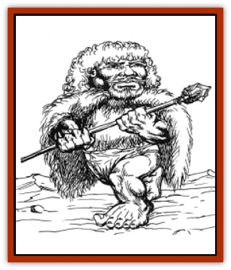

# Dwarf - Arctic

| Statistic | **Dwarf, Arctic** |
| --- | --- |
| **Activity Cycle:** | Any |
| **Alignment:** | Varies, but usually lawful neutral |
| **Armor Class:** | 8 (10) |
| **Climate/Terrain:** | Arctic (Great Glacier) |
| **Damage/Attack:** | 1-8 (weapon) |
| **Diet:** | Omnivore |
| **Frequency:** | Rare |
| **Hit Dice:** | 1 |
| **Intelligence:** | Varies (3-18) |
| **Magic Resistance:** | See below |
| **Morale:** | Elite (13) |
| **Movement:** | 6 |
| **No. Appearing:** | 10-100 |
| **No. of Attacks:** | 1 |
| **Organization:** | Clan |
| **Size:** | S (2-3' tall) |
| **Special Attacks:** | See below |
| **Special Defenses:** | See below |
| **THAC0:** | 19 |
| **Treasure:** | M (&times;5), Q |
| **XP Value:** | Varies |

Squat, hardy, and eccentric, the arctic dwarves, or Innugaakalikurit, are the only dwarven race native to the Great Glacier region.

With blocky bodies, pinched faces, and stubby legs, Innugaakalikurit resemble normal dwarves who have been squashed. They seldom exceed 3 feet in height, and are nearly as broad as they are tall. Their eyes are bright blue, their cheeks as ruddy as apples. Normally, their skin is white, almost bluish, but because of their fondness for basking under the bright sun, many Innugaakalikurit are sunburned red from head to toe, a condition that causes no discomfort or other ill effects.

Their fingers and toes are thick and blunt, their feet flat and wide, enabling them to walk on the snow without sinking. Curly white hair covers their heads and tumbles down their backs nearly to their waists. Males sport short beards and twisting moustaches. Both sexes favor simple tunics of polar bear fur. Innugaakalikurit are always barefoot.

Innugaakalikurit speak a dialect similar to that of the Ulutiuns. They also speak the languages of [[Dragon_Chromatic_White|white dragons]], [[Yeti|yeti]], [[Giant_Frost|frost giants]], and [[Selkie|selkie]]. Their high, gentle voices are particularly suited for singing.

**Combat:** Though peaceful at heart, Innugaakalikurit relish recreational combat; a group of of arctic dwarves can pleasantly pass an afternoon by pounding each another into unconsciousness. They are also excellent hunters and fishers. However, Innugaakalikurit studiously avoid war and won.t engage in combat except to defend themselves or their families. An Innugaakalikurit isn't likely to risk his life to defend a principle or acquire treasure, considering such actions to be the height of stupidity.

Innugaakalikurit are extremely strong; a pair of Innugaakalikurit can carry a full-grown polar bear, and a single Innugaakalikurit can effortlessly lift an adult human off his feet. Their preferred weapon is a bulky bow called an eyklak that fires thick arrows with sharp barbs, capable of inflicting 1-8 points of damage. Innugaakalikurit gain a +2 bonus to hit when using an eyklak, but because of the weapon.s awkward shape, non-Innugaakalikurits suffer a -2 penalty using it. On occasion, they employ battle axes and spears.

Arctic dwarves don't wear armor, but the thick layers of fur worn by hunters and scouts give a protection of AC 8.

In addition to all of the special abilities of dwarves listed in the 2nd Edition *Player's Handbook*, Innugaakalikurit suffer no ill effects of cold temperatures. They are also immune to cold-based spells and other magically-generated forms of cold (such as a white dragon's breath).

**Habitat/Society:** Though a few Innugaakalikurit settlements are found in the ice-covered mountains in the northern reaches of the Great Glacier, most live in small villages in the highest peaks of Novularond. A typical clan consists of about 100 members. Of the able-bodied adults, about 80% are 1st-level fighters, 10% are 2nd- to 4th-level fighters, 5% are 5th-level or higher fighters, and the rest are rangers and thieves of various levels. The eldest male serves as clan leader, though opinions of all adults are freely solicited. Homes are caves or simple structures of snow blocks.

Innugaakalikurit life focuses on hunting, gathering, and raising children. Singing, storytelling, and contact sports (such as boxing and wrestling) occupy their leisure time.

Innugaakalikurit are fascinated by weapons of all types. When coming across an unusual weapon - which for the Innugaakalikurit can be anything from a scimitar to a trident to a blowgun - they may spend hours turning it over in their hands, admiring its craftsmanship and discussing its merits. A few Innugaakalikurit maintain sizeable collections of odd weapons.

**Ecology:** Curious and outgoing, the Innugaakalikurit are quite sociable and maintain friendly, if distant, relationships with other races. They despise frost giants, with whom they have long-standing territorial conflicts in Novularond. Favorite foods include fish, caribou, and polar bear.

---
## Discovery & Documentation

**Source Publication:** Monstrous Compendium, 1996 Annual, Volume 3 (1995)
**Campaign Setting:** Advanced Dungeons & Dragons 2nd Edition
**Author(s):** Jon Pickens

### Other Creatures Found in This Source Book
   * [[Alaghi|Alaghi]]
   * [[Alhoon|Alhoon]]
   * [[Aranea_Savage_Coast|Aranea (Savage Coast)]]
   * [[Arcane_Head|Arcane Head]]
   * [[Banedead|Banedead]]
   * [[Banelich|Banelich]]
   * [[Bat_Bonebat|Bat, Bonebat]]
   * [[Beetle|Beetle]]
   * [[Belgoi|Belgoi]]
   * [[Bladeling|Bladeling]]
   * [[Braxat|Braxat]]
   * [[Bunyip|Bunyip]]
   * [[Burbur|Burbur]]
   * [[Bvanen|Bvanen]]
   * [[Cat_Great_Snow_Tiger|Cat, Great, Snow Tiger]]
   * [[Chosen_One|Chosen One]]
   * [[Chronovoid|Chronovoid]]
   * [[Cildabrin|Cildabrin]]
   * [[Coffer_Corpse|Coffer Corpse]]
   * [[Disenchanter|Disenchanter]]
   * [[Dog_Temporal|Dog, Temporal]]
   * [[Dragon_Cerilia|Dragon (Cerilia)]]
   * [[Dragon_Ghost|Dragon, Ghost]]
   * [[Dragon_Lesser_Undead|Dragon, Lesser Undead]]
   * [[Dragon_Neutral_Amber|Dragon, Neutral, Amber]]
   * [[Dread_Warrior|Dread Warrior]]
   * [[Dreamweaver|Dreamweaver]]
   * [[Dream_Spawn_Greater_Ennui|Dream Spawn, Greater, Ennui]]
   * [[Dream_Spawn_Lesser_Morph|Dream Spawn, Lesser, Morph]]
   * [[Dwarf_Urdunnir|Dwarf, Urdunnir]]
   * [[Eel_Giant_Moray|Eel, Giant Moray]]
   * [[Elemental_Fire_Kin_Tome_Guardian|Elemental, Fire Kin, Tome Guardian]]
   * [[Elf_Rockseer|Elf, Rockseer]]
   * [[Ethyk|Ethyk]]
   * [[Faerie_Faerie_Fiddler|Faerie, Faerie Fiddler]]
   * [[Faerie_Petty_Bramble|Faerie, Petty, Bramble]]
   * [[Faerie_Petty_Gorse|Faerie, Petty, Gorse]]
   * [[Faerie_Petty|Faerie, Petty]]
   * [[Firenewt|Firenewt]]
   * [[Formian|Formian]]
   * [[Gargoyle_II|Gargoyle II]]
   * [[Giant_Cerilia|Giant (Cerilia)]]
   * [[Goblin_Cerilia|Goblin (Cerilia)]]
   * [[Golem_Magic|Golem, Magic]]
   * [[Golem_Shaboath|Golem, Shaboath]]
   * [[Hag_Bheur|Hag, Bheur]]
   * [[Hamadryad|Hamadryad]]
   * [[Hound_of_Ill-Omen|Hound of Ill-Omen]]
   * [[Human_Cerilia|Human (Cerilia)]]
   * [[Hybsil|Hybsil]]
   * [[Ibrandlin|Ibrandlin]]
   * [[Imp_Chaos|Imp, Chaos]]
   * [[Ixitxachitl_Ixzan|Ixitxachitl, Ixzan]]
   * [[Jabberwock|Jabberwock]]
   * [[Kyton|Kyton]]
   * [[Kyuss_Son_of|Kyuss, Son of]]
   * [[Lillend|Lillend]]
   * [[Life-Shaped_Creation_Guardian|Life-Shaped Creation, Guardian]]
   * [[Life-Shaped_Creation_Transport|Life-Shaped Creation, Transport]]
   * [[Lycanthrope_Werecrocodile|Lycanthrope, Werecrocodile]]
   * [[Lycanthrope_Werespider|Lycanthrope, Werespider]]
   * [[Magedoom|Magedoom]]
   * [[Manotaur|Manotaur]]
   * [[Mastiff_Shadow|Mastiff, Shadow]]
   * [[Meazel|Meazel]]
   * [[Mist_Scarlet_Dancer|Mist, Scarlet Dancer]]
   * [[Needleman|Needleman]]
   * [[Orc_Neo-Orog|Orc, Neo-Orog]]
   * [[Orc_Ondonti|Orc, Ondonti]]
   * [[Owlbear_II|Owlbear II]]
   * [[Pegataur|Pegataur]]
   * [[Phaerimm|Phaerimm]]
   * [[Reggelid|Reggelid]]
   * [[Render|Render]]
   * [[Saurial|Saurial]]
   * [[Scalamagdrion|Scalamagdrion]]
   * [[Sharn|Sharn]]
   * [[Snake_Messenger|Snake, Messenger]]
   * [[Spirit_Forest_Uthraki|Spirit, Forest, Uthraki]]
   * [[Spirit_Forest_Wood_Man|Spirit, Forest, Wood Man]]
   * [[Spirit_Ice_Orglash|Spirit, Ice, Orglash]]
   * [[Spirit_Rock_Thomil|Spirit, Rock, Thomil]]
   * [[Strider_Giant|Strider, Giant]]
   * [[Tembo|Tembo]]
   * [[Temporal_Glider|Temporal Glider]]
   * [[Temporal_Stalker|Temporal Stalker]]
   * [[Tether_Beast|Tether Beast]]
   * [[Thessalmonster|Thessalmonster]]
   * [[Time_Dimensional|Time Dimensional]]
   * [[Tomb_Tapper|Tomb Tapper]]
   * [[Undead_Dragon_Slayer|Undead Dragon Slayer]]
   * [[Unicorn_Black_Toril|Unicorn, Black (Toril)]]
   * [[Vaath|Vaath]]
   * [[Vortex_Spider|Vortex Spider]]
   * [[Weredragon|Weredragon]]
   * [[Zhentarim_Spirit|Zhentarim Spirit]]
