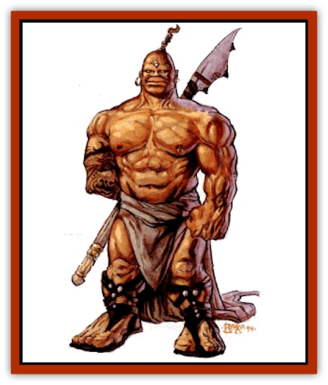

# Dwarf - Athas

| Statistic | **Dwarf (Athas)** |
| --- | --- |
| **Activity Cycle:** | Any |
| **Alignment:** | Lawful neutral |
| **Armor Class:** | 6 (10) |
| **Climate/Terrain:** | Any land |
| **Damage/Attack:** | 1d2 or by weapon +2 |
| **Diet:** | Omnivore |
| **Frequency:** | Uncommon |
| **Hit Dice:** | 1+2 |
| **Intelligence:** | Average (9-11) |
| **Magic Resistance:** | Nil |
| **Morale:** | Very steady (12.13) |
| **Movement:** | 6 |
| **No. Appearing:** | 3-10 (3d10) |
| **No. of Attacks:** | 1 |
| **Organization:** | Clan |
| **Size:** | S (4' tall) |
| **Special Attacks:** | Nil |
| **Special Defenses:** | Special resistances |
| **THAC0:** | 19 |
| **Treasure:** | Varies |
| **XP Value:** | Normal: 65 / Uhrakkus: 120 / Uhrnius: 270 / Uhrnomus: 2,000 |

Dwarves are short, stocky demihumans capable of amazing feats of strength. They are known for obsessive attitudes about the tasks they perform and as such, are considered extremely reliable workers.

Dwarves stand an average of 4½ to 5 feet tall. They tend to have disproportionate statures because of over-muscled bodies and sometimes weigh as much as 200 pounds despite their height. Their massive hands permit them to hold weapons that seem too large for their size. Equally large feet help keep their bulging frames standing. Deep-set eyes sometimes give the impression that the dwarves are constantly observing, silently watching and judging the actions of those around them.

Other than a distinctive build and usually hairless heads, dwarves do not stray too far from a human appearance. However, endless hours laboring under the scorching, Athasian sun has brought them deep copper tans and calloused bodies. There is a joke spread by the humans that dwarves use no whetstone to sharpen their weapons; instead, they are said to rely upon their own skin to keep their blades sharp.

The dwarven language is deep and throaty, with hard, guttural consonants that usually end the brief sentences. Since their tongue often makes non-dwarves hoarse after a few hours of speech, dwarves are willing to learn the common language spoken by merchants throughout the land. Because the language is so difficult, dwarves view with respect those who attempt their language for extended periods, in return for the honor they feel is being demonstrated to them.

**Combat:** Dwarves approach combat with the same obsessive, single-minded perspective they do all things. They neither offer nor expect any quarter, viewing almost every battle as one to the death. They are not incapable of mercy, but mercy is far from their first instinct. Opponents who fight with skill and honor have been known to lose to a dwarf and walk away.

Dwarves prefer sturdy weapons with good heft since weaker ones tend to break under the powerful might of a dwarven swing or thrust. Most dwarves strike for 1-8 (1d8) points of damage with one of their swords, axes, hammers, or similar weapons. Most dwarven weapons are made of stone, but they might also be made with metals. Stone weapons have a -2 THAC0 penalty and a -1 penalty to damage rolls. In addition, dwarves' great strength gives a +2 to all damage inflicted from a melee attack. Dwarves are particularly fond of, and quite capable of, finding and using metal to forge their weapons and armor, more so than most of the other demihuman races. There is a 10% chance per dwarf encountered that 1-4 (1d4) of them have arms and armor constructed from scraps of metal found or mined from the wastelands.

Ironically, though dwarves love metal, they despise bulky armor. Most prefer [[Animal_Domestic_Athas_I|mekillot]] hide or bone as protection, though some will shape pieces of metal into breastplates, bracers, or greaves (conferring an AC of 5). Most dwarves use shields if their main weapon requires only one hand or if they are not carrying a second weapon. Dwarves who find metal are most likely to use it for a weapon or a shield rather than applying it to armor.

Dwarves are inherently nonmagical, both by choice and by design. They are never preservers, defilers, or illusionists, nor do they employ magical spells. They do not, however, overlook the value of enchanted arms, believing that the weapon or armor overpowers whatever unreliable magics reside within. They do not share similar views of clerics and templars, noting an important distinction between spiritual and wizardly magic. This resistance to magic gives a +4 bonus to all saving throws versus magical attacks, though individual dwarves may have different adjustments based on the description given in the *Dark Sun* Rules Book. A dwarf's high Constitution also results in a stronger resistance to illnesses and toxins, granting dwarves a +4 to saving throws versus disease and poison, but this can vary for the individual dwarf.

When entire clans (30-300 members) are encountered, one dwarf in 10 is called a uhrakkus, meaning sub-leader. This uhrakkus has 3+6 HD, THAC0 17, and always has a steel weapon. For every 50 dwarves, there is a uhrnius (leader) present who has 5+10 HD, THAC0 15, and a magical steel weapon. The uhrnius is 50% likely to possess psionic or clerical abilities. Every clan of more than 100 dwarves will have a 10+1 HD uhrnomus (over-leader) with THAC0 11, clerical and psionic abilities (as per 5th-level cleric/5th-level psionicist), a magical weapon, and 1-4 (1d4) magical items. Clans with more than 200 members are 40% likely to have two uhrnomus, though only one actually has the title and the right to command.

Dwarves have the ability to see varying degrees of heat (infravision) to as far as 60 feet, making them formidable opponents even in darkness.

**Habitat/Society:** The saying that a dwarf's first love is hard work is true. No dwarf iS more content than while working toward the resolution of some cause, be it labor or combat. This task, called a *focus*, is approached with single-minded direction for the dwarf's entire life, if need be, though most foci require considerably less time. The only time constraint for a focus is that it must take more than a week to complete, anything less is nothing more than a simple task. A dwarf does not ignore such short activities, but he derives no satisfaction from their completion. At all times, the dwarf must be progressing toward the completion of the focus, changing direction for no more than a few days at most.

It is possible for a dwarf to have more than one focus, providing both are somehow related. For example, a dwarf whose focus is to construct a new village for his clan to adopt may also have a short-term focus to locate the best builders in all of Athas for this village. A dwarf who performs tasks related to the completion of his foci receives a +1 bonus to all saving throws and a +2 bonus to his proficiency rolls. A dwarf who dies while resolving a focus is doomed to spend the remainder of its existence as a [[Banshee_Dwarf|banshee]], forever wandering the wastelands in vain attempts to finish his work.

Free dwarves settle in communities, called clans, bound around their families. Ties of the blood are honored and respected above all others, except the focus. Debts and glories earned from one generation in a clan are passed down to the family members of the next generation. There is no way to break free from these nebulous ties, for such a concept is entirely foreign to the mind of the dwarf. Many foci of clan dwarves center around the benefit of the family.

**Ecology:** Dwarves adapt to virtually all types of terrain on Athas, comfortably settling in mountains, deserts, or near human city-states. Few communities surpass 300 in number. These communities usually spring from a few extended families linked by a common ancestor whose focus was to start the settlement ages ago.

Most free dwarves earn their money through commerce with the world around them. Dwarven-forged metal is considered to be among the best in all of Athas. Many smiths swell the boundaries of their clan's economy by purchasing or finding scraps of steel and converting it to arms or armor. Though dwarves despise haggling because it wastes too much time that could be directed toward better things, they set their prices fairly. Most dwarven-produced goods are priced within 10% of the prices listed in the *Player's Handbook*.

In the cities, dwarves who do not craft metal usually hire out as mercenaries. Dwarven mercenaries are highly prized; it is hard to buy their loyalty once it has been purchased by another. Some desperate dwarves find their ways into the gladiatorial pits of the nobles, sacrificing freedom to send money to the homelands.

Dwarves have an average life span of about 250 years.

---
## Discovery & Documentation

**Source Publication:** Dark Sun Appendix II - Terrors Beyond Tyr (1991)
**Campaign Setting:** Dark Sun
**Author(s):** Jim Atkiss, Steve Brown, Timothy B. Brown, Andrew P. Morris, Bruce Nesmith, Wes Nicholson, Bill Slavicsek

### Other Creatures Found in This Source Book
   * [[Aarakocra_Athas|Aarakocra (Athas)]]
   * [[Animal_Domestic_Athas_II|Animal, Domestic (Athas) II]]
   * [[Aviarag|Aviarag]]
   * [[Baazrag|Baazrag]]
   * [[Baazrag_Boneclaw|Baazrag, Boneclaw]]
   * [[Bloodgrass|Bloodgrass]]
   * [[Cactus_Hunting|Cactus, Hunting]]
   * [[Cactus_Rock|Cactus, Rock]]
   * [[Cilops|Cilops]]
   * [[Crodlu|Crodlu]]
   * [[Dagorran|Dagorran]]
   * [[Dhaot|Dhaot]]
   * [[Drake_Lesser_Athas_General_Information|Drake, Lesser (Athas), General Information]]
   * [[Drake_Lesser_Athas_Magma|Drake, Lesser (Athas), Magma]]
   * [[Drake_Lesser_Athas_Rain|Drake, Lesser (Athas), Rain]]
   * [[Drake_Lesser_Athas_Silt|Drake, Lesser (Athas), Silt]]
   * [[Drake_Lesser_Athas_Sun|Drake, Lesser (Athas), Sun]]
   * [[Dray|Dray]]
   * [[Drik|Drik]]
   * [[Dune_Reaper|Dune Reaper]]
   * [[Elemental_Beast_Athas_Air|Elemental Beast (Athas), Air]]
   * [[Elemental_Beast_Athas_Earth|Elemental Beast (Athas), Earth]]
   * [[Elemental_Beast_Athas_Fire|Elemental Beast (Athas), Fire]]
   * [[Elemental_Beast_Athas_Water|Elemental Beast (Athas), Water]]
   * [[Elf_Athas|Elf (Athas)]]
   * [[Fael|Fael]]
   * [[Feylaar|Feylaar]]
   * [[Fordorran|Fordorran]]
   * [[Giant_Half-giant|Giant, Half-giant]]
   * [[Giant_Shadow|Giant, Shadow]]
   * [[Golem_Athas_Magma|Golem (Athas), Magma]]
   * [[Golem_Athas_Salt|Golem (Athas), Salt]]
   * [[Golem_Athas_General_Information|Golem (Athas), General Information]]
   * [[Gorak|Gorak]]
   * [[Halfling_Athas|Halfling (Athas)]]
   * [[Human_Athas|Human (Athas)]]
   * [[Jhakar|Jhakar]]
   * [[Kaisharga|Kaisharga]]
   * [[Kes'trekel|Kes'trekel]]
   * [[Klar|Klar]]
   * [[Krag|Krag]]
   * [[Kragling|Kragling]]
   * [[Lirr|Lirr]]
   * [[Mastyrial|Mastyrial]]
   * [[Meorty|Meorty]]
   * [[Mul|Mul]]
   * [[Nikaal|Nikaal]]
   * [[Paraelemental_Beast_General_Information|Paraelemental Beast, General Information]]
   * [[Paraelemental_Beast_Magma|Paraelemental Beast, Magma]]
   * [[Paraelemental_Beast_Rain|Paraelemental Beast, Rain]]
   * [[Paraelemental_Beast_Silt|Paraelemental Beast, Silt]]
   * [[Paraelemental_Beast_Sun|Paraelemental Beast, Sun]]
   * [[Pakubrazi|Pakubrazi]]
   * [[Psionocus|Psionocus]]
   * [[Psurlon|Psurlon]]
   * [[Raaig|Raaig]]
   * [[Retriever_Obsidian|Retriever, Obsidian]]
   * [[Ruktoi|Ruktoi]]
   * [[Ruvoka_Athas|Ruvoka (Athas)]]
   * [[Sand_Howler|Sand Howler]]
   * [[Scorpion_Athas|Scorpion (Athas)]]
   * [[Seed_Brain|Seed, Brain]]
   * [[Silt_Horror_Black|Silt Horror, Black]]
   * [[Silt_Horror_Magma|Silt Horror, Magma]]
   * [[Silt_Horror_Red|Silt Horror, Red]]
   * [[Silt_Spawn|Silt Spawn]]
   * [[Slig|Slig]]
   * [[Spider_Athas|Spider (Athas)]]
   * [[Spinewyrm|Spinewyrm]]
   * [[Ssurran|Ssurran]]
   * [[Stalking_Horror|Stalking Horror]]
   * [[Tarek|Tarek]]
   * [[Tari|Tari]]
   * [[Thri-kreen|Thri-kreen]]
   * [[T'liz|T'liz]]
   * [[Tohr-kreen_II|Tohr-kreen II]]
   * [[Tohr-kreen_III|Tohr-kreen III]]
   * [[Trin|Trin]]
   * [[Tul'k|Tul'k]]
   * [[Undead_Athas_General_Information|Undead (Athas), General Information]]
   * [[Wraith_Athas|Wraith (Athas)]]
   * [[Xerichou|Xerichou]]
   * [[Zombie_Thinking|Zombie, Thinking]]
