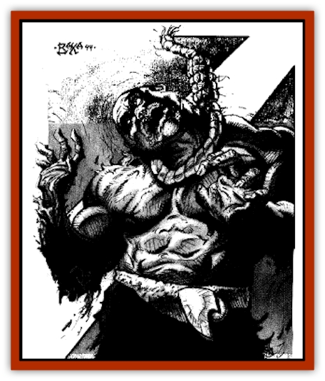

# Dwarf - Cursed Dead

| Statistic | **Dwarf, Cursed Dead** |
| --- | --- |
| **Activity Cycle:** | Any |
| **Alignment:** | Chaotic evil |
| **Armor Class:** | 6 |
| **Climate/Terrain:** | Groaning City |
| **Damage/Attack:** | 1-8/1-8 |
| **Diet:** | None |
| **Frequency:** | Uncommon |
| **Hit Dice:** | 8 |
| **Intelligence:** | High (13-14) |
| **Magic Resistance:** | 15% |
| **Morale:** | Fanatic (18) |
| **Movement:** | 9 |
| **No. Appearing:** | 1 or 2-5 |
| **No. of Attacks:** | 2 |
| **Organization:** | Solitary or pack |
| **Size:** | M (4' tall) |
| **Special Attacks:** | See below |
| **Special Defenses:** | +1 weapons to hit |
| **THAC0:** | 13 |
| **Treasure:** | Nil |
| **XP Value:** | 1,500 |

**Psionics Summary**

| Level | Dis/Sci/Dev | Attack/Defense | Score | PSPs |
| --- | --- | --- | --- | --- |
| 7 | 1/2/4 | -/IF,MB | 12 | 50 |

**Psychometabolism -** *Sciences:* death field, life draining; *Devotions:* aging, body weaponry, cause decay, ectoplasmatic form.

The demihumans of ancient Giustenal fled to the uppermost cavern beneath the city to escape the Cleansing Wars and the wrath of their sorcerer-king, [[Dregoth|Dregoth]]. Eventually, Dregoth discovered the place the demihumans took sanctuary, and his troops were sent below to destroy them. The last group of defenders were the dwarves guarding the Hall of the Lion in the cavern that would come to be called the Groaning City. Dregoth personally helped defeat the dwarves, and he watched as each of them was hanged from the trees in front of the place they sought to defend. When his troops set fire to the remains of the settlement, Dregoth cursed the dwarves for defying him. On that day the cursed dead were born.

The cursed dead dwarves are undead creatures who look much like they did in life. They wear faded yellow robes with lion images emblazoned on the fronts. Because of the way they died, their heads bounce on broken necks. Ropes of giant hair still hang around their necks, further evidence of the terrible fate that befell them.

The bodies of many of these dwarves still sway from rotting nooses. They let out low, haunting moans whenever someone enters the cavern, thus giving the ruins the name of the Groaning City. Occasionally, a rope breaks and a cursed dead is freed from its tree to roam the cavern. Visitors to the ruins may run into these free cursed dead among the ruins on the overlook in the northern portion of the cavern.

The cursed dead of the Groaning City remember the language of ancient Giustenal, as well as the dwarven language spoken at that time. However, most are not capable of producing any sounds other than the low moans that echo throughout the cavern.

**Combat:** A cursed dead dwarf suffers in constant anguish over its barely remembered failure to save its beloved city. Any living being is a reminder of the army that once ransacked their home, and the cursed dead will stop at nothing to right that ancient wrong.

Anyone who gets close enough to a cursed dead must watch out for its powerful pummeling attacks. It swings its arms like heavy clubs, inflicting 1d8 points of damage with every hit. Even those still hanging from the trees can attack in this manner, though they do so with a -2 attack roll penalty.

A cursed dead.s special attack is both frightening and gruesome. With a terrible moan, it spreads its arms and legs wide, then its sinews explode in a mass of writhing, constricting cords. It can use this attack once every five rounds, as it takes time to reconstitute itself before it can once more shoot out the cords. (A cursed dead can use its pummeling attack while reconstituting itself.) Anyone within 20 feet of a cursed dead is eligible to be hit by the sinews. It can direct four attacks in a round this way, but all the attacks must be at the same target. Each hit inflicts 1d4 points of damage. If at least two of the sinew attacks hit, then the target is caught by the sinews.

Those entwined in the sinewy cords can't cast spells or attempt to turn the undead creatures. They also fight and defend with penalties of -4. It takes a cursed dead one round to pull its captured victim close. Then it launches a series of pummeling attacks until the victim is destroyed.

To escape from the sinews, a character must make a successful Strength check with a modifier based on how many cords hit: 2 cords, Str -2; 3 cords, Str -3; 4 cords, Str -4. The cords can also be severed. To sever one of the cords, a character must inflict 8 points of damage to it. Once severed, the cord will regenerate (if the cursed dead isn.t destroyed) in 24 hours. Blunt or impaling weapons cause only a single point of damage to the cords with each successful hit, though they cause full damage to the cursed dead itself.

Cursed dead can't be controlled by evil clerics, but they will never attack an evil priest or anyone within 10 feet of him if that result is achieved on a turning check.

**Habitat/Society:** The cursed dead never leave the confines of the Groaning City. Most are encountered along the Avenue of the Hanged, where their bodies still sway from the charred, dead trees. A few have escaped and roam the city. A free cursed dead will follow whoever disturbs it, waiting for an opportunity to use its special attack.

Whenever a living being steps within 50 feet of a cursed dead, all of the dwarves hanging from the trees will begin to moan. Once the moaning starts, the cursed dead wait for the chance to grab those who have disturbed them. If any are cut down, they immediately attack with their special attack form.

Any characters who hear the horrible moans must save versus death magic. Those who fail suffer a -2 penalty to all attack rolls and proficiency checks made within the cavern, and they will insist on leaving after 1d4 hours have passed.

**Ecology:** The cursed dead have become evil since becoming undead. Though they are driven to protect their home and make up for the failure of the past, the best they can do is kill intruders and hope to find some solace in the deaths of those who disturb their anguished existence.

---
## Discovery & Documentation

**Source Publication:** City by the Silt Sea (1994)
**Campaign Setting:** Dark Sun
**Author(s):** Shane Lacy Hensley

### Other Creatures Found in This Source Book
   * [[Beetle_Dragon|Beetle, Dragon]]
   * [[Caller_in_Darkness|Caller in Darkness]]
   * [[Dray|Dray]]
   * [[Dregoth|Dregoth]]
   * [[Kalin|Kalin]]
   * [[Krag|Krag]]
   * [[Kragling|Kragling]]
   * [[Pit_Snatcher|Pit Snatcher]]
   * [[Silt_Serpent|Silt Serpent]]
   * [[Silt_Spawn|Silt Spawn]]
   * [[Venger|Venger]]
   * [[Wall_Walker|Wall Walker]]
