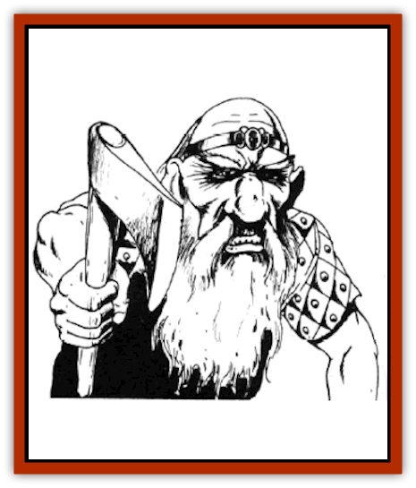

# Dwarf - Duergar

| Statistic | **Duergar** | **Steeder (giant spider)** |
| --- | --- | --- |
| **Activity Cycle:** | Any | Any |
| **Alignment:** | Lawful evil (neutral) | Neutral |
| **Armor Class:** | 4 | 4 |
| **Climate/Terrain:** | Subterranean | Subterranean |
| **Damage/Attack:** | By weapon | 1-8 |
| **Diet:** | Omnivore | Carnivore |
| **Frequency:** | Very rare | Uncommon |
| **Hit Dice:** | 1+2 | 4 |
| **Intelligence:** | Average (8-10) to genius (17-18) | Non- (0) |
| **Magic Resistance:** | Nil | Nil |
| **Morale:** | Elite (13) | Steady (11) |
| **Movement:** | 6 | 12 |
| **No. Appearing:** | 2-9 or 201-300 | 2-20 |
| **No. of Attacks:** | 1 or more | 1 |
| **Organization:** | Tribal | Pack |
| **Size:** | S (4') | M (4' high, 8' long) |
| **Special Attacks:** | See below | See below |
| **Special Defenses:** | Save with +4 bonus | Leap |
| **THAC0:** | 19 | 17 |
| **Treasure:** | Individuals M,Q; Lair B (magic only),F | Nil |
| **XP Value:** | Normal: 420 / 2+4 HD: 650 / 3+6 HD: 975 / 4+8 HD: 1,400 | 120 |

The duergar, or gray [[Dwarf|dwarves]], are a malevolent breed that dwells in the extreme depths of the ground. Duergar may be fighters, priests, or thieves. Multi-classed duergar may be fighter/priests, fighter/thieves, or priest/thieves. Thief duergar are proficient in the use of poison.

Duergar appear to be emaciated, nasty-looking dwarves. Their complexion and hair range from medium to dark gray. They prefer drab clothing designed to blend into their environment. In their lair, they may wear jewelry, although such pieces are kept dull.

Duergar have infravision with a range of 120 feet. They speak the duergar dialect of the dwarves tongue, "undercommon" (the trading language of subterranean cultures), and the silent speech employed by same subterranean creatures. Intelligent duergar may speak other languages as well.

**Combat:** For every four normal, 1-HD duergar encountered outside a lair, there is one with 2+4 HD. If a band of nine duergar is encountered outside a lair, a tenth duergar of 3+6 HD or 4+8 HD always leads the group.

Duergar are armed as follows:

<ul><li>1st level: pick, hammer, spear, chain mail, and shield</li><li>2nd level: pick, light crossbow, chain mail, and shield</li><li>3rd-6th levels hammer, short sword, plate mail, and shield</li><li>7th-9th level: hammer*, short sword*, plate mail*, and shield*</li><li>3rd-6th/3rd-6th level priest/thief: any usable*/any usable*</li><li>7th-9th/7th-9th level priest/thief: any usable*/any usable*</li></ul>* 5% chance/level for magical item; for multi-class, add one-half of lower level (round upward) to the higher level in order to find the appropriate multiplier.

There are noncombatant duergar children equal to 10% of the total number of duergar fighters encountered, The duergar's stealth imposes a -2 penalty to opponents' surprise rolls; the duergar are surprised only on a 1 on 1d10. Their saving throws vs. magical attacks gain a +4 bonus. They are immune to paralysis and illusion/phantasm spells. They are unaffected by poisons.

All duergar possess innate magical abilities of *enlargement* and *invisibility*. They can use these spells as wizards of level equal to the duergar's hit points. Duergar can use the enlargement power to either grow or shrink themselves and anything they are wearing or carrying.

Daylight affects the duergar as follows: their enhanced ability to gain surprise is negated, Dexterity is reduced by 2, attacks are made with a -2 penalty to the attack roll, and opponents' saving throws are made with a +2 bonus. If the encounter occurs when the duergar are in darkness but their opponents are brightly illuminated, the duergar's surprise ability and Dexterity are normal. but the duergar suffer a -1 penalty to their attack rolls and opponents gain a +1 bonus to saving throws against duergar attacks. Duergar are not adversely affected by the light given off by torches, lanterns, magical weapons, or *light* and *faerie fire* spells.

There is a 10% chance that encountered duergar are accompanied by 2d4 giant spiders (steeders) used as mounts.

**Habitat/Society:** The duergar are similar to other dwarves cultures, although the life is much harsher due to their hostile environment deep under the ground. They do not venture into the surface except at night or on the gloomiest days. Duergar live longer than their surface-dwelling kin. Life spans can reach 400 years or more.

Duergar lairs are always deep underground. These are elaborate collection of chambers, passages, rooms, and secret areas. There is a 25% chance a monster is kept as a guardian for the lair complex. Such a creature is probably kept at an entrance to the duergar complex or kept within the treasure cave.

There is a 75% chance that a lair holds 1d4x10 slaves. Roll 1d20 to determine the type of slave.

| Roll | Slaves |
| --- | --- |
| 1-8 | Mountain dwarves |
| 9-12 | Dwarves (other) or goblins |
| 13-16 | Gnomes |
| 17-18 | Halfling (stout) or kobolds |
| 19 | Svirfneblin |
| 20 | Adventurers or others (drow or other subterranean race) |

Duergar raise giant [[Spider|spiders]] called steeders for mounts. A large chamber serves as "corral" for the herd of 20d10 steeders of various sizes (see following).

The duergar are not as affluent as other dwarven races. Individuals may have a few gold or platinum coins stashed away. Normal, usable items like weapons or armor are immediately distributed. Magical items and the bulk of the acquired treasure is stored in a well-protected chamber deep in the duergar complex.

Duergar possess the normal dwarven abilities to detect slope, new construction, sliding walls, traps, and depth underground. They have the dwarven combat advantages when fighting such creatures as [[Ogre|ogres]], [[Troll|trolls]], [[Ogre|ogre magi]], giants, and [[Titan|titans]]. They do not gain the dwarves advantage when fighting [[Orc|orcs]], half-orcs,  goblins, and [[Hobgoblin|hobgoblins]], since duergar are not inherently hostile toward such races.

The duergar diet is an omnivorous mix of fungi, insects, and subterranean animals. Duergar complexes include caverns used as fungus farms that are filled with giant, edible mushrooms. They brew a potent ale from such mushrooms.

**Ecology:** Duergar detest the other dwarves races, whom they consider pampered. weak, and self-indulgent. They may ally and even share living space with evil dwarves, but the duergar's hostile nature snakes such alliances extremely rare.

Duergar tend to see intruders as invaders. Even if trespassers can convince the duergar of their peaceful intentions, the duergar may demand a stiff toll to permit safe passage. Even then, duergar may discreetly follow the travelers to see what they are up to and, if treasure is involved, to steal such riches for themselves.

Duergar rarely bother surface-dwellers due to their disadvantages on the surface. When encountered on the surface, such dwarves are usually on a mission or part of a raiding party.

**Steeders**

  Steeders are immense tarantulas used as mounts by the duergar. The duergar ride on leather saddles and use a complex series of prods and straps to control the monsters.

Only speeders of 20 or more hp are used as mounts.

A steeder lacks a poisonous bite; it attacks with its sharp mandibles. Its feet exude a sticky secretion that enables it to cling to the most precarious surface. If even one of its eight feet is touching a surface, a steeder cannot fall. These secretions can also be used to cling to victims. There is a 50% chance that a steeder tries to cling to its prey. This requires a successful attack roll, but the victim is considered AC 10, minus any Dexterity or magical armor bonus. After clinging to a victim, the steeder can automatically bite for 1d8 points of damage. The victim can escape by rolling a successful Dexterity or Strength check (player's choice which) with a -10 penalty. While held, victims suffer a -2 penalty to attack and damage rolls.

A steeder can leap 240 feet in any direction, even when mounted. It can leap once every three rounds. Leaps are considered charging attacks and give both steeper and rider the normal charge bonuses. If the speeder leaps onto a set spear or pike, it suffers double damage.

A speeder can move on walls or ceilings at half its normal movement rate. Steeder saddles are constructed to allow for this.

---
## Discovery & Documentation

**Source Publication:** MC2 Volume II (1993)
**Campaign Setting:** Advanced Dungeons & Dragons 2nd Edition
**Author(s):** Jay Batista, Scott Bennie, Grant Boucher, William W. Connors, Steve Gilbert, Heike Kubasch, James Lowder, David Edward Martin, Bruce Nesmith, Jean Rabe, Rick Swan, John J. Terra, Gary L. Thomas

### Other Creatures Found in This Source Book
   * [[Ant|Ant]]
   * [[Ant_Lion_Giant|Ant Lion, Giant]]
   * [[Ape_Carnivorous|Ape, Carnivorous]]
   * [[Baboon|Baboon]]
   * [[Badger|Badger]]
   * [[Barracuda|Barracuda]]
   * [[Beetle_Giant|Beetle, Giant]]
   * [[Bulette|Bulette]]
   * [[Bullywug|Bullywug]]
   * [[Dwarf_Gully|Dwarf, Gully]]
   * [[Eagle|Eagle]]
   * [[Eel|Eel]]
   * [[Elemental_Air_Kin|Elemental, Air Kin]]
   * [[Elemental_Water_Kin|Elemental, Water Kin]]
   * [[Elemental_Water_Kin_Water_Weird|Elemental, Water Kin, Water Weird]]
   * [[Firestar|Firestar]]
   * [[Firetail|Firetail]]
   * [[Fish_Giant|Fish, Giant]]
   * [[Frog|Frog]]
   * [[Gorgon|Gorgon]]
   * [[Hawk|Hawk]]
   * [[Heucuva|Heucuva]]
   * [[Hippocampus|Hippocampus]]
   * [[Hippogriff|Hippogriff]]
   * [[Kelpie|Kelpie]]
   * [[Kenku|Kenku]]
   * [[Killmoulis|Killmoulis]]
   * [[Kuo-Toa|Kuo-Toa]]
   * [[Lamia|Lamia]]
   * [[Lammasu|Lammasu]]
   * [[Lamprey|Lamprey]]
   * [[Leech|Leech]]
   * [[Leprechaun|Leprechaun]]
   * [[Leucrotta|Leucrotta]]
   * [[Locathah|Locathah]]
   * [[Lycanthrope_Wereboar|Lycanthrope, Wereboar]]
   * [[Lycanthrope_Werefox|Lycanthrope, Werefox]]
   * [[Mammal_Minimal|Mammal, Minimal]]
   * [[Mammal_Small|Mammal, Small]]
   * [[Mimic|Mimic]]
   * [[Morkoth|Morkoth]]
   * [[Muckdweller|Muckdweller]]
   * [[Myconid|Myconid]]
   * [[Naga|Naga]]
   * [[Obliviax|Obliviax]]
   * [[Octopus_Giant|Octopus, Giant]]
   * [[Otyugh|Otyugh]]
   * [[Piranha|Piranha]]
   * [[Plant_Dangerous_I|Plant, Dangerous I]]
   * [[Plant_Intelligent|Plant, Intelligent]]
   * [[Poltergeist|Poltergeist]]
   * [[Porcupine|Porcupine]]
   * [[Rat_Osquip|Rat, Osquip]]
   * [[Roc|Roc]]
   * [[Roper|Roper]]
   * [[Rot_Grub|Rot Grub]]
   * [[Rust_Monster|Rust Monster]]
   * [[Sahuagin|Sahuagin]]
   * [[Sea_Lion|Sea Lion]]
   * [[Sea_Horse_Giant|Sea Horse, Giant]]
   * [[Shambling_Mound|Shambling Mound]]
   * [[Shark|Shark]]
   * [[Sphinx|Sphinx]]
   * [[Squid_Giant|Squid, Giant]]
   * [[Stirge|Stirge]]
   * [[Swanmay|Swanmay]]
   * [[Tarrasque|Tarrasque]]
   * [[Tasloi|Tasloi]]
   * [[Triton|Triton]]
   * [[Troglodyte|Troglodyte]]
   * [[Urchin|Urchin]]
   * [[Urd|Urd]]
   * [[Weasel|Weasel]]
   * [[Wolverine|Wolverine]]
   * [[Yellow_Musk_Creeper|Yellow Musk Creeper]]
