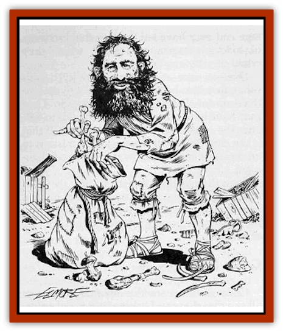

# Dwarf - Gully

| Statistic | **Dwarf, Gully** |
| --- | --- |
| **Activity Cycle:** | Any |
| **Alignment:** | Varies, but usually chaotic neutral |
| **Armor Class:** | 7 (10) |
| **Climate/Terrain:** | Tropical, subtropical, and temperate/Plain, swamp, forest, jungle, hill, and mountain |
| **Damage/Attack:** | 1-4/1-4 (fist/bite) or by weapon (1-4) |
| **Diet:** | Omnivore |
| **Frequency:** | Rare |
| **Hit Dice:** | 1 |
| **Intelligence:** | Varies (3-9) |
| **Magic Resistance:** | See below |
| **Morale:** | Unsteady (7) |
| **Movement:** | 6 |
| **No. Appearing:** | 2-20 |
| **No. of Attacks:** | 1 or 2 |
| **Organization:** | Clan |
| **Size:** | S (4' tall) |
| **Special Attacks:** | See below |
| **Special Defenses:** | See below |
| **THAC0:** | 19 |
| **Treasure:** | J (׼); (J,K) |
| **XP Value:** | Varies |

Gully [[Dwarf|dwarves]], also known as Aghar, are stupid, filthy, and obnoxious.

Gully dwarves are short and squat, averaging four feet in height and weighing about 100 pounds. Their skin tones range from olive brown to a light parchment color. Males wear long, scruffy beards; females have cheek hair but no beards. Hair color ranges from dirty blond to duil black. Eyes can be watery blue, dull green, or hazel. Gully dwarves have narrower fingers and limbs than other dwarves, and their skin is often covered with scars, boils, sores, and filth. Pot bellies are common among both sexes.

The stupidity of gully dwarves is legendary. To a gully dwarf, any number greater than one is "two", which simply means "more than one". In spite of their dull minds, gully dwarves take themselves quite seriously. They tend to have inflated ideas of their own importance, and puncturing their egos is almost impossible.

**Combat:** Since they regard cowardice as a virtue, gully dwarves have raised groveling to an art form. If confronted by a dangerous opponent but not immediately attacked, gully dwarves either faint, cry, beg for mercy, divulge rivers of information, run away, or stand and hake. If attacked, gully dwarves defend themselves, but they sometimes fight with their eyes closed. Gully dwarves are not above stealing, lying, or bullying, and dirty tricks are among their favorite tactics.

Master scavengers, gully dwarves use any armor and weapons they happen to recover from garbage dumps or scrap heaps. Padded and studded leather are commonly worn. Gully dwarves rarely use weapons other than clubs, daggers, knifes, and hand axes. A few have learned to use slings.

**Habitat/Society:** Gully dwarf communities are quite small, seldom exceeding more than 2d10 members. A typical clan of 11 members includes a chieftain (a fighter of level 2-6), about four 1st-level fighters (one of whom serves as the clans shaman, although he has no magical abilities), one fighter of level 2-4 (or a thief of the same level range); the rest are females and children. Most clans live in abandoned villages or in the wilderness in old mines and caves. Others live in slums, refuse dumps, or the sewer systems of large cities. When several clans live together, the strongest and cleverest chieftain becomes the local king, whose title is produced by adding the prefix "High" to his clan name. Each successive king often calls himself "the First", owing to the gully dwarves' inability to count.

Gully dwarves believe magical items are useless because their magic was put into them by other races. To gully dwarves, the most powerful items are those that seem to do nothing at all. Objects such as old bones, rotten fruit, fur balls, and bent sticks are treasured and venerated. The clan's shaman keeps these "holy relics" and administers their use.

**Ecology:** Other races avoid gully dwarves, but they are occasionally hired to perform menial tasks. [[Gnome|Gnomes]] occasionally hire them as assassins and spies, even though gully dwarves aren't particular adept at these jobs. Gully dwarves eat anything. Many gully dwarves keep a pot of stew boiling constantly, throwing anything dead or nearly dead into the pot.

---
## Discovery & Documentation

**Source Publication:** MC2 Volume II (1993)
**Campaign Setting:** Advanced Dungeons & Dragons 2nd Edition
**Author(s):** Jay Batista, Scott Bennie, Grant Boucher, William W. Connors, Steve Gilbert, Heike Kubasch, James Lowder, David Edward Martin, Bruce Nesmith, Jean Rabe, Rick Swan, John J. Terra, Gary L. Thomas

### Other Creatures Found in This Source Book
   * [[Ant|Ant]]
   * [[Ant_Lion_Giant|Ant Lion, Giant]]
   * [[Ape_Carnivorous|Ape, Carnivorous]]
   * [[Baboon|Baboon]]
   * [[Badger|Badger]]
   * [[Barracuda|Barracuda]]
   * [[Beetle_Giant|Beetle, Giant]]
   * [[Bulette|Bulette]]
   * [[Bullywug|Bullywug]]
   * [[Dwarf_Duergar|Dwarf, Duergar]]
   * [[Eagle|Eagle]]
   * [[Eel|Eel]]
   * [[Elemental_Air_Kin|Elemental, Air Kin]]
   * [[Elemental_Water_Kin|Elemental, Water Kin]]
   * [[Elemental_Water_Kin_Water_Weird|Elemental, Water Kin, Water Weird]]
   * [[Firestar|Firestar]]
   * [[Firetail|Firetail]]
   * [[Fish_Giant|Fish, Giant]]
   * [[Frog|Frog]]
   * [[Gorgon|Gorgon]]
   * [[Hawk|Hawk]]
   * [[Heucuva|Heucuva]]
   * [[Hippocampus|Hippocampus]]
   * [[Hippogriff|Hippogriff]]
   * [[Kelpie|Kelpie]]
   * [[Kenku|Kenku]]
   * [[Killmoulis|Killmoulis]]
   * [[Kuo-Toa|Kuo-Toa]]
   * [[Lamia|Lamia]]
   * [[Lammasu|Lammasu]]
   * [[Lamprey|Lamprey]]
   * [[Leech|Leech]]
   * [[Leprechaun|Leprechaun]]
   * [[Leucrotta|Leucrotta]]
   * [[Locathah|Locathah]]
   * [[Lycanthrope_Wereboar|Lycanthrope, Wereboar]]
   * [[Lycanthrope_Werefox|Lycanthrope, Werefox]]
   * [[Mammal_Minimal|Mammal, Minimal]]
   * [[Mammal_Small|Mammal, Small]]
   * [[Mimic|Mimic]]
   * [[Morkoth|Morkoth]]
   * [[Muckdweller|Muckdweller]]
   * [[Myconid|Myconid]]
   * [[Naga|Naga]]
   * [[Obliviax|Obliviax]]
   * [[Octopus_Giant|Octopus, Giant]]
   * [[Otyugh|Otyugh]]
   * [[Piranha|Piranha]]
   * [[Plant_Dangerous_I|Plant, Dangerous I]]
   * [[Plant_Intelligent|Plant, Intelligent]]
   * [[Poltergeist|Poltergeist]]
   * [[Porcupine|Porcupine]]
   * [[Rat_Osquip|Rat, Osquip]]
   * [[Roc|Roc]]
   * [[Roper|Roper]]
   * [[Rot_Grub|Rot Grub]]
   * [[Rust_Monster|Rust Monster]]
   * [[Sahuagin|Sahuagin]]
   * [[Sea_Lion|Sea Lion]]
   * [[Sea_Horse_Giant|Sea Horse, Giant]]
   * [[Shambling_Mound|Shambling Mound]]
   * [[Shark|Shark]]
   * [[Sphinx|Sphinx]]
   * [[Squid_Giant|Squid, Giant]]
   * [[Stirge|Stirge]]
   * [[Swanmay|Swanmay]]
   * [[Tarrasque|Tarrasque]]
   * [[Tasloi|Tasloi]]
   * [[Triton|Triton]]
   * [[Troglodyte|Troglodyte]]
   * [[Urchin|Urchin]]
   * [[Urd|Urd]]
   * [[Weasel|Weasel]]
   * [[Wolverine|Wolverine]]
   * [[Yellow_Musk_Creeper|Yellow Musk Creeper]]
