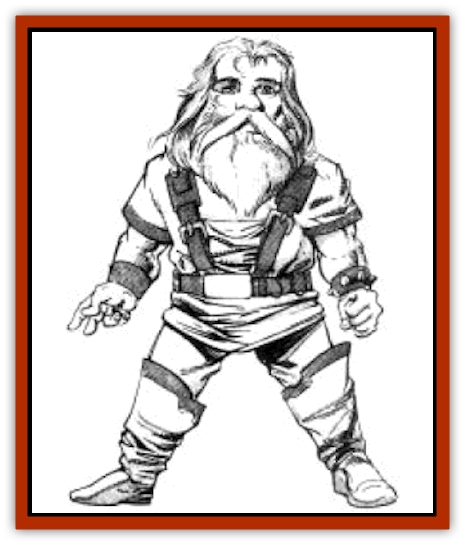

# Dwarf - Hill - Neidar

| Statistic | **Dwarf, Hill, Neidar** |
| --- | --- |
| **Activity Cycle:** | Any |
| **Alignment:** | Varies, but usually neutral good |
| **Armor Class:** | 6 (10) |
| **Climate/Terrain:** | Subtropical and temperate/Hills and forests |
| **Damage/Attack:** | 1-8 (weapon) |
| **Diet:** | Omnivore |
| **Frequency:** | Common |
| **Hit Dice:** | 1 |
| **Intelligence:** | Varies (3-18) |
| **Magic Resistance:** | See below |
| **Morale:** | Elite (13) |
| **Movement:** | 6 |
| **No. Appearing:** | 1 or clan of 10-100 members |
| **No. of Attacks:** | 1 |
| **Organization:** | Clan |
| **Size:** | M (4-5' tall) |
| **Special Attacks:** | See below |
| **Special Defenses:** | See below |
| **THAC0:** | 19 |
| **Treasure:** | M (&times;2); (G,Q (&times;20),R) |
| **XP Value:** | Varies |

Hill dwarves, also known as Neidar, are the most commonly encountered dwarven race on Krynn.

Neidar have deep tan to light brown skin, ruddy cheeks, and bright eyes. Their hair is brown, black, or gray, and the majority of adult males wear long bushy beards and moustaches. They favor earth toned clothing and knee-high boots.

Neidar tend to be rough and coarse. They are extremely loyal and honorable, and are capable of deep and lasting friendships. Neidar have low, rich voices and can sing quite well. They have an extreme aversion to traveling by water.

**Combat:** Neidar are reluctant combatants, preferring to let others do their fighting for them or, avoiding violent situations altogether. However, when drawn into a battle, Neidar fight with skill and courage. They usually wear studded leather armor and carry small shields. Battle axes and daggers are their preferred weapons.

**Habitat/Society:** Neidar clans form small villages that consist of modest houses of thatch, wood, and stone. A typical clan includes 10d10 members. About 40-50% are women and children. Of the adult males, about 80% are 1st-level fighters, 10% are 2nd- to 4th-level fighters, 5% are 5th-level or higher fighters, and the rest are rangers and thieves of various levels. Because of their dwarven roots they are excellent miners, metalsmiths, and woodworkers. The eldest male serves as clan leader, but most major decisions are made by consensus. Unmarried Neidar often set out on their own, returning to their original clan only occasionally.

The Neidar clan system predates the Cataclysm by hundreds of years and, true to tradition, different clans seldom associate with each other. This attitude has not only bred suspicion and a lack of cooperation among the clans, it has also hindered trade and economic development, keeping most clans in relative poverty.

Once part of the society of subterranean dwarves, the Neidar were cast from their homes in the wake of the Cataclysm that preceded the Age of Darkness. Forbidden to return to their former homes, the Neidar were forced to live permanently above ground. Neidar have been reasonably successful at integrating themselves into Krynn society and are as likely to be found in urban taverns as in their own modest villages.

**Ecology:** Neidar get along well with humans and [[Kender|kender]]. Some have established cordial relationships with [[Elf|elves]]. However, most other dwarven races shun the Neidar, particularly the [[Dwarf_Mountain_Hylar|mountain dwarves]]. Fond of animals, they keep kittens, sparrows, and ponies as pets. They produce few items of value, but sometimes they create metal tools and honey candies to sell in human towns. Neidar have voracious appetites. Favorite dishes include cornbread, mushroom soup, and roast [[Bird_Krynn|kingfisher]].

---
## Discovery & Documentation

**Source Publication:** MC4 Dragonlance Appendix (w/binder #2) (1989)
**Campaign Setting:** Dragonlance
**Author(s):** Rick Swan

### Other Creatures Found in This Source Book
   * [[Anemone_Giant_Sea|Anemone, Giant Sea]]
   * [[Bear_Ice|Bear, Ice]]
   * [[Beast_Undead|Beast, Undead]]
   * [[Bird_Krynn|Bird (Krynn)]]
   * [[Disir|Disir]]
   * [[Draconian_Aurak|Draconian, Aurak]]
   * [[Draconian_Baaz|Draconian, Baaz]]
   * [[Draconian_Bozak|Draconian, Bozak]]
   * [[Draconian_Kapak|Draconian, Kapak]]
   * [[Draconian_General_Information|Draconian, General Information]]
   * [[Draconian_Sivak|Draconian, Sivak]]
   * [[Draconian_Proto-_Traag|Draconian, Proto-, Traag]]
   * [[Dragon_Amphi|Dragon, Amphi]]
   * [[Dragon_Astral|Dragon, Astral]]
   * [[Dragon_Kodragon|Dragon, Kodragon]]
   * [[Dragon_Krynn_Othlorx_General_Information|Dragon (Krynn), Othlorx, General Information]]
   * [[Dragon_Krynn_General_Information|Dragon (Krynn), General Information]]
   * [[Dragon_Sea|Dragon, Sea]]
   * [[Dreamshadow|Dreamshadow]]
   * [[Dreamwraith|Dreamwraith]]
   * [[Dwarf_Daergar|Dwarf, Daergar]]
   * [[Dwarf_Mountain_Hylar|Dwarf, Mountain, Hylar]]
   * [[Dwarf_Theiwar|Dwarf, Theiwar]]
   * [[Dwarf_Zakhar|Dwarf, Zakhar]]
   * [[Elf_Half-|Elf, Half-]]
   * [[Elf_High_Qualinesti|Elf, High, Qualinesti]]
   * [[Elf_High_Silvanesti|Elf, High, Silvanesti]]
   * [[Elf_Sea_Dargonesti|Elf, Sea, Dargonesti]]
   * [[Elf_Sea_Dimernesti|Elf, Sea, Dimernesti]]
   * [[Elf_Wild_Kagonesti|Elf, Wild, Kagonesti]]
   * [[Eyewing|Eyewing]]
   * [[Fetch|Fetch]]
   * [[Fire_Minion|Fire Minion]]
   * [[Fireshadow|Fireshadow]]
   * [[Gnome_Tinker|Gnome, Tinker]]
   * [[Gurik_Cha'ahl|Gurik Cha'ahl]]
   * [[Haunt_Knight|Haunt, Knight]]
   * [[Horax|Horax]]
   * [[Human_Krynn|Human (Krynn)]]
   * [[Imp_Blood_Sea|Imp, Blood Sea]]
   * [[Kalothagh|Kalothagh]]
   * [[Kani_Doll|Kani Doll]]
   * [[Kender|Kender]]
   * [[Kyrie|Kyrie]]
   * [[Lizard_Man_Krynn|Lizard Man (Krynn)]]
   * [[Minotaur_Krynn|Minotaur, Krynn]]
   * [[Ogre_High|Ogre, High]]
   * [[Ogre_Krynn|Ogre (Krynn)]]
   * [[Phaethon|Phaethon]]
   * [[Saqualaminoi|Saqualaminoi]]
   * [[Shadowperson|Shadowperson]]
   * [[Shimmerweed|Shimmerweed]]
   * [[Skrit|Skrit]]
   * [[Spectral_Minion|Spectral Minion]]
   * [[Spider_Krynn|Spider (Krynn)]]
   * [[Stag|Stag]]
   * [[Tayling|Tayling]]
   * [[Thanoi|Thanoi]]
   * [[Tylor|Tylor]]
   * [[Wichtlin|Wichtlin]]
   * [[Wyndlass|Wyndlass]]
   * [[Yaggol|Yaggol]]
