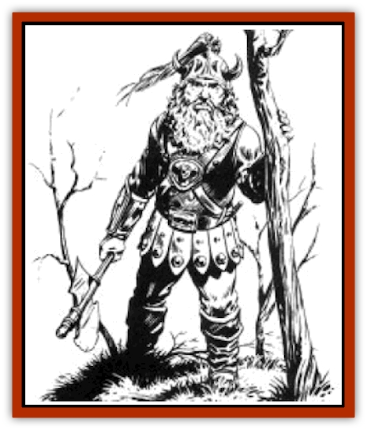

# Dwarf - Mountain - Hylar

| Statistic | **Dwarf, Mountain, Hylar** |
| --- | --- |
| **Activity Cycle:** | Any |
| **Alignment:** | Varies, but usually lawful neutral |
| **Armor Class:** | 4 (10) |
| **Climate/Terrain:** | Tropical, subtropical, and temperate/Subterranean |
| **Damage/Attack:** | 1-8 (weapon) |
| **Diet:** | Omnivore |
| **Frequency:** | Uncommon |
| **Hit Dice:** | 1 |
| **Intelligence:** | Varies (3-18) |
| **Magic Resistance:** | See below |
| **Morale:** | Elite (13) |
| **Movement:** | 4 (6) |
| **No. Appearing:** | 4-24 |
| **No. of Attacks:** | 1 |
| **Organization:** | Clan |
| **Size:** | M (4½' tall) |
| **Special Attacks:** | See below |
| **Special Defenses:** | See below |
| **THAC0:** | 19 |
| **Treasure:** | M (&times;5),Q; (R (&times;20),G) |
| **XP Value:** | Varies |

Mountain dwarves are the oldest of the dwarven races. The best known and most revered of mountain dwarves are the Hylar. Hylar have light brown skin, ruddy cheeks, and dark brown, gray, or green eyes. Their hair is black, gray, brown, or white. They favor earth tones in their clothing.

**Combat:** The battlefield skill of the Hylar is legendary. When they encounter an intelligent opponent, Hylar prefer to parley before combat. Opponents who surrender with grace are treated with dignity.

Hylar wear chain mail and carry shields. Preferred weapons include hammers, spears, battle axes, and light crossbows.

**Habitat/Society:** Hylar live in fabulous underground cities beneath immense mountain ranges. The most famous of all dwarven kingdoms is Thorbardin, a 300-square-mile area in the Kharolis Mountains.

Mountain dwarves have little interest in the affairs of other races. In fact, most mountain dwarves have never seen a non-dwarf They are not interested in helping others unless they can be shown that the matter affects them directly.

A typical group of 100 Hylar includes 40 1st- to 2nd-level fighters, 15 3rd- to 4th-level fighters, ten 5th- to 8th-level fighters, five 8th-level or higher fighters, 25 0-level workers and children, and five paladins, priests, and thieves of various levels.

Two other dwarven races are closely associated with the Hylar and often live in the same cities. The Daewar, who are respected fighters and deter to the Hylar's leadership. The Klar are [[Dwarf_Hill_Neidar|hill dwarves]] who serve wealthy Hylar in menial roles.

Mountain dwarf leaders are called thanes. Each thane represents his folk in the Council of Thanes, an organization founded for the purpose of settling disputes and promoting common interests. Seats on the Council are held by representatives of the Hylar, [[Dwarf_Theiwar|Theiwar]], Daewar, [[Dwarf_Daergar|Daergar]], [[Dwarf_Hill_Neidar|Neidar]], Klar, and [[Dwarf_Gully|Aghar]]. The dwarves venerate their dead and consider the Kingdom of the Dead to be represented on the Council. The High King is chosen by acclamation of the Council and must be ordained by the citizens. Most of the great dwarven kings have been Hylar.

**Ecology:** Tension persists between the Hylar and other dwarven races. They have reasonably good relations with the Qualinesti elves. Hylar enjoy roasted meats, boiled vegetables, and strong beer. They rarely trade with other races.

---
## Discovery & Documentation

**Source Publication:** MC4 Dragonlance Appendix (w/binder #2) (1989)
**Campaign Setting:** Dragonlance
**Author(s):** Rick Swan

### Other Creatures Found in This Source Book
   * [[Anemone_Giant_Sea|Anemone, Giant Sea]]
   * [[Bear_Ice|Bear, Ice]]
   * [[Beast_Undead|Beast, Undead]]
   * [[Bird_Krynn|Bird (Krynn)]]
   * [[Disir|Disir]]
   * [[Draconian_Aurak|Draconian, Aurak]]
   * [[Draconian_Baaz|Draconian, Baaz]]
   * [[Draconian_Bozak|Draconian, Bozak]]
   * [[Draconian_Kapak|Draconian, Kapak]]
   * [[Draconian_General_Information|Draconian, General Information]]
   * [[Draconian_Sivak|Draconian, Sivak]]
   * [[Draconian_Proto-_Traag|Draconian, Proto-, Traag]]
   * [[Dragon_Amphi|Dragon, Amphi]]
   * [[Dragon_Astral|Dragon, Astral]]
   * [[Dragon_Kodragon|Dragon, Kodragon]]
   * [[Dragon_Krynn_Othlorx_General_Information|Dragon (Krynn), Othlorx, General Information]]
   * [[Dragon_Krynn_General_Information|Dragon (Krynn), General Information]]
   * [[Dragon_Sea|Dragon, Sea]]
   * [[Dreamshadow|Dreamshadow]]
   * [[Dreamwraith|Dreamwraith]]
   * [[Dwarf_Daergar|Dwarf, Daergar]]
   * [[Dwarf_Hill_Neidar|Dwarf, Hill, Neidar]]
   * [[Dwarf_Theiwar|Dwarf, Theiwar]]
   * [[Dwarf_Zakhar|Dwarf, Zakhar]]
   * [[Elf_Half-|Elf, Half-]]
   * [[Elf_High_Qualinesti|Elf, High, Qualinesti]]
   * [[Elf_High_Silvanesti|Elf, High, Silvanesti]]
   * [[Elf_Sea_Dargonesti|Elf, Sea, Dargonesti]]
   * [[Elf_Sea_Dimernesti|Elf, Sea, Dimernesti]]
   * [[Elf_Wild_Kagonesti|Elf, Wild, Kagonesti]]
   * [[Eyewing|Eyewing]]
   * [[Fetch|Fetch]]
   * [[Fire_Minion|Fire Minion]]
   * [[Fireshadow|Fireshadow]]
   * [[Gnome_Tinker|Gnome, Tinker]]
   * [[Gurik_Cha'ahl|Gurik Cha'ahl]]
   * [[Haunt_Knight|Haunt, Knight]]
   * [[Horax|Horax]]
   * [[Human_Krynn|Human (Krynn)]]
   * [[Imp_Blood_Sea|Imp, Blood Sea]]
   * [[Kalothagh|Kalothagh]]
   * [[Kani_Doll|Kani Doll]]
   * [[Kender|Kender]]
   * [[Kyrie|Kyrie]]
   * [[Lizard_Man_Krynn|Lizard Man (Krynn)]]
   * [[Minotaur_Krynn|Minotaur, Krynn]]
   * [[Ogre_High|Ogre, High]]
   * [[Ogre_Krynn|Ogre (Krynn)]]
   * [[Phaethon|Phaethon]]
   * [[Saqualaminoi|Saqualaminoi]]
   * [[Shadowperson|Shadowperson]]
   * [[Shimmerweed|Shimmerweed]]
   * [[Skrit|Skrit]]
   * [[Spectral_Minion|Spectral Minion]]
   * [[Spider_Krynn|Spider (Krynn)]]
   * [[Stag|Stag]]
   * [[Tayling|Tayling]]
   * [[Thanoi|Thanoi]]
   * [[Tylor|Tylor]]
   * [[Wichtlin|Wichtlin]]
   * [[Wyndlass|Wyndlass]]
   * [[Yaggol|Yaggol]]
