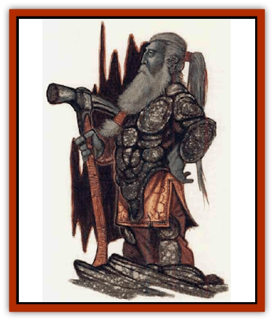

# Dwarf - Urdunnir

| Statistic | **Dwarf, Urdunnir** |
| --- | --- |
| **Activity Cycle:** | Any |
| **Alignment:** | Neutral |
| **Armor Class:** | 0 |
| **Climate/Terrain:** | Underground |
| **Damage/Attack:** | 1d4 |
| **Diet:** | Special |
| **Frequency:** | Rare |
| **Hit Dice:** | 2 |
| **Intelligence:** | Very (11-12) |
| **Magic Resistance:** | 25% |
| **Morale:** | Elite (13-14) |
| **Movement:** | 6, Br 6 (<i>stone walk</i>) |
| **No. Appearing:** | 10-100 |
| **No. of Attacks:** | 2 |
| **Organization:** | Clan |
| **Size:** | M (4½' and taller) |
| **Special Attacks:** | See below |
| **Special Defenses:** | See below |
| **THAC0:** | 19 |
| **Treasure:** | M,Q (H,R&times;10) |
| **XP Value:** | 975 / Leader: 2,000 |

A long-forgotten offshoot of the dwarves, *urdunnir* means "Orecutter" in the urdunnir language, which is closely related to dwarvish (a speaker of one language can understand about 75% of the other). Dwarven legends state that urdunnirin are specially blessed by the dwarven deity Dumathoin.

Urdunnirin look much like [[Dwarf|mountain dwarves]]. Their skin tends to be light gray, while their long beards range from light gray to dark gray. Their eyes are silver. Urdunnirin take very good care of their facial hair, but otherwise pay little attention to grooming (females do not have facial hair).

Urdunnirin usually wear a tight-fitting one-piece garment composed of stone and/or metal. The urdunnirin use their innate abilities to make these garment flexible. Only the leaders of the urdunnirin wear garments made completely of metal.

**Combat:** Urdunnirin rarely attack other creatures, though they will defend their homes, families, and treasure hoards to the best of their abilities. Each urdunnir has the ability *stone walk*, to pass into and through stone and earth as if it were air. This ability adapts well to ambush tactics and opponents have a -3 penalty to their surprise rolls.

Urdunnirin are able to move objects through stone with them. Up to twice the udunnir's body weight can be transported in this manner. For the urdunnir to use this ability offensively, the urdunnir must make a successful attack roll to grab the subject, who is then allowed a saving throw vs. petrification to break free. If the saving throw fails, the urdunnir can transport all or part of the victim's body into the earth or stone, and then release him. The victim's body then binds with the earth, resulting in death. Only a *wish* will reverse such a death. A *phase door* spell cast on a stone walking urdunnir will instantly kill the dwarf.

Urdunnir have an innate stone shape ability: Once per round, they can affect up to eight cubic feet of stone as per the spell. Casting time is 1, and no spell components are required. Urdunnir lairs often have several ingenious traps designed to take advantage of this power.

An urdunnir who concentrates for a full round can *shape metal* in the next round. Up to five cubic feet of metal can be affected per use. If an urdunnir uses this power on metal carried or worn by another individual, an attack roll is required. An urdunnir prepared for an attack by a metal weapon can shape it as it hits, taking only half damage and rendering the weapon useless.

Magical weapons and armor are allowed a saving throw vs. spell against this power at their user's level, and adjusted by the item's bnnus. If all else fails, urdunnir attack with their fists, inflicting 1d4 points of damage per hit. They never use weapons.

An urdunnir leader, an alird ("gold lord") will be encountered with 20 or mnw normal urdunnirin. Alirds wear sllver or gold garments and have 3 Hit Dice and Armor Class -2. They do not need to concentrate for a full round to *shape metal*, but can do so immediately.

Urdunnirin are resistant to poisons, gaining a +4 to saving throws against such attacks.

**Habitat/Society:** Urdunnirin use their abilities to collect ore and gems from the earth, and to shape those riches. Their lairs are decorated with many statues and fantastic works of gold and other precious metals.

Like dwarves, urdunnirin have a clan-based society, wlth each clan specializing in finding and shaping a certain substance. Known clans include Marble, Gold, and Ruby.

**Ecology:** Urdunnirin do not live on normal foods, eating gems instead. Dumathoin provides each settlement of urdunnirin with a self-replenishing supply of precious stones solely for eating. The urdunnirin guard these sources to the death.

Urdunnirin are great enemies of the [[Xorn|xorn]], which often attack them. They will kill xorn on sight.

 

*When the dwarven race was young, the god Dumathoin grew angry that they burrowed into his mountains, taking the riches he had hidden in the earth. Though he soon began to take pleasure in the creations they made, for a time he was very upset. During this time, he created the urdunnir race from certain mountain dwarves, and hid them far away from the other dwarves. The urdunnirin, with their ability to pass through stone, could hunt for ores and gems without destroying the mountains. Dwarven legends still tell of this lost race, which they call sonsannan, or "stonefriend".*

---
## Discovery & Documentation

**Source Publication:** MC14 Fiend Folio Appendix (1992)
**Campaign Setting:** Fiends Folio
**Author(s):** Don Bingle, John Terra, Wes Nicholson, Tim Beach, Steve Hardinger, Kris Hardinger, Rob Nicholls, Greg Swedberg, Al Boyce, Vince Garcia, Norm Ritchie

### Other Creatures Found in This Source Book
   * [[Aballin|Aballin]]
   * [[Achaierai|Achaierai]]
   * [[Adherer|Adherer]]
   * [[Algoid|Algoid]]
   * [[Al-Mi'raj|Al-Mi'raj]]
   * [[Apparition|Apparition]]
   * [[Caterwaul|Caterwaul]]
   * [[Coffer_Corpse|Coffer Corpse]]
   * [[Crabman|Crabman]]
   * [[Dark_Creeper|Dark Creeper]]
   * [[Dark_Stalker|Dark Stalker]]
   * [[Darter|Darter]]
   * [[Denzelian|Denzelian]]
   * [[Dune_Stalker|Dune Stalker]]
   * [[Falcon_Fire|Falcon, Fire]]
   * [[Faux_Faerie|Faux Faerie]]
   * [[Flawder|Flawder]]
   * [[Fyrefly|Fyrefly]]
   * [[Gambado|Gambado]]
   * [[Garbug|Garbug]]
   * [[Giant_Fhoimorien|Giant, Fhoimorien]]
   * [[Gibberling|Gibberling]]
   * [[Gorbel|Gorbel]]
   * [[Grimlock|Grimlock]]
   * [[Hellcat|Hellcat]]
   * [[Ice_Lizard|Ice Lizard]]
   * [[Iron_Cobra|Iron Cobra]]
   * [[Khargra|Khargra]]
   * [[Mantari|Mantari]]
   * [[Penanggalan|Penanggalan]]
   * [[Pernicon|Pernicon]]
   * [[Phantom_Stalker|Phantom Stalker]]
   * [[Retriever|Retriever]]
   * [[Ruve|Ruve]]
   * [[Scathe|Scathe]]
   * [[Sheet_Ghoul_Sheet_Phantom|Sheet Ghoul/Sheet Phantom]]
   * [[Shocker|Shocker]]
   * [[Spanner|Spanner]]
   * [[Stwinger|Stwinger]]
   * [[Sussurus|Sussurus]]
   * [[Symbiotic_Jelly|Symbiotic Jelly]]
   * [[Terithran|Terithran]]
   * [[Thunder_Children|Thunder Children]]
   * [[Troll_Ice|Troll, Ice]]
   * [[Tween|Tween]]
   * [[Umpleby|Umpleby]]
   * [[Volt|Volt]]
   * [[Xill|Xill]]
   * [[Xvart|Xvart]]
   * [[Zygraat|Zygraat]]
