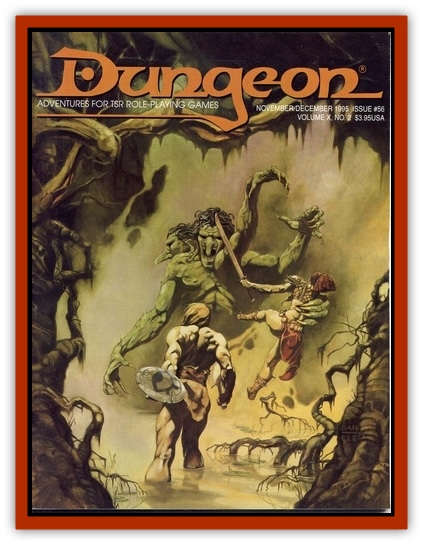

# Dwarf - Utuchekulu

| Statistic | **Dwarf, Utuchekulu** |
| --- | --- |
| **Activity Cycle:** | Any |
| **Alignment:** | Lawful evil |
| **Armor Class:** | By armor type |
| **Climate/Terrain:** | Tropical jungle |
| **Damage/Attack:** | By weapon type |
| **Diet:** | Omnivore |
| **Frequency:** | Rare |
| **Hit Dice:** | 1-6 hp or by class and level |
| **Intelligence:** | Low to high (3-18) |
| **Magic Resistance:** | See below |
| **Morale:** | Champion (15-16) |
| **Movement:** | 9 |
| **No. Appearing:** | 3-30 |
| **No. of Attacks:** | 1 or more |
| **Organization:** | Tribe |
| **Size:** | S (3' tall) |
| **Special Attacks:** | Tooth, poison, traps |
| **Special Defenses:** | Resistance to poison |
| **THAC0:** | By class and level |
| **Treasure:** | M (individual), B (lair) |
| **XP Value:** | 35 or more |

The utuchekulu are an offshoot breed of [[Dwarf|dwarves]] that live in the jungles of the Dark Continent. They have ebony skin, black hair, and dark eyes. Their most distinguishing feature is the single blood red fang that protrudes from one side of their mouth. The utuchekulu have been sundered from their northern kin since primeval times, even longer than the [[Dwarf_Duergar|duergar]], evolving separately in the jungle. Sometime in their past, the utuchekulu mixed with something foul and unnatural. Today, they are an evil, man-eating people.

Although they are dwarfish in ancestry, the utuchekulu have little resemblance to their northern kin. Utuchekulu do not live underground, and they have thin and scanty beards, often shaved. However, they do retain their dwarfish abilities to working with metal and stone and have a dwarfs resistance to poison and magic (PBH/21).

**Combat:** Where northern dwarves wield axes and hammers, the utuchekulu carry spears, short bows, knives, clubs, and machetes. They have a special method of preparing rhino and hippo hides into very hard and durable leather. Armor made from this has a base AC of 7. If the utuchekulu has surprise against an opponent, he can leap up to 5' and attack with the fang. With surprise, the fang does 2-12 damage; without surprise, the fang causes only 1�6 damage. The utuchekulu use hunting poison on their arrowheads (see below). The utuchekulu excel at building blinds for ambushes. When attacking from an ambush, the utuchekulu gain a -2 bonus on the surprise roll. They are also known to set numerous pits and snares around their lairs.

**Habitat/Society:** Like other dwarves, the utuchekuiu excel at working stone. But instead of digging underground, they prefer to occupy abandoned stone ruins (there are many on the Dark Continent) and rebuild them. Every clan has two or three smiths to make tools and weapons of steel.

The utuchekulu live in tribal bands, usually ruled by the strongest fighter. Priests are respected advisors, but they do not rule. The bulk of the men are warriors; hunters, champions, defenders. A village's population will be 2/3 women and children, 1/3 adult men.

The utuchekulu survive mainly by hunting game and humans. Women and children forage for small game, eggs, grubs, and fish. Utuchekulu are zealous man-eaters and hunt humans as game.

Utuchekulu may be fighters, thieves, clerics, fighter/thieves, or fighter/clerics. They have the same level limits as normal dwarves.

**Ecology:** Utuchekulu are omnivores, eating much the same food as humans, except for their man-eating habits. While northerners will kill them as foes, natives of the Dark Continent have superstitious fears of their spiritual powers, and avoid them. Of course, any native tribe attacked outright will defend itself, but natives do not go looking for the Utuchekulu.

**Hunting Poison**

The [[Human_Pygmy|pygmies]] have developed a special poison made from certain beetle larvae, used to bring down large game. The poison is placed only on arrowheads. Anyone hit by a poisoned arrow must save vs. poison at -2. Failure means that the victim is slowed (aa the spell) one round later, and paralyzed two rounds after being hit. The paralyzation lasts 1-4 turns. One hour after the victim has been poisoned, the poison completely breaks down, and dead game is safe to eat. A successful save means that the victim suffers no ill effects.

The Utuchekulu also use hunting poison, but a much more potent version. Again, it is used only on arrowheads. Anyone hit must save vs. poison at -2. Failure means that the victim is slowed one round after boing hit, paralyzed the second round, and dead the third round. Even a successful save causes the victim to be slowed one round after being hit and paralyzed for the next three rounds. The poison breaks down completely two hours after the initial poisoning.

---
## Discovery & Documentation

**Source Publication:** Dungeon #56 (1995)
**Campaign Setting:** Dungeon Magazine
**Author(s):**
