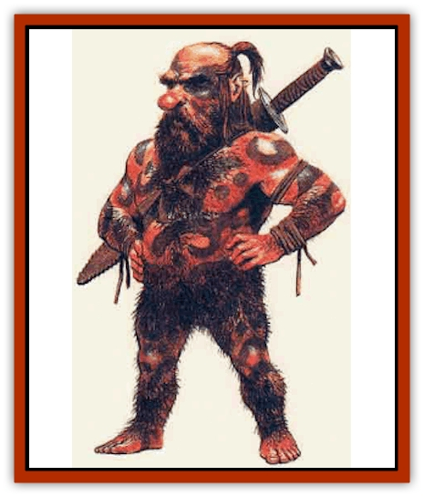

# Dwarf - Wild

| Statistic | **Dwarf, Wild** |
| --- | --- |
| **Activity Cycle:** | Any |
| **Alignment:** | Lawful neutral |
| **Armor Class:** | 8 (10) |
| **Climate/Terrain:** | Subterranean, tropical jungle |
| **Damage/Attack:** | By weapon type |
| **Diet:** | Omnivore |
| **Frequency:** | Rare |
| **Hit Dice:** | 1+1 |
| **Intelligence:** | Very (11-12) |
| **Magic Resistance:** | See below |
| **Morale:** | Elite (13-14) |
| **Movement:** | 8 |
| **No. Appearing:** | 20-200 |
| **No. of Attacks:** | 1 |
| **Organization:** | Hunting band |
| **Size:** | S (3') |
| **Special Attacks:** | See below |
| **Special Defenses:** | See below |
| **THAC0:** | 20 |
| **Treasure:** | K,L,M,Q or V |
| **XP Value:** | 270 |

Wild [[Dwarf|Dwarves]] are a reclusive race of dwarves. Also known as "Jungle Dwarves", they are found only in remote, hot jungle areas in Chult and the nearby lands to the east.

Wild Dwarves are dark-skinned, short, and stout. Their bodies are covered with tattoos and grease which serves to keep off insects, and also makes them hard to hold (reflected in their armor class). They wear nothing except their long, woven hair which serves as adequate clothing, which they plaster with mud into crude armor when going to war.

Wild Dwarves forge weapons and tools from mined metals. In this and in infravision, "underground skills", and lifespan, they are like other dwarves. Sturdy (+1 to Con scores) and muscular, they distrust intruders and will avoid confrontations unless they are attacked or provoked. Wild Dwarves speak their own clicking, trilling tongue, a smattering of the common tongue, and the language spoken by most Wanderer dwarves. They use and understand Dethek runes.

**Combat:** Wild Dwarves are armed with blowguns that can fire 2 darts per round (ranges 1/3/5). Each dwarf carries 1d10 +6 barbed darts which do 1d3 (1d2 vs. large creatures) damage and have a sleep-inducing venom - save vs. poison or be slowed for 2 rounds, then fall asleep for 2-5 rounds; slapping does not awaken. Each dart can be used twice before venom is exhausted. All adult Wild Dwarves are specialists with their darts; at short range they gain an attack bonus of +2, whether using a blowgun or tossing it. They are immune to the effects of their venom. Each Wild Dwarf also carries a spear (1d6 damage) and a spiked throwing club (1d6) or hand axe (1d6).

Wild Dwarves like to use pits, snares, deadfalls, and other traps to defend their home caves. All of these are tailored from the jungle surroundings and are very effective, even against victims of high levels, especially those uninitiated to jungle combat. They prefer to attack in large groups, firing darts from behind cover until an angered target charges them, whereupon they attack from all sides.

Wild Dwarves have the same poison saving throw bonuses and magic-handling abilities as a normal dwarf. Centuries of battling poisonous [[Snake|snakes]] have given them a natural poison/venom resistance; they make all poison saving throws (against poisons and poisonous vapors) at an additional +1. They are less likely to suffer from debilitating disease or parasite effects than those who aren't jungle dwellers (DM must adjudicate), and receive a bonus of -1 per die damage on insect swarm and heat-related attacks, even if magically induced.

**Habitat/Society:** Wild Dwarves dwell in jungle trees and caverns, calling themselves "dur Authalar" (the People). They are polygamous and do not form tribes or clans, but live in hunting bands with ever-shifting membership. Each group carries a large water-bladder and a "talking drum", to call other bands to a �big kill' or �great danger'.

A typical hunting band knows of three or four watering-holes, a bathing-place, a shaded eating area with a firepit and several lookouts, a sleeping-cavern and several sleeping-trees hung with nets of interwoven vines. They also know of at least five "refuge-caverns" that run deep into the earth.

Wild Dwarves think of themselves as one big family, "dur Authalar". They follow their "talkers" (planners and tacticians, of both sexes, all ages, and all levels), "war leaders" (treat as 5th to 7th level warriors), "bloods" (experienced warriors of 2nd through 4th level), and "priests" (clerics of all levels up to and including 10th). All Wild Dwarves worship Thard Harr, but rarely make offerings to other dwarven deities.

Wild Dwarves wear carved bone earrings, bracelets, and necklaces for adornment, reserving mined metal only for use in weapon- and tool-making or barter.

**Ecology:** Wild Dwarves eat certain fruits, berries, roots, leaves, and saps, and all manner of insects, worms, jungle birds, reptiles, and animals. Some have been known to eat humans, but they are not cannibals and do not usually eat intelligent beings. They consider most snakes delicacies, and make fermented fruit-wines in earthenware jugs.

Wild Dwarves are cross-fertile with all demi-human races, and with humans. They mistrust folk of other races, though, and rarely leave the confines of their hot, shady jungles willingly.

---
## Discovery & Documentation

**Source Publication:** Monstrous Compendium, 1995 Annual, Volume 2 (1995)
**Campaign Setting:** Advanced Dungeons & Dragons 2nd Edition
**Author(s):** Jon Pickens

### Other Creatures Found in This Source Book
   * [[Aboleth_Savant|Aboleth, Savant]]
   * [[Addazahr|Addazahr]]
   * [[Amiq_Rasol|Amiq Rasol]]
   * [[Arch-Shadow|Arch-Shadow]]
   * [[Automaton_Scaladar|Automaton, Scaladar]]
   * [[Automaton_Trobriand's|Automaton, Trobriand's]]
   * [[Bat_Sporebat|Bat, Sporebat]]
   * [[Beetle_Dragon|Beetle, Dragon]]
   * [[Bi-nou|Bi-nou]]
   * [[Boggle|Boggle]]
   * [[Brownie_Dobie|Brownie, Dobie]]
   * [[Brownie_Quickling|Brownie, Quickling]]
   * [[Cat_Crypt|Cat, Crypt]]
   * [[Cat_Great_Cath_Shee|Cat, Great, Cath Shee]]
   * [[Centaur-kin_Dorvesh|Centaur-kin, Dorvesh]]
   * [[Centaur-kin_Gnoat|Centaur-kin, Gnoat]]
   * [[Centaur-kin_Ha'pony|Centaur-kin, Ha'pony]]
   * [[Centaur-kin_Zebranaur|Centaur-kin, Zebranaur]]
   * [[Chronolily|Chronolily]]
   * [[Curst|Curst]]
   * [[Darktentacles|Darktentacles]]
   * [[Dinosaur_Aquatic|Dinosaur, Aquatic]]
   * [[Dinosaur_II|Dinosaur II]]
   * [[Dinosaur_III|Dinosaur III]]
   * [[Doppelganger_Greater|Doppelganger, Greater]]
   * [[Dragon_Brine|Dragon, Brine]]
   * [[Dragon_Half-|Dragon, Half-]]
   * [[Dragon-kin_Sea_Wyrm|Dragon-kin, Sea Wyrm]]
   * [[Ekimmu|Ekimmu]]
   * [[Elemental_Nature|Elemental, Nature]]
   * [[Elf_Winged|Elf, Winged]]
   * [[Fish_Great_Glacier|Fish (Great Glacier)]]
   * [[Fish_Subterranean|Fish, Subterranean]]
   * [[Fish_Toril|Fish (Toril)]]
   * [[Flareater|Flareater]]
   * [[Flumph|Flumph]]
   * [[Froghemoth|Froghemoth]]
   * [[Ghost_Casurua|Ghost, Casurua]]
   * [[Ghost_Ker|Ghost, Ker]]
   * [[Ghul|Ghul]]
   * [[Ghul-Kin|Ghul-Kin]]
   * [[Giant_Half-giant|Giant, Half-giant]]
   * [[Golem_Burning_Man|Golem, Burning Man]]
   * [[Golem_Phantom_Flyer|Golem, Phantom Flyer]]
   * [[Gulguthhydra|Gulguthhydra]]
   * [[Hakeashar|Hakeashar]]
   * [[Horse_Moon-|Horse, Moon-]]
   * [[Human_Dragonslayer|Human, Dragonslayer]]
   * [[Human_Vistana|Human, Vistana]]
   * [[Jellyfish_Giant|Jellyfish, Giant]]
   * [[Kalin|Kalin]]
   * [[Kholiathra|Kholiathra]]
   * [[Laerti|Laerti]]
   * [[Leucrotta_Greater|Leucrotta, Greater]]
   * [[Lich_Suel|Lich, Suel]]
   * [[Lurker_Shadow|Lurker, Shadow]]
   * [[Lycanthrope_Werepanther|Lycanthrope, Werepanther]]
   * [[Lycanthrope_Wereshark|Lycanthrope, Wereshark]]
   * [[Mammal_Herd_II|Mammal, Herd II]]
   * [[Marl|Marl]]
   * [[Meenlock|Meenlock]]
   * [[Mimic_Greater|Mimic, Greater]]
   * [[Mold_II|Mold II]]
   * [[Mummy_Creature|Mummy, Creature]]
   * [[Nyth|Nyth]]
   * [[Ooze_Slime_Jelly_Ghaunadan|Ooze/Slime/Jelly, Ghaunadan]]
   * [[Palimpsest|Palimpsest]]
   * [[Peltast|Peltast]]
   * [[Plant_Dangerous_II|Plant, Dangerous II]]
   * [[Pleistocene_Animal|Pleistocene Animal]]
   * [[Pudding_Subterranean|Pudding, Subterranean]]
   * [[Raggamoffyn|Raggamoffyn]]
   * [[Snake_Serpent|Snake, Serpent]]
   * [[Snake_Serpent_Vine|Snake, Serpent Vine]]
   * [[Sphinx_Draco-|Sphinx, Draco-]]
   * [[Sprite_Seelie_Faerie|Sprite, Seelie Faerie]]
   * [[Sprite_Unseelie_Faerie|Sprite, Unseelie Faerie]]
   * [[Squealer|Squealer]]
   * [[Turtle_Giant|Turtle, Giant]]
   * [[Umpleby|Umpleby]]
   * [[Vizier's_Turban|Vizier's Turban]]
   * [[Wall_Walker|Wall Walker]]
   * [[Webbird|Webbird]]
   * [[Yak-Man|Yak-Man]]
   * [[Zorbo|Zorbo]]
