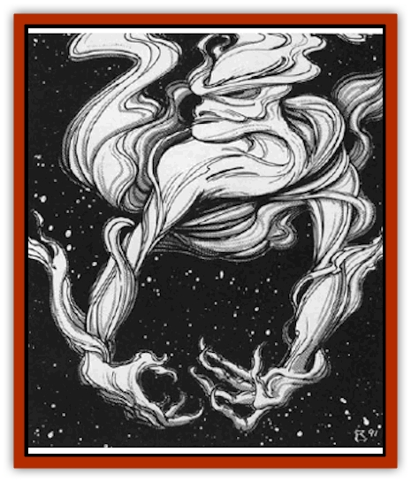

# Dweomerborn

| Statistic | **Dweomerborn** |
| --- | --- |
| **Activity Cycle:** | Any |
| **Alignment:** | Neutral evil |
| **Armor Class:** | -4 |
| **Climate/Terrain:** | Wildspace |
| **Damage/Attack:** | 1d12/1d12 |
| **Diet:** | Magic |
| **Frequency:** | Rare |
| **Hit Dice:** | 10 |
| **Intelligence:** | Very (12) |
| **Magic Resistance:** | Special |
| **Morale:** | Fanatic (17) |
| **Movement:** | 6+special |
| **No. Appearing:** | 1 |
| **No. of Attacks:** | 2 |
| **Organization:** | Solitary |
| **Size:** | L (8' tall) |
| **Special Attacks:** | Special |
| **Special Defenses:** | +2 or better weapon to hit |
| **THAC0:** | 11 |
| **Treasure:** | Nil |
| **XP Value:** | 9,000 |

Matter and energy are seldom annihilated. The magical energy used to propel spelljamming ships produces its own "exhaust" trail, invisible to the eye but detectable by *detect magic*. This energy sometimes forms into a sentient monster called a dweomerborn. These bizarre creatures wander the spacelanes of wildspace feeding on magical energy. They look especially for spelljamming ships.

Dweomerborn appear as warped, distorted humanoid phantoms, 8' tall, with long, delicate fingers. Each finger is tipped with a long talon-like fingernail. They cannot speak.

**Combat:** When a dweomerborn finds a spelljammer, it tries to "hitch a ride" by diving to the ship's stern and riding its exhaust trail. The dweomerborn can work its way up this exhaust, like a rope, to the stern of the ship. To do so, it must make a Dexterity check. Most dweomerborn have a Dexterity of 12 + 1d6.

Consider a ship's stream to be 60 + 6d20 feet in length. The dweomerborn clings to the end of the stream and begins working its way up. To an observer at the ship's stern, it appears that a small patch of fog is following the ship, closing with it at 60' per round. Once within arm's length of the ship, its claws grip the hull, and it climbs aboard.

The dweomerborn also uses its claws to defend itself if pressed, doing 1d12 damage per hand. When the dweomerborn uses its claws for combat, it lets go of the ship's deck.

All dweomerborn have the following innate spell like abilities, each usable seven times a day: *detect magic*, *identify*, *invisibility*, *know school*, and *gaseous form*, all cast at 10th level.

The dweomerborn drains spellcasters, magical items, and other sources of magic (except artifacts, relics, and helms). Magical items must save vs. electricity. Failure means the item loses its magic permanently. A dweomerborn's successful wrestling attack on a spellcaster inflicts normal wrestling damage, and the victim also loses one spell! (Choose the spell randomly, levels notwithstanding.)

Once a dweomerborn gets 20 spell levels of energy, it jumps off the ship, sated for the next 24 hours. Magical items supply spell levels equal to the item's XP value divided by 100 (minimum 1).

If a dweomerborn touches a *rod of cancellation* or *wand of negation*, the monster must save vs. death at -2 or die. A successful save means it takes 2d10 damage.

Only magical weapons of +2 or greater enchantment can harm the monster. If a weapon scores a hit, the weapon must save vs. electricity or become non-magical.

Due to its magical makeup, a dweomerborn is unaffected by most spells. In fact, it devours magic aimed at it, except illusion spells. The dweomerborn are affected normally by all illusions, including phantasms. Sages speculate that this happens because illusions are insubstantial and leave nothing behind. (Even a *divination* spell leaves something behind - the knowledge it imparts.)

**Habitat/Society:** Dweomerborn care nothing for treasure. They simply wander wildspace, singlehandedly seeking new sources of magic. Their bodies are living sponges, absorbing magical energy without conscious effort. They have no society or organization; each dweomerborn looks out for itself. They have no lairs, for they require no sleep.

**Ecology:** Dweomerborn have no function. If they do not eat the magical exhaust of spelljamming vessels, the trails simply dissipate in about a week's time with no effects. They cannot reproduce.

All spelljamming ships except those powered by orbi, forges, furnaces, and non-magical engines can supply the energy to bring a dweomerborn into existence. The chance of giving "birth" to a dweomerborn is 1% for every two levels of the spelljammer; roll the chance once per month of game time. The spellcaster is not solely responsible for the dweomerborn's creation; rather, the ship's magical exhaust provides the last bit necessary for a birth.

Some speculate that since most spellcasters are humanoid and since most spells are stored in human brains, there is a sort of "racial memory" that causes the dweomerborn to take humanoid form.

---
## Discovery & Documentation

**Source Publication:** MC9 Spelljammer Appendix II (1991)
**Campaign Setting:** Planescape
**Author(s):** Scott Davis, Newton Ewell, John Terra

### Other Creatures Found in This Source Book
   * [[Alchemy_Plant|Alchemy Plant]]
   * [[Allura|Allura]]
   * [[Aperusa|Aperusa]]
   * [[Autognome|Autognome]]
   * [[Bionoid|Bionoid]]
   * [[Bloodsac|Bloodsac]]
   * [[Buzzjewel|Buzzjewel]]
   * [[Constellate|Constellate]]
   * [[Contemplator|Contemplator]]
   * [[Dohwar|Dohwar]]
   * [[Dragon_Moon|Dragon, Moon]]
   * [[Dragon_Stellar|Dragon, Stellar]]
   * [[Dragon_Sun|Dragon, Sun]]
   * [[Dreamslayer|Dreamslayer]]
   * [[Fal|Fal]]
   * [[Feesu|Feesu]]
   * [[Fire_Bat|Fire Bat]]
   * [[Firebird|Firebird]]
   * [[Firelich|Firelich]]
   * [[Flowfiend|Flowfiend]]
   * [[Gadabout|Gadabout]]
   * [[Gammaroid|Gammaroid]]
   * [[Gonn|Gonn]]
   * [[Gossamer|Gossamer]]
   * [[Grav|Grav]]
   * [[Great_Dreamer|Great Dreamer]]
   * [[Greatswan|Greatswan]]
   * [[Grell_Colonial|Grell, Colonial]]
   * [[Gullion|Gullion]]
   * [[Insectare|Insectare]]
   * [[Lhee|Lhee]]
   * [[Mercurial_Slime|Mercurial Slime]]
   * [[Meteorspawn|Meteorspawn]]
   * [[Monitor|Monitor]]
   * [[Owl_Space|Owl, Space]]
   * [[Pristatic|Pristatic]]
   * [[Scro|Scro]]
   * [[Selkie_Star|Selkie, Star]]
   * [[Silatic|Silatic]]
   * [[Skullbird|Skullbird]]
   * [[Sleek|Sleek]]
   * [[Sluk|Sluk]]
   * [[Space_Swine|Space Swine]]
   * [[Sphinx_Astro-|Sphinx, Astro-]]
   * [[Spirit_Warrior|Spirit Warrior]]
   * [[Starfly_Plant|Starfly Plant]]
   * [[Stargazer|Stargazer]]
   * [[Undead_Stellar|Undead, Stellar]]
   * [[Witchlight_Marauder|Witchlight Marauder]]
   * [[Xixchil|Xixchil]]
   * [[Yitsan|Yitsan]]
   * [[Zurchin|Zurchin]]
