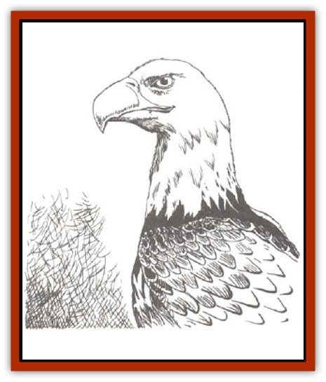

# Eagle

| Statistic | **Giant** | **Wild** |
| --- | --- | --- |
| **Activity Cycle:** | Day | Day |
| **Alignment:** | Neutral | Neutral |
| **Armor Class:** | 7 | 6 |
| **Climate/Terrain:** | Temperate to subarctic/ / High mountain cliffs | Subarctic to subtropical/ / Mountains and Hills |
| **Damage/Attack:** | 1-6/1-6/2-12 | 1-2/1-2/1-2 |
| **Diet:** | Carnivore | Carnivore, scavenger |
| **Frequency:** | Rare | Rare |
| **Hit Dice:** | 4 | 1+3 |
| **Intelligence:** | Average (8-10) | Animal (1) |
| **Magic Resistance:** | Nil | Nil |
| **Morale:** | Elite (13) | Average (9) |
| **Movement:** | 3, Fl 48 (D) | 1, Fl 30 (C) |
| **No. Appearing:** | 1-20 | 1 or 2/5-12 |
| **No. of Attacks:** | 3 | 3 |
| **Organization:** | Flock | Solitary or flock |
| **Size:** | L (20' wing spread) | S (6'-7'+ wing spread) |
| **Special Attacks:** | See below | See below |
| **Special Defenses:** | See below | See below |
| **THAC0:** | 15 | 18 |
| **Treasure:** | Q,C (magic only) | See below |
| **XP Value:** | 420 | 175 |

Eagles are majestic [[Bird|birds]] of prey, rarely used for hunting, but often sought after for their beauty and legendary courage.

Eagles are large birds, usually standing around three feet tall. with distinctive feathering on their legs. Their wing span is an impressive six to seven feet. Eagles are usually brown in color, ranging from the blackish brown of the golden eagle to the dark brown of the bald eagle. They always sport a set of razor-sharp talons and a beak, equally as sharp and turned down abruptly at its point. The eagle's cry is high and shrill.

**Combat:** An eagle uses its claws and beak for combat, each of which inflicts 1-2 points of damage. An eagle typically attacks from great heights, folding back its wings and letting gravity hurtle it toward its prey. If an eagle dives for more than 100', its diving speed is double its normal flying speed and the eagle is restricted to attacking with only its two sets of claws. However, these high-speed attacks gain a +2 bonus to the attack roll and score double damage.

Eagles also have exceptional eyesight. This superior vision affords eagles the advantage of rarely being surprised. During the day, an eagle can be surprised only 5% of the time. At night, normal rules for surprise apply.

**Habitat/Society:** High rocky cliffs and tall, broad trees are the favorite nesting spots for eagles. Once an eagle builds a nest, it will keep that home, adding it with each passing season, until the nest is destroyed or the eagle dies. There is always a 50% chance that 1d4 eggs are present in a nest. If eggs are not present, there is a 20% chance that 1d4 young eagles are present instead. There is always a 10% chance that the eagle is storing some small, shiny objects in the nest (like gold coins or gems).

Eagles are usually encountered alone or in pairs. Eagles mate for life and, since they nest in one spot each year, it is easy to identify places where eagles are normally present. On occasion, in an area of especially rich feeding, 1d8+4 eagles are encountered instead of the normal individual or pair. This fertile area can support more than one nest, so more eagles move into the area. This occurs only 5% of the time, however.

**Ecology:** Eagles are carnivores and generally hunt rodents, fish, and other small animals. Eagles have also been known to feed on the carrion of recently killed creatures, as well. Unless exceptionally hungry, an eagle will never attack a human or demihuman, though small creatures like [[Brownie|brownies]] have to be wary of a hunting eagle mistaking them for rabbits.

Eagles are not easy to train for hunting purposes (only 25% chance of success). Nevertheless, a thriving market for eaglets and eagle eggs means that each one captured brings a price of 60 to 100 gp. Eagle feathers and other eagle tokens are also valued highly by many adventurers, as they wrongly believe the eagle's courage to be transferred to them by possession of such items.

**Eagle, Giant**

  Giant eagles usually stand 10 feet tall and have wing spans of up to 20'. They share the coloration and fighting methods of their smaller cousins, inflicting much more damage, of course. However, if a giant eagle dives more than 50', it adds +4 to its attack roll and doubles its normal claw attack damage of 1d6/1d6. Giant eagles have their own language, but they also communicate through a form of limited telepathy. Giant eagles also have exceptional eyesight and cannot be surprised except at night or in their lair, and then only 10% of the time.

Giant eagles build their nests only in high mountain passes, where they have room to fly undisturbed. They are far more social than wild eagles, and up to 20 have been discovered nesting in the same area. One nest will be found for each pair of giant eagles. There is a 50% chance that 1d4 eggs are present in a nest, or a 25% chance of 1d4 young. If there are young or eggs in the nest, the giant eagle will attack any creature within 50' of the nest. Eagles are always suspicious of any creature coming near a nest, whether eaglets are present or not, as this is where their treasure is to be found.

Some individual [[Dwarf|dwarves]] and [[Elf|elves]] - and sometims even groups of dwarves and elves - are considered friends by giant eagles. Members of the two races are considered less of a threat than humans. Giant eagles can be trained, and their eggs sell for 500 to 800 gp each on the open market.

---
## Discovery & Documentation

**Source Publication:** MC2 Volume II (1993)
**Campaign Setting:** Advanced Dungeons & Dragons 2nd Edition
**Author(s):** Jay Batista, Scott Bennie, Grant Boucher, William W. Connors, Steve Gilbert, Heike Kubasch, James Lowder, David Edward Martin, Bruce Nesmith, Jean Rabe, Rick Swan, John J. Terra, Gary L. Thomas

### Other Creatures Found in This Source Book
   * [[Ant|Ant]]
   * [[Ant_Lion_Giant|Ant Lion, Giant]]
   * [[Ape_Carnivorous|Ape, Carnivorous]]
   * [[Baboon|Baboon]]
   * [[Badger|Badger]]
   * [[Barracuda|Barracuda]]
   * [[Beetle_Giant|Beetle, Giant]]
   * [[Bulette|Bulette]]
   * [[Bullywug|Bullywug]]
   * [[Dwarf_Duergar|Dwarf, Duergar]]
   * [[Dwarf_Gully|Dwarf, Gully]]
   * [[Eel|Eel]]
   * [[Elemental_Air_Kin|Elemental, Air Kin]]
   * [[Elemental_Water_Kin|Elemental, Water Kin]]
   * [[Elemental_Water_Kin_Water_Weird|Elemental, Water Kin, Water Weird]]
   * [[Firestar|Firestar]]
   * [[Firetail|Firetail]]
   * [[Fish_Giant|Fish, Giant]]
   * [[Frog|Frog]]
   * [[Gorgon|Gorgon]]
   * [[Hawk|Hawk]]
   * [[Heucuva|Heucuva]]
   * [[Hippocampus|Hippocampus]]
   * [[Hippogriff|Hippogriff]]
   * [[Kelpie|Kelpie]]
   * [[Kenku|Kenku]]
   * [[Killmoulis|Killmoulis]]
   * [[Kuo-Toa|Kuo-Toa]]
   * [[Lamia|Lamia]]
   * [[Lammasu|Lammasu]]
   * [[Lamprey|Lamprey]]
   * [[Leech|Leech]]
   * [[Leprechaun|Leprechaun]]
   * [[Leucrotta|Leucrotta]]
   * [[Locathah|Locathah]]
   * [[Lycanthrope_Wereboar|Lycanthrope, Wereboar]]
   * [[Lycanthrope_Werefox|Lycanthrope, Werefox]]
   * [[Mammal_Minimal|Mammal, Minimal]]
   * [[Mammal_Small|Mammal, Small]]
   * [[Mimic|Mimic]]
   * [[Morkoth|Morkoth]]
   * [[Muckdweller|Muckdweller]]
   * [[Myconid|Myconid]]
   * [[Naga|Naga]]
   * [[Obliviax|Obliviax]]
   * [[Octopus_Giant|Octopus, Giant]]
   * [[Otyugh|Otyugh]]
   * [[Piranha|Piranha]]
   * [[Plant_Dangerous_I|Plant, Dangerous I]]
   * [[Plant_Intelligent|Plant, Intelligent]]
   * [[Poltergeist|Poltergeist]]
   * [[Porcupine|Porcupine]]
   * [[Rat_Osquip|Rat, Osquip]]
   * [[Roc|Roc]]
   * [[Roper|Roper]]
   * [[Rot_Grub|Rot Grub]]
   * [[Rust_Monster|Rust Monster]]
   * [[Sahuagin|Sahuagin]]
   * [[Sea_Lion|Sea Lion]]
   * [[Sea_Horse_Giant|Sea Horse, Giant]]
   * [[Shambling_Mound|Shambling Mound]]
   * [[Shark|Shark]]
   * [[Sphinx|Sphinx]]
   * [[Squid_Giant|Squid, Giant]]
   * [[Stirge|Stirge]]
   * [[Swanmay|Swanmay]]
   * [[Tarrasque|Tarrasque]]
   * [[Tasloi|Tasloi]]
   * [[Triton|Triton]]
   * [[Troglodyte|Troglodyte]]
   * [[Urchin|Urchin]]
   * [[Urd|Urd]]
   * [[Weasel|Weasel]]
   * [[Wolverine|Wolverine]]
   * [[Yellow_Musk_Creeper|Yellow Musk Creeper]]
