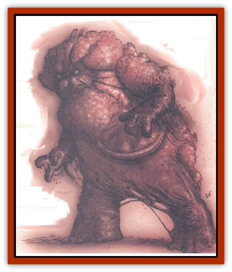

# Eater of Knowledge

| Statistic | **Eater of Knowledge** |
| --- | --- |
| **Activity Cycle:** | Night |
| **Alignment:** | Neutral evil |
| **Armor Class:** | 1 |
| **Climate/Terrain:** | Outlands |
| **Damage/Attack:** | 3d4/3d4 |
| **Diet:** | Special |
| **Frequency:** | Very rare |
| **Hit Dice:** | 10 |
| **Intelligence:** | Genius (17-18) |
| **Magic Resistance:** | 25% |
| **Morale:** | Elite (13-14) |
| **Movement:** | 6 |
| **No. Appearing:** | 1 |
| **No. of Attacks:** | 2 |
| **Organization:** | Solitary |
| **Size:** | L (9' tall) |
| **Special Attacks:** | Magical powers, stolen powers |
| **Special Defenses:** | Magical powers, stolen powers: immune to mental attacks and mind-affecting powers |
| **THAC0:** | 11 |
| **Treasure:** | R&times;3,U |
| **XP Value:** | 13,000 |

**Psionics Summary**

| Level | Dis/Sci/Dev | Attack/Defense | Score | PSPs |
| --- | --- | --- | --- | --- |
| 10 | 3/7/14 | All/All | 16 | 210 |

**Psychokinesis -** *Sciences:* disintegrate, project force, telekinesis; *Devotions:* animate object, control body, control winds, inertial barrier, molecular agitation, soften.

**Psychoportation -** *Science:* probability travel; *Devotions:* astral projection, dimensional door.

**Telepathy -** *Sciences:* domination, mind link, probe; *Devotions:* contact, ESP, inflict pain, invincible foes, invisibility, synaptic static.

One of the powers iesiding in the Land is Ilsensine, the [[Mind_Flayer|illithid]] god-brain. Ilsensine doesn't leave its Caverns of Thought, preferring to watch and wait from its immobile form in the center of the Caverns, but it does have agents it can send into the Outlands on its errands. These creatures are called eaters of knowledge.

The eaters are charged with a variety of tasks, but one of their principal missions is to add to Ilsensine's knowledge by venturing into realms the god-brain cannot perceive and recording their observations. An eater of knowledge does this by devouring the brains of creatures it comes across. The memories and experiences of its victims become its own as it digests their brains. In addition to their role as knowledge-seekers, eaters of knowledge serve Ilsensine as instruments of its vengeance against those that have defied or displeased it; it may even loan an eater to another power in payment for some service or other.

An eater of knowledge is a hideous thing. It resembles a humanoid heap of leathery hide and exposed ganglia, with naked brain matter oozing from openings in its distended skull. A reek of rot and decay surrounds it. Eaters are slow, shambling creatures that move with ponderous, awkward steps. They're speechless, but occasionally moan or gurgle when agitated. Despite their repulsive, clumsy appearance, eaters of knowledge are exkemely intelligent and remorseless beings with an array of dangerous powers.

**Combat:** Eaters of knowledge appear awkward and soft-skinned, but their soft, bulbous bodies conceal sinews of iron, and they can move with surprising speed. The eater can strike powerful blows with its crude fists and can easily stand toe-to-toe against a skilled, armored warrior. If the eater scores a hit against the same man-size or smaller opponent with both its attacks, it can seize that opponent, hold it still (no movement or attacks), and attempt to ingest the victim's brain. The trapped victim can attempt an open doors roll once per round to wrench free of the eater's grasp.

To ingest a victim's brain, the eater brings its exposed cerebral matter in contact with the victim's flesh. This requires a normal attack roll, but a pinned victim doesn't receive any Dexterity bonuses to his AC. If the eater scores a hit, tiny tendrils of nerves bore into the victim's flesh and begin to take control of the victim's nervous system, tunneling toward the brain. This agonizing process causes 1d6+6 points of damage and permanently destroys 1 point of the victim's Intelligence, Wisdom, and Dexterity scores each round it continues, unless the victim succeeds in a saving throw versus death magic.

After 1d4 rounds of boring, the eater's nerve tendrils are in place to begin extracting the victim's brain. Tiny chunks of brain matter are torn away by the tendrils and drawn back into the eater's own gray matter. This kills the victim in 1d3 rounds, reducing each of the victim's ability scores by 1d6 points for each round the extraction continues. There is no saving throw.

Normally, an eater of knowledge won't release its victim until it has completely consumed the brain. The damage and loss of ability scores stop if the victim is pulled free or the eater's forced to let go. If the victim's friends help him in his attempt to pull away, he gains a +4 bonus on his chance to escape the eater's grasp. The eater can he forced to let go by being killed or reduced to 10 hp or fewer; the creature will flee rather than die. A single attack or spell that inflicts at least 20 hp of damage in 1 round also forces the eater to let go.

While the eater of knowledge's special abilities make it an exceptionally dangerous opponent in hand-to-hand combat, this is not its preferred method of fighting. The monster relies on its mental powers and the stolen powers of those it has fed on to lure lone victims away from their companions, where it can feed uninterrupted. A typical eater may have one or more of the special abilities noted below:

| d10 Roll | Special Ability |
| --- | --- |
| 1-2 | No special abilities currently available |
| 3-5 | Spell powers of a 2nd-7th-level cleric |
| 6-8 | Spell powers of a 1st-8th-level wizard |
| 9 | Thief abilities of a 3rd-12th-level thief |
| 0 | Two of the above |

In addition to its stolen powers, the eater of knowledge can use the following powers, once per round, at will: *confusion*, *detect invisibility*, *domination*, *ESP*, *forget*, *hold person*, *levitate*, and *shadow walk*. Eaters communicate with a natural power of telepathy; their mental voices're a discordant chorus of every sentient creature they've devoured. The eater of knowledge is itself completely immune to any mental attacks or mind-affecting powers, including illusions and *charm* or *hold* effects.

**Habitat/Society:** The eaters of knowledge were created by Ilsensine as its servants. They have no role or purpose other than to do its will. They can be found as guardians of the Caverns of Thought, emissaries or messengers bearing Ilsensine's words, or stealthy hunters and brain-takers in the wilds of the Outlands.

In addition to their lesser tasks on the Outer Planes, eaters of knowledge're occasionally sent to the Prime Material Plane for missions among the illithid worshippers of Ilsensine. Even mind flayers must be careful of the eaters of knowledge.

**Ecology:** Bleakers say that the eaters of knowledge are made from the living corpses of Ilsensine's zombies. The god-brain selects some of these empty husks, removes their burned-out brains, and replaces them with a small portion of its own gray matter. This vile material causes the host body to swell and change, as noted above.

Eaters of knowledge subsist on the brains they devour, but also crave the memories and experiences of the minds housed in those brains. Animal brains are of no interest to them; only the mind of a sentient creature can provide them with the nourishment they require.

Eaters of knowledge have no definite life span or method of reproduction; Ilsensine creates a new eater of knowledge whenever it requires one, and cares little whether an individual eater survives a year or a millenium before dying in its service.

---
## Discovery & Documentation

**Source Publication:** Planescape II (1996)
**Campaign Setting:** Planescape
**Author(s):** Rich Baker, Karen S. Boomgarden

### Other Creatures Found in This Source Book
   * [[Aasimar|Aasimar]]
   * [[Abrian|Abrian]]
   * [[Arcane|Arcane]]
   * [[Balaena|Balaena]]
   * [[Beholder-kin_Observer|Beholder-kin, Observer]]
   * [[Bloodthorn|Bloodthorn]]
   * [[Bonespear|Bonespear]]
   * [[Darkweaver|Darkweaver]]
   * [[Demarax|Demarax]]
   * [[Dhour|Dhour]]
   * [[Eladrin_Greater_Firre|Eladrin, Greater, Firre]]
   * [[Eladrin_Greater_Ghaele|Eladrin, Greater, Ghaele]]
   * [[Eladrin_Greater_Tulani|Eladrin, Greater, Tulani]]
   * [[Eladrin_Lesser_Bralani|Eladrin, Lesser, Bralani]]
   * [[Eladrin_Lesser_Coure|Eladrin, Lesser, Coure]]
   * [[Eladrin_Lesser_Noviere|Eladrin, Lesser, Noviere]]
   * [[Eladrin_Lesser_Shiere|Eladrin, Lesser, Shiere]]
   * [[Fhorge|Fhorge]]
   * [[Ghostlight|Ghostlight]]
   * [[Guardinal_Avoral|Guardinal, Avoral]]
   * [[Guardinal_Cervidal|Guardinal, Cervidal]]
   * [[Guardinal_General_Information|Guardinal, General Information]]
   * [[Guardinal_Equinal|Guardinal, Equinal]]
   * [[Guardinal_Leonal|Guardinal, Leonal]]
   * [[Guardinal_Lupinal|Guardinal, Lupinal]]
   * [[Guardinal_Ursinal|Guardinal, Ursinal]]
   * [[Hollyphant|Hollyphant]]
   * [[Incantifer|Incantifer]]
   * [[Ironmaw|Ironmaw]]
   * [[Keeper|Keeper]]
   * [[Khaasta|Khaasta]]
   * [[Leomarh|Leomarh]]
   * [[Monster_of_Legend|Monster of Legend]]
   * [[Mortai|Mortai]]
   * [[Noctral|Noctral]]
   * [[Quill|Quill]]
   * [[Razorvine|Razorvine]]
   * [[Reave|Reave]]
   * [[Retriever|Retriever]]
   * [[Rilmani_Abiorach|Rilmani, Abiorach]]
   * [[Rilmani_General_Information|Rilmani, General Information]]
   * [[Rilmani_Argenach|Rilmani, Argenach]]
   * [[Rilmani_Aurumach|Rilmani, Aurumach]]
   * [[Rilmani_Cuprilach|Rilmani, Cuprilach]]
   * [[Rilmani_Ferrumach|Rilmani, Ferrumach]]
   * [[Rilmani_Plumach|Rilmani, Plumach]]
   * [[Shadowdrake|Shadowdrake]]
   * [[Spellhaunt|Spellhaunt]]
   * [[Spider_Hook|Spider, Hook]]
   * [[Sunfly|Sunfly]]
   * [[Sword_Spirit|Sword Spirit]]
   * [[Tanar'ri_Lesser_Bulezau|Tanar'ri, Lesser, Bulezau]]
   * [[Tanar'ri_Lesser_Maurezhi|Tanar'ri, Lesser, Maurezhi]]
   * [[Tanar'ri_Lesser_Yochlol|Tanar'ri, Lesser, Yochlol]]
   * [[Tanar'ri_General_Information|Tanar'ri, General Information]]
   * [[Tanar'ri_True_Alkilith|Tanar'ri, True, Alkilith]]
   * [[Terlen|Terlen]]
   * [[Tso|Tso]]
   * [[T'uen-rin|T'uen-rin]]
   * [[Vaporighu|Vaporighu]]
   * [[Vorr|Vorr]]
   * [[Wastrel|Wastrel]]
   * [[Wraithworm|Wraithworm]]
   * [[Yugoloth_Lesser_Canoloth|Yugoloth, Lesser, Canoloth]]
   * [[Zoveri|Zoveri]]
