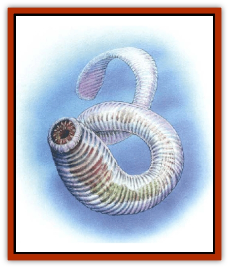

# Echyan

| Statistic | **Echyan** |
| --- | --- |
| **Activity Cycle:** | Any |
| **Alignment:** | Neutral |
| **Armor Class:** | 4 (10) |
| **Climate/Terrain:** | Tropical seas, coasts and rivers |
| **Damage/Attack:** | 2d4 |
| **Diet:** | Carnivore |
| **Frequency:** | Uncommon |
| **Hit Dice:** | 5 |
| **Intelligence:** | Animal (1) |
| **Magic Resistance:** | Nil |
| **Morale:** | Average (8-10) |
| **Movement:** | 6, Sw 24 |
| **No. Appearing:** | 1d6+6 |
| **No. of Attacks:** | 1 |
| **Organization:** | School |
| **Size:** | L (12' long) |
| **Special Attacks:** | Swallow whole |
| **Special Defenses:** | Nil |
| **THAC0:** | 15 |
| **Treasure:** | Nil |
| **XP Value:** | 1,400 |

These large, predatory sea worms live in the Western Sea and, at times, in the rivers of the Savage Coast lands.

A typical echyan is approximately 12 feet in length and 2 feet in diameter, tapering into a flat tail. A barely noticeable bulge around the head area houses what small brain it possesses. It has no discernible eyes, and its skin and flesh are translucent, making it all but invisible in the water until it strikes. The mouth of the creature forms a giant suction cup, lined with three rows of crystalline fangs that help it lock onto and swallow its prey.

**Combat:** Echyans will prey on almost anything. They attack from behind or underneath, detecting their victims by motion. On a successful hit, they lock onto their prey and suck both blood and flesh. Damage occurs automatically every round thereafter, unless the victim makes a successful bend bars roll to detach the echyan. On a natural attack roll of 18, 19, or 20 the echyan swallows whole any creature that is man-sized or smaller.

Only one echyan will attack at a time. A worm that loses half of its hit points will disengage, and another will attempt to attack. This rotation occurs until all are damaged. At that point, those still able to swim away will attempt to do so.

**Habitat/Society:** Echyans breed in the main rivers along the Savage Coast, digging into the mud to lay eggs which hatch in the spring. Newborn, already four feet in length when they emerge from the mud, swim down to the Western Sea. They grow quickly, spending the summer months off the coast, following schools of migrating fish. When possible, they also go for larger prey such as walruses, sea turtles<!--manatees-->, and [[Whale|whales]]. In the winter they return to the rivers and spawn a new generation. [[Plant_Savage_Coast|Eyeweeds]], [[Juhrion|juhrions]], and many other large creatures sometimes enter the echyan mating grounds to feed on the exhausted worms.

Echyans have been encountered as far as the Jurur� and Xing� Rivers in Jibar�, and the Dream River hosts thousands of spawning echyans every winter. The sea worms congregate here in safety because they are immune to the effects of the [[Plant_Savage_Coast|amber lotus]]. They feed on [[Batracine|batracines]], [[Jorri|jorries]], [[Tortle|tortle]] eggs, and other river creatures during their brief freshwater stay. Once in the sea, they feed mostly on fish, though the occasional worm will crawl up on the beach in search of tortle eggs, which they particularly like. An echyan caught on shore after dawn will burrow partially into the sand to protect itself from the burning rays of the sun.

**Ecology:** Echyans are one of the more dangerous water predators along the Savage Coast because of their near-invisibility in water and powerful bite. Despite this, most humanoid victims are those unlucky enough to stumble across an echyan that has been stranded on shore during the daylight. Echyans are not particularly useful and so are left to their own devices by most races. However, the lupins do take an active interest in the worms and try to keep them from returning to Dream River every year.

---
## Discovery & Documentation

**Source Publication:** Monstrous Compendium, 1997 Annual, Volume 4 (1995)
**Campaign Setting:** Advanced Dungeons & Dragons 2nd Edition
**Author(s):** Jon Pickens

### Other Creatures Found in This Source Book
   * [[Anemone_Giant_Sea|Anemone, Giant Sea]]
   * [[Asperii|Asperii]]
   * [[Bainligor|Bainligor]]
   * [[Beast_of_Chaos|Beast of Chaos]]
   * [[Blindheim|Blindheim]]
   * [[Bloodsipper_Far_Realm|Bloodsipper (Far Realm)]]
   * [[Bulette_Gohlbrorn|Bulette, Gohlbrorn]]
   * [[Child_of_the_Sea|Child of the Sea]]
   * [[Clockwork_Horror|Clockwork Horror]]
   * [[Clockwork_Swordsman|Clockwork Swordsman]]
   * [[Coral|Coral]]
   * [[Darklore|Darklore]]
   * [[Dharculus|Dharculus]]
   * [[Dolphin_Athas|Dolphin (Athas)]]
   * [[Dragon_Neutral_Moonstone|Dragon, Neutral, Moonstone]]
   * [[Dragon_Prismatic|Dragon, Prismatic]]
   * [[Dream_Stalker|Dream Stalker]]
   * [[Dragon-kin_Albino_Wyrm|Dragon-kin, Albino Wyrm]]
   * [[Firestar|Firestar]]
   * [[Firetail|Firetail]]
   * [[Fish_Ascallion|Fish, Ascallion]]
   * [[Fish_Deep_Ocean|Fish, Deep Ocean]]
   * [[Fish_Tropical|Fish, Tropical]]
   * [[Fish_Vurgens|Fish, Vurgens]]
   * [[Fogwarden|Fogwarden]]
   * [[Fraal|Fraal]]
   * [[Giant_Crag|Giant, Crag]]
   * [[Gibberling_Brood|Gibberling, Brood]]
   * [[Glutton_Sea|Glutton, Sea]]
   * [[Golden_Ammonite|Golden Ammonite]]
   * [[Golem_Brass_Minotaur|Golem, Brass Minotaur]]
   * [[Golem_Gemstone|Golem, Gemstone]]
   * [[Golem_Maggot|Golem, Maggot]]
   * [[Groundling|Groundling]]
   * [[Hermit_Sea|Hermit, Sea]]
   * [[Hound_of_Law|Hound of Law]]
   * [[Human_Amazon|Human, Amazon]]
   * [[Human_Pygmy|Human, Pygmy]]
   * [[Inquisitor|Inquisitor]]
   * [[Kercpa|Kercpa]]
   * [[Kreel|Kreel]]
   * [[Lycanthrope_Lythari|Lycanthrope, Lythari]]
   * [[Mercurial|Mercurial]]
   * [[Mold_Chromatic|Mold, Chromatic]]
   * [[Mummy_Bog|Mummy, Bog]]
   * [[Neh-thalggu|Neh-thalggu]]
   * [[Nymph_Grain|Nymph, Grain]]
   * [[Nymph_Unseelie|Nymph, Unseelie]]
   * [[Octopus_Octo-Jelly|Octopus, Octo-Jelly]]
   * [[Puddingfish|Puddingfish]]
   * [[Sea_Demon|Sea Demon]]
   * [[Shade|Shade]]
   * [[Shadowrath|Shadowrath]]
   * [[Shark_Athas|Shark (Athas)]]
   * [[Siren_Ravenloft|Siren (Ravenloft)]]
   * [[Skeleton_Variant|Skeleton, Variant]]
   * [[Skyfish|Skyfish]]
   * [[Spectral_Scion|Spectral Scion]]
   * [[Spyder_Fiend|Spyder Fiend]]
   * [[Squid_Squark|Squid, Squark]]
   * [[Tanar'ri_Lesser_Uridezu|Tanar'ri, Lesser, Uridezu]]
   * [[Troll_Mutate|Troll Mutate]]
   * [[Vaati|Vaati]]
   * [[Vampire_Cerebral|Vampire, Cerebral]]
   * [[Varkha|Varkha]]
   * [[Wizshade|Wizshade]]
   * [[Worm_Lukhorn|Worm, Lukhorn]]
   * [[Wyste|Wyste]]
   * [[Yugoloth_Lesser_Gacholoth|Yugoloth, Lesser, Gacholoth]]
   * [[Zombie_Mud|Zombie, Mud]]
