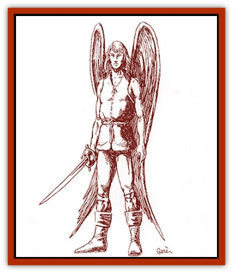

# Ee'aar

| Statistic | **Ee'aar** |
| --- | --- |
| **Activity Cycle:** | Day |
| **Alignment:** | Neutral (lawful good) |
| **Armor Class:** | 8 |
| **Climate/Terrain:** | Temperate and arctic/Mountains |
| **Damage/Attack:** | 1d8 (or by weapon) |
| **Diet:** | Omnivore |
| **Frequency:** | Uncommon |
| **Hit Dice:** | 2+1 |
| **Intelligence:** | High (13-14) |
| **Magic Resistance:** | Nil |
| **Morale:** | Elite (13-14) |
| **Movement:** | 16, Fl 24 (B) |
| **No. Appearing:** | 2d4 |
| **No. of Attacks:** | 1 |
| **Organization:** | Clan |
| **Size:** | M (5-6' tall) |
| **Special Attacks:** | Dive, elf abilities |
| **Special Defenses:** | Dancing maneuvers |
| **THAC0:** | 19 |
| **Treasure:** | R (F) |
| **XP Value:** | 650 |

Except for a pair of very large, feathered wings, ee'aar appear to be stocky [[Elf|elves]]. They posses the typical elven arched eyebrows, pointed ears, quick reflexes, and natural grace in movement. Though ee'aar eye color follows typical elf shades, it is of a paler wash than usual. The predominant hair color is silver or white, though some have been known to have lighter shades of auburn and blonde. Ee'aar also tend toward lean, well-muscled bodies and are slightly taller than their earthbound relatives.

The wings of an ee'aar spread almost 30% wider than the entire body length and, when folded, stretch from the heels to several inches above the head. Though feathers tend to be lighter in color - mostly white, gray, and light blue - perhaps as many as 40% of the ee'aar possess darker shades - such as brown, gold, and black.

Most ee'aar speak several languages. All know Aeshtyn, the standard ee'aar language, which is very soft and musical and carries well on the winds. Ee'aar also grow up around Nimmush, the language of the [[Enduk|enduks]]. Other languages would be those of any mountain-dwelling race or those races along the western edge of the Savage Coast. Ee'aar also gain the special elf abilities of infravision, resistance to *sleep* and *charm*, and heightened perception.

**Combat:** Ee'aar learn to fight on the ground as well as in the air. For purposes of combat, the average ee'aar should be considered a 2nd-level warrior, though many of them are much more proficient. They gain a +1 attack bonus with all normal swords and any one of the clan's hunting weapons - lasso, net, bolas, blowgun, or spear. Ee'aar can also use short bows with no penalty for being airborne. They generally stay away from bulky weapons such as two-handed swords and long bows.

On the ground, the ee'aar base AC is 8, due to its dexterity. They can wear leather armor, but most despise using anything so restricting (it changes flight maneuverability to class C). They never use full shields, but in rare cases a buckler might be employed. Ee'aar put high stock in improving their Armor Class with magic, such as *bracers* and *rings of protection*.

In the air, an ee'aar can use its greater speed and maneuverability to gain an additional -1 bonus to its overall Armor Class.

During melee, ee'aar can hover, allowing normal combat, or they can confine their aerial battle maneuvers to passing attacks and dives at the ground. A passing attack occurs when an ee'aar flies past another creature, making a single attack and possibly a defensive maneuver. Creatures with multiple attacks must be able to claim special consideration (a *haste* spell, special initiative rules, etc.) if more than one attack is to hit the ee'aar in a single pass. When attacking a ground-based opponent from the air, an ee'aar can employ a ranged weapon, land for melee combat, or make a diving attack with a melee weapon. Because the diving attack comes so swiftly, the ee'aar gains another -1 Armor Class bonus, the defender's Dexterity bonus is negated, and all attacks inflict double damage. This attack puts the ee'aar on more even footing with an armored opponent. Ee'aar can attempt this attack every round, but it cannot be used in conjunction with the dancing maneuvers described below.

Often, the ee'aar utilize dancing maneuvers in combat. This ability modifies their flying ability to make larger leaps, sharper turns, and faster spins. They literally appear to be dancing while engaged in melee attacks. This ability works similarly on the ground and in the air; it adjusts the ee'aar's Armor Class by one half its level. (A 4th-level ee'aar warrior receives a -2 AC bonus against any form of attack, except for area-affecting attacks.) The dancing maneuvers even provide a saving throw for one quarter damage from direct spell attacks like lightning. Wearing any form of armor or carrying a shield makes using this skill impossible. Also, an ee'aar cannot use this skill and simultaneously fire a missile weapon.

The ee'aar normally fly at a speed of 240 feet per round; however, this lowers to 60 feet per round if climbing straight up. A casual ascent of 45 degrees allows 120 feet of forward movement with 120 feet of ascent. When descending, the ee'aar can drop 1 foot for every foot moved forward, allowing 240 feet both forward and downward. They can also dive, which doubles their movement rate to 480 feet of movement both forward and downward. An ee'aar may carry up to 50 pounds of weight plus 5 pounds for every point of Strength without penalty. After that, its movement rate drops to half, and its maneuverability drops to C.

An ee'aar must make a Constitution check for each hour of flight. If this check fails, it must land and rest one-half hour for every hour spent recently in the air. Constitution checks are subject to a penalty of -1 for each 50 pounds (or fraction thereof) of weight carried above the initial 50. A further penalty is assessed at -1 per 5,000 feet of altitude above the first 5,000, with a maximum ceiling of 20,000 feet. However, if favorable wind conditions are present (such as a strong mountain updraft or good steady sea breeze) the ee'aar may glide and receive a +4 bonus to its check.

As with all flying creatures, an ee'aar must land immediately if its hit points are fall below 50% of maximum. Flight (even gliding) becomes impossible if 75% of its overall hit points are lost, and if already airborne, the ee'aar will fall from the sky. If 25% of the ee'aar's total hit points in damage is applied directly to its wings, it must land immediately; 50% prevents any flight until healed.

Due to their size, the wings have an AC rating 1 point worse than the ee'aar itself. Also, armor never covers the wings, possibly widening this gap. The wings cannot be hit by a frontal attack unless the attacker is taller than the ee'aar. If attacked from the side, an attack too low to successfully hit the ee'aar's AC but high enough to hit the wing AC is applied to the wings. Wings cannot be specifically targeted except in a rear attack; a successful attack from behind always hits the wings. Wings also suffer an extra 1d6 points of damage per round if exposed directly to flame. The wings will keep burning until the ee'aar loses more than 75% of its normal hit points or action is taken to extinguish the flames.

Recovering from direct damage to the wings takes 1 full week for each 10 of the ee'aar's total hit points. *Cure* spells will heal damage but will not regrow feathers, so flight is still not possible. *Regeneration* and *heal* spells will replace feathers. Magical healing always applies to direct wing damage last. As the percentages fall below 75% and 50% (or 50% and 25% as applied to direct wing damage), the ee'aar regains the ability to glide and, then, fly. Also, an ee'aar regains additional hit points for healing wing damage according to its Constitution bonus. (An ee'aar with a 16 Constitution heals an extra 2 points per week.)

The ee'aar have extreme claustrophobia. Ee'aar that are confined must make a Wisdom check each day or become temporarily insane. This can be cured by a *heal* or *cure disease* spell. Four missed checks in any period of confinement makes the condition permanent, cured by nothing short of a *wish* or *limited wish*.

**Habitat/Society:** The ee'aar normally live in the mountains on the Arm of the Immortals peninsula. They have adapted to the cold and can survive comfortably with little more than light, down-lined fur tunics, soft leather boots, and thick leggings. Only recently have they come down from those heights to join their enduk friends in the Savage Coast lands. It takes an ee'aar months to get used to the warmth and humidity of the lowlands, especially in the tropics the enduk favor. Anywhere along the Savage Coast, other than the area directly surrounding Um-Shedu, ee'aar are a rare sight.

Ee'aar live in family communities called aeries. An ee'aar village is made up of several aeries, while in a city, aeries can number in the hundreds. Every ee'aar works toward the survival and improvement of the clan, as well as the welfare of the entire ee'aar community. Those clans considered noble are responsible for leading the others. A noble clan is not a permanent endowment; the honor is bestowed on those with a proven history of successful leadership. Noble lines sometimes relinquish this honor to another clan which has proven more worthy, contenting themselves with a place of honor in the armies the ee'aar maintain for defense.

Though they have their own language (Aeshtyn), the ee'aar follow many standard elven practices, including arranged marriages. A mate is usually selected from another clan of equal social standing; sometimes, interclan marriages occur if an orphan was adopted into the clan. The ee'aar very rarely have twins, but they do have children more frequently than other elves.

**Ecology:** Ee'aar generally have little to do with other races besides the enduks. While they consider their ways superior, the ee'aar do not lord it over other races. They simply recognize the benefits their long history gives them over the "infant" races. The ee'aar have even been known to assist some of these races, like they did with the enduks, helping them to reclaim their lands from the [[Manscorpion_Nimmurian|manscorpions]].

   Despite their reserved demeanor, ee'aar craft elaborate jewelry, delicate figurines, and ornate weapons. Their cultural artwork is in high demand throughout most of the Savage Coast, bringing high prices where it is available.

---
## Discovery & Documentation

**Source Publication:** Monstrous Compendium Savage Coast Appendix (Online Exclusive) (1995)
**Campaign Setting:** Mystara
**Author(s):** Loren L Coleman, Ted James, Thomas Zuvich, Cindi M. Rice

### Other Creatures Found in This Source Book
   * [[Aranea_Savage_Coast|Aranea (Savage Coast)]]
   * [[Arashaeem|Arashaeem]]
   * [[Batracine|Batracine]]
   * [[Cat_Marine|Cat, Marine]]
   * [[Cinnavixen|Cinnavixen]]
   * [[Clockwork_Swordsman|Clockwork Swordsman]]
   * [[Critter_Temple|Critter, Temple]]
   * [[Cursed_One|Cursed One]]
   * [[Deathmare|Deathmare]]
   * [[Dragon_Savage_Coast_Crimson|Dragon (Savage Coast), Crimson]]
   * [[Dragon_Savage_Coast_Red_Hawk|Dragon (Savage Coast), Red Hawk]]
   * [[Echyan|Echyan]]
   * [[Enduk|Enduk]]
   * [[Fachan_Savage_Coast|Fachan (Savage Coast)]]
   * [[Feliquine|Feliquine]]
   * [[Fiend_Narvaezan|Fiend, Narvaezan]]
   * [[Frelôn|Frelôn]]
   * [[Ghriest|Ghriest]]
   * [[Glutton_Sea|Glutton, Sea]]
   * [[Goatman|Goatman]]
   * [[Golem_Naâruk|Golem, Naâruk]]
   * [[Golem_Savage_Coast|Golem (Savage Coast)]]
   * [[Grudgling|Grudgling]]
   * [[Heraldic_Servant_I|Heraldic Servant I]]
   * [[Heraldic_Servant_II|Heraldic Servant II]]
   * [[Heraldic_Servant_III|Heraldic Servant III]]
   * [[Heraldic_Servant_IV|Heraldic Servant IV]]
   * [[Heraldic_Servant_V|Heraldic Servant V]]
   * [[Heraldic_Servant_General_Information|Heraldic Servant, General Information]]
   * [[Hermit_Sea|Hermit, Sea]]
   * [[Jorri|Jorri]]
   * [[Juhrion|Juhrion]]
   * [[Kla'a-tah|Kla'a-tah]]
   * [[Leech_Legacy|Leech, Legacy]]
   * [[Lich_Inheritor|Lich, Inheritor]]
   * [[Lizard_Kin_Savage_Coast|Lizard Kin (Savage Coast)]]
   * [[Lupasus|Lupasus]]
   * [[Lupin|Lupin]]
   * [[Lyra_Bird_Saragón|Lyra Bird, Saragón]]
   * [[Malfera|Malfera]]
   * [[Manscorpion_Nimmurian|Manscorpion, Nimmurian]]
   * [[Mythuínn_Folk|Mythuínn Folk]]
   * [[Neshezu|Neshezu]]
   * [[Nikt'oo|Nikt'oo]]
   * [[Nosferatu|Nosferatu]]
   * [[Omm-wa|Omm-wa]]
   * [[Omshirim|Omshirim]]
   * [[Parasite_Savage_Coast|Parasite (Savage Coast)]]
   * [[Phanaton|Phanaton]]
   * [[Plant_Savage_Coast|Plant (Savage Coast)]]
   * [[Pudding_Vermilion|Pudding, Vermilion]]
   * [[Rakasta|Rakasta]]
   * [[Ray_Forest|Ray, Forest]]
   * [[Shedu_Greater_Savage_Coast|Shedu, Greater (Savage Coast)]]
   * [[Shimmerfish|Shimmerfish]]
   * [[Skinwing|Skinwing]]
   * [[Spawn_of_Nimmur|Spawn of Nimmur]]
   * [[Spider-spy|Spider-spy]]
   * [[Spirit_Heroic|Spirit, Heroic]]
   * [[Spirit_Walleran|Spirit, Walleran]]
   * [[Succulus|Succulus]]
   * [[Swampmare|Swampmare]]
   * [[Symbiont_Shadow|Symbiont, Shadow]]
   * [[Tortle|Tortle]]
   * [[Troll_Legacy|Troll, Legacy]]
   * [[Trosip|Trosip]]
   * [[Tyminid|Tyminid]]
   * [[Utukku|Utukku]]
   * [[Voat|Voat]]
   * [[Voat_Herathian|Voat, Herathian]]
   * [[Vulturehound|Vulturehound]]
   * [[Wallara|Wallara]]
   * [[Wurmling|Wurmling]]
   * [[Wynzet|Wynzet]]
   * [[Yeshom|Yeshom]]
   * [[Zombie_Red|Zombie, Red]]
