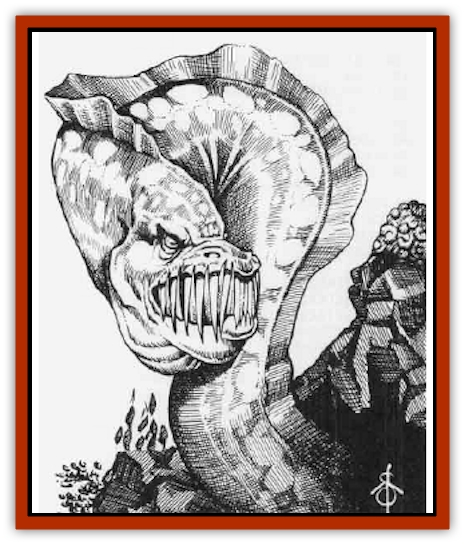

# Eel - Giant Moray

| Statistic | **Eel, Giant Moray** |
| --- | --- |
| **Activity Cycle:** | Any |
| **Alignment:** | Neutral evil |
| **Armor Class:** | 4 |
| **Climate/Terrain:** | Aquatic |
| **Damage/Attack:** | 2d4 or 1d4+2/1d4 |
| **Diet:** | Carnivore/scavenger |
| **Frequency:** | Rare |
| **Hit Dice:** | 5+ |
| **Intelligence:** | Animal (1) |
| **Magic Resistance:** | Nil |
| **Morale:** | Steady (12) or Fearless (20) |
| **Movement:** | Sw 6 |
| **No. Appearing:** | 1 (7-12 in lair) |
| **No. of Attacks:** | 1 (2) |
| **Organization:** | Solitary |
| **Size:** | L to H (8-20' long) |
| **Special Attacks:** | Jaw lock, disease, tail lash |
| **Special Defenses:** | Immune to fear and disease, +4 saving throw bonus vs. enfeeblement effects |
| **THAC0:** | 15 |
| **Treasure:** | Incidental |
| **XP Value:** | HD 5 to 5+3: 420 / HD 5+4 to 5+12: 650 |

These aquatic predators are evil, cruel creatures - slow, but feared for their diseased bite and their fearlessness once they have seized prey. Giant morays have brown, mottled, thick, leathery skin , with lighter brown or yellow-brown spots on their dorsal surface. They have pronounced incisor teeth, and their unblinking eyes seem to reveal their baneful nature. Both freshwater and saltwater versions exist, identical save for their chosen environment. Giant morays are very long-lived, with some specimens believed to have survived for hundreds of years. Older individuals are larger than most; length is 6+1d6+1d8 feet, and for every foot in length above 8 feet the moray gains an additional hit point (so a 20-foot-long specimen has HD 5+12).

**Combat:** Giant morays usually conceal themselves in fissures in reefs, beneath stones, in the sand of the sea bed, or in weeds, kelp, etc. They lunge forth to attack prey with their bite, and they will attack virtually anything, irrespective of its size or strength. A successful attack made with a score of +4 or better above the minimum number needed to hit, or a natural 20. means that the moray has gripped its prey firmly and locked its jaws into the wound, causing automatic damage thereafter (1d4+2). Normally, morays have steady morale (ML 12), but once a moray has locked its jaws in this way it is fearless (ML 20). Furthermore, even if the moray is killed the jaws remain locked in the wound and have to be cut away, or else the victim continues to bleed (though automatic damage is now reduced to 1d2 points per round). Cutting away the head of the moray in this manner requires one round of work with a dagger or knife, and the cutter must make a Dexterity check. Failure means that the knife or dagger slips and the unfortunate bitten victim suffers a further 1d4 points of damage from this accidental wounding.

A lock-jawed moray bite causes a rotting disease (no saving throw). After 12+1d12 hours, the bitten body part becomes swollen and very sore (-2 to Dexterity due to swelling); it rots away within 1d4+4 days. A *cure disease* or *heal* spell can prevent or reverse the Dexterity loss and stop the rot.

As a rule, giant morays use their tail lash attack only if they have locked jaws on a victim, when they employ it against secondary targets on their flanks. A giant moray out of the water can employ its tail lash in addition to its bite attack, though not against the same target. Giant morays are very tough creatures, and if removed from water they can survive for 10+1d10 rounds before expiring from an inability to breathe.

Giant moray eels are immune to all forms of *fear* and *disease* and gain a +4 bonus to all magical attacks that have a primary effect of reducing strength (*ray of enfeeblement*, *weakness*, etc.)

**Habitat/Society:** Giant moray eels are solitary creatures, though rarely several will share a stretch of reef, rocky outcrop, etc. They have almost no form of social organization, though each individual knows the extent of its territory and does not usually intrude on those of other morays. Morays do not cooperate in any form (in combat, etc.) Even mating between them can be hazardous, with males and females as likely to attack and eat each other as cooperate in the production of young. Young morays are born with 2 HD and are 3½ feet in length; they gain 1 HD and 1½ feet in length for every month of growth up to 5 HD. Thereafter the rate of growth slows, with the moray gaining an additional hit point and extra foot of length every decade. Few survive to adulthood, as immature morays have many enemies (including adult morays, who will consme younger ones, given the chance). But since the adult giant moray has few natural predators, their numbers tend to be relatively stable.

**Ecology:** Giant morays are thoroughly unpleasant creatures and are feared by almost all intelligent aquatic creatures for their ferocity, fearlessness, and lack of discrimination (they will attack anything, even a [[Squid_Giant|kraken]], if it gets close enough). However, they rarely move from their own small territory, prefening to wait for prey to come to them, which minimizes their dangerousness somewhat. In addition to being indiscriminate carnivores, they are also unfussy consumers of carrion of all kinds. Giant morays will gleefully gulp down all manner of detritus, no matter how rotten or diseased, and this habit explains their own ability to inflict disease with their bites. As scavengers they have a useful role in aquatic ecology, since they consume refuse and carrion which few other creahms would consider edible. The giant moray has few natural predators; only creatures of the size and strength of [[Shark|sharks]], kraken, and the like prey on them.

Treasure found in a moray lair will be incidental: anything dropped by victims of the eel.

---
## Discovery & Documentation

**Source Publication:** Monstrous Compendium, 1996 Annual, Volume 3 (1995)
**Campaign Setting:** Advanced Dungeons & Dragons 2nd Edition
**Author(s):** Jon Pickens

### Other Creatures Found in This Source Book
   * [[Alaghi|Alaghi]]
   * [[Alhoon|Alhoon]]
   * [[Aranea_Savage_Coast|Aranea (Savage Coast)]]
   * [[Arcane_Head|Arcane Head]]
   * [[Banedead|Banedead]]
   * [[Banelich|Banelich]]
   * [[Bat_Bonebat|Bat, Bonebat]]
   * [[Beetle|Beetle]]
   * [[Belgoi|Belgoi]]
   * [[Bladeling|Bladeling]]
   * [[Braxat|Braxat]]
   * [[Bunyip|Bunyip]]
   * [[Burbur|Burbur]]
   * [[Bvanen|Bvanen]]
   * [[Cat_Great_Snow_Tiger|Cat, Great, Snow Tiger]]
   * [[Chosen_One|Chosen One]]
   * [[Chronovoid|Chronovoid]]
   * [[Cildabrin|Cildabrin]]
   * [[Coffer_Corpse|Coffer Corpse]]
   * [[Disenchanter|Disenchanter]]
   * [[Dog_Temporal|Dog, Temporal]]
   * [[Dragon_Cerilia|Dragon (Cerilia)]]
   * [[Dragon_Ghost|Dragon, Ghost]]
   * [[Dragon_Lesser_Undead|Dragon, Lesser Undead]]
   * [[Dragon_Neutral_Amber|Dragon, Neutral, Amber]]
   * [[Dread_Warrior|Dread Warrior]]
   * [[Dreamweaver|Dreamweaver]]
   * [[Dream_Spawn_Greater_Ennui|Dream Spawn, Greater, Ennui]]
   * [[Dream_Spawn_Lesser_Morph|Dream Spawn, Lesser, Morph]]
   * [[Dwarf_Arctic|Dwarf, Arctic]]
   * [[Dwarf_Urdunnir|Dwarf, Urdunnir]]
   * [[Elemental_Fire_Kin_Tome_Guardian|Elemental, Fire Kin, Tome Guardian]]
   * [[Elf_Rockseer|Elf, Rockseer]]
   * [[Ethyk|Ethyk]]
   * [[Faerie_Faerie_Fiddler|Faerie, Faerie Fiddler]]
   * [[Faerie_Petty_Bramble|Faerie, Petty, Bramble]]
   * [[Faerie_Petty_Gorse|Faerie, Petty, Gorse]]
   * [[Faerie_Petty|Faerie, Petty]]
   * [[Firenewt|Firenewt]]
   * [[Formian|Formian]]
   * [[Gargoyle_II|Gargoyle II]]
   * [[Giant_Cerilia|Giant (Cerilia)]]
   * [[Goblin_Cerilia|Goblin (Cerilia)]]
   * [[Golem_Magic|Golem, Magic]]
   * [[Golem_Shaboath|Golem, Shaboath]]
   * [[Hag_Bheur|Hag, Bheur]]
   * [[Hamadryad|Hamadryad]]
   * [[Hound_of_Ill-Omen|Hound of Ill-Omen]]
   * [[Human_Cerilia|Human (Cerilia)]]
   * [[Hybsil|Hybsil]]
   * [[Ibrandlin|Ibrandlin]]
   * [[Imp_Chaos|Imp, Chaos]]
   * [[Ixitxachitl_Ixzan|Ixitxachitl, Ixzan]]
   * [[Jabberwock|Jabberwock]]
   * [[Kyton|Kyton]]
   * [[Kyuss_Son_of|Kyuss, Son of]]
   * [[Lillend|Lillend]]
   * [[Life-Shaped_Creation_Guardian|Life-Shaped Creation, Guardian]]
   * [[Life-Shaped_Creation_Transport|Life-Shaped Creation, Transport]]
   * [[Lycanthrope_Werecrocodile|Lycanthrope, Werecrocodile]]
   * [[Lycanthrope_Werespider|Lycanthrope, Werespider]]
   * [[Magedoom|Magedoom]]
   * [[Manotaur|Manotaur]]
   * [[Mastiff_Shadow|Mastiff, Shadow]]
   * [[Meazel|Meazel]]
   * [[Mist_Scarlet_Dancer|Mist, Scarlet Dancer]]
   * [[Needleman|Needleman]]
   * [[Orc_Neo-Orog|Orc, Neo-Orog]]
   * [[Orc_Ondonti|Orc, Ondonti]]
   * [[Owlbear_II|Owlbear II]]
   * [[Pegataur|Pegataur]]
   * [[Phaerimm|Phaerimm]]
   * [[Reggelid|Reggelid]]
   * [[Render|Render]]
   * [[Saurial|Saurial]]
   * [[Scalamagdrion|Scalamagdrion]]
   * [[Sharn|Sharn]]
   * [[Snake_Messenger|Snake, Messenger]]
   * [[Spirit_Forest_Uthraki|Spirit, Forest, Uthraki]]
   * [[Spirit_Forest_Wood_Man|Spirit, Forest, Wood Man]]
   * [[Spirit_Ice_Orglash|Spirit, Ice, Orglash]]
   * [[Spirit_Rock_Thomil|Spirit, Rock, Thomil]]
   * [[Strider_Giant|Strider, Giant]]
   * [[Tembo|Tembo]]
   * [[Temporal_Glider|Temporal Glider]]
   * [[Temporal_Stalker|Temporal Stalker]]
   * [[Tether_Beast|Tether Beast]]
   * [[Thessalmonster|Thessalmonster]]
   * [[Time_Dimensional|Time Dimensional]]
   * [[Tomb_Tapper|Tomb Tapper]]
   * [[Undead_Dragon_Slayer|Undead Dragon Slayer]]
   * [[Unicorn_Black_Toril|Unicorn, Black (Toril)]]
   * [[Vaath|Vaath]]
   * [[Vortex_Spider|Vortex Spider]]
   * [[Weredragon|Weredragon]]
   * [[Zhentarim_Spirit|Zhentarim Spirit]]
