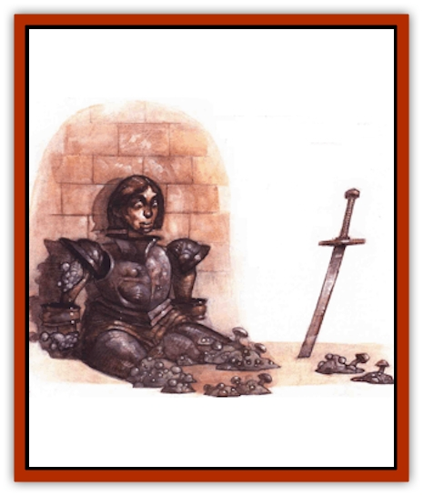

# Egarus

| Statistic | **Egarus** |
| --- | --- |
| **Activity Cycle:** | N/A |
| **Alignment:** | Neutral |
| **Armor Class:** | 10 |
| **Climate/Terrain:** | Quasiplane of Vacuum |
| **Damage/Attack:** | Nil |
| **Diet:** | Absence |
| **Frequency:** | Rare |
| **Hit Dice:** | N/A |
| **Intelligence:** | Non- (0) |
| **Magic Resistance:** | 25% |
| **Morale:** | N/A |
| **Movement:** | 0 |
| **No. Appearing:** | 1d3 patches |
| **No. of Attacks:** | 0 |
| **Organization:** | Patch |
| **Size:** | T (one patch is 6&rdquo; across) |
| **Special Attacks:** | Disintegration |
| **Special Defenses:** | Telcportation, immune to cold, fire, physical attacks, most spells |
| **THAC0:** | N/A |
| **Treasure:** | Nil |
| **XP Value:** | 270 |

A yawning expanse of unending nothingness stretches into infinity, turning a body's mind in on itself when he tries to grasp the enormity of it. The quasiplane of Vacuum is, by all accounts, one of the loneliest, most inhospitable places in all the multiverse. Even the most adventuresome planewalkers find little reason to explore this plane. Betterknown voids like the Astral and inhospitable backwaters like the bottom layer of Pandemonium look like well-traveled throughways teeming with life by comparison.

That's why when truly canny bloods need to get rid of something - something that must disappear from all existence forever - they banish it to the quasiplane of Vacuum. But sometimes even that doesn't work.

See, it all started in the Abyss. Some hapless berk had traveled to one of the layers he considered to be "safe". Why he'd gone, and why he thought *any* part of the Abyss was safe, has been lost in the annals of time. He was Clueless; perhaps nothing more need be said.

When he returned to his prime world, however, he inadvertently brought with him some fungus that clung to the tip of his shoe. This Abyssal fungus, finding itself on an unprepared and unsuspecting world, immediately began to grow at an alarming rate. Unable to scrape off the fungus, the addle-cove discarded the boot - but that didn't solve the problem. It grew and grew, proliferating in the pleasant environment. Soon it covered the sod's house. While some of the local graybeards examined the fungus, it spread to the neighbors' cases. Suddenly afraid, the graybeards tried to burn the stuff. It wouldn't burn.

Within days, the growth covered half the town, and the locals'd given it the name "egarus" (chant is, the word's a curse). Wizards arrived on the scene to help, and while some of their magic was effective, it was too little, too late. The wind had carried bits of fungus throughout the region. Certain spells and magical devices held the growth at bay or even destroyed a patch or two, but there weren't enough wizards to keep up with the spreading egarus fungus. Plus, even when it was apparently eradicated in one area, the insidious stuff reappeared elsewhere. There seemed no way to tell when it was really and truly gone!

Finally, a few deities who had a considerable following on this prime world took pity on the inhabitants. It was obvious that soon the Abyssal fungus would destroy the entire world. Thus, the powers answered the prayers of their worshipers and opened gates to the quasiplane of Vacuum. After many mortal generations of work, the primes managed to round up all of the fungus and thrust it through the multitude of gates. By this time, their best wizards had developed spells to detect the growth, so they could be sure that it was all gone.

At last, the gates were sealed. Everyone figured that with nothing to grow on, nothing to feed on, the egarus fungus would surely die on Vacuum.

Even the gods' plans can sometimes go awry.

The fungus didn't die. It adapted. The plane of Vacuum offered only emptiness - so it began to feed on that. The fungus learned to thrive on the absence of matter and energy. (Though the Dustmen would certainly disagree, there is nothing so tenacious, so powerful, as life and its ability to adapt and continue living.) In its new home, the egarus fungus formed tiny clumps that floated in the void, feeding on the nothingness like a leech or a cancer.

The fungus thrives still. Its dull white lumps don't move or do anything that might call attention to themselves. In fact, it's extraordinarily unlikely that a basher visiting the quasiplane would ever encounter the tiny clumps, even if he actively looked for them. Despite this, the egarus' adaptations to its new environment make it a real threat to those barmy enough to enter the plane of Vacuum.

**Combat:** The egarus feeds on nonexistence, so anything with substance is anathema to it. Even in the infinite reaches of Vacuum, it cannot abide matter and energy in any amount other than itself. Thus, the fungus attacks anyone or anything entering the plane and alerting its delicate senses. A patch of egarus can sense matter many thousands of miles away - though on the plane of Vacuum, distance means very little.

The fungus attacks by using an ability much like *teleport without error* to reach the offending matter or energy. (It cannot use the ability to leave the plane, however.) Once in close proximity (within 25 feet), the fungus begins breaking things down, effectively disintegrating its target. This process is slow, but insidious. No magical protections can defend against this (for they, too, are broken down), nor can magic resistance provide any help.

The fungus attacks energy first, so light sources, flames (torches or magical flame weapons, for example), and active spell effects are extinguished first. This happens at a rate of one energy source per round per egarus patch, in a random order. Nonliving material objects are attacked next, and again, are simply disintegrated one by one until nothing stands between the fungus and the living being. Magical items and creatures are permitted a saving throw vs. disintegration or death magic to avoid this effect.

Like so many things in the Inner Planes, the egarus can be stopped only by its utter destruction. This, fortunately, is not terribly hard to do. *Cure disease*, *disintegrate*, *finger of death*, *lightning bolt*, *shocking grasp*, or *slay living* spells destroy a patch instantly, as does the application of any acid, alcohol, electrical attack, or even a large amount of water (at least 60 gallons, which must be used to dilute and disperse the patch before the water freezes due to the cold of the plane). *Hold monster*, *hold plant*, or *slow* stop the egarus from attacking. The fungus is immune to cold, fire, physical attacks, and most spells other than those discussed above.

**Habitat/Society:** The egarus has adapted well to its new habitat. It attacks intruders on the plane, since they threaten the emptiness the fungus requires to survive.

**Ecology:** Presumably, the egarus reproduces like other types of fungi once it consumes "nourishment". There's no guessing how many clumps of egarus fungus now exist within the endless void.

If a patch of egarus were taken out of the quasiplane of Vacuum - say, on the tip of another sod's shoe - the fungus couldn't survive. Since it has adapted to thrive in the absence of matter. the egarus would literally starve to death. Before it died, however, it would destroy massice quantities of matter in an attempt to create a suitable empty void.

---
## Discovery & Documentation

**Source Publication:** Planescape III (1996)
**Campaign Setting:** Planescape
**Author(s):** Monte Cook

### Other Creatures Found in This Source Book
   * [[Animental|Animental]]
   * [[Archomental_Evil|Archomental, Evil]]
   * [[Archomental_Good|Archomental, Good]]
   * [[Belker|Belker]]
   * [[Bzastra|Bzastra]]
   * [[Chososion|Chososion]]
   * [[Darklight|Darklight]]
   * [[Devete|Devete]]
   * [[Devourer_Planescape|Devourer (Planescape)]]
   * [[Dharum_Suhn|Dharum Suhn]]
   * [[Elemental_Athas_Lesser_Air_Earth|Elemental (Athas), Lesser, Air/Earth]]
   * [[Elemental_Athas_Lesser_Fire_Water|Elemental (Athas), Lesser, Fire/Water]]
   * [[Elemental_Fire_Kin_Salamander_II|Elemental, Fire Kin, Salamander II]]
   * [[Entrope|Entrope]]
   * [[Facet|Facet]]
   * [[Frost_Salamander|Frost Salamander]]
   * [[Fundamental_Air_Earth|Fundamental, Air/Earth]]
   * [[Fundamental_Fire_Water|Fundamental, Fire/Water]]
   * [[Fundamental_All_Elements|Fundamental, All Elements]]
   * [[Garmorm|Garmorm]]
   * [[Homunculus_Elemental|Homunculus, Elemental]]
   * [[Immoth|Immoth]]
   * [[Khargra|Khargra]]
   * [[Klyndes|Klyndes]]
   * [[Magran|Magran]]
   * [[Menglis|Menglis]]
   * [[Nathri|Nathri]]
   * [[Ooze_Sprite|Ooze Sprite]]
   * [[Paraelemental|Paraelemental]]
   * [[Phirblas|Phirblas]]
   * [[Psurlon|Psurlon]]
   * [[Quasielemental_Negative|Quasielemental, Negative]]
   * [[Quasielemental_Positive|Quasielemental, Positive]]
   * [[Rast|Rast]]
   * [[Ravid|Ravid]]
   * [[Ruvoka|Ruvoka]]
   * [[Scile|Scile]]
   * [[Shad|Shad]]
   * [[Shocker|Shocker]]
   * [[Sislan|Sislan]]
   * [[Suisseen|Suisseen]]
   * [[Terithran|Terithran]]
   * [[Thoqqua|Thoqqua]]
   * [[Trilloch|Trilloch]]
   * [[Tsnng|Tsnng]]
   * [[Ungulosin|Ungulosin]]
   * [[Vacuous|Vacuous]]
   * [[Wavefire|Wavefire]]
   * [[Xag-Ya_Xeg-Yi|Xag-Ya/Xeg-Yi]]
   * [[Xill|Xill]]
