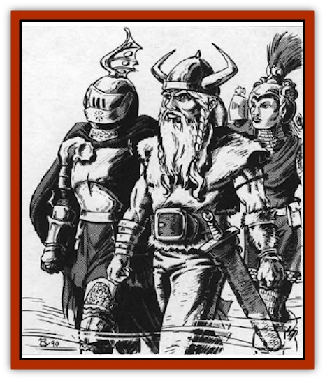

# Einheriar

| Statistic | **Einheriar** |
| --- | --- |
| **Activity Cycle:** | Any |
| **Alignment:** | Varies by plane |
| **Armor Class:** | Varies |
| **Climate/Terrain:** | Upper Planes |
| **Damage/Attack:** | By weapon |
| **Diet:** | None |
| **Frequency:** | Common |
| **Hit Dice:** | 4 or more |
| **Intelligence:** | Average to high (8-14) |
| **Magic Resistance:** | 5% |
| **Morale:** | Elite (13-14) |
| **Movement:** | 12 |
| **No. Appearing:** | 10-100 |
| **No. of Attacks:** | 1 |
| **Organization:** | Troop or army |
| **Size:** | M (6' tall average) |
| **Special Attacks:** | See below |
| **Special Defenses:** | See below |
| **THAC0:** | Varies |
| **Treasure:** | Nil |
| **XP Value:** | Varies |

Strictly speaking, the term einheriar ("faithful") applies to the dead of Asgard, the first layer of Ysgard. Over time, however, the term has come to refer to any humanoid spirits employed by the powers of the Upper Planes as servants, warriors, patrols, or guards.

In the *Edredsaga* is the following tale: "Our leader, Egil, had been tricked by the words of the sorceress, and when we landed upon the frosty isle we were not meeting a force of a hundred men as we had been told, but a hundred [[Giant_Frost|frost giants]]. They destroyed our longboats with their flung boulders, and we prepared to meet death gloriously. We were warriors, and warriors must always be prepared to die. Our line broke in red carnage against the giants' might; indeed, we might have been the sea against the rocks.

"My thoughts turned toward the home I would never see, and especially sad I was, that no skald would sing of my fallen brothers. Then there came a loud clear humming in the air. From the sky they came, far above the foamy water. Like mist they were, or cloud, yet I knew them to be from the high ones, sent as a sign of their troth with us. I could see the cold sun gleam upon their helms, and knew their swords would soon be reddened. The einheriar, they were.

"They fought beside us as warriors and wizards. No more came than enough to make the fight fair. We did not understand their words, but they seemed to know what we said. Great they were in battle, and old Swen said that he thought he saw his grandfather among them.

"Together we slaughtered the frost giants and made the land safe for the folk. When the long battle was done, the einheriar rose into the air and returned to the sky. There seemed more of them, as if our fallen brothers had joined that company. I am an old man now, with perhaps only one or two battles left in me. I hope my life has purified my soul that I may go fight with those bright ones!"

Einheriar appear as wispy, humanoid warriors with equally wispy armor and weapons. Each individual resembles the being he was in life; the majority of einheriar were human before death. In groups, einheriar march in military formation.

**Combat:** Einheriar form large groups organized loosely into a single combat unit. Individuals in the unit each have the class and level they held in life. Roll twice for each individual encountered to determine these.

| Roll | Class* |
| --- | --- |
| 1-50 | Fighter |
| 51-55 | Ranger |
| 56-60 | Paladin |
| 61-70 | Wizard |
| 71-75 | Specialist wizard |
| 76-85 | Priest |
| 86-90 | Thief |
| 91-00 | Bard |

* Roll again if plane alignment precludes a class.

| Roll | Level* |
| --- | --- |
| 1-50 | 4 |
| 51-75 | 5 |
| 76-88 | 6 |
| 89-94 | 7 |
| 95-97 | 8 |
| 98 | 9 |
| 99 | 10 |
| 00 | 11-16 |

* Divide level by 2 or 3 for multi-class.

Einheriar have maximum hit points per Hit Die. Compute THAC0s normally. Spellcasters have their normal complement of spells. Warrior einheriar retain weapon specialties they had in life.

Einheriar use the best in nonmagical arms and armor for their class, modified according to the power they serve. For instance, einheriar in service to the Great Spirit of the American Indian mythology would not wear plate mail and carry two-handed swords.

There is a 3% chance per level that an einheriar has magical items of a nonspecial nature (e.g. *sword +1*, *chain mail +2*, magical *bracers*, etc.). Most einheriar never carry specialty items such as *armor of etherealness* or a *sword +1, flametongue*.

**Habitat/Society:** Einheriar are common among the myriad servants of the powers of good. They fight for the powers and enforce their beliefs willingly and adamantly.

Einheriar have no hierarchy outside their units, nor interests beyond their mission. In general terms, more difficult tasks fall to higher-level individuals and units.

**Ecology:** The einheriar respect the [[Aasimon_General_Information|aasimon]] and [[Archon|archons]], hut they act independently of these greater beings, taking on lesser missions. They receive their guidance through prayer.

---
## Discovery & Documentation

**Source Publication:** MC8 Outer Planes Appendix (1990)
**Campaign Setting:** Planescape
**Author(s):** Timothy B. Brown, Jamie LaFountain

### Other Creatures Found in This Source Book
   * [[Aasimon_Agathinon|Aasimon, Agathinon]]
   * [[Aasimon_Deva|Aasimon, Deva]]
   * [[Aasimon_Light|Aasimon, Light]]
   * [[Aasimon_General_Information|Aasimon, General Information]]
   * [[Aasimon_Planetar|Aasimon, Planetar]]
   * [[Aasimon_Solar|Aasimon, Solar]]
   * [[Air_Sentinel|Air Sentinel]]
   * [[Animal_Lord|Animal Lord]]
   * [[Archon|Archon]]
   * [[Baatezu_Lesser_Abishai|Baatezu, Lesser, Abishai]]
   * [[Baatezu_Greater_Amnizu|Baatezu, Greater, Amnizu]]
   * [[Baatezu_Lesser_Barbazu|Baatezu, Lesser, Barbazu]]
   * [[Baatezu_Greater_Cornugon|Baatezu, Greater, Cornugon]]
   * [[Baatezu_Lesser_Erinyes|Baatezu, Lesser, Erinyes]]
   * [[Baatezu_General_Information|Baatezu, General Information]]
   * [[Baatezu_Greater_Gelugon|Baatezu, Greater, Gelugon]]
   * [[Baatezu_Lesser_Hamatula|Baatezu, Lesser, Hamatula]]
   * [[Baatezu_Lemure|Baatezu, Lemure]]
   * [[Baatezu_Least_Nupperibo|Baatezu, Least, Nupperibo]]
   * [[Baatezu_Lesser_Osyluth|Baatezu, Lesser, Osyluth]]
   * [[Baatezu_Greater_Pit_Fiend|Baatezu, Greater, Pit Fiend]]
   * [[Baatezu_Least_Spinagon|Baatezu, Least, Spinagon]]
   * [[Balaena|Balaena]]
   * [[Bariaur|Bariaur]]
   * [[Bebilith|Bebilith]]
   * [[Bodak|Bodak]]
   * [[Dog_Moon|Dog, Moon]]
   * [[Dragon_Adamantite|Dragon, Adamantite]]
   * [[Gehreleth|Gehreleth]]
   * [[Githyanki|Githyanki]]
   * [[Githzerai|Githzerai]]
   * [[Hordling|Hordling]]
   * [[Lammasu_Celestial|Lammasu, Celestial]]
   * [[Larva|Larva]]
   * [[Maelephant|Maelephant]]
   * [[Marut|Marut]]
   * [[Mediator|Mediator]]
   * [[Mortai|Mortai]]
   * [[Night_Hag|Night Hag]]
   * [[Nightmare|Nightmare]]
   * [[Noctral|Noctral]]
   * [[Per|Per]]
   * [[Phoenix|Phoenix]]
   * [[Slaad|Slaad]]
   * [[Tanar'ri_Greater_Babau|Tanar'ri, Greater, Babau]]
   * [[Tanar'ri_Greater_Chasme|Tanar'ri, Greater, Chasme]]
   * [[Tanar'ri_Greater_Nabassu|Tanar'ri, Greater, Nabassu]]
   * [[Tanar'ri_Least_Dretch|Tanar'ri, Least, Dretch]]
   * [[Tanar'ri_Least_Manes|Tanar'ri, Least, Manes]]
   * [[Tanar'ri_Least_Rutterkin|Tanar'ri, Least, Rutterkin]]
   * [[Tanar'ri_Lesser_Alu-Fiend|Tanar'ri, Lesser, Alu-Fiend]]
   * [[Tanar'ri_Lesser_Bar-Lgura|Tanar'ri, Lesser, Bar-Lgura]]
   * [[Tanar'ri_Lesser_Cambion|Tanar'ri, Lesser, Cambion]]
   * [[Tanar'ri_Lesser_Succubus|Tanar'ri, Lesser, Succubus]]
   * [[Tanar'ri_Guardian_Molydeus|Tanar'ri, Guardian, Molydeus]]
   * [[Tanar'ri_General_Information|Tanar'ri, General Information]]
   * [[Tanar'ri_True_Balor|Tanar'ri, True, Balor]]
   * [[Tanar'ri_True_Glabrezu|Tanar'ri, True, Glabrezu]]
   * [[Tanar'ri_True_Hezrou|Tanar'ri, True, Hezrou]]
   * [[Tanar'ri_True_Marilith|Tanar'ri, True, Marilith]]
   * [[Tanar'ri_True_Nalfeshnee|Tanar'ri, True, Nalfeshnee]]
   * [[Tanar'ri_True_Vrock|Tanar'ri, True, Vrock]]
   * [[Titan|Titan]]
   * [[Translator|Translator]]
   * [[T'uen-rin|T'uen-rin]]
   * [[Vaporighu|Vaporighu]]
   * [[Warden_Beast|Warden Beast]]
   * [[Yugoloth_Greater_Arcanaloth|Yugoloth, Greater, Arcanaloth]]
   * [[Yugoloth_Lesser_Dergoloth|Yugoloth, Lesser, Dergoloth]]
   * [[Yugoloth_Lesser_Hydroloth|Yugoloth, Lesser, Hydroloth]]
   * [[Yugoloth_General_Information|Yugoloth, General Information]]
   * [[Yugoloth_Lesser_Mezzoloth|Yugoloth, Lesser, Mezzoloth]]
   * [[Yugoloth_Greater_Nycaloth|Yugoloth, Greater, Nycaloth]]
   * [[Yugoloth_Lesser_Piscoloth|Yugoloth, Lesser, Piscoloth]]
   * [[Yugoloth_Greater_Ultroloth|Yugoloth, Greater, Ultroloth]]
   * [[Yugoloth_Lesser_Yagnoloth|Yugoloth, Lesser, Yagnoloth]]
   * [[Zoveri|Zoveri]]
