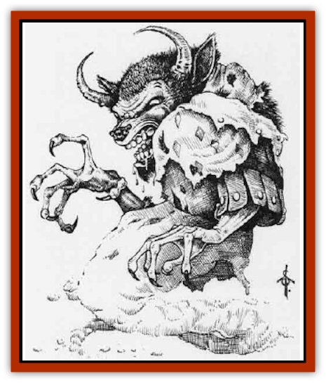

# Ekimmu

| Statistic | **Ekimmu** |
| --- | --- |
| **Activity Cycle:** | Nocturnal |
| **Alignment:** | Any evil |
| **Armor Class:** | 4 or as host |
| **Climate/Terrain:** | Wilderness, ruins |
| **Damage/Attack:** | Nil or as host |
| **Diet:** | Carnivore |
| **Frequency:** | Very rare |
| **Hit Dice:** | 8 |
| **Intelligence:** | Semi- (24) |
| **Magic Resistance:** | Nil |
| **Morale:** | Fearless (20) |
| **Movement:** | 12 or as host |
| **No. Appearing:** | 1 or 1-4 |
| **No. of Attacks:** | 1 or as host |
| **Organization:** | Solitary or band |
| **Size:** | L (10' tall) |
| **Special Attacks:** | Possession |
| **Special Defenses:** | Invisibility; immune to <i>sleep</i>, <i>charm</i>, <i>hold</i>, <i>paralysis</i>, cold-based spells and poison |
| **THAC0:** | Nil or as host |
| **Treasure:** | Nil (F 25% chance) |
| **XP Value:** | 3,000 |

An ekimmu is an angry undead spirit that was once human. It is created when a human dies far from home and is not given proper burial rites; for this reason an ekimmu hates humans, demihumans and humanoids, and seeks vengeance against the living. An ekimmu appears as a spectral, bull-headed humanoid nearly 10 feet tall, much like a ghostly [[Minotaur|minotaur]].

**Combat:** The ekimmu may be completely invisible before it attacks; in this case its presence will be felt as a ghaastly wind carrying the charnel stench of the grave, and its presence may be detected as a malevolent and brooding evil.

The ekimmu does not attack directly. Instead, it seeks to take over the body of a character. The potential host is allowed a saving throw vs. spell to avoid the attack. If the saving throw is successful, then that ekimmu cannot try to take over that character again durig the encounter. It might try to take over some other character.

If the character fails the saving throw, then the ekimmu uses the host body to wreak havoc on all other intelligent living creatures in the area, attacking exactly as if it were the controlled character. In its fury, the semi-intelligent ekimmu is unlikely to use spells memorized by a spell-casting host; physical attacks are most likely. The ekimmu attacks furiously with no care whatsoever for the host body. Should the host be slain, the ekimmu will leave the host and take over another. In its natural form, the ekimmu has no physical attacks, but its wispy substance gives it an unnaturally low Armor Class.

While in a host, the ekimmu has the host's Armor Class, taking one point of damage itself for every two points of damage inflicted on the host. Should the ekimmu be reduced to 0 hit points, it is forced out of the host and dissipated, and the host (if alive) returns to normal. The ekimmu will continue attacking until all characters are slain, all characters have saved against its attack, or until it is driven out or dissipated.

The ekimmu gives its host many of its undead powers: immunity to *sleep*, *charm*, *hold*, *paralysis*, cold-based spells and poison. However, it (and its host) takes 2d5 points of damage from a vial of holy water. A *protection from evil* spell will block its possession attack. A *dispel evil* exorcises it from its host and gives the host immunity as if a successful saving throw had been made. A *holy word* immediately exorcizes all ekimmu in its area and drives them away, ending the encounter.

If the characters can find the remains of the ekimmu and give it a proper burial, the ekimmu will dissipate, abandoning any host it controls.

An ekimmu outside a host body can be turned as a vampire.

*Note:* A group of ekimmu can be especially deadly, since each ekimmu can attack each character in the group. The DM should exercise special care when preparing an encounter with multiple ekimmu.

**Habitat/Society:** Ekimmu are most likely to be found in wilderness areas where no one has found their remains and given the proper funeral rites. Ruins and isolated caves are among their most common haunts.

Ekimmu usually remain close to the spot they died, but are not bound to it; many roam at will. A wandering ekimmu usually returns to the site of its death every few days. Seeing its unburied remains again rekindles its anger and hatred.

Eklmmu are solitary, but sometimes form bands to better vent their hatred. Bands are most likely when the individuals died in the same place at the same time.

**Ecology:** Ekimmu try to destroy any intelligent life that they encounter. As long as its remains are unburied, a dissipated ekimmu will eventually reform, though this may take some days or weeks.

---
## Discovery & Documentation

**Source Publication:** Monstrous Compendium, 1995 Annual, Volume 2 (1995)
**Campaign Setting:** Advanced Dungeons & Dragons 2nd Edition
**Author(s):** Jon Pickens

### Other Creatures Found in This Source Book
   * [[Aboleth_Savant|Aboleth, Savant]]
   * [[Addazahr|Addazahr]]
   * [[Amiq_Rasol|Amiq Rasol]]
   * [[Arch-Shadow|Arch-Shadow]]
   * [[Automaton_Scaladar|Automaton, Scaladar]]
   * [[Automaton_Trobriand's|Automaton, Trobriand's]]
   * [[Bat_Sporebat|Bat, Sporebat]]
   * [[Beetle_Dragon|Beetle, Dragon]]
   * [[Bi-nou|Bi-nou]]
   * [[Boggle|Boggle]]
   * [[Brownie_Dobie|Brownie, Dobie]]
   * [[Brownie_Quickling|Brownie, Quickling]]
   * [[Cat_Crypt|Cat, Crypt]]
   * [[Cat_Great_Cath_Shee|Cat, Great, Cath Shee]]
   * [[Centaur-kin_Dorvesh|Centaur-kin, Dorvesh]]
   * [[Centaur-kin_Gnoat|Centaur-kin, Gnoat]]
   * [[Centaur-kin_Ha'pony|Centaur-kin, Ha'pony]]
   * [[Centaur-kin_Zebranaur|Centaur-kin, Zebranaur]]
   * [[Chronolily|Chronolily]]
   * [[Curst|Curst]]
   * [[Darktentacles|Darktentacles]]
   * [[Dinosaur_Aquatic|Dinosaur, Aquatic]]
   * [[Dinosaur_II|Dinosaur II]]
   * [[Dinosaur_III|Dinosaur III]]
   * [[Doppelganger_Greater|Doppelganger, Greater]]
   * [[Dragon_Brine|Dragon, Brine]]
   * [[Dragon_Half-|Dragon, Half-]]
   * [[Dragon-kin_Sea_Wyrm|Dragon-kin, Sea Wyrm]]
   * [[Dwarf_Wild|Dwarf, Wild]]
   * [[Elemental_Nature|Elemental, Nature]]
   * [[Elf_Winged|Elf, Winged]]
   * [[Fish_Great_Glacier|Fish (Great Glacier)]]
   * [[Fish_Subterranean|Fish, Subterranean]]
   * [[Fish_Toril|Fish (Toril)]]
   * [[Flareater|Flareater]]
   * [[Flumph|Flumph]]
   * [[Froghemoth|Froghemoth]]
   * [[Ghost_Casurua|Ghost, Casurua]]
   * [[Ghost_Ker|Ghost, Ker]]
   * [[Ghul|Ghul]]
   * [[Ghul-Kin|Ghul-Kin]]
   * [[Giant_Half-giant|Giant, Half-giant]]
   * [[Golem_Burning_Man|Golem, Burning Man]]
   * [[Golem_Phantom_Flyer|Golem, Phantom Flyer]]
   * [[Gulguthhydra|Gulguthhydra]]
   * [[Hakeashar|Hakeashar]]
   * [[Horse_Moon-|Horse, Moon-]]
   * [[Human_Dragonslayer|Human, Dragonslayer]]
   * [[Human_Vistana|Human, Vistana]]
   * [[Jellyfish_Giant|Jellyfish, Giant]]
   * [[Kalin|Kalin]]
   * [[Kholiathra|Kholiathra]]
   * [[Laerti|Laerti]]
   * [[Leucrotta_Greater|Leucrotta, Greater]]
   * [[Lich_Suel|Lich, Suel]]
   * [[Lurker_Shadow|Lurker, Shadow]]
   * [[Lycanthrope_Werepanther|Lycanthrope, Werepanther]]
   * [[Lycanthrope_Wereshark|Lycanthrope, Wereshark]]
   * [[Mammal_Herd_II|Mammal, Herd II]]
   * [[Marl|Marl]]
   * [[Meenlock|Meenlock]]
   * [[Mimic_Greater|Mimic, Greater]]
   * [[Mold_II|Mold II]]
   * [[Mummy_Creature|Mummy, Creature]]
   * [[Nyth|Nyth]]
   * [[Ooze_Slime_Jelly_Ghaunadan|Ooze/Slime/Jelly, Ghaunadan]]
   * [[Palimpsest|Palimpsest]]
   * [[Peltast|Peltast]]
   * [[Plant_Dangerous_II|Plant, Dangerous II]]
   * [[Pleistocene_Animal|Pleistocene Animal]]
   * [[Pudding_Subterranean|Pudding, Subterranean]]
   * [[Raggamoffyn|Raggamoffyn]]
   * [[Snake_Serpent|Snake, Serpent]]
   * [[Snake_Serpent_Vine|Snake, Serpent Vine]]
   * [[Sphinx_Draco-|Sphinx, Draco-]]
   * [[Sprite_Seelie_Faerie|Sprite, Seelie Faerie]]
   * [[Sprite_Unseelie_Faerie|Sprite, Unseelie Faerie]]
   * [[Squealer|Squealer]]
   * [[Turtle_Giant|Turtle, Giant]]
   * [[Umpleby|Umpleby]]
   * [[Vizier's_Turban|Vizier's Turban]]
   * [[Wall_Walker|Wall Walker]]
   * [[Webbird|Webbird]]
   * [[Yak-Man|Yak-Man]]
   * [[Zorbo|Zorbo]]
