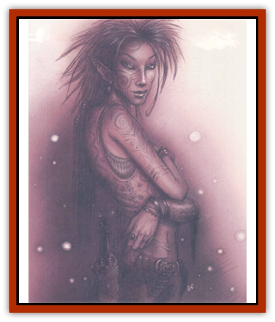

# Eladrin - General Information

Lesser eladrins're vulnerable to weapons of cold-wrought iron and suffer double damage dice from any cold iron weapon that strikes them. If the cold iron weapon is enchanted, the eladrins ignore the double damage; the magic spoils the baneful properties of the blade. Greater eladrins don't suffer double damage from a cold iron weapon, but they do suffer normal damage even if the weapon normally couldn't hit them because of a lack of enchantment. For example, a greater eladrin normally hit only by +3 weapons or better can be damaged by a nonmagical cold iron weapon. Cold iron weapons have to be custom-made and cost twice as much as normal.

Silver weapons inflict full damage if they are sufficiently enchanted to be able to damage the eladrin anyway.

**Planar Travel:** Any eladrin can travel to any Upper Plane, Ysgard, the Outlands, and the Astral Plane. Greater eladrins can travel to any Outer or Inner Plane, the Ethereal Plane, or any prime-material world. Unlike many fiends, eladrins can freely enter any world they can reach; they don't have to wait until they're summoned. However, eladrins are required to veil themselves when traveling in prima-material worlds. The same laws that force a baatezu or tanar'ri to subject itself to the manipulations of a wizard also prevent an eladrin from revealing its true nature except under the direst of circumstances.

When an eladrin is veiled, it takes on the guise of a creature native to the world it is journeying in. It may assume a human or demihuman form, pretending to be an adventurer or wandering bard. Once committed to its veil, it can't do anything that its assumed identity couldn't do whenever a mortal might be near enough to see. Should an eladrin violate its veil, it has to return to Arborea for 1,001 years before walking the prime-material worlds again. Usually the violator eladrin is allowed a brief time - a few minutes or an hour - to attend to any business it has to finish before it is called away.

**The Court of Stars:** The magical and mysterious heart of the eladrin lies in the Court of Stars, where the beautiful Queen Morwel reigns over her people. Morwel is sometimes called the Faerie Queen, the Lady of the Lake, or the Lady of Stars; she's probably a demipower in her own right, and she's surrounded by the brightest and most gracious of the eladrins. The Court moves from place to place throughout Arborea, existing only where night falls over the realm. The Court of Stars isn't really the government of the eladrins as much as it is the heart or spirit of the race.

The eladrins're on good terms with the elven pantheon and the Greek pantheon, but they tend to keep to the wilds of Arborea. When the eladrins visit Olympus, they often assume the forms of petitioners or forest spirits, veiling their true nature. In the elven realms, the eladrins feel free to show themselves for what they are.

On rare occasions, the eladrins join with the aasimon who serve the Greek and elven powers when some profound evil threatens all of Arborea. But for the most part, they prefer powers be and govern their own affairs.

---
## Discovery & Documentation

**Source Publication:** Unknown Legacy Archive Source
