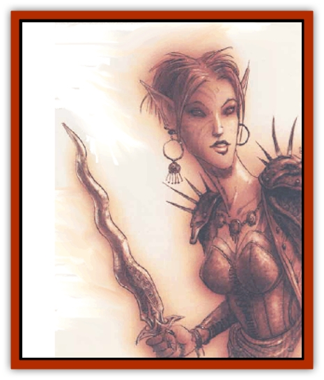

# Eladrin - Greater - Firre

| Statistic | **Eladrin, Greater, Firre** |
| --- | --- |
| **Activity Cycle:** | Any |
| **Alignment:** | Chaotic good |
| **Armor Class:** | -3 |
| **Climate/Terrain:** | Arborea |
| **Damage/Attack:** | By weapon +6 or 3d6/3d6 |
| **Diet:** | Omnivore |
| **Frequency:** | Rare |
| **Hit Dice:** | 7+10 |
| **Intelligence:** | Genius (17-18) |
| **Magic Resistance:** | 40% |
| **Morale:** | Champion (15-16) |
| **Movement:** | 15, F1 36 (A) |
| **No. Appearing:** | 1-4 |
| **No. of Attacks:** | 1 or 2 |
| **Organization:** | Solitary |
| **Size:** | M (6' tall) |
| **Special Attacks:** | Spellsong |
| **Special Defenses:** | Magic use, shapechange; struck only by cold iron or weapon of +2 or better enchantment |
| **THAC0:** | 13 |
| **Treasure:** | Incidental |
| **XP Value:** | 14,000 |

It shouldn't be any surprise that there are [[Eladrin_General_Information|eladrins]] who devote themselves to art, music, and magic. The firres (pronounced *feers*) are creatures who live for beauty; their lives are consumed by a fiery passion for art of any kind, and they strive to make their own existence a living image of wonder and delight.

The firre eladrins live as wandering minstrels and bards in Arborea, attending the courts of more powerful eladrins or tarrying to entertain a circle of coures in a forgotten dell. Their pursuit of beauty leads them to any place where art, skill, or grace is held in high esteem. A body could run across a firre traveling the Outlands or visiting the palaces of neutral-aligned powers just as easily as he'd find one in Arborea. Firres have a deep love and appreciation of mortal art, and often embark on lengthy sojourns on the Prime Material Plane to seek out works of excellence.

In their natural form, firre eladrins resemble stocky [[Elf|elves]] with brilliant red hair and fiery red eyes. At first glance, a firre might be taken for a [[Elf_Half-|half-elf]], but her eyes give her away; they have no iris or pupil, and glow brightly with the firre's inner flame. Firres can also transform themselves into man-size pillars or balls of fire; in this form they can fly at the listed rate.

**Combat:** Like the [[Eladrin_Lesser_Bralani|bralani]] or [[Eladrin_Lesser_Coure|coures]], firres often use weapons in their demihuman form. They're far stronger than they look and possess an 18/00 Strength. Firres favor long, wavy-bladed swords equal to *two-handed swords +3*. They also may use slender javelins that become blazing bolts of fire when thrown, inflicting damage as a *javelin +5*. (The javelin's consumed in the throw, but many firre carry up to four.) A creature that meets the fiery glance of an angry firre must successfully save versus paralyzation or be blinded for 2d10 rounds, suffering 1d10 points of damage.

In her fiery form, a firre can strike twice per round for 3d6 points of damage per attack. Any creature within 10 feet of the burning firre must make a successful save versus spell or suffer 1d6 points of damage from the heat. Any weapon that strikes a fiery firre must survive an item saving throw versus magical fire or be destroyed, although the firre still takes damage from a successful hit.

In any shape, the firre eladrin radiates *protection from evil* in a 10-foot radius. The firre can also use the following spell-like powers once per round at will: *advanced illusion*, *affect normal fires*, *continual light*, *detect invisibility*, *ESP*, *improved invisibility*, *polymorph self*, *wall of fire*, or cast a 10d6 *fireball*. Once per day the firre can create a *prismatic spray*. In addition to these spell-like powers, the firre has the spell ability of a 9th-level priest.

In demihuman form, the firre can choose to sing instead of attack. Her unearthly voice functions as a *charm*, *hold*, *sleep*, or *suggestion* spell on any creature within 50 feet. (The firre chooses the exact effect.) Any listeners must successfully save versus spell or be affected, The firre's *sleep* song can affect creatures normally unaffected by *sleep* spells.

Firres can be hit only by weapons of +2 or greater enchantment, or cold-wrought iron weapons. They suffer normal - not doubled - damage from such weapons.

---
## Discovery & Documentation

**Source Publication:** Planescape II (1996)
**Campaign Setting:** Planescape
**Author(s):** Rich Baker, Karen S. Boomgarden

### Other Creatures Found in This Source Book
   * [[Aasimar|Aasimar]]
   * [[Abrian|Abrian]]
   * [[Arcane|Arcane]]
   * [[Balaena|Balaena]]
   * [[Beholder-kin_Observer|Beholder-kin, Observer]]
   * [[Bloodthorn|Bloodthorn]]
   * [[Bonespear|Bonespear]]
   * [[Darkweaver|Darkweaver]]
   * [[Demarax|Demarax]]
   * [[Dhour|Dhour]]
   * [[Eater_of_Knowledge|Eater of Knowledge]]
   * [[Eladrin_Greater_Ghaele|Eladrin, Greater, Ghaele]]
   * [[Eladrin_Greater_Tulani|Eladrin, Greater, Tulani]]
   * [[Eladrin_Lesser_Bralani|Eladrin, Lesser, Bralani]]
   * [[Eladrin_Lesser_Coure|Eladrin, Lesser, Coure]]
   * [[Eladrin_Lesser_Noviere|Eladrin, Lesser, Noviere]]
   * [[Eladrin_Lesser_Shiere|Eladrin, Lesser, Shiere]]
   * [[Fhorge|Fhorge]]
   * [[Ghostlight|Ghostlight]]
   * [[Guardinal_Avoral|Guardinal, Avoral]]
   * [[Guardinal_Cervidal|Guardinal, Cervidal]]
   * [[Guardinal_General_Information|Guardinal, General Information]]
   * [[Guardinal_Equinal|Guardinal, Equinal]]
   * [[Guardinal_Leonal|Guardinal, Leonal]]
   * [[Guardinal_Lupinal|Guardinal, Lupinal]]
   * [[Guardinal_Ursinal|Guardinal, Ursinal]]
   * [[Hollyphant|Hollyphant]]
   * [[Incantifer|Incantifer]]
   * [[Ironmaw|Ironmaw]]
   * [[Keeper|Keeper]]
   * [[Khaasta|Khaasta]]
   * [[Leomarh|Leomarh]]
   * [[Monster_of_Legend|Monster of Legend]]
   * [[Mortai|Mortai]]
   * [[Noctral|Noctral]]
   * [[Quill|Quill]]
   * [[Razorvine|Razorvine]]
   * [[Reave|Reave]]
   * [[Retriever|Retriever]]
   * [[Rilmani_Abiorach|Rilmani, Abiorach]]
   * [[Rilmani_General_Information|Rilmani, General Information]]
   * [[Rilmani_Argenach|Rilmani, Argenach]]
   * [[Rilmani_Aurumach|Rilmani, Aurumach]]
   * [[Rilmani_Cuprilach|Rilmani, Cuprilach]]
   * [[Rilmani_Ferrumach|Rilmani, Ferrumach]]
   * [[Rilmani_Plumach|Rilmani, Plumach]]
   * [[Shadowdrake|Shadowdrake]]
   * [[Spellhaunt|Spellhaunt]]
   * [[Spider_Hook|Spider, Hook]]
   * [[Sunfly|Sunfly]]
   * [[Sword_Spirit|Sword Spirit]]
   * [[Tanar'ri_Lesser_Bulezau|Tanar'ri, Lesser, Bulezau]]
   * [[Tanar'ri_Lesser_Maurezhi|Tanar'ri, Lesser, Maurezhi]]
   * [[Tanar'ri_Lesser_Yochlol|Tanar'ri, Lesser, Yochlol]]
   * [[Tanar'ri_General_Information|Tanar'ri, General Information]]
   * [[Tanar'ri_True_Alkilith|Tanar'ri, True, Alkilith]]
   * [[Terlen|Terlen]]
   * [[Tso|Tso]]
   * [[T'uen-rin|T'uen-rin]]
   * [[Vaporighu|Vaporighu]]
   * [[Vorr|Vorr]]
   * [[Wastrel|Wastrel]]
   * [[Wraithworm|Wraithworm]]
   * [[Yugoloth_Lesser_Canoloth|Yugoloth, Lesser, Canoloth]]
   * [[Zoveri|Zoveri]]
