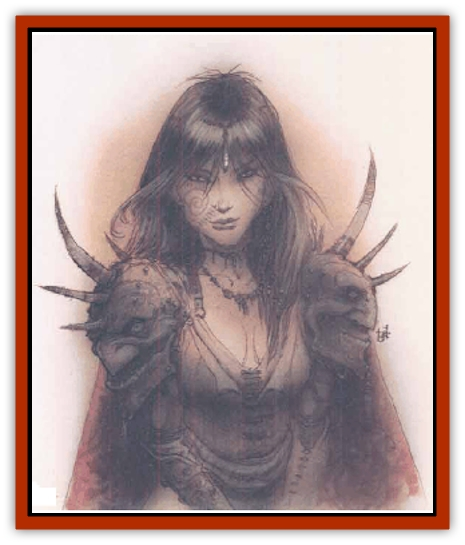

# Eladrin - Greater - Ghaele

| Statistic | **Eladrin, Greater, Ghaele** |
| --- | --- |
| **Activity Cycle:** | Any |
| **Alignment:** | Chaotic good |
| **Armor Class:** | -5 |
| **Climate/Terrain:** | Arborea |
| **Damage/Attack:** | By weapon +7 or 2d12/2d12 |
| **Diet:** | Omnivore |
| **Frequency:** | Rare |
| **Hit Dice:** | 10+15 |
| **Intelligence:** | Exceptional to Genius (15-18) |
| **Magic Resistance:** | 40% |
| **Morale:** | Fearless (19-20) |
| **Movement:** | 18, Fl 60 (A) |
| **No. Appearing:** | 1 (1-3) |
| **No. of Attacks:** | 1 or 2 |
| **Organization:** | Solitary |
| **Size:** | M (6' tall) or L (20' wingspan) |
| **Special Attacks:** | Positive energy, gaze |
| **Special Defenses:** | Struck only by cold iron or weapons of +3 or better enchantment |
| **THAC0:** | 11 |
| **Treasure:** | Incidental |
| **XP Value:** | 19,000 |

The ghaeles are the knights errant of the [[Eladrin_General_Information|eladrins]]. Wherever evil and tyranny raise their ugly heads, the ghaeles respond. Working behind the scenes, they quietly muster resistance and offer guidance to any creatures of good heart with the courage to stand against their oppressors. More than any other eladrins, the ghaeles are accustomed to working from behind the veil.

Ghaeles resemble tall, athletic high [[Elf|elves]]. They might easily be taken noble elves if not for their pearly, opalescent eyes and radiant aura. Of course, a ghaele may be wearing any manner of mortal guise when encountered away from Arborea. Ghaele eladrins can also take the form of an incorporeal globe of eldritch colors, 5' in diameter.

**Combat:** In demihuman form, ghaeles favor incandescent long swords +4 that inflict an extra 1d10 points of positive energy damage to any evil foe struck. Evil creatures of fewer than 5 Hit Dice meeting the gaze of an angry ghaele must successfully save versus spell or be slain; even if they succeed in their saving throw, they are stricken with fear for 2d10 rounds. Evil creatures of 5 Hit Dice or more, or any nonevil opponent, suffer the *fear* effect only if they miss their save; they are unaffected if they succeed. The ghaele's gaze has a range of 60 feet.

In their light form, ghaeles attack by firing beams of brilliant light that sear their enemies for 2d12 points of damage per strike. The beams have a range of 100 yards and strike with a +4 attack bonus. The ghaeles can't gaze in this form.

At all times, the ghaele is surrounded by a nimbus of light that functions as a double-strength *protection from evil* in a 20-foot radius. The nimbus also has the properties of a *minor globe of invulnerabilily* and confers *protection from normal missiles* on the ghaele. In addition, a ghaele has the spell ability of a 14th-level priest and can use the following spell-like powers once per round: *advanced illusion*, *charm monster*, *color spray*, *continual light*, *dancing lights*, *detect invisibility*, *dispel magic*, *ESP*, *hold monster*, *improved invisibility*, *polymorph any object*, *prismatic spray*, *telekinesis*, *teleport without error*, *wall of force*, or cast a 12d8 *chain lightning bolt*.

The ghaele can be hit only by weapons of +3 or greater enchantment, or by cold-wrought iron weapons.

**Habitat/Society:** The ghaeles are advisers and counselors to the great [[Eladrin_Greater_Tulani|tulani eladrins]], lords of the eladrin courts. It's quite rare to find two or more ghaeles gathered together, but on rare occasions several may be in the service of one tulani. A ghaele is kind-hearted and compassionate, but his mission against evil weighs on his mind; even in blissful Arborea, he's wondering how things arc going back on the last prime world he left. His frequent work with mortals and use of mortal veils makes him the most serious and heavy-hearted of the eladrins. Better than any others of his kind, he knows how hard it is to be human.

---
## Discovery & Documentation

**Source Publication:** Planescape II (1996)
**Campaign Setting:** Planescape
**Author(s):** Rich Baker, Karen S. Boomgarden

### Other Creatures Found in This Source Book
   * [[Aasimar|Aasimar]]
   * [[Abrian|Abrian]]
   * [[Arcane|Arcane]]
   * [[Balaena|Balaena]]
   * [[Beholder-kin_Observer|Beholder-kin, Observer]]
   * [[Bloodthorn|Bloodthorn]]
   * [[Bonespear|Bonespear]]
   * [[Darkweaver|Darkweaver]]
   * [[Demarax|Demarax]]
   * [[Dhour|Dhour]]
   * [[Eater_of_Knowledge|Eater of Knowledge]]
   * [[Eladrin_Greater_Firre|Eladrin, Greater, Firre]]
   * [[Eladrin_Greater_Tulani|Eladrin, Greater, Tulani]]
   * [[Eladrin_Lesser_Bralani|Eladrin, Lesser, Bralani]]
   * [[Eladrin_Lesser_Coure|Eladrin, Lesser, Coure]]
   * [[Eladrin_Lesser_Noviere|Eladrin, Lesser, Noviere]]
   * [[Eladrin_Lesser_Shiere|Eladrin, Lesser, Shiere]]
   * [[Fhorge|Fhorge]]
   * [[Ghostlight|Ghostlight]]
   * [[Guardinal_Avoral|Guardinal, Avoral]]
   * [[Guardinal_Cervidal|Guardinal, Cervidal]]
   * [[Guardinal_General_Information|Guardinal, General Information]]
   * [[Guardinal_Equinal|Guardinal, Equinal]]
   * [[Guardinal_Leonal|Guardinal, Leonal]]
   * [[Guardinal_Lupinal|Guardinal, Lupinal]]
   * [[Guardinal_Ursinal|Guardinal, Ursinal]]
   * [[Hollyphant|Hollyphant]]
   * [[Incantifer|Incantifer]]
   * [[Ironmaw|Ironmaw]]
   * [[Keeper|Keeper]]
   * [[Khaasta|Khaasta]]
   * [[Leomarh|Leomarh]]
   * [[Monster_of_Legend|Monster of Legend]]
   * [[Mortai|Mortai]]
   * [[Noctral|Noctral]]
   * [[Quill|Quill]]
   * [[Razorvine|Razorvine]]
   * [[Reave|Reave]]
   * [[Retriever|Retriever]]
   * [[Rilmani_Abiorach|Rilmani, Abiorach]]
   * [[Rilmani_General_Information|Rilmani, General Information]]
   * [[Rilmani_Argenach|Rilmani, Argenach]]
   * [[Rilmani_Aurumach|Rilmani, Aurumach]]
   * [[Rilmani_Cuprilach|Rilmani, Cuprilach]]
   * [[Rilmani_Ferrumach|Rilmani, Ferrumach]]
   * [[Rilmani_Plumach|Rilmani, Plumach]]
   * [[Shadowdrake|Shadowdrake]]
   * [[Spellhaunt|Spellhaunt]]
   * [[Spider_Hook|Spider, Hook]]
   * [[Sunfly|Sunfly]]
   * [[Sword_Spirit|Sword Spirit]]
   * [[Tanar'ri_Lesser_Bulezau|Tanar'ri, Lesser, Bulezau]]
   * [[Tanar'ri_Lesser_Maurezhi|Tanar'ri, Lesser, Maurezhi]]
   * [[Tanar'ri_Lesser_Yochlol|Tanar'ri, Lesser, Yochlol]]
   * [[Tanar'ri_General_Information|Tanar'ri, General Information]]
   * [[Tanar'ri_True_Alkilith|Tanar'ri, True, Alkilith]]
   * [[Terlen|Terlen]]
   * [[Tso|Tso]]
   * [[T'uen-rin|T'uen-rin]]
   * [[Vaporighu|Vaporighu]]
   * [[Vorr|Vorr]]
   * [[Wastrel|Wastrel]]
   * [[Wraithworm|Wraithworm]]
   * [[Yugoloth_Lesser_Canoloth|Yugoloth, Lesser, Canoloth]]
   * [[Zoveri|Zoveri]]
