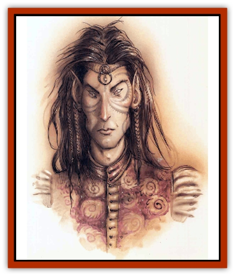

# Eladrin - Greater - Tulani

| Statistic | **Eladrin, Greater, Tulani** |
| --- | --- |
| **Activity Cycle:** | Any |
| **Alignment:** | Chaotic good |
| **Armor Class:** | -7 |
| **Climate/Terrain:** | Arborea |
| **Damage/Attack:** | 2d4+12 |
| **Diet:** | Omnivore |
| **Frequency:** | Very rare |
| **Hit Dice:** | 12+20 |
| **Intelligence:** | Supra-genius (19-20) |
| **Magic Resistance:** | 50% |
| **Morale:** | Fearless (19-20) |
| **Movement:** | 18, Fl 30 (A) |
| **No. Appearing:** | 1 (1-2) |
| **No. of Attacks:** | 3 |
| **Organization:** | Solitary |
| **Size:** | M (7' tall) |
| **Special Attacks:** | Gaze |
| **Special Defenses:** | Aura; struck only by cold iron or weapons of +4 or better enchantment |
| **THAC0:** | 7 |
| **Treasure:** | Incidental |
| **XP Value:** | 27,000 |

The greatest of the [[Eladrin_General_Information|eladrins]] are the tulani, or faerie lords. Their courts are scattered throughout Olympus, never staying in the same place more than one night. The tulani are peaceful in nature and take up arms only when Arborea itself is threatened or the direst of emergencies requires their attention.

Tulani're creatures of unearthly beauty and grace; their voices are living music, and their faces shine so brightly that mortals find it difficult to look at them. In form they're tall, stately [[Elf|elven]] lords dressed in shimmering robes of shifting color. A tulani is surrounded by a magical aura that evil creatures cannot bear to be near.

Visitors to Arborea who seek out the tulani courts soon find out that the eladrins aren't easy to find when they want to avoid someone. When a cutter finally gets to meet with a tulani, he's wise to keep his bone-box shut and mind his manners. The tulani don't tolerate insolence or disrespect from mortals, but are gracious hosts when their guests behave themselves.

**Combat:** The tulani've got no need for weapons or armor; at will they can create a swordlike blade of fiery light in their fist that strikes as a *sword of sharpness +4*. The sword delivers an extra 2d8 points of positive energy damage to any evil foe struck. Tulani's slender forms conceal an effective strength of 20, and they can *fly* unaided at will.

An evil creature of fewer than 8 Hit Dice meeting the gaze of an angry tulani must successfully save versus spell or be slain; even if it survives its saving throw, it is *blinded* and stricken with *fear* for 2d10 rounds. If the opponent meeting the gaze is of any nonevil alignment, or is evil and of 8 Hit Dice or more, then it suffers *fear* and *blindness* only if it fails the save.

Tulani can assume the secondary forms of any other eladrin at will. They keep their AC and THACO, regardless of form, but cause double the damage of a [[Eladrin_Lesser_Coure|coure]], [[Eladrin_Lesser_Bralani|bralani]], [[Eladrin_Lesser_Noviere|noviere]], or [[Eladrin_Greater_Firre|firre]] eladrin's second form. In the [[Eladrin_Greater_Ghaele|ghaele's]] form, their lightbeams strike for 3d12 points of damage and never miss.

At all times, the tulani eladrin's aura functions as a double-strength *protection from evil* in a 20-foot radius. The nimbus also has the properties of a *minor globe of invulnerability* and confers *protection from normal missiles* on the tulani. Any evil creature must make a successful saving throw versus spell to be able to approach within 20 feet of the tulani. The faerie lord has the spell ability of a 16th-level priest and can use the following spell-like powers once per round: *color spray*, *dancing lights*, *continual light*, *detect invisibility*, *ESP*, *dispel magic*, *mass charm*, *improved invisibility*, *advanced illusion*, *hold monster*, *teleport without error*, *telekinesis*, *wall of force*, *prismatic spray*, *polymorph any object*, or cast a 12d8 *chain lightning bolt*. Once per day the tulani can cast a *meteor swarm*, speak a *power word kill*, or use *time stop*. Once per year the tulani can grant another's *wish*.

The tulani eladrin can be hit only by weapons of +4 or greater enchantment, or by cold-wrought iron weapons.

**Habitat/Society:** As rulers over the lesser eladrins, tulani rarely may be encountered. The tulani watch over Arborea and act as stewards over the realms of the eladrins. Typically, a tulani will have a host of shiere wamors, several ghaeles and firres, and uncounted numbers of coures in his domain.

The tulani eladrins answer only to the Queen of Stars, who share Arborea with them. Within their own realms, tulani are free to rule as they see fit; generally, they're compassionate but distant overlords who allow their subjects to do as they please.

---
## Discovery & Documentation

**Source Publication:** Planescape II (1996)
**Campaign Setting:** Planescape
**Author(s):** Rich Baker, Karen S. Boomgarden

### Other Creatures Found in This Source Book
   * [[Aasimar|Aasimar]]
   * [[Abrian|Abrian]]
   * [[Arcane|Arcane]]
   * [[Balaena|Balaena]]
   * [[Beholder-kin_Observer|Beholder-kin, Observer]]
   * [[Bloodthorn|Bloodthorn]]
   * [[Bonespear|Bonespear]]
   * [[Darkweaver|Darkweaver]]
   * [[Demarax|Demarax]]
   * [[Dhour|Dhour]]
   * [[Eater_of_Knowledge|Eater of Knowledge]]
   * [[Eladrin_Greater_Firre|Eladrin, Greater, Firre]]
   * [[Eladrin_Greater_Ghaele|Eladrin, Greater, Ghaele]]
   * [[Eladrin_Lesser_Bralani|Eladrin, Lesser, Bralani]]
   * [[Eladrin_Lesser_Coure|Eladrin, Lesser, Coure]]
   * [[Eladrin_Lesser_Noviere|Eladrin, Lesser, Noviere]]
   * [[Eladrin_Lesser_Shiere|Eladrin, Lesser, Shiere]]
   * [[Fhorge|Fhorge]]
   * [[Ghostlight|Ghostlight]]
   * [[Guardinal_Avoral|Guardinal, Avoral]]
   * [[Guardinal_Cervidal|Guardinal, Cervidal]]
   * [[Guardinal_General_Information|Guardinal, General Information]]
   * [[Guardinal_Equinal|Guardinal, Equinal]]
   * [[Guardinal_Leonal|Guardinal, Leonal]]
   * [[Guardinal_Lupinal|Guardinal, Lupinal]]
   * [[Guardinal_Ursinal|Guardinal, Ursinal]]
   * [[Hollyphant|Hollyphant]]
   * [[Incantifer|Incantifer]]
   * [[Ironmaw|Ironmaw]]
   * [[Keeper|Keeper]]
   * [[Khaasta|Khaasta]]
   * [[Leomarh|Leomarh]]
   * [[Monster_of_Legend|Monster of Legend]]
   * [[Mortai|Mortai]]
   * [[Noctral|Noctral]]
   * [[Quill|Quill]]
   * [[Razorvine|Razorvine]]
   * [[Reave|Reave]]
   * [[Retriever|Retriever]]
   * [[Rilmani_Abiorach|Rilmani, Abiorach]]
   * [[Rilmani_General_Information|Rilmani, General Information]]
   * [[Rilmani_Argenach|Rilmani, Argenach]]
   * [[Rilmani_Aurumach|Rilmani, Aurumach]]
   * [[Rilmani_Cuprilach|Rilmani, Cuprilach]]
   * [[Rilmani_Ferrumach|Rilmani, Ferrumach]]
   * [[Rilmani_Plumach|Rilmani, Plumach]]
   * [[Shadowdrake|Shadowdrake]]
   * [[Spellhaunt|Spellhaunt]]
   * [[Spider_Hook|Spider, Hook]]
   * [[Sunfly|Sunfly]]
   * [[Sword_Spirit|Sword Spirit]]
   * [[Tanar'ri_Lesser_Bulezau|Tanar'ri, Lesser, Bulezau]]
   * [[Tanar'ri_Lesser_Maurezhi|Tanar'ri, Lesser, Maurezhi]]
   * [[Tanar'ri_Lesser_Yochlol|Tanar'ri, Lesser, Yochlol]]
   * [[Tanar'ri_General_Information|Tanar'ri, General Information]]
   * [[Tanar'ri_True_Alkilith|Tanar'ri, True, Alkilith]]
   * [[Terlen|Terlen]]
   * [[Tso|Tso]]
   * [[T'uen-rin|T'uen-rin]]
   * [[Vaporighu|Vaporighu]]
   * [[Vorr|Vorr]]
   * [[Wastrel|Wastrel]]
   * [[Wraithworm|Wraithworm]]
   * [[Yugoloth_Lesser_Canoloth|Yugoloth, Lesser, Canoloth]]
   * [[Zoveri|Zoveri]]
