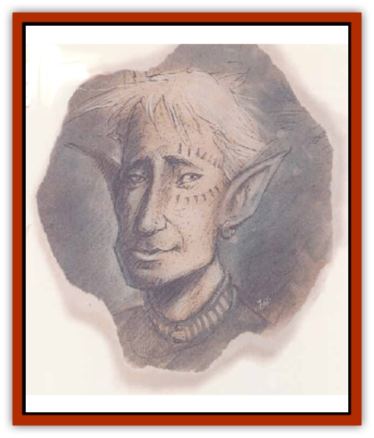

# Eladrin - Lesser - Bralani

| Statistic | **Eladrin, Lesser, Bralani** |
| --- | --- |
| **Activity Cycle:** | Any |
| **Alignment:** | Chaotic good |
| **Armor Class:** | 2 (-2) |
| **Climate/Terrain:** | Arborea (Pelion) |
| **Damage/Attack:** | By weapon +4 or 1d10/1d10 |
| **Diet:** | Omnivore |
| **Frequency:** | Uncommon (Common) |
| **Hit Dice:** | 6+9 |
| **Intelligence:** | High (13-14) |
| **Magic Resistance:** | 35% |
| **Morale:** | Elite (13-14) |
| **Movement:** | 15, Fl 30 (A) |
| **No. Appearing:** | 1-3 (3-24) |
| **No. of Attacks:** | 1 or 2 |
| **Organization:** | Band |
| **Size:** | M (5' tall) |
| **Special Attacks:** | Whirlwind |
| **Special Defenses:** | See below |
| **THAC0:** | 15 |
| **Treasure:** | Incidental |
| **XP Value:** | 9,000 |

The snowy, sandy wastes of Pelion are home to the bralani [[Eladrin_General_Information|eladrins]]. They're the wildest and most feral of their kind, existing from heartbeat to heartbeat in a glorious, never-ending passion. No eladrin can match the fury of an angry bralani, or the keening depths of her grief or sorrow, or the blissful heights of her joy. Bralani are tied to the plains of Pelion, but may occasionally be found dancing in the desert winds or arctic wastes of other realms, exulting in their freedom and the beauty of the open land.

Bralani in their natural form resemble short, stocky [[Elf|elves]], broad in the shoulders but graceful nonetheless. Their hair is usually a bright silvery-white, and their eyes are an everchanging rainbow of hues that flicker and shift with the vagaries of the bralani's mood. Bralani can also take the shape of a whirlwind of dust, sand, or snow, racing across their beloved plains like living zephyrs.

Bralani are the most distant and fey of the eladrins, dangerous to approach and fickle in temperament. Strangers might be greeted with wild celebration or attacked in a towering rage. Although the bralani's purpose seems to be to dance and race about in the wastes, they'll drop their endless dance in a moment if they come across evil in their domain. A few rare and unusual bralani sojourning in other worlds ally themselves with the local forces of good, siding with a tribe of noble desert savages or aiding a group of northern herdsmen.

**Combat:** In humanoid form, bralani are surprisingly strong; they've got an 18/76 Strength with the resulting bonuses. Balani prefer the spear, the bow, and the scimitar - weapons of the desert nomads they most closely resemble. Bralani weapons're often enchanted. These folk are superb archers, and gain a +4 bonus to bow attacks due to their great Dexterity and instinctive mastery of the wind.

However, a bralani's just as likely to abandon his weapons and attack as a living whirlwind. In this form, he's AC -2 and can attack with two scourging sand- or snow-blasts for 1d10 points of damage each. The blasts have a 20-foot range and affect a cone 5' in diameter. Any creature within 20 feet of the bralani in whirlwind form must successfully save vs. paralyzation or suffer a -2 to attacks due to stinging sand in its eyes. Any man-size or smaller creature that approaches within 5 feet of the bralani in its whirlwind form must successfully save vs. paralyzation again or be swept off its feet by thc raging winds and thrown 10 to 30 feet. Bralani love to careen through an enemy's ranks, knocking their foes left and right as they dance right past them.

In addition to the powers all eladrins possess, bralani can use the following abilities once per round: *blur*, *charm person*, *control weather*, *cure disease*, *gust of wind*, *mirror image*, and *wind wall*. Twice per day they can cast a *lightning bolt* (8d8 points of damage), and *cure serious wounds* or *neutralize poison*; once per week they can *heal* another person, but not themselves.

Bralani can be hit only by +1 or better weapons, or weapons forged of cold-wrought iron. A bralani can *gate* 1d4 other bralani eladrins to his location with a 40% chance of success.

**Habitat/Society:** In their native layer or Pelion, the bralani travel in loose bands in an unending dance of wind and sand. Each day the band travels hundreds of miles, stopping only to play pranks on travelers or deal with any unwanted intruders they find. The bralani don't acknowledge any one individual as leader. The entire band acts merely on spontaneous impulses, which can make these eladrins very hard to deal with.

When the bralani leave Pelion, they travel in small groups of only 1 to 3 individuals. In the rare instances where the bralani have mobilized for war, they act as scouts and skirmishers, harrying the enemies flanks and rear.

---
## Discovery & Documentation

**Source Publication:** Planescape II (1996)
**Campaign Setting:** Planescape
**Author(s):** Rich Baker, Karen S. Boomgarden

### Other Creatures Found in This Source Book
   * [[Aasimar|Aasimar]]
   * [[Abrian|Abrian]]
   * [[Arcane|Arcane]]
   * [[Balaena|Balaena]]
   * [[Beholder-kin_Observer|Beholder-kin, Observer]]
   * [[Bloodthorn|Bloodthorn]]
   * [[Bonespear|Bonespear]]
   * [[Darkweaver|Darkweaver]]
   * [[Demarax|Demarax]]
   * [[Dhour|Dhour]]
   * [[Eater_of_Knowledge|Eater of Knowledge]]
   * [[Eladrin_Greater_Firre|Eladrin, Greater, Firre]]
   * [[Eladrin_Greater_Ghaele|Eladrin, Greater, Ghaele]]
   * [[Eladrin_Greater_Tulani|Eladrin, Greater, Tulani]]
   * [[Eladrin_Lesser_Coure|Eladrin, Lesser, Coure]]
   * [[Eladrin_Lesser_Noviere|Eladrin, Lesser, Noviere]]
   * [[Eladrin_Lesser_Shiere|Eladrin, Lesser, Shiere]]
   * [[Fhorge|Fhorge]]
   * [[Ghostlight|Ghostlight]]
   * [[Guardinal_Avoral|Guardinal, Avoral]]
   * [[Guardinal_Cervidal|Guardinal, Cervidal]]
   * [[Guardinal_General_Information|Guardinal, General Information]]
   * [[Guardinal_Equinal|Guardinal, Equinal]]
   * [[Guardinal_Leonal|Guardinal, Leonal]]
   * [[Guardinal_Lupinal|Guardinal, Lupinal]]
   * [[Guardinal_Ursinal|Guardinal, Ursinal]]
   * [[Hollyphant|Hollyphant]]
   * [[Incantifer|Incantifer]]
   * [[Ironmaw|Ironmaw]]
   * [[Keeper|Keeper]]
   * [[Khaasta|Khaasta]]
   * [[Leomarh|Leomarh]]
   * [[Monster_of_Legend|Monster of Legend]]
   * [[Mortai|Mortai]]
   * [[Noctral|Noctral]]
   * [[Quill|Quill]]
   * [[Razorvine|Razorvine]]
   * [[Reave|Reave]]
   * [[Retriever|Retriever]]
   * [[Rilmani_Abiorach|Rilmani, Abiorach]]
   * [[Rilmani_General_Information|Rilmani, General Information]]
   * [[Rilmani_Argenach|Rilmani, Argenach]]
   * [[Rilmani_Aurumach|Rilmani, Aurumach]]
   * [[Rilmani_Cuprilach|Rilmani, Cuprilach]]
   * [[Rilmani_Ferrumach|Rilmani, Ferrumach]]
   * [[Rilmani_Plumach|Rilmani, Plumach]]
   * [[Shadowdrake|Shadowdrake]]
   * [[Spellhaunt|Spellhaunt]]
   * [[Spider_Hook|Spider, Hook]]
   * [[Sunfly|Sunfly]]
   * [[Sword_Spirit|Sword Spirit]]
   * [[Tanar'ri_Lesser_Bulezau|Tanar'ri, Lesser, Bulezau]]
   * [[Tanar'ri_Lesser_Maurezhi|Tanar'ri, Lesser, Maurezhi]]
   * [[Tanar'ri_Lesser_Yochlol|Tanar'ri, Lesser, Yochlol]]
   * [[Tanar'ri_General_Information|Tanar'ri, General Information]]
   * [[Tanar'ri_True_Alkilith|Tanar'ri, True, Alkilith]]
   * [[Terlen|Terlen]]
   * [[Tso|Tso]]
   * [[T'uen-rin|T'uen-rin]]
   * [[Vaporighu|Vaporighu]]
   * [[Vorr|Vorr]]
   * [[Wastrel|Wastrel]]
   * [[Wraithworm|Wraithworm]]
   * [[Yugoloth_Lesser_Canoloth|Yugoloth, Lesser, Canoloth]]
   * [[Zoveri|Zoveri]]
